<p align="center">
  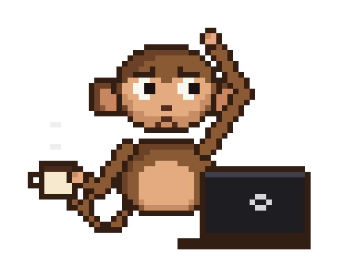
</p>

<h1 align="center">Gobyet</h1>

<p align="center">
  <b>Goblok monyet.</b> Maskot dari semua project saya: dikerjakan buat have fun,<br>
  oleh monyet bodoh yang lagi larping jadi programmer.
</p>

## Gobyet Universe

Satu monyet, banyak dunia. Rework v2 membuat setiap karakter Gobyet berdiri dengan kuda-kuda, senjata, dan siluet sesuai perannya, sementara kepala, wajah, telinga, dan ekornya tetap Gobyet yang sama.

**39 karakter · 328 state animasi · 4.165 frame · kanvas 64×64 (Berserker 144×100) · 13 sprite VFX**

### Animasi andalan

| Heavy Knight | Viking Berserker | Pirate Skirmisher | Wizard |
|:---:|:---:|:---:|:---:|
| 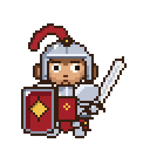 | 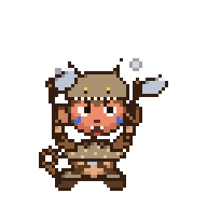 | 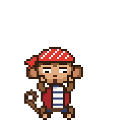 | 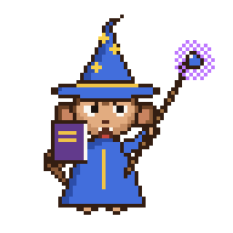 |
| `attack` | `rage` | `explosion` | `spell_fail` |

| Hacker | Skeptic | Normal GBLK | Champion |
|:---:|:---:|:---:|:---:|
| 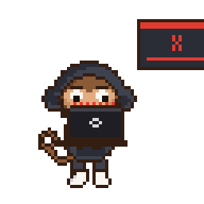 | 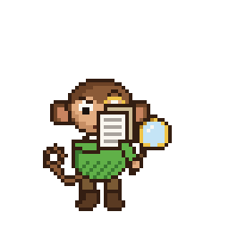 | 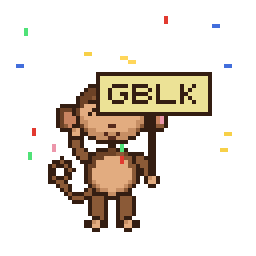 | 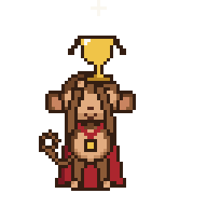 |
| `error` | `inspect` | `victory_dance` | `trophy_raise` |

### Berserker: pedang raksasa (dark fantasy)

Pendekar berzirah hitam dengan pedang dua tangan selebar papan (1,4× tinggi badan). Desain orisinal dari
arketipe umum, dengan kepala dan badan Gobyet berskala sama seperti karakter lain; kanvasnya saja yang 144×100.
Ada 23 state (17 dari brief, 5 varian idle, 1 varian attack), tempo per frame, event `hit`/`hitstop`/`screen_shake`,
lapisan karakter/senjata/VFX, dan tiga tingkat kerusakan zirah. Darah hanya muncul sebagai sprite VFX terpisah yang
bergaya piksel, singkat, dan muncul hanya saat serangan kena.

| `leap_spin_slash` (jurus khas) | konfirmasi kena |
|:---:|:---:|
|  | 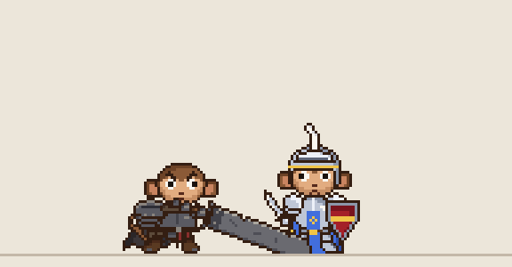 |

| `idle` | `rage_attack` | `miss` | `defeat` |
|:---:|:---:|:---:|:---:|
|  | 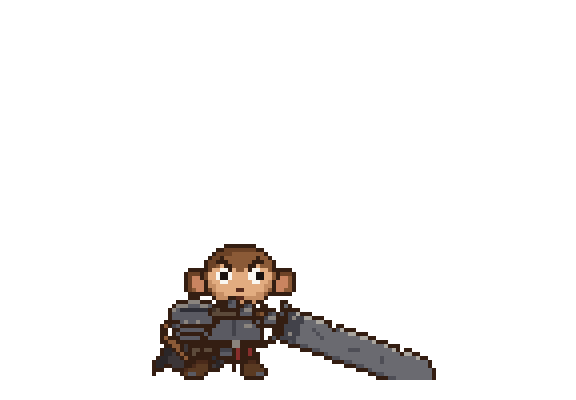 |  | 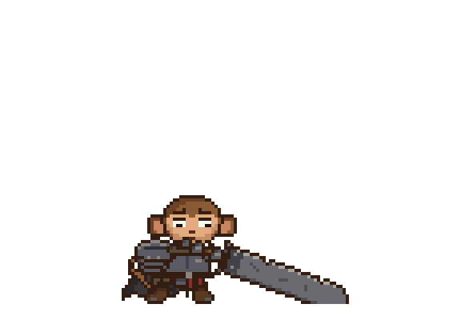 |

### FANTASY (18)

| Heavy Knight | Archer | Man-at-Arms | Assassin |
|:---:|:---:|:---:|:---:|
| 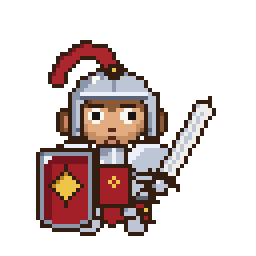 | 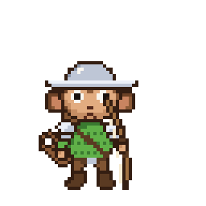 | 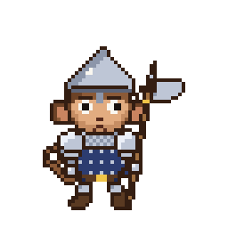 | 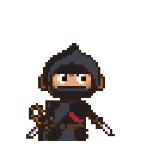 |

| Fantasy Knight | Viking | Viking Berserker | Huscarl |
|:---:|:---:|:---:|:---:|
| 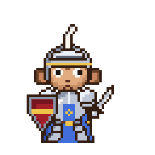 | 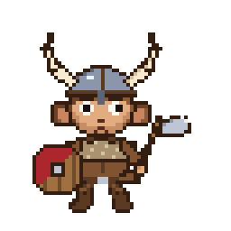 | 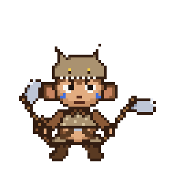 | 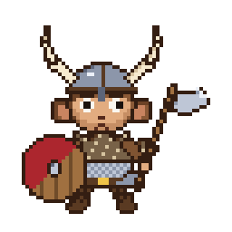 |

| Gestir | Bondi | Fantasy Viking | Pirate Captain |
|:---:|:---:|:---:|:---:|
| 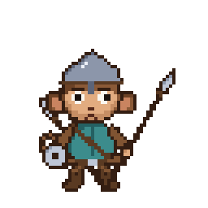 | 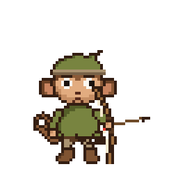 | 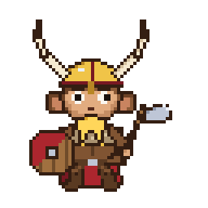 | 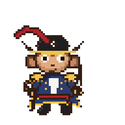 |

| Pirate Skirmisher | Pirate Sharpshooter | Pirate Buccaneer | Fantasy Pirate |
|:---:|:---:|:---:|:---:|
| 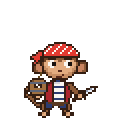 | 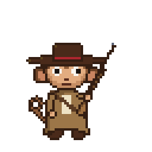 | 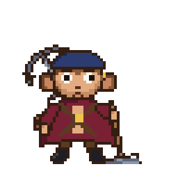 | 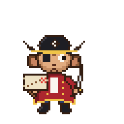 |

| Wizard |
|:---:|
| 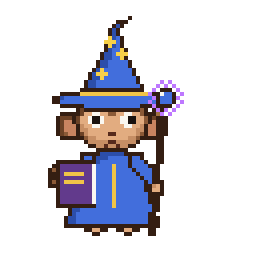 |

### DOMAIN (15)

| Philosopher | Academic | Scientist | Mathematician |
|:---:|:---:|:---:|:---:|
| 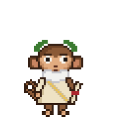 | 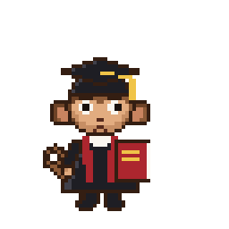 | 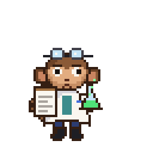 | 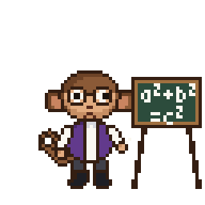 |

| Lawyer | Historian | Economist | Psychologist |
|:---:|:---:|:---:|:---:|
| 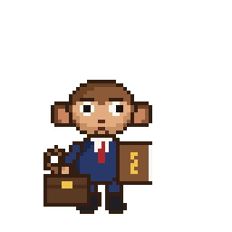 | 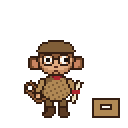 | 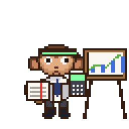 | 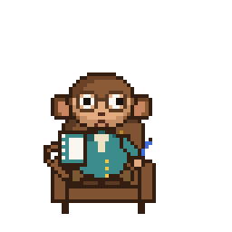 |

| Sociologist | Engineer | Detective | Researcher |
|:---:|:---:|:---:|:---:|
| 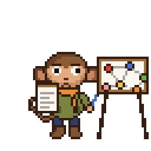 | 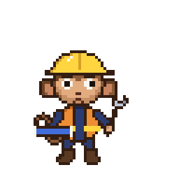 | 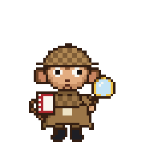 | 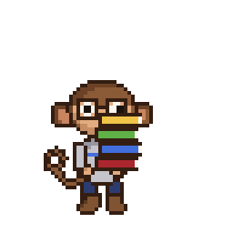 |

| Pak Haji | Priest | Hacker |
|:---:|:---:|:---:|
| 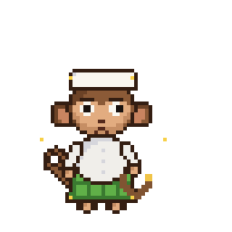 | 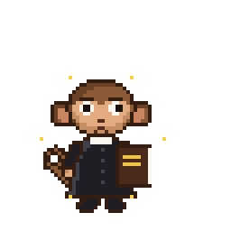 | 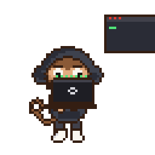 |

### ROLE (5)

| Referee | Judge | Skeptic | Champion |
|:---:|:---:|:---:|:---:|
| 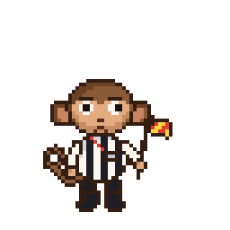 | 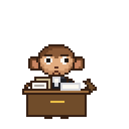 | 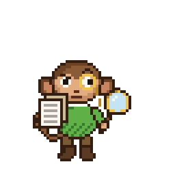 | 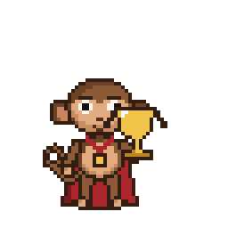 |

| Defeated |
|:---:|
| 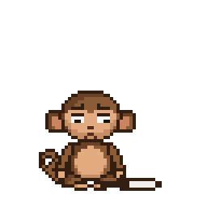 |

### SPECIAL (1)

| Normal GBLK |
|:---:|
| 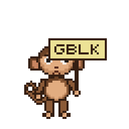 |

Aset v1 di bawah (animasi asli dan character pack Fase 2) tidak diubah oleh v2. Detail v2: [`v2/README.md`](v2/README.md), tata bahasa visual [`v2/STYLE.md`](v2/STYLE.md), laporan [`v2/reports/rework-v2.md`](v2/reports/rework-v2.md). Galeri interaktif (semua state, mode siluet dan grayscale, uji skala) ada di [`v2/gallery.html`](v2/gallery.html); buka dari folder `v2/` di komputer.

## Animasi

| Makan pisang | Ngamuk debug | Ngopi santai |
|:---:|:---:|:---:|
|  |  |  |
| Tiga gigitan sampai kulitnya terkulai, mengunyah dengan mata `^ ^`, lalu garuk pantat dengan lega. | Mengetik tenang, error merah muncul, muka memerah, laptop dibanting, telinga berasap, lalu menghela napas. | Pose aslinya: garuk kepala, melirik laptop, berkedip, lalu menyeruput kopi. |

Semua GIF transparan, 512×384, dan berulang terus, jadi aman di tema terang maupun gelap.

## Kostum

| Wisuda | Filsuf Yunani | Rambut Einstein |
|:---:|:---:|:---:|
|  |  |  |
| Topi toga, kemeja, dasi merah. Pegang ijazah, lalu lempar topi sambil konfeti. | Janggut putih, mahkota zaitun, kain toga di samping pilar. Mengelus janggut, `...`, `?`, lalu `!`. | Rambut putih awut-awutan dan kumis tebal. Menulis E=mc², lalu menjulurkan lidah. |

| Hacker | Detektif bug | Kondangan |
|:---:|:---:|:---:|
|  |  |  |
| Hoodie dan kacamata hitam, terminal hijau bergulir, lalu `OK`. | Topi detektif dan kaca pembesar. Bug merayap, ketemu, matanya membesar di balik lensa. | Peci dan batik, joget kiri-kanan diiringi not musik. |

## Character pack

Sistem kostum × state untuk dipakai di aplikasi (misalnya arena Battle Royale Argumen) ada di [`pack/`](pack):

- `manifest.json`: peta kostum × state.
- `resolver.js`: resolver dengan fallback berantai.
- `preview.html`: matriks semua kostum × state, panel banding gaya, dan tes buta. Placeholder ditandai jelas.

Detailnya di [`pack/README.md`](pack/README.md).

### Update: Fase 2, aset per gerbang

Aset baru dibuat bertahap per gerbang. Urutan kerjanya A, B, C, D, E, G, H, I, J, F. Status terkini ada di [`pack/PROGRESS.md`](pack/PROGRESS.md).

| Gerbang | Isi | Status |
|---|---|---|
| A | Referee: idle, thinking | disetujui |
| B | Judge: idle, thinking, judging · Skeptic: idle, suspicious, attack · Champion: idle, victory (laurel emas diganti medali) | disetujui |
| C | Greek Philosopher: idle, victory, defeated · Academic: thinking, victory, defeated · Normal: thinking, victory, defeated | disetujui |
| D | Scientist: idle, shocked, victory · Mathematician: idle, thinking, victory | disetujui |
| E | Hacker: thinking, shocked, victory · Detective: idle, suspicious, shocked, victory · Lawyer: idle, thinking, victory | disetujui |
| G | Gamer (7 state), Normal-GBLK (8 state) | dibuat, validasi lulus, menunggu persetujuan akhir |
| H | Knight, Viking, Pirate, Wizard (masing-masing 6 state, termasuk 2 tarian) | dibuat, validasi lulus, menunggu persetujuan akhir |
| I | Pak Haji, Priest (masing-masing idle, thinking, happy, victory, defeated; perlakuan dan aura identik, aturan 7.2) | dibuat, validasi lulus, menunggu persetujuan akhir |
| J | 12 varian kelas Knight, Viking, Pirate (masing-masing idle, attack, victory) | dibuat, validasi lulus, menunggu persetujuan akhir |
| F | Sisa sel 12 kostum lama (14 wajib + 22 opsional), dokumentasi | dibuat, validasi lulus, menunggu persetujuan akhir |

Semua 163 sel yang berlaku terisi: 7 aset asli dan 156 aset baru. Laporan akhir Fase 2: [`pack/reports/final.md`](pack/reports/final.md).

**Kostum peran (idle)**

| Referee | Judge | Skeptic | Champion |
|:---:|:---:|:---:|:---:|
|  |  |  |  |
| juga: `thinking` | juga: `thinking`, `judging` | juga: `suspicious`, `attack` | juga: `victory` |

**Gerbang C**

| | idle / thinking | victory | defeated |
|---|:---:|:---:|:---:|
| Greek Philosopher |  |  |  |
| Academic |  |  |  |
| Normal |  |  |  |

Baris Greek Philosopher kolom pertama adalah `idle`; baris Academic dan Normal adalah `thinking` (idle keduanya sudah ada: `wisuda` dan `ngopi-santai`).

Cek sendiri:

```bash
python3 src/validate_pack.py --gate C    # hash aset lama, palet, seam loop, siluet, ukuran, warna
node --test pack/resolver.test.js        # resolver dan manifest
```

## Pasang Gobyet di project lain

Tempel di README atau halaman mana pun:

```html

```

Ganti `marah-debug` dengan nama animasi lain: `makan-pisang`, `ngopi-santai`, `wisuda`, `filsuf-yunani`, `rambut-einstein`, `hacker`, `detektif-bug`, atau `kondangan`. Atur ukurannya lewat `width` (kelipatan 64 paling tajam: 128, 256, 512).

Aset character pack (`referee-idle`, `judge-judging`, dan seterusnya; daftar lengkapnya di `pack/manifest.json`) baru bisa dipakai lewat URL `main` setelah Fase 2 digabung ke `main`.

## Sprite sheet

Untuk web atau game, pakai sprite sheet di [`sheets/`](sheets): satu baris frame, tiap frame 64×48 (versi `@4x`: 256×192).

| Animasi | Frame | Durasi |
|---|---:|---:|
| `makan-pisang` | 25 | 3,8 detik |
| `marah-debug` | 28 | 4,2 detik |
| `ngopi-santai` | 16 | 2,8 detik |
| `wisuda` | 18 | 2,7 detik |
| `filsuf-yunani` | 20 | 3,5 detik |
| `rambut-einstein` | 22 | 3,9 detik |
| `hacker` | 16 | 2,1 detik |
| `detektif-bug` | 20 | 3,0 detik |
| `kondangan` | 12 | 1,7 detik |

Durasi tiap frame ada di `SCENES` pada [`src/scenes.py`](src/scenes.py) dan [`src/costumes.py`](src/costumes.py). Jumlah frame dan durasi aset character pack ada di [`pack/manifest.json`](pack/manifest.json).

## Bikin pose baru

Gobyet tidak digambar per frame, tapi disusun dari "rig" di [`src/monkey.py`](src/monkey.py):

- **`head()`**: ekspresi lewat parameter `eyes`, `brows`, `mouth`, dan `face` (normal atau merah marah).
- **`arm()`**: lengan dengan siku.
- **`tail()`, `sitting_body()`**: ekor keriting dan badan duduk.
- **Properti:** `banana()`, `laptop()`, `mug()`, `bubble()`, `puff()`.

Kostum ada di [`src/costumes.py`](src/costumes.py): badan berbaju (`dressed_body()`), aksesori kepala (`mortarboard()`, `laurel()`, `beard()`, `wild_hair()`, `hood()`, `sunglasses()`, `deerstalker()`, `peci()`), dan properti (`scroll()`, `column()`, `chalkboard()`, `magnifier()`, `bug()`).

Aset character pack Fase 2 ada di [`src/roles.py`](src/roles.py) (Referee, Judge, Skeptic, Champion) dan [`src/domains.py`](src/domains.py) (Normal dan kostum domain, termasuk pose rebah `lying_body()`).

Untuk pose atau kostum baru, tulis fungsi frame baru di `src/scenes.py`, `src/costumes.py`, `src/roles.py`, atau `src/domains.py`, daftarkan di `SCENES`-nya, lalu jalankan:

```bash
pip install -r requirements.txt
python3 src/export.py
```

GIF di `gif/` dan sprite sheet di `sheets/` akan dibangun ulang.

## Asal-usul

Digambar ulang dari gambar aslinya di [`asli/gobyet-asli.jpg`](asli/gobyet-asli.jpg): monyet cokelat dengan mug kopi, garuk kepala, di depan laptop.
