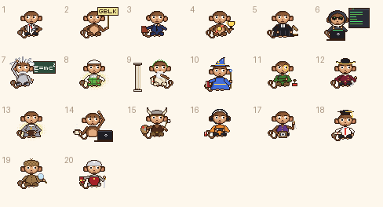
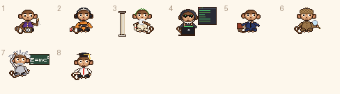
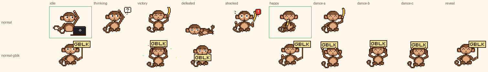
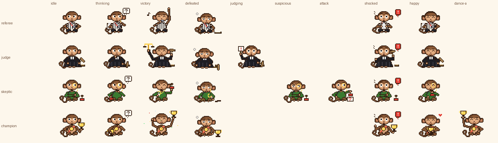
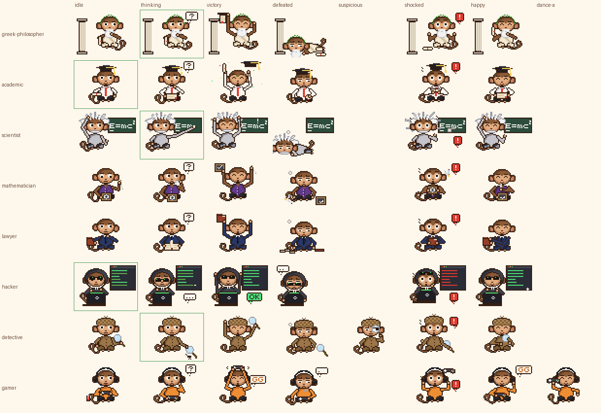
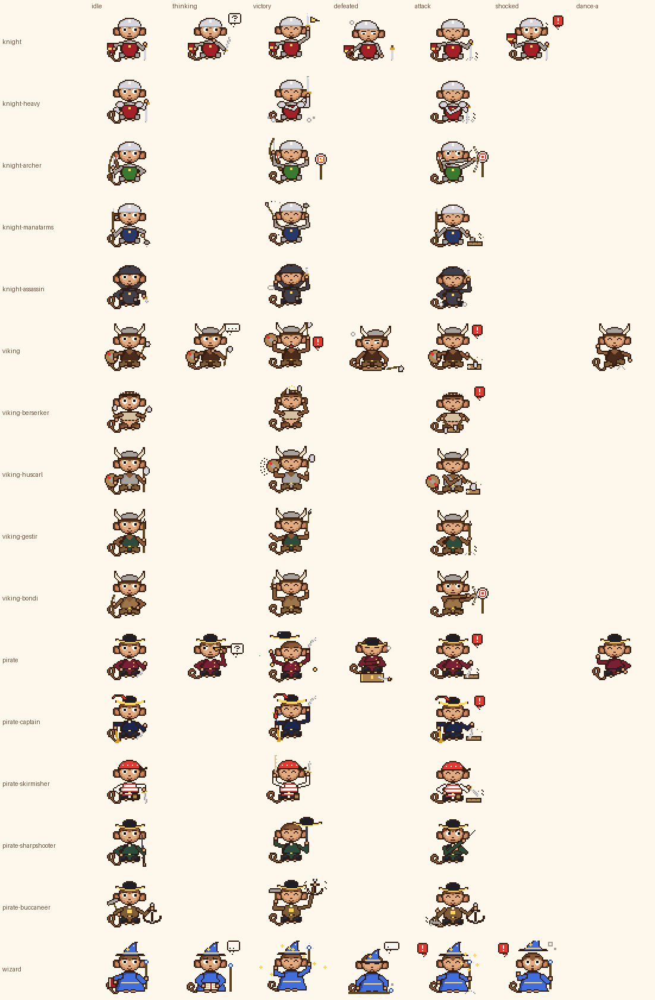
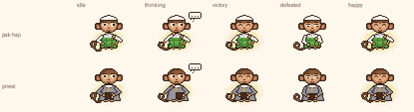

# Laporan akhir Fase 2: Gobyet Character Pack

Branch `claude/gobyet-fase2` (PR #1, draft, **belum di-merge**). Laporan ini mengumpulkan hasil semua gerbang sesuai keputusan pemilik 12. Laporan per gerbang ada di `pack/reports/gate-<X>.md` (G, H, I, J, F); gerbang A-E dilaporkan di percakapan dan ringkasannya ada di `pack/PROGRESS.md`.

**Status:** semua 163 sel yang berlaku terisi (7 asli, 156 baru, 0 placeholder). Validator, tes unit, tes resolver, dan uji browser lulus pada commit akhir. Gaya gerbang G, H, I, J, dan F **belum disetujui**.

## 1. Gerbang

| Gerbang | Isi | Aset | Status | Commit | Tag |
|---|---|---:|---|---|---|
| A | Referee: idle, thinking | 2 | disetujui, dikunci | `06bc433` | `fase2-gate-A` (tidak dibuat) |
| B | Judge (3), Skeptic (3), Champion (2) | 8 | disetujui, dikunci | `6875e4e, 73c034b` | `fase2-gate-B` (tidak dibuat) |
| C | Greek (3), Academic (3), Normal (3) | 9 | disetujui, dikunci | `73c034b` | `fase2-gate-C` (tidak dibuat) |
| D | Scientist (3), Mathematician (3) | 6 | disetujui, dikunci | `056e0dc` | `fase2-gate-D` |
| E | Hacker (3), Detective (4), Lawyer (3) | 10 | disetujui, dikunci | `3eb2cdc` | `fase2-gate-E` |
| G | Gamer (7), Normal-GBLK (8) | 15 | dibuat, menunggu persetujuan | `1d52710` | `fase2-gate-G` |
| H | Knight, Viking, Pirate, Wizard (6 per kostum) | 24 | dibuat, menunggu persetujuan | `bd42c0c` | `fase2-gate-H` |
| I | Pak Haji (5), Priest (5) | 10 | dibuat, menunggu persetujuan | `316fe79` | `fase2-gate-I` |
| J | 12 varian kelas × idle, attack, victory | 36 | dibuat, menunggu persetujuan | `13fe94f` | `fase2-gate-J` |
| F | 36 sel sisa 12 kostum lama | 36 | dibuat, menunggu persetujuan | `7fc8b43` | `fase2-gate-F` |

Tag dibuat di sesi, tetapi remote menolak push tag dari sesi ini. Jalankan `sh tools/tag_gates.sh` dari mesinmu untuk membuat dan mem-push tag D, E, G, H, I, J, dan F.

## 2. Urutan review yang disarankan

Diurutkan dari yang paling berisiko dinilai keliru:

1. **Teologi** (Pak Haji, Priest): `gate-I.md` beserta contact sheet penuh semua state, audit 7.2 a-h butir demi butir, dan `[VT]` di bagian 5. Kesan hormat dan netral **tidak terbukti** otomatis.
2. **GBLK dan tarian:** Normal-GBLK (8 state, 3 tarian) di `gate-G.md`. Tarian lain: Gamer (G), Viking dan Pirate (H), Normal dan Champion (F).
3. **Fantasi:** kostum dasar (`gate-H.md`) lalu 12 varian (`gate-J.md`). Periksa 7.1 (tidak ada yang diarahkan ke karakter, tanpa kilatan, tanpa proyektil).
4. **Sisanya:** Gamer (`gate-G.md`) dan sel sisa kostum lama (`gate-F.md`), terutama victory role netral tanpa lompat.

## 3. Tabel seluruh 163 sel

Status: **asli** = aset sebelum Fase 2 (dikunci hash); **baru** = dibuat di Fase 2. Tidak ada placeholder. Ukuran dalam byte. Sheet 4× hanya ada di aset lama.

<details><summary>Buka tabel (163 baris)</summary>

| Kostum | State | Aturan | Status | Gerbang | File | GIF | Sheet 1× |
|---|---|---|---|---|---|---:|---:|
| `normal` | idle | wajib | asli | - | `ngopi-santai` | 95936 | 3111 |
| `normal` | thinking | wajib | baru | C | `normal-thinking` | 86903 | 2738 |
| `normal` | victory | wajib | baru | C | `normal-victory` | 88693 | 3604 |
| `normal` | defeated | wajib | baru | C | `normal-defeated` | 57848 | 1870 |
| `normal` | shocked | opsional | baru | F | `normal-shocked` | 63595 | 3008 |
| `normal` | happy | opsional | asli | - | `makan-pisang` | 123956 | 4684 |
| `normal` | dance-a | opsional | baru | F | `normal-dance-a` | 70396 | 3122 |
| `normal-gblk` | idle | wajib | baru | G | `normal-gblk-idle` | 92551 | 2790 |
| `normal-gblk` | victory | wajib | baru | G | `normal-gblk-victory` | 95216 | 4348 |
| `normal-gblk` | defeated | wajib | baru | G | `normal-gblk-defeated` | 66226 | 2626 |
| `normal-gblk` | reveal | opsional | baru | G | `normal-gblk-reveal` | 89887 | 2937 |
| `normal-gblk` | happy | opsional | baru | G | `normal-gblk-happy` | 66599 | 2610 |
| `normal-gblk` | dance-a | opsional | baru | G | `normal-gblk-dance-a` | 83336 | 3171 |
| `normal-gblk` | dance-b | opsional | baru | G | `normal-gblk-dance-b` | 81933 | 3007 |
| `normal-gblk` | dance-c | opsional | baru | G | `normal-gblk-dance-c` | 79501 | 2719 |
| `referee` | idle | wajib | baru | A | `referee-idle` | 87689 | 2744 |
| `referee` | thinking | wajib | baru | A | `referee-thinking` | 111960 | 3016 |
| `referee` | victory | wajib | baru | F | `referee-victory` | 81891 | 3196 |
| `referee` | defeated | wajib | baru | F | `referee-defeated` | 74262 | 2618 |
| `referee` | shocked | opsional | baru | F | `referee-shocked` | 61208 | 2874 |
| `referee` | happy | opsional | baru | F | `referee-happy` | 59434 | 2589 |
| `judge` | idle | wajib | baru | B | `judge-idle` | 94461 | 2678 |
| `judge` | thinking | wajib | baru | B | `judge-thinking` | 99746 | 2792 |
| `judge` | victory | wajib | baru | F | `judge-victory` | 98384 | 3244 |
| `judge` | defeated | wajib | baru | F | `judge-defeated` | 68338 | 2621 |
| `judge` | shocked | opsional | baru | F | `judge-shocked` | 69518 | 3008 |
| `judge` | happy | opsional | baru | F | `judge-happy` | 61821 | 2635 |
| `judge` | judging | opsional | baru | B | `judge-judging` | 111841 | 3604 |
| `skeptic` | idle | wajib | baru | B | `skeptic-idle` | 87876 | 2787 |
| `skeptic` | thinking | wajib | baru | F | `skeptic-thinking` | 81611 | 2896 |
| `skeptic` | victory | wajib | baru | F | `skeptic-victory` | 77177 | 3277 |
| `skeptic` | defeated | wajib | baru | F | `skeptic-defeated` | 68763 | 2754 |
| `skeptic` | shocked | opsional | baru | F | `skeptic-shocked` | 62432 | 2839 |
| `skeptic` | happy | opsional | baru | F | `skeptic-happy` | 56197 | 2717 |
| `skeptic` | suspicious | opsional | baru | B | `skeptic-suspicious` | 85285 | 2776 |
| `skeptic` | attack | opsional | baru | B | `skeptic-attack` | 92100 | 3027 |
| `champion` | idle | wajib | baru | B | `champion-idle` | 92563 | 2875 |
| `champion` | thinking | wajib | baru | F | `champion-thinking` | 76087 | 2645 |
| `champion` | victory | wajib | baru | B | `champion-victory` | 99434 | 4648 |
| `champion` | defeated | wajib | baru | F | `champion-defeated` | 72183 | 2625 |
| `champion` | shocked | opsional | baru | F | `champion-shocked` | 68833 | 3067 |
| `champion` | happy | opsional | baru | F | `champion-happy` | 50506 | 2560 |
| `champion` | dance-a | opsional | baru | F | `champion-dance-a` | 74131 | 3251 |
| `greek-philosopher` | idle | wajib | baru | C | `greek-philosopher-idle` | 126674 | 3236 |
| `greek-philosopher` | thinking | wajib | asli | - | `filsuf-yunani` | 170572 | 3898 |
| `greek-philosopher` | victory | wajib | baru | C | `greek-philosopher-victory` | 136520 | 4298 |
| `greek-philosopher` | defeated | wajib | baru | C | `greek-philosopher-defeated` | 109985 | 2916 |
| `greek-philosopher` | shocked | opsional | baru | F | `greek-philosopher-shocked` | 95396 | 3381 |
| `greek-philosopher` | happy | opsional | baru | F | `greek-philosopher-happy` | 88611 | 3216 |
| `academic` | idle | wajib | asli | - | `wisuda` | 103795 | 3593 |
| `academic` | thinking | wajib | baru | C | `academic-thinking` | 92856 | 3165 |
| `academic` | victory | wajib | baru | C | `academic-victory` | 105871 | 5151 |
| `academic` | defeated | wajib | baru | C | `academic-defeated` | 88114 | 2886 |
| `academic` | shocked | opsional | baru | F | `academic-shocked` | 66710 | 2910 |
| `academic` | happy | opsional | baru | F | `academic-happy` | 57979 | 2740 |
| `scientist` | idle | wajib | baru | D | `scientist-idle` | 117994 | 3331 |
| `scientist` | thinking | wajib | asli | - | `rambut-einstein` | 171429 | 4235 |
| `scientist` | victory | wajib | baru | D | `scientist-victory` | 118932 | 4403 |
| `scientist` | defeated | wajib | baru | F | `scientist-defeated` | 89391 | 2681 |
| `scientist` | shocked | opsional | baru | D | `scientist-shocked` | 124003 | 4167 |
| `scientist` | happy | opsional | baru | F | `scientist-happy` | 88799 | 2986 |
| `mathematician` | idle | wajib | baru | D | `mathematician-idle` | 81320 | 3232 |
| `mathematician` | thinking | wajib | baru | D | `mathematician-thinking` | 86689 | 3012 |
| `mathematician` | victory | wajib | baru | D | `mathematician-victory` | 90887 | 4061 |
| `mathematician` | defeated | wajib | baru | F | `mathematician-defeated` | 81162 | 2855 |
| `mathematician` | shocked | opsional | baru | F | `mathematician-shocked` | 65963 | 3452 |
| `mathematician` | happy | opsional | baru | F | `mathematician-happy` | 55949 | 3274 |
| `lawyer` | idle | wajib | baru | E | `lawyer-idle` | 74719 | 2686 |
| `lawyer` | thinking | wajib | baru | E | `lawyer-thinking` | 80823 | 2835 |
| `lawyer` | victory | wajib | baru | E | `lawyer-victory` | 84266 | 3603 |
| `lawyer` | defeated | wajib | baru | F | `lawyer-defeated` | 72443 | 2590 |
| `lawyer` | shocked | opsional | baru | F | `lawyer-shocked` | 60319 | 2749 |
| `lawyer` | happy | opsional | baru | F | `lawyer-happy` | 55354 | 2555 |
| `hacker` | idle | wajib | asli | - | `hacker` | 120602 | 3063 |
| `hacker` | thinking | wajib | baru | E | `hacker-thinking` | 109904 | 3176 |
| `hacker` | victory | wajib | baru | E | `hacker-victory` | 115337 | 3806 |
| `hacker` | defeated | wajib | baru | F | `hacker-defeated` | 79768 | 2598 |
| `hacker` | shocked | opsional | baru | E | `hacker-shocked` | 108621 | 3882 |
| `hacker` | happy | opsional | baru | F | `hacker-happy` | 78703 | 2610 |
| `detective` | idle | wajib | baru | E | `detective-idle` | 89174 | 2942 |
| `detective` | thinking | wajib | asli | - | `detektif-bug` | 136550 | 4317 |
| `detective` | victory | wajib | baru | E | `detective-victory` | 98729 | 3997 |
| `detective` | defeated | wajib | baru | F | `detective-defeated` | 96119 | 3020 |
| `detective` | shocked | opsional | baru | E | `detective-shocked` | 98287 | 3654 |
| `detective` | happy | opsional | baru | F | `detective-happy` | 61159 | 2926 |
| `detective` | suspicious | opsional | baru | E | `detective-suspicious` | 83822 | 3645 |
| `gamer` | idle | wajib | baru | G | `gamer-idle` | 79143 | 2985 |
| `gamer` | thinking | wajib | baru | G | `gamer-thinking` | 65746 | 2653 |
| `gamer` | victory | wajib | baru | G | `gamer-victory` | 90391 | 3990 |
| `gamer` | defeated | wajib | baru | G | `gamer-defeated` | 78130 | 2617 |
| `gamer` | happy | opsional | baru | G | `gamer-happy` | 68671 | 2500 |
| `gamer` | shocked | opsional | baru | G | `gamer-shocked` | 65197 | 3113 |
| `gamer` | dance-a | opsional | baru | G | `gamer-dance-a` | 76396 | 3071 |
| `knight` | idle | wajib | baru | H | `knight-idle` | 58254 | 2606 |
| `knight` | thinking | wajib | baru | H | `knight-thinking` | 66910 | 2479 |
| `knight` | victory | wajib | baru | H | `knight-victory` | 81381 | 3693 |
| `knight` | defeated | wajib | baru | H | `knight-defeated` | 79751 | 2640 |
| `knight` | shocked | opsional | baru | H | `knight-shocked` | 67741 | 2723 |
| `knight` | attack | opsional | baru | H | `knight-attack` | 59638 | 3164 |
| `knight-heavy` | idle | wajib | baru | J | `knight-heavy-idle` | 60619 | 2735 |
| `knight-heavy` | victory | wajib | baru | J | `knight-heavy-victory` | 80615 | 3791 |
| `knight-heavy` | attack | opsional | baru | J | `knight-heavy-attack` | 60079 | 3369 |
| `knight-archer` | idle | wajib | baru | J | `knight-archer-idle` | 63849 | 2828 |
| `knight-archer` | victory | wajib | baru | J | `knight-archer-victory` | 106520 | 3984 |
| `knight-archer` | attack | opsional | baru | J | `knight-archer-attack` | 79450 | 3266 |
| `knight-manatarms` | idle | wajib | baru | J | `knight-manatarms-idle` | 61359 | 2785 |
| `knight-manatarms` | victory | wajib | baru | J | `knight-manatarms-victory` | 83176 | 4578 |
| `knight-manatarms` | attack | opsional | baru | J | `knight-manatarms-attack` | 64852 | 3408 |
| `knight-assassin` | idle | wajib | baru | J | `knight-assassin-idle` | 57692 | 2688 |
| `knight-assassin` | victory | wajib | baru | J | `knight-assassin-victory` | 79071 | 3762 |
| `knight-assassin` | attack | opsional | baru | J | `knight-assassin-attack` | 58193 | 3088 |
| `viking` | idle | wajib | baru | H | `viking-idle` | 72587 | 2890 |
| `viking` | thinking | wajib | baru | H | `viking-thinking` | 78096 | 2556 |
| `viking` | victory | wajib | baru | H | `viking-victory` | 106870 | 4272 |
| `viking` | defeated | wajib | baru | H | `viking-defeated` | 92307 | 2753 |
| `viking` | attack | opsional | baru | H | `viking-attack` | 77898 | 3257 |
| `viking` | dance-a | opsional | baru | H | `viking-dance-a` | 84999 | 3331 |
| `viking-berserker` | idle | wajib | baru | J | `viking-berserker-idle` | 58979 | 2724 |
| `viking-berserker` | victory | wajib | baru | J | `viking-berserker-victory` | 77359 | 3910 |
| `viking-berserker` | attack | opsional | baru | J | `viking-berserker-attack` | 61658 | 3757 |
| `viking-huscarl` | idle | wajib | baru | J | `viking-huscarl-idle` | 75737 | 2992 |
| `viking-huscarl` | victory | wajib | baru | J | `viking-huscarl-victory` | 101652 | 4066 |
| `viking-huscarl` | attack | opsional | baru | J | `viking-huscarl-attack` | 80092 | 3815 |
| `viking-gestir` | idle | wajib | baru | J | `viking-gestir-idle` | 66949 | 2827 |
| `viking-gestir` | victory | wajib | baru | J | `viking-gestir-victory` | 87813 | 3814 |
| `viking-gestir` | attack | opsional | baru | J | `viking-gestir-attack` | 67804 | 3348 |
| `viking-bondi` | idle | wajib | baru | J | `viking-bondi-idle` | 67792 | 2856 |
| `viking-bondi` | victory | wajib | baru | J | `viking-bondi-victory` | 90536 | 3732 |
| `viking-bondi` | attack | opsional | baru | J | `viking-bondi-attack` | 83080 | 3124 |
| `pirate` | idle | wajib | baru | H | `pirate-idle` | 61848 | 2381 |
| `pirate` | thinking | wajib | baru | H | `pirate-thinking` | 67176 | 2700 |
| `pirate` | victory | wajib | baru | H | `pirate-victory` | 95951 | 5434 |
| `pirate` | defeated | wajib | baru | H | `pirate-defeated` | 79738 | 2736 |
| `pirate` | attack | opsional | baru | H | `pirate-attack` | 68186 | 3207 |
| `pirate` | dance-a | opsional | baru | H | `pirate-dance-a` | 73737 | 3246 |
| `pirate-captain` | idle | wajib | baru | J | `pirate-captain-idle` | 66161 | 3018 |
| `pirate-captain` | victory | wajib | baru | J | `pirate-captain-victory` | 94966 | 4273 |
| `pirate-captain` | attack | opsional | baru | J | `pirate-captain-attack` | 74494 | 3817 |
| `pirate-skirmisher` | idle | wajib | baru | J | `pirate-skirmisher-idle` | 60016 | 2857 |
| `pirate-skirmisher` | victory | wajib | baru | J | `pirate-skirmisher-victory` | 87384 | 4466 |
| `pirate-skirmisher` | attack | opsional | baru | J | `pirate-skirmisher-attack` | 63035 | 3768 |
| `pirate-sharpshooter` | idle | wajib | baru | J | `pirate-sharpshooter-idle` | 64460 | 2953 |
| `pirate-sharpshooter` | victory | wajib | baru | J | `pirate-sharpshooter-victory` | 83532 | 3974 |
| `pirate-sharpshooter` | attack | opsional | baru | J | `pirate-sharpshooter-attack` | 63503 | 3147 |
| `pirate-buccaneer` | idle | wajib | baru | J | `pirate-buccaneer-idle` | 77849 | 3141 |
| `pirate-buccaneer` | victory | wajib | baru | J | `pirate-buccaneer-victory` | 105053 | 4265 |
| `pirate-buccaneer` | attack | opsional | baru | J | `pirate-buccaneer-attack` | 76752 | 3583 |
| `wizard` | idle | wajib | baru | H | `wizard-idle` | 63504 | 2412 |
| `wizard` | thinking | wajib | baru | H | `wizard-thinking` | 77051 | 2636 |
| `wizard` | victory | wajib | baru | H | `wizard-victory` | 93110 | 5062 |
| `wizard` | defeated | wajib | baru | H | `wizard-defeated` | 75945 | 2545 |
| `wizard` | shocked | opsional | baru | H | `wizard-shocked` | 72816 | 3407 |
| `wizard` | attack | opsional | baru | H | `wizard-attack` | 67853 | 3244 |
| `pak-haji` | idle | wajib | baru | I | `pak-haji-idle` | 106591 | 3642 |
| `pak-haji` | thinking | wajib | baru | I | `pak-haji-thinking` | 84784 | 2497 |
| `pak-haji` | victory | wajib | baru | I | `pak-haji-victory` | 115568 | 4162 |
| `pak-haji` | defeated | wajib | baru | I | `pak-haji-defeated` | 91841 | 3174 |
| `pak-haji` | happy | opsional | baru | I | `pak-haji-happy` | 80710 | 3575 |
| `priest` | idle | wajib | baru | I | `priest-idle` | 97716 | 3247 |
| `priest` | thinking | wajib | baru | I | `priest-thinking` | 78678 | 2381 |
| `priest` | victory | wajib | baru | I | `priest-victory` | 105923 | 3566 |
| `priest` | defeated | wajib | baru | I | `priest-defeated` | 85988 | 3005 |
| `priest` | happy | opsional | baru | I | `priest-happy` | 73144 | 3157 |

</details>

Jumlah baris: 163. Total GIF sel: 13,548,702 B, total sheet 1× sel: 525,659 B (tanpa extras dan sheet 4×).

## 4. Tes buta dan contact sheet per keluarga

Idle 1× ukuran asli, tanpa label, urutan acak dengan seed tetap `20260930` (+ indeks keluarga). Nomor kecil hanya penanda posisi. Coba tebak dulu, baru buka kuncinya. Versi interaktif ada di preview, panel Tes buta.

**Semua kostum dasar**



<details><summary>Kunci Semua kostum dasar</summary>

1 = `referee`, 2 = `normal-gblk`, 3 = `lawyer`, 4 = `champion`, 5 = `judge`, 6 = `hacker`, 7 = `scientist`, 8 = `pak-haji`, 9 = `greek-philosopher`, 10 = `wizard`, 11 = `skeptic`, 12 = `pirate`, 13 = `priest`, 14 = `normal`, 15 = `viking`, 16 = `gamer`, 17 = `mathematician`, 18 = `academic`, 19 = `detective`, 20 = `knight`

</details>

**Inti dan spesial**


<details><summary>Kunci Inti dan spesial</summary>

1 = `normal-gblk`, 2 = `normal`

</details>

**Peran**


<details><summary>Kunci Peran</summary>

1 = `champion`, 2 = `referee`, 3 = `judge`, 4 = `skeptic`

</details>

**Domain**



<details><summary>Kunci Domain</summary>

1 = `mathematician`, 2 = `gamer`, 3 = `greek-philosopher`, 4 = `hacker`, 5 = `lawyer`, 6 = `detective`, 7 = `scientist`, 8 = `academic`

</details>

**Fantasi**


<details><summary>Kunci Fantasi</summary>

1 = `viking`, 2 = `pirate`, 3 = `wizard`, 4 = `knight`

</details>

**Teologi**


<details><summary>Kunci Teologi</summary>

1 = `pak-haji`, 2 = `priest`

</details>

### Contact sheet per keluarga

Semua sel yang terisi, frame kunci, 2×. Kotak hijau = aset asli. Kolom = state yang dipakai keluarga itu.

**Inti dan spesial**



**Peran**



**Domain**



**Fantasi**



**Teologi**



## 5. Validasi final (V1-V13)

Output mentah validator penuh di HEAD sesudah perbaikan teknis (`python3 src/validate_pack.py`, tanpa `--gate`). Aset tidak berubah sejak commit Gerbang F. Yang berubah hanya laporan V4: median, seam/median, dan peringatan SEAM-POP. Rinciannya di `pack/reports/perbaikan-teknis.md`.

| | Pemeriksaan | Hasil |
|---|---|---|
| V1 | Hash aset asli (27), disetujui (89), dan dibuat (242) | 27 + 89 + 242 identik dalam satu keluaran validator |
| V2-V3 | Manifest, schema, palet, kanvas, alfa, isi GIF = sheet | 32 kostum, 13 state, 163/163 sel, 0 gagal |
| V4 | Seam loop ≤ 1,25×, median, seam/median, dan peringatan SEAM-POP (seam ≥ 0,9 × maks dan maks > 100 px) | semua aset baru lulus ambang; 4 aset asli DIKETAHUI; daftar SEAM-POP ada di output V4 dan `perbaikan-teknis.md` |
| V5 | IoU siluet | tidak ada defeated > 0,85; idle > 0,90 hanya Pak Haji–Priest 0,93 (dilaporkan) |
| V6 | Warna dominan dan ΔE | pasangan < 15 hanya tiga pengecualian yang diterima; aksen varian sefaksi ≥ 20,1 |
| V7 | Ukuran prop | tabel di output; prop di bawah 6×6 ditandai |
| V8 | Audit teks | lulus; `E=mc` statis, `GBLK` utuh di frame kunci |
| VT | Audit teologi 7.2 (i-vi) dan kontrol positif | lulus |
| V9 | Tarian 16 × 120 ms, pose besar di beat | 10 tarian lulus |
| V10 | Ukuran | pertambahan 10,69 MB dari `dd78be8` (ambang peringatan 15 MB, batas 16 MB) |
| V11 | Tes unit, tes resolver, uji browser | lulus (bagian Tes di bawah) |
| V12 | Git: diff terhadap `main`, repo Bertahan tidak berubah | bagian Git di bawah |
| V13 | Panel tes buta per keluarga dan semua kostum dasar | preview (e2e memeriksa label tersembunyi dan urutan tetap) dan bagian 4 |

### Warna dominan final dan pasangan terdekat

```
[V6] Warna dominan dari piksel kostum saja dan jarak warna (CIE76 Delta E; target >= 15)
  metode: frame kunci idle (atau sel pertama bila belum ada idle); piksel yang berbeda dari Normal idle
  pada posisi sama; warna tubuh (BEFKMbf) tidak dihitung; 16 W + 8 P (mata) dikurangkan.
  Kostum teologi: piksel aura (mask identik untuk keduanya, 7.2e) tidak dihitung sebagai pakaian.
  Normal tidak berkostum: warnanya bulu B.
  normal             (idle)     dominan B (139, 90, 55)   100%   kedua -
  normal-gblk        (idle)     dominan n (236, 226, 150)  84%   kedua N (96, 70, 30)
  referee            (idle)     dominan W (250, 247, 240)  36%   kedua P (26, 18, 14)
  judge              (idle)     dominan L (30, 30, 36)     69%   kedua l (64, 64, 74)
  skeptic            (idle)     dominan v (58, 122, 48)    55%   kedua O (255, 214, 90)
  champion           (idle)     dominan O (255, 214, 90)   76%   kedua r (255, 130, 96)
  greek-philosopher  (idle)     dominan c (214, 194, 160)  30%   kedua m (232, 228, 218)
  academic           (idle)     dominan W (250, 247, 240)  42%   kedua L (30, 30, 36)
  scientist          (idle)     dominan k (44, 76, 60)     41%   kedua h (196, 196, 202)
  mathematician      (idle)     dominan p (98, 58, 140)    40%   kedua X (176, 136, 84)
  lawyer             (idle)     dominan J (40, 56, 104)    60%   kedua U (150, 62, 40)
  hacker             (idle)     dominan q (42, 44, 54)     53%   kedua L (30, 30, 36)
  detective          (idle)     dominan d (156, 118, 72)   34%   kedua x (128, 94, 56)
  gamer              (idle)     dominan o (238, 142, 52)   38%   kedua L (30, 30, 36)
  knight             (idle)     dominan z (164, 32, 40)    36%   kedua G (214, 214, 220)
  viking             (idle)     dominan D (74, 42, 26)     33%   kedua s (168, 162, 156)
  pirate             (idle)     dominan i (122, 32, 52)    44%   kedua L (30, 30, 36)
  wizard             (idle)     dominan 3 (66, 110, 220)   68%   kedua 4 (44, 78, 170)
  pak-haji           (idle)     dominan V (96, 176, 72)    27%   kedua S (240, 238, 234)
  priest             (idle)     dominan g (150, 150, 160)  66%   kedua D (74, 42, 26)
  pasangan terdekat:
    referee            academic           W vs W  Delta E   0.0  < 15
    judge              hacker             L vs q  Delta E   7.2  < 15
    normal             detective          B vs d  Delta E  12.2  < 15
    normal-gblk        greek-philosopher  n vs c  Delta E  23.1
    skeptic            pak-haji           v vs V  Delta E  23.8
    greek-philosopher  academic           c vs W  Delta E  24.2
    referee            greek-philosopher  W vs c  Delta E  24.2
    scientist          hacker             k vs q  Delta E  24.5
  aksen varian knight (target Delta E >= 10 antar saudara): knight-heavy=G, knight-archer=v, knight-manatarms=J, knight-assassin=l
    knight-heavy         knight-archer        Delta E  65.8
    knight-heavy         knight-manatarms     Delta E  67.6
    knight-heavy         knight-assassin      Delta E  58.4
    knight-archer        knight-manatarms     Delta E  81.4
    knight-archer        knight-assassin      Delta E  58.2
    knight-manatarms     knight-assassin      Delta E  25.4
  aksen varian viking (target Delta E >= 10 antar saudara): viking-berserker=c, viking-huscarl=s, viking-gestir=k, viking-bondi=d
    viking-berserker     viking-huscarl       Delta E  20.1
    viking-berserker     viking-gestir        Delta E  54.7
    viking-berserker     viking-bondi         Delta E  30.1
    viking-huscarl       viking-gestir        Delta E  41.2
    viking-huscarl       viking-bondi         Delta E  31.8
    viking-gestir        viking-bondi         Delta E  42.3
  aksen varian pirate (target Delta E >= 10 antar saudara): pirate-captain=w, pirate-skirmisher=R, pirate-sharpshooter=k, pirate-buccaneer=x
    pirate-captain       pirate-skirmisher    Delta E  95.0
    pirate-captain       pirate-sharpshooter  Delta E  40.6
    pirate-captain       pirate-buccaneer     Delta E  57.3
    pirate-skirmisher    pirate-sharpshooter  Delta E  91.2
    pirate-skirmisher    pirate-buccaneer     Delta E  57.9
    pirate-sharpshooter  pirate-buccaneer     Delta E  35.4
```

### IoU siluet final

```
[V5] Siluet: IoU mask buram frame kunci
  catatan: semua kostum memakai kepala dan badan yang sama, jadi IoU dasar antar-kostum sudah tinggi
  a) idle antar kostum dasar (> 0,90 = kandidat terlalu mirip)
             normal normal refere  judge skepti champi greek- academ scient mathem lawyer hacker detect  gamer knight viking pirate wizard pak-ha priest
  normal       1.00   0.41   0.51   0.58   0.55   0.50   0.43   0.52   0.31   0.50   0.50   0.32   0.50   0.53   0.50   0.47   0.50   0.56   0.54   0.56
  normal-gbl   0.41   1.00   0.66   0.58   0.61   0.65   0.38   0.48   0.39   0.60   0.59   0.45   0.63   0.63   0.60   0.60   0.63   0.45   0.59   0.58
  referee      0.51   0.66   1.00   0.78   0.85   0.86   0.44   0.62   0.32   0.84   0.85   0.30   0.82   0.85   0.79   0.74   0.83   0.55   0.78   0.79
  judge        0.58   0.58   0.78   1.00   0.79   0.75   0.46   0.62   0.31   0.78   0.74   0.31   0.73   0.74   0.72   0.65   0.75   0.61   0.76   0.82
  skeptic      0.55   0.61   0.85   0.79   1.00   0.79   0.46   0.60   0.31   0.83   0.80   0.28   0.77   0.84   0.78   0.71   0.80   0.57   0.77   0.77
  champion     0.50   0.65   0.86   0.75   0.79   1.00   0.43   0.59   0.33   0.83   0.77   0.33   0.83   0.77   0.75   0.70   0.78   0.58   0.75   0.75
  greek-phil   0.43   0.38   0.44   0.46   0.46   0.43   1.00   0.40   0.30   0.42   0.41   0.26   0.46   0.43   0.43   0.41   0.44   0.40   0.44   0.45
  academic     0.52   0.48   0.62   0.62   0.60   0.59   0.40   1.00   0.31   0.61   0.58   0.31   0.62   0.63   0.58   0.57   0.62   0.71   0.65   0.64
  scientist    0.31   0.39   0.32   0.31   0.31   0.33   0.30   0.31   1.00   0.32   0.36   0.64   0.33   0.35   0.36   0.40   0.34   0.30   0.34   0.33
  mathematic   0.50   0.60   0.84   0.78   0.83   0.83   0.42   0.61   0.32   1.00   0.80   0.32   0.78   0.81   0.78   0.73   0.81   0.58   0.78   0.80
  lawyer       0.50   0.59   0.85   0.74   0.80   0.77   0.41   0.58   0.36   0.80   1.00   0.32   0.72   0.81   0.83   0.79   0.78   0.52   0.75   0.75
  hacker       0.32   0.45   0.30   0.31   0.28   0.33   0.26   0.31   0.64   0.32   0.32   1.00   0.33   0.31   0.33   0.37   0.31   0.34   0.34   0.34
  detective    0.50   0.63   0.82   0.73   0.77   0.83   0.46   0.62   0.33   0.78   0.72   0.33   1.00   0.82   0.80   0.74   0.82   0.56   0.78   0.73
  gamer        0.53   0.63   0.85   0.74   0.84   0.77   0.43   0.63   0.35   0.81   0.81   0.31   0.82   1.00   0.80   0.75   0.85   0.57   0.76   0.74
  knight       0.50   0.60   0.79   0.72   0.78   0.75   0.43   0.58   0.36   0.78   0.83   0.33   0.80   0.80   1.00   0.83   0.85   0.54   0.79   0.73
  viking       0.47   0.60   0.74   0.65   0.71   0.70   0.41   0.57   0.40   0.73   0.79   0.37   0.74   0.75   0.83   1.00   0.78   0.50   0.73   0.68
  pirate       0.50   0.63   0.83   0.75   0.80   0.78   0.44   0.62   0.34   0.81   0.78   0.31   0.82   0.85   0.85   0.78   1.00   0.56   0.79   0.75
  wizard       0.56   0.45   0.55   0.61   0.57   0.58   0.40   0.71   0.30   0.58   0.52   0.34   0.56   0.57   0.54   0.50   0.56   1.00   0.61   0.64
  pak-haji     0.54   0.59   0.78   0.76   0.77   0.75   0.44   0.65   0.34   0.78   0.75   0.34   0.78   0.76   0.79   0.73   0.79   0.61   1.00   0.93
  priest       0.56   0.58   0.79   0.82   0.77   0.75   0.45   0.64   0.33   0.80   0.75   0.34   0.73   0.74   0.73   0.68   0.75   0.64   0.93   1.00
  tertinggi: pak-haji-priest 0.93, referee-champion 0.86, referee-lawyer 0.85
  pasangan > 0,90: pak-haji-priest 0.93
  b) defeated vs idle pada kostum yang sama (<= 0,85)
    normal               0.30  lulus
    greek-philosopher    0.34  lulus
    academic             0.75  lulus
    scientist            0.43  lulus
    hacker               0.42  lulus
    detective            0.66  lulus
    referee              0.66  lulus
    judge                0.60  lulus
    skeptic              0.66  lulus
    champion             0.62  lulus
    mathematician        0.59  lulus
    lawyer               0.60  lulus
    gamer                0.65  lulus
    normal-gblk          0.53  lulus
    knight               0.56  lulus
    viking               0.61  lulus
    pirate               0.64  lulus
    wizard               0.65  lulus
    pak-haji             0.79  lulus
    priest               0.83  lulus
  c) varian vs saudara sefaksi (dilaporkan)
    knight               knight-heavy         0.85
    knight               knight-archer        0.88
    knight               knight-manatarms     0.88
    knight               knight-assassin      0.84
    knight-heavy         knight-archer        0.82
    knight-heavy         knight-manatarms     0.83
    knight-heavy         knight-assassin      0.87
    knight-archer        knight-manatarms     0.87
    knight-archer        knight-assassin      0.81
    knight-manatarms     knight-assassin      0.84
    viking               viking-berserker     0.75
    viking               viking-huscarl       0.94
    viking               viking-gestir        0.85
    viking               viking-bondi         0.88
    viking-berserker     viking-huscarl       0.76
    viking-berserker     viking-gestir        0.78
    viking-berserker     viking-bondi         0.79
    viking-huscarl       viking-gestir        0.88
    viking-huscarl       viking-bondi         0.86
    viking-gestir        viking-bondi         0.90
    pirate               pirate-captain       0.92
    pirate               pirate-skirmisher    0.87
    pirate               pirate-sharpshooter  0.95
    pirate               pirate-buccaneer     0.83
    pirate-captain       pirate-skirmisher    0.80
    pirate-captain       pirate-sharpshooter  0.87
    pirate-captain       pirate-buccaneer     0.78
    pirate-skirmisher    pirate-sharpshooter  0.88
    pirate-skirmisher    pirate-buccaneer     0.76
    pirate-sharpshooter  pirate-buccaneer     0.82
```

### Audit teologi

```
[VT] Audit teologi 7.2 (keputusan pemilik 11c: pemeriksaan i-vi, wajib lulus)
  state pak-haji: defeated, happy, idle, thinking, victory | priest: defeated, happy, idle, thinking, victory
  (ii) defeated  16 frame, durasi [200] ms, sama untuk keduanya
  (ii) happy     12 frame, durasi [150] ms, sama untuk keduanya
  (ii) idle      16 frame, durasi [180] ms, sama untuk keduanya
  (ii) thinking  12 frame, durasi [170] ms, sama untuk keduanya
  (ii) victory   16 frame, durasi [160] ms, sama untuk keduanya
  (ii) lulus
  (i)  defeated  mask aura 69-318 piksel per frame, identik di 16 frame; terlihat rata-rata pak-haji 83, priest 66
  (i)  happy     mask aura 280-361 piksel per frame, identik di 12 frame; terlihat rata-rata pak-haji 128, priest 107
  (i)  idle      mask aura 280-361 piksel per frame, identik di 16 frame; terlihat rata-rata pak-haji 128, priest 107
  (i)  thinking  mask aura 318-318 piksel per frame, identik di 12 frame; terlihat rata-rata pak-haji 131, priest 107
  (i)  victory   mask aura 464-596 piksel per frame, identik di 16 frame; terlihat rata-rata pak-haji 187, priest 158
  (i)  lulus
  (iii) pak-haji-defeated    teks mini_text: tidak ada (titik digambar sebagai piksel)
  (iii) pak-haji-happy       teks mini_text: tidak ada (titik digambar sebagai piksel)
  (iii) pak-haji-idle        teks mini_text: tidak ada (titik digambar sebagai piksel)
  (iii) pak-haji-thinking    teks mini_text: tidak ada (titik digambar sebagai piksel)
  (iii) pak-haji-victory     teks mini_text: tidak ada (titik digambar sebagai piksel)
  (iii) priest-defeated      teks mini_text: tidak ada (titik digambar sebagai piksel)
  (iii) priest-happy         teks mini_text: tidak ada (titik digambar sebagai piksel)
  (iii) priest-idle          teks mini_text: tidak ada (titik digambar sebagai piksel)
  (iii) priest-thinking      teks mini_text: tidak ada (titik digambar sebagai piksel)
  (iii) priest-victory       teks mini_text: tidak ada (titik digambar sebagai piksel)
  (iii) lulus
  (iv) warna salib 'y': pak-haji 0 piksel di semua frame; priest kotak 3x4 (6 px); buku polos warna CDK
  (iv) lulus (glyph: hanya lewat mini_text yang diinstrumentasi di iii)
  (v)  dagu (30 piksel zona) tanpa GHSWghm; di atas alis tanpa VZkv: lulus
  (vi) area kopiah tanpa Llq, tanpa warna batik Uu; kopiah putih pak-haji min 40 piksel W: lulus
  kontrol positif greek-philosopher-idle janggut 26, daun 20, kopiah hitam 0, batik 0 piksel -> terdeteksi
  kontrol positif kondangan              janggut 0, daun 0, kopiah hitam 30, batik 135 piksel -> terdeteksi
```

### Tarian dan ukuran

```
[V9] Audit tarian (dance-*: 16 frame x 120 ms, pose besar di beat f0/f4/f8/f12)
  normal/dance-a           transisi beat [677, 662, 665, 677], lainnya maks 19  lulus
  champion/dance-a         transisi beat [721, 670, 673, 721], lainnya maks 19  lulus
  gamer/dance-a            transisi beat [619, 589, 610, 619], lainnya maks 20  lulus
  normal-gblk/dance-a      transisi beat [873, 859, 860, 873], lainnya maks 19  lulus
  normal-gblk/dance-b      transisi beat [834, 828, 832, 844], lainnya maks 19  lulus
  normal-gblk/dance-c      transisi beat [962, 932, 941, 956], lainnya maks 19  lulus
  viking/dance-a           transisi beat [586, 557, 575, 597], lainnya maks 20  lulus
  pirate/dance-a           transisi beat [548, 518, 536, 559], lainnya maks 20  lulus

[V10] Ukuran
  GIF pra-Fase 2 terbesar: 171429 byte (batas per GIF baru, dihitung setelah optimize)
  gerbang A:  2 aset, GIF terbesar 111960 byte, total file   222284 byte
  gerbang B:  8 aset, GIF terbesar 111841 byte, total file   858967 byte
  gerbang C:  9 aset, GIF terbesar 136520 byte, total file  1004656 byte
  gerbang D:  6 aset, GIF terbesar 124003 byte, total file   642031 byte
  gerbang E: 10 aset, GIF terbesar 115337 byte, total file   977908 byte
  gerbang G: 15 aset, GIF terbesar  95216 byte, total file  1224060 byte
  gerbang H: 24 aset, GIF terbesar 106870 byte, total file  1898721 byte
  gerbang I: 10 aset, GIF terbesar 115568 byte, total file   953349 byte
  gerbang J: 36 aset, GIF terbesar 106520 byte, total file  2816640 byte
  gerbang F: 36 aset, GIF terbesar  98384 byte, total file  2694681 byte
  sel berlaku 163, terisi 163, tersisa 0
  rata-rata per aset profil baru: GIF 78609 byte, sheet 3196 byte (137 aset)
             dd78be8   sekarang  pertambahan proyeksi akhir
  GIF        3029800   13799243     10769443       10769443
  sheet       365586     803533       437947         437947
  proyeksi pertambahan total: 11207390 byte (10.69 MB); ambang peringatan 15 MB, batas keras 16 MB
  opsi D (GIF aset baru dibuat saat rilis, tidak disimpan): hemat 10769443 byte sekarang, 10769443 byte di akhir
HASIL: LULUS
```

<details><summary>Output validator lengkap (V1-V10, VT)</summary>

```
[V1] Hash aset yang dikunci dan aset yang sudah dibuat
  sha256-asli.txt: 27 identik, 0 berubah/hilang
  sha256-disetujui.txt: 89 identik, 0 berubah/hilang
  sha256-dibuat.txt: 242 identik, 0 berubah/hilang

[V2] Manifest dan schema, [V3] palet, kanvas, alfa, isi GIF
  32 kostum, 13 state, 163 sel berlaku, 163 sel terisi; 0 gagal

[V4] Loop seam (piksel berbeda; seam = frame terakhir -> frame pertama)
  ambang = 1.25 x selisih maksimum antar-frame berurutan di aset itu sendiri
  SEAM-POP (peringatan) = seam >= 0.9 x maks dan maks > 100 px; seam/med = seam dibagi median langkah internal
  sel                        status     maks median  ambang   seam seam/med  hasil
  normal/idle                terkunci    237     42   296.2     37     0.88  lulus
  normal/happy               terkunci    324   91.5   405.0    100     1.09  lulus
  normal/thinking            terkunci    158     37   197.5     34     0.92  lulus
  normal/victory             terkunci    544    395   680.0     16     0.04  lulus
  normal/defeated            terkunci     45      7    56.2     36     5.14  lulus
  normal/shocked             baru        687    412   858.8     19     0.05  lulus
  normal/dance-a             baru        677      7   846.2    677    96.71  lulus; SEAM-POP PERINGATAN
  greek-philosopher/thinking terkunci    197     20   246.2    234    11.70  lulus; SEAM-POP DIKETAHUI (terkunci)
  greek-philosopher/idle     terkunci     70     28    87.5     33     1.18  lulus
  greek-philosopher/victory  terkunci    560    438   700.0      8     0.02  lulus
  greek-philosopher/defeated terkunci    113     24   141.2     69     2.88  lulus
  greek-philosopher/shocked  baru        702    401   877.5     17     0.04  lulus
  greek-philosopher/happy    baru        344     40   430.0     42     1.05  lulus
  academic/idle              terkunci    241     27   301.2     36     1.33  lulus
  academic/thinking          terkunci    176     34   220.0     28     0.82  lulus
  academic/victory           terkunci    549    130   686.2     20     0.15  lulus
  academic/defeated          terkunci    287     17   358.8     12     0.71  lulus
  academic/shocked           baru        409    117   511.2     27     0.23  lulus
  academic/happy             baru        420     36   525.0     31     0.86  lulus
  scientist/thinking         terkunci    140     37   175.0    239     6.46  DIKETAHUI (terkunci, tidak diubah); SEAM-POP DIKETAHUI (terkunci)
  scientist/idle             terkunci     75     43    93.8     44     1.02  lulus
  scientist/shocked          terkunci    814     44  1017.5     30     0.68  lulus
  scientist/victory          terkunci    722    493   902.5     59     0.12  lulus
  scientist/defeated         baru         46      7    57.5     36     5.14  lulus
  scientist/happy            baru         99     45   123.8     69     1.53  lulus
  hacker/idle                terkunci    257     43   321.2    258     6.00  lulus; SEAM-POP DIKETAHUI (terkunci)
  hacker/thinking            terkunci    138     25   172.5     68     2.72  lulus
  hacker/shocked             terkunci    372    118   465.0     68     0.58  lulus
  hacker/victory             terkunci    600    331   750.0     68     0.21  lulus
  hacker/defeated            baru        712     11   890.0    708    64.36  lulus; SEAM-POP PERINGATAN
  hacker/happy               baru         74     61    92.5     74     1.21  lulus
  detective/thinking         terkunci    312     80   390.0    356     4.45  lulus; SEAM-POP DIKETAHUI (terkunci)
  detective/idle             terkunci    196     19   245.0     16     0.84  lulus
  detective/suspicious       terkunci    527     65   658.8     93     1.43  lulus
  detective/shocked          terkunci    813    100  1016.2     16     0.16  lulus
  detective/victory          terkunci    689    467   861.2     16     0.03  lulus
  detective/defeated         baru        246     18   307.5     16     0.89  lulus
  detective/happy            baru        376     52   470.0     31     0.60  lulus
  referee/idle               terkunci    216     20   270.0      8     0.40  lulus
  referee/thinking           terkunci    143     27   178.8    152     5.63  lulus; SEAM-POP DIKETAHUI (terkunci)
  referee/victory            baru        231     34   288.8     18     0.53  lulus
  referee/defeated           baru        219      7   273.8     42     6.00  lulus
  referee/shocked            baru        623    357   778.8     18     0.05  lulus
  referee/happy              baru        173     41   216.2    102     2.49  lulus
  judge/idle                 terkunci    207     18   258.8      4     0.22  lulus
  judge/thinking             terkunci    158     26   197.5     24     0.92  lulus
  judge/judging              terkunci    207    112   258.8      7     0.06  lulus
  judge/victory              baru        302     46   377.5     19     0.41  lulus
  judge/defeated             baru        226      7   282.5     37     5.29  lulus
  judge/shocked              baru        670    388   837.5     19     0.05  lulus
  judge/happy                baru        374     36   467.5     19     0.53  lulus
  skeptic/idle               terkunci    221     18   276.2      8     0.44  lulus
  skeptic/suspicious         terkunci    278     21   347.5      8     0.38  lulus
  skeptic/attack             terkunci    152     20   190.0      8     0.40  lulus
  skeptic/thinking           baru        158     26   197.5     40     1.54  lulus
  skeptic/victory            baru        222     41   277.5     19     0.46  lulus
  skeptic/defeated           baru        229     19   286.2     67     3.53  lulus
  skeptic/shocked            baru        587    340   733.8     19     0.06  lulus
  skeptic/happy              baru        333     47   416.2     19     0.40  lulus
  champion/idle              terkunci    214     19   267.5     16     0.84  lulus
  champion/victory           terkunci    513    286   641.2     16     0.06  lulus
  champion/thinking          baru        154     22   192.5     41     1.86  lulus
  champion/defeated          baru        218      7   272.5     42     6.00  lulus
  champion/shocked           baru        763    463   953.8     18     0.04  lulus
  champion/happy             baru        324     34   405.0     16     0.47  lulus
  champion/dance-a           baru        721      7   901.2    721   103.00  lulus; SEAM-POP PERINGATAN
  mathematician/idle         terkunci     59     37    73.8     23     0.62  lulus
  mathematician/thinking     terkunci    180     48   225.0     11     0.23  lulus
  mathematician/victory      terkunci    710    450   887.5     38     0.08  lulus
  mathematician/defeated     baru        217      8   271.2     42     5.25  lulus
  mathematician/shocked      baru        731    385   913.8     18     0.05  lulus
  mathematician/happy        baru        281     62   351.2     55     0.89  lulus
  lawyer/idle                terkunci    105     27   131.2      8     0.30  lulus
  lawyer/thinking            terkunci    131     37   163.8     18     0.49  lulus
  lawyer/victory             terkunci    652    403   815.0      8     0.02  lulus
  lawyer/defeated            baru        217      8   271.2     38     4.75  lulus
  lawyer/shocked             baru        671    345   838.8     11     0.03  lulus
  lawyer/happy               baru        331     39   413.8     11     0.28  lulus
  gamer/idle                 baru        154     36   192.5     43     1.19  lulus
  gamer/thinking             baru        211     35   263.8     32     0.91  lulus
  gamer/happy                baru        220     22   275.0     31     1.41  lulus
  gamer/shocked              baru        620    107   775.0     32     0.30  lulus
  gamer/victory              baru        803    443  1003.8     17     0.04  lulus
  gamer/defeated             baru        103     18   128.8     16     0.89  lulus
  gamer/dance-a              baru        619      7   773.8    619    88.43  lulus; SEAM-POP PERINGATAN
  normal-gblk/idle           baru        183     43   228.8    158     3.67  lulus
  normal-gblk/reveal         baru        367     19   458.8    261    13.74  lulus
  normal-gblk/happy          baru        217    200   271.2     36     0.18  lulus
  normal-gblk/victory        baru        993    359  1241.2     16     0.04  lulus
  normal-gblk/defeated       baru        359     18   448.8     16     0.89  lulus
  normal-gblk/dance-a        baru        873      7  1091.2    873   124.71  lulus; SEAM-POP PERINGATAN
  normal-gblk/dance-b        baru        834      7  1042.5    844   120.57  lulus; SEAM-POP PERINGATAN
  normal-gblk/dance-c        baru        962      7  1202.5    956   136.57  lulus; SEAM-POP PERINGATAN
  knight/idle                baru        356     14   445.0     11     0.79  lulus
  knight/thinking            baru        138     32   172.5     28     0.88  lulus
  knight/shocked             baru        728     19   910.0     11     0.58  lulus
  knight/attack              baru        509     22   636.2     11     0.50  lulus
  knight/victory             baru        552    460   690.0     11     0.02  lulus
  knight/defeated            baru         32     14    40.0     13     0.93  lulus
  viking/idle                baru        396     21   495.0    395    18.81  lulus; SEAM-POP PERINGATAN
  viking/thinking            baru        114     29   142.5     27     0.93  lulus
  viking/attack              baru        267     21   333.8     11     0.52  lulus
  viking/victory             baru        719    541   898.8     11     0.02  lulus
  viking/defeated            baru         30     15    37.5     14     0.93  lulus
  viking/dance-a             baru        586      7   732.5    597    85.29  lulus; SEAM-POP PERINGATAN
  pirate/idle                baru         45     19    56.2     19     1.00  lulus
  pirate/thinking            baru        272     15   340.0     43     2.87  lulus
  pirate/attack              baru        277     32   346.2     19     0.59  lulus
  pirate/victory             baru        652    596   815.0     19     0.03  lulus
  pirate/defeated            baru         29     16    36.2     22     1.38  lulus
  pirate/dance-a             baru        548      7   685.0    559    79.86  lulus; SEAM-POP PERINGATAN
  wizard/idle                baru         37     13    46.2     17     1.31  lulus
  wizard/thinking            baru        130     27   162.5    138     5.11  lulus; SEAM-POP PERINGATAN
  wizard/shocked             baru        531    116   663.8     18     0.16  lulus
  wizard/attack              baru        153     76   191.2     18     0.24  lulus
  wizard/victory             baru        642    580   802.5     24     0.04  lulus
  wizard/defeated            baru        120     10   150.0     32     3.20  lulus
  pak-haji/idle              baru        296     39   370.0     19     0.49  lulus
  pak-haji/thinking          baru         99     17   123.8     54     3.18  lulus
  pak-haji/happy             baru        295     52   368.8     82     1.58  lulus
  pak-haji/victory           baru        136     45   170.0     48     1.07  lulus
  pak-haji/defeated          baru        153     15   191.2     19     1.27  lulus
  priest/idle                baru        240     18   300.0     19     1.06  lulus
  priest/thinking            baru         99     14   123.8     48     3.43  lulus
  priest/happy               baru        242     32   302.5     66     2.06  lulus
  priest/victory             baru        100     26   125.0     35     1.35  lulus
  priest/defeated            baru        126     14   157.5     19     1.36  lulus
  knight-heavy/idle          baru        441     32   551.2    435    13.59  lulus; SEAM-POP PERINGATAN
  knight-heavy/attack        baru        555     40   693.8     19     0.47  lulus
  knight-heavy/victory       baru        504    474   630.0     19     0.04  lulus
  knight-archer/idle         baru        442     22   552.5    437    19.86  lulus; SEAM-POP PERINGATAN
  knight-archer/attack       baru        309     22   386.2     11     0.50  lulus
  knight-archer/victory      baru        523    446   653.8     11     0.02  lulus
  knight-manatarms/idle      baru        453     23   566.2    449    19.52  lulus; SEAM-POP PERINGATAN
  knight-manatarms/attack    baru        490     23   612.5     12     0.52  lulus
  knight-manatarms/victory   baru        551    506   688.8     12     0.02  lulus
  knight-assassin/idle       baru        469     32   586.2    463    14.47  lulus; SEAM-POP PERINGATAN
  knight-assassin/attack     baru        384     47   480.0     19     0.40  lulus
  knight-assassin/victory    baru        501    471   626.2     19     0.04  lulus
  viking-berserker/idle      baru        489     32   611.2    483    15.09  lulus; SEAM-POP PERINGATAN
  viking-berserker/attack    baru        667     96   833.8     19     0.20  lulus
  viking-berserker/victory   baru        558    460   697.5     19     0.04  lulus
  viking-huscarl/idle        baru        464     21   580.0    463    22.05  lulus; SEAM-POP PERINGATAN
  viking-huscarl/attack      baru        551     19   688.8      9     0.47  lulus
  viking-huscarl/victory     baru        694    592   867.5     11     0.02  lulus
  viking-gestir/idle         baru        475     32   593.8    469    14.66  lulus; SEAM-POP PERINGATAN
  viking-gestir/attack       baru        558     32   697.5     19     0.59  lulus
  viking-gestir/victory      baru        578    514   722.5     19     0.04  lulus
  viking-bondi/idle          baru        489     22   611.2    487    22.14  lulus; SEAM-POP PERINGATAN
  viking-bondi/attack        baru        259     21   323.8     12     0.57  lulus
  viking-bondi/victory       baru        541    490   676.2     12     0.02  lulus
  pirate-captain/idle        baru        522     27   652.5    515    19.07  lulus; SEAM-POP PERINGATAN
  pirate-captain/attack      baru        646     77   807.5     15     0.19  lulus
  pirate-captain/victory     baru        600    529   750.0     15     0.03  lulus
  pirate-skirmisher/idle     baru        517     32   646.2    516    16.12  lulus; SEAM-POP PERINGATAN
  pirate-skirmisher/attack   baru        683     32   853.8     32     1.00  lulus
  pirate-skirmisher/victory  baru        501    298   626.2     32     0.11  lulus
  pirate-sharpshooter/idle   baru        483     32   603.8    477    14.91  lulus; SEAM-POP PERINGATAN
  pirate-sharpshooter/attack baru        208     21   260.0     19     0.90  lulus
  pirate-sharpshooter/victory baru        626    505   782.5     19     0.04  lulus
  pirate-buccaneer/idle      baru        538     32   672.5    532    16.62  lulus; SEAM-POP PERINGATAN
  pirate-buccaneer/attack    baru        561     32   701.2     19     0.59  lulus
  pirate-buccaneer/victory   baru        713    603   891.2     19     0.03  lulus
  SEAM-POP: 28 sel (5 terkunci = DIKETAHUI, 23 baru = PERINGATAN): normal/dance-a, hacker/defeated, champion/dance-a, gamer/dance-a, normal-gblk/dance-a, normal-gblk/dance-b, normal-gblk/dance-c, viking/idle, viking/dance-a, pirate/dance-a, wizard/thinking, knight-heavy/idle, knight-archer/idle, knight-manatarms/idle, knight-assassin/idle, viking-berserker/idle, viking-huscarl/idle, viking-gestir/idle, viking-bondi/idle, pirate-captain/idle, pirate-skirmisher/idle, pirate-sharpshooter/idle, pirate-buccaneer/idle

[V5] Siluet: IoU mask buram frame kunci
  catatan: semua kostum memakai kepala dan badan yang sama, jadi IoU dasar antar-kostum sudah tinggi
  a) idle antar kostum dasar (> 0,90 = kandidat terlalu mirip)
             normal normal refere  judge skepti champi greek- academ scient mathem lawyer hacker detect  gamer knight viking pirate wizard pak-ha priest
  normal       1.00   0.41   0.51   0.58   0.55   0.50   0.43   0.52   0.31   0.50   0.50   0.32   0.50   0.53   0.50   0.47   0.50   0.56   0.54   0.56
  normal-gbl   0.41   1.00   0.66   0.58   0.61   0.65   0.38   0.48   0.39   0.60   0.59   0.45   0.63   0.63   0.60   0.60   0.63   0.45   0.59   0.58
  referee      0.51   0.66   1.00   0.78   0.85   0.86   0.44   0.62   0.32   0.84   0.85   0.30   0.82   0.85   0.79   0.74   0.83   0.55   0.78   0.79
  judge        0.58   0.58   0.78   1.00   0.79   0.75   0.46   0.62   0.31   0.78   0.74   0.31   0.73   0.74   0.72   0.65   0.75   0.61   0.76   0.82
  skeptic      0.55   0.61   0.85   0.79   1.00   0.79   0.46   0.60   0.31   0.83   0.80   0.28   0.77   0.84   0.78   0.71   0.80   0.57   0.77   0.77
  champion     0.50   0.65   0.86   0.75   0.79   1.00   0.43   0.59   0.33   0.83   0.77   0.33   0.83   0.77   0.75   0.70   0.78   0.58   0.75   0.75
  greek-phil   0.43   0.38   0.44   0.46   0.46   0.43   1.00   0.40   0.30   0.42   0.41   0.26   0.46   0.43   0.43   0.41   0.44   0.40   0.44   0.45
  academic     0.52   0.48   0.62   0.62   0.60   0.59   0.40   1.00   0.31   0.61   0.58   0.31   0.62   0.63   0.58   0.57   0.62   0.71   0.65   0.64
  scientist    0.31   0.39   0.32   0.31   0.31   0.33   0.30   0.31   1.00   0.32   0.36   0.64   0.33   0.35   0.36   0.40   0.34   0.30   0.34   0.33
  mathematic   0.50   0.60   0.84   0.78   0.83   0.83   0.42   0.61   0.32   1.00   0.80   0.32   0.78   0.81   0.78   0.73   0.81   0.58   0.78   0.80
  lawyer       0.50   0.59   0.85   0.74   0.80   0.77   0.41   0.58   0.36   0.80   1.00   0.32   0.72   0.81   0.83   0.79   0.78   0.52   0.75   0.75
  hacker       0.32   0.45   0.30   0.31   0.28   0.33   0.26   0.31   0.64   0.32   0.32   1.00   0.33   0.31   0.33   0.37   0.31   0.34   0.34   0.34
  detective    0.50   0.63   0.82   0.73   0.77   0.83   0.46   0.62   0.33   0.78   0.72   0.33   1.00   0.82   0.80   0.74   0.82   0.56   0.78   0.73
  gamer        0.53   0.63   0.85   0.74   0.84   0.77   0.43   0.63   0.35   0.81   0.81   0.31   0.82   1.00   0.80   0.75   0.85   0.57   0.76   0.74
  knight       0.50   0.60   0.79   0.72   0.78   0.75   0.43   0.58   0.36   0.78   0.83   0.33   0.80   0.80   1.00   0.83   0.85   0.54   0.79   0.73
  viking       0.47   0.60   0.74   0.65   0.71   0.70   0.41   0.57   0.40   0.73   0.79   0.37   0.74   0.75   0.83   1.00   0.78   0.50   0.73   0.68
  pirate       0.50   0.63   0.83   0.75   0.80   0.78   0.44   0.62   0.34   0.81   0.78   0.31   0.82   0.85   0.85   0.78   1.00   0.56   0.79   0.75
  wizard       0.56   0.45   0.55   0.61   0.57   0.58   0.40   0.71   0.30   0.58   0.52   0.34   0.56   0.57   0.54   0.50   0.56   1.00   0.61   0.64
  pak-haji     0.54   0.59   0.78   0.76   0.77   0.75   0.44   0.65   0.34   0.78   0.75   0.34   0.78   0.76   0.79   0.73   0.79   0.61   1.00   0.93
  priest       0.56   0.58   0.79   0.82   0.77   0.75   0.45   0.64   0.33   0.80   0.75   0.34   0.73   0.74   0.73   0.68   0.75   0.64   0.93   1.00
  tertinggi: pak-haji-priest 0.93, referee-champion 0.86, referee-lawyer 0.85
  pasangan > 0,90: pak-haji-priest 0.93
  b) defeated vs idle pada kostum yang sama (<= 0,85)
    normal               0.30  lulus
    greek-philosopher    0.34  lulus
    academic             0.75  lulus
    scientist            0.43  lulus
    hacker               0.42  lulus
    detective            0.66  lulus
    referee              0.66  lulus
    judge                0.60  lulus
    skeptic              0.66  lulus
    champion             0.62  lulus
    mathematician        0.59  lulus
    lawyer               0.60  lulus
    gamer                0.65  lulus
    normal-gblk          0.53  lulus
    knight               0.56  lulus
    viking               0.61  lulus
    pirate               0.64  lulus
    wizard               0.65  lulus
    pak-haji             0.79  lulus
    priest               0.83  lulus
  c) varian vs saudara sefaksi (dilaporkan)
    knight               knight-heavy         0.85
    knight               knight-archer        0.88
    knight               knight-manatarms     0.88
    knight               knight-assassin      0.84
    knight-heavy         knight-archer        0.82
    knight-heavy         knight-manatarms     0.83
    knight-heavy         knight-assassin      0.87
    knight-archer        knight-manatarms     0.87
    knight-archer        knight-assassin      0.81
    knight-manatarms     knight-assassin      0.84
    viking               viking-berserker     0.75
    viking               viking-huscarl       0.94
    viking               viking-gestir        0.85
    viking               viking-bondi         0.88
    viking-berserker     viking-huscarl       0.76
    viking-berserker     viking-gestir        0.78
    viking-berserker     viking-bondi         0.79
    viking-huscarl       viking-gestir        0.88
    viking-huscarl       viking-bondi         0.86
    viking-gestir        viking-bondi         0.90
    pirate               pirate-captain       0.92
    pirate               pirate-skirmisher    0.87
    pirate               pirate-sharpshooter  0.95
    pirate               pirate-buccaneer     0.83
    pirate-captain       pirate-skirmisher    0.80
    pirate-captain       pirate-sharpshooter  0.87
    pirate-captain       pirate-buccaneer     0.78
    pirate-skirmisher    pirate-sharpshooter  0.88
    pirate-skirmisher    pirate-buccaneer     0.76
    pirate-sharpshooter  pirate-buccaneer     0.82

[V6] Warna dominan dari piksel kostum saja dan jarak warna (CIE76 Delta E; target >= 15)
  metode: frame kunci idle (atau sel pertama bila belum ada idle); piksel yang berbeda dari Normal idle
  pada posisi sama; warna tubuh (BEFKMbf) tidak dihitung; 16 W + 8 P (mata) dikurangkan.
  Kostum teologi: piksel aura (mask identik untuk keduanya, 7.2e) tidak dihitung sebagai pakaian.
  Normal tidak berkostum: warnanya bulu B.
  normal             (idle)     dominan B (139, 90, 55)   100%   kedua -
  normal-gblk        (idle)     dominan n (236, 226, 150)  84%   kedua N (96, 70, 30)
  referee            (idle)     dominan W (250, 247, 240)  36%   kedua P (26, 18, 14)
  judge              (idle)     dominan L (30, 30, 36)     69%   kedua l (64, 64, 74)
  skeptic            (idle)     dominan v (58, 122, 48)    55%   kedua O (255, 214, 90)
  champion           (idle)     dominan O (255, 214, 90)   76%   kedua r (255, 130, 96)
  greek-philosopher  (idle)     dominan c (214, 194, 160)  30%   kedua m (232, 228, 218)
  academic           (idle)     dominan W (250, 247, 240)  42%   kedua L (30, 30, 36)
  scientist          (idle)     dominan k (44, 76, 60)     41%   kedua h (196, 196, 202)
  mathematician      (idle)     dominan p (98, 58, 140)    40%   kedua X (176, 136, 84)
  lawyer             (idle)     dominan J (40, 56, 104)    60%   kedua U (150, 62, 40)
  hacker             (idle)     dominan q (42, 44, 54)     53%   kedua L (30, 30, 36)
  detective          (idle)     dominan d (156, 118, 72)   34%   kedua x (128, 94, 56)
  gamer              (idle)     dominan o (238, 142, 52)   38%   kedua L (30, 30, 36)
  knight             (idle)     dominan z (164, 32, 40)    36%   kedua G (214, 214, 220)
  viking             (idle)     dominan D (74, 42, 26)     33%   kedua s (168, 162, 156)
  pirate             (idle)     dominan i (122, 32, 52)    44%   kedua L (30, 30, 36)
  wizard             (idle)     dominan 3 (66, 110, 220)   68%   kedua 4 (44, 78, 170)
  pak-haji           (idle)     dominan V (96, 176, 72)    27%   kedua S (240, 238, 234)
  priest             (idle)     dominan g (150, 150, 160)  66%   kedua D (74, 42, 26)
  pasangan terdekat:
    referee            academic           W vs W  Delta E   0.0  < 15
    judge              hacker             L vs q  Delta E   7.2  < 15
    normal             detective          B vs d  Delta E  12.2  < 15
    normal-gblk        greek-philosopher  n vs c  Delta E  23.1
    skeptic            pak-haji           v vs V  Delta E  23.8
    greek-philosopher  academic           c vs W  Delta E  24.2
    referee            greek-philosopher  W vs c  Delta E  24.2
    scientist          hacker             k vs q  Delta E  24.5
  aksen varian knight (target Delta E >= 10 antar saudara): knight-heavy=G, knight-archer=v, knight-manatarms=J, knight-assassin=l
    knight-heavy         knight-archer        Delta E  65.8
    knight-heavy         knight-manatarms     Delta E  67.6
    knight-heavy         knight-assassin      Delta E  58.4
    knight-archer        knight-manatarms     Delta E  81.4
    knight-archer        knight-assassin      Delta E  58.2
    knight-manatarms     knight-assassin      Delta E  25.4
  aksen varian viking (target Delta E >= 10 antar saudara): viking-berserker=c, viking-huscarl=s, viking-gestir=k, viking-bondi=d
    viking-berserker     viking-huscarl       Delta E  20.1
    viking-berserker     viking-gestir        Delta E  54.7
    viking-berserker     viking-bondi         Delta E  30.1
    viking-huscarl       viking-gestir        Delta E  41.2
    viking-huscarl       viking-bondi         Delta E  31.8
    viking-gestir        viking-bondi         Delta E  42.3
  aksen varian pirate (target Delta E >= 10 antar saudara): pirate-captain=w, pirate-skirmisher=R, pirate-sharpshooter=k, pirate-buccaneer=x
    pirate-captain       pirate-skirmisher    Delta E  95.0
    pirate-captain       pirate-sharpshooter  Delta E  40.6
    pirate-captain       pirate-buccaneer     Delta E  57.3
    pirate-skirmisher    pirate-sharpshooter  Delta E  91.2
    pirate-skirmisher    pirate-buccaneer     Delta E  57.9
    pirate-sharpshooter  pirate-buccaneer     Delta E  35.4

[V7] Ukuran prop di 1x (kotak pembatas, digambar sendirian; target heuristik >= 6x6)
  referee: peluit                 9x8   ok
  referee: papan klip             8x10  ok
  judge: palu                     9x9   ok
  judge: landasan                 7x3   di bawah 6x6
  judge: papan skor               9x12  ok
  skeptic: monokel                8x14  ok
  skeptic: stempel                7x9   ok
  skeptic: kertas bercap         10x7   ok
  champion: piala                12x11  ok
  champion: medali                7x7   ok
  greek: gulungan terbuka        10x11  ok
  greek: gulungan menggelinding  11x4   di bawah 6x6
  academic: topi toga            21x10  ok
  academic: ijazah terbuka       15x8   ok
  academic: ijazah kusut          8x6   ok
  normal: pisang                  6x17  ok
  scientist: papan tulis (asli)  29x16  ok
  mathematician: batu tulis      11x9   ok
  mathematician: jangka           7x9   ok
  detective: kaca pembesar (asli) 12x13  ok
  hacker: laptop (asli)          24x15  ok
  lawyer: map tertutup           10x9   ok
  lawyer: map terbuka            16x8   ok
  lawyer: dasi                    2x8   di bawah 6x6
  gamer: gamepad                 14x6   ok
  gamer: headset                 26x19  ok
  gamer: kaleng                   4x6   di bawah 6x6
  normal-gblk: papan GBLK        27x21  ok
  knight: pedang                  4x15  di bawah 6x6
  knight: perisai                 9x11  ok
  knight: helm terbuka           20x8   ok
  knight: panji                   8x5   di bawah 6x6
  viking: kapak                  10x15  ok
  viking: perisai bundar         12x12  ok
  viking: helm bertanduk         26x11  ok
  pirate: cutlass                 9x13  ok
  pirate: teropong               15x4   di bawah 6x6
  pirate: tricorn                25x8   ok
  wizard: tongkat                 7x27  ok
  wizard: topi runcing           25x12  ok
  wizard: buku mantra            13x7   ok
  pak-haji: kopiah putih         18x6   ok
  pak-haji: tasbih                8x8   ok
  priest: buku polos              9x7   ok
  priest: kalung salib            6x5   di bawah 6x6
  knight-heavy: pedang besar      6x19  ok
  knight-heavy: pelindung bahu    8x6   ok
  knight-archer: busur panjang    5x25  di bawah 6x6
  knight-archer: tabung panah     7x14  ok
  knight-archer: papan sasaran   10x22  ok
  knight-manatarms: halberd       6x30  ok
  knight-manatarms: gada          8x13  ok
  knight-assassin: belati         4x9   di bawah 6x6
  knight-assassin: bom asap       4x6   di bawah 6x6
  viking-berserker: ikat kepala bulu 18x3   di bawah 6x6
  viking-huscarl: kapak besar     6x22  ok
  viking-gestir: tombak lempar    3x29  di bawah 6x6
  viking-bondi: busur pendek      4x16  di bawah 6x6
  viking-bondi: seax              7x4   di bawah 6x6
  pirate-captain: topi kapten    28x9   ok
  pirate-captain: blunderbuss     7x18  ok
  pirate-captain: burung beo      8x10  ok
  pirate-skirmisher: bandana     25x9   ok
  pirate-skirmisher: tong mesiu   5x6   di bawah 6x6
  pirate-sharpshooter: senapan panjang 11x26  ok
  pirate-buccaneer: palu besar   10x16  ok
  pirate-buccaneer: jangkar      14x15  ok
  judge: timbangan (victory)     17x11  ok
  skeptic: monokel tergantung     6x13  ok
  lawyer: kertas berkas          16x5   di bawah 6x6
  champion: hati kecil            5x4   di bawah 6x6

[V8] Audit teks (semua pemanggil mini_text diinstrumentasi) dan beat per rentang frame

[VT] Audit teologi 7.2 (keputusan pemilik 11c: pemeriksaan i-vi, wajib lulus)
  state pak-haji: defeated, happy, idle, thinking, victory | priest: defeated, happy, idle, thinking, victory
  (ii) defeated  16 frame, durasi [200] ms, sama untuk keduanya
  (ii) happy     12 frame, durasi [150] ms, sama untuk keduanya
  (ii) idle      16 frame, durasi [180] ms, sama untuk keduanya
  (ii) thinking  12 frame, durasi [170] ms, sama untuk keduanya
  (ii) victory   16 frame, durasi [160] ms, sama untuk keduanya
  (ii) lulus
  (i)  defeated  mask aura 69-318 piksel per frame, identik di 16 frame; terlihat rata-rata pak-haji 83, priest 66
  (i)  happy     mask aura 280-361 piksel per frame, identik di 12 frame; terlihat rata-rata pak-haji 128, priest 107
  (i)  idle      mask aura 280-361 piksel per frame, identik di 16 frame; terlihat rata-rata pak-haji 128, priest 107
  (i)  thinking  mask aura 318-318 piksel per frame, identik di 12 frame; terlihat rata-rata pak-haji 131, priest 107
  (i)  victory   mask aura 464-596 piksel per frame, identik di 16 frame; terlihat rata-rata pak-haji 187, priest 158
  (i)  lulus
  (iii) pak-haji-defeated    teks mini_text: tidak ada (titik digambar sebagai piksel)
  (iii) pak-haji-happy       teks mini_text: tidak ada (titik digambar sebagai piksel)
  (iii) pak-haji-idle        teks mini_text: tidak ada (titik digambar sebagai piksel)
  (iii) pak-haji-thinking    teks mini_text: tidak ada (titik digambar sebagai piksel)
  (iii) pak-haji-victory     teks mini_text: tidak ada (titik digambar sebagai piksel)
  (iii) priest-defeated      teks mini_text: tidak ada (titik digambar sebagai piksel)
  (iii) priest-happy         teks mini_text: tidak ada (titik digambar sebagai piksel)
  (iii) priest-idle          teks mini_text: tidak ada (titik digambar sebagai piksel)
  (iii) priest-thinking      teks mini_text: tidak ada (titik digambar sebagai piksel)
  (iii) priest-victory       teks mini_text: tidak ada (titik digambar sebagai piksel)
  (iii) lulus
  (iv) warna salib 'y': pak-haji 0 piksel di semua frame; priest kotak 3x4 (6 px); buku polos warna CDK
  (iv) lulus (glyph: hanya lewat mini_text yang diinstrumentasi di iii)
  (v)  dagu (30 piksel zona) tanpa GHSWghm; di atas alis tanpa VZkv: lulus
  (vi) area kopiah tanpa Llq, tanpa warna batik Uu; kopiah putih pak-haji min 40 piksel W: lulus
  kontrol positif greek-philosopher-idle janggut 26, daun 20, kopiah hitam 0, batik 0 piksel -> terdeteksi
  kontrol positif kondangan              janggut 0, daun 0, kopiah hitam 30, batik 135 piksel -> terdeteksi

[V9] Audit tarian (dance-*: 16 frame x 120 ms, pose besar di beat f0/f4/f8/f12)
  normal/dance-a           transisi beat [677, 662, 665, 677], lainnya maks 19  lulus
  champion/dance-a         transisi beat [721, 670, 673, 721], lainnya maks 19  lulus
  gamer/dance-a            transisi beat [619, 589, 610, 619], lainnya maks 20  lulus
  normal-gblk/dance-a      transisi beat [873, 859, 860, 873], lainnya maks 19  lulus
  normal-gblk/dance-b      transisi beat [834, 828, 832, 844], lainnya maks 19  lulus
  normal-gblk/dance-c      transisi beat [962, 932, 941, 956], lainnya maks 19  lulus
  viking/dance-a           transisi beat [586, 557, 575, 597], lainnya maks 20  lulus
  pirate/dance-a           transisi beat [548, 518, 536, 559], lainnya maks 20  lulus

[V10] Ukuran
  GIF pra-Fase 2 terbesar: 171429 byte (batas per GIF baru, dihitung setelah optimize)
  gerbang A:  2 aset, GIF terbesar 111960 byte, total file   222284 byte
  gerbang B:  8 aset, GIF terbesar 111841 byte, total file   858967 byte
  gerbang C:  9 aset, GIF terbesar 136520 byte, total file  1004656 byte
  gerbang D:  6 aset, GIF terbesar 124003 byte, total file   642031 byte
  gerbang E: 10 aset, GIF terbesar 115337 byte, total file   977908 byte
  gerbang G: 15 aset, GIF terbesar  95216 byte, total file  1224060 byte
  gerbang H: 24 aset, GIF terbesar 106870 byte, total file  1898721 byte
  gerbang I: 10 aset, GIF terbesar 115568 byte, total file   953349 byte
  gerbang J: 36 aset, GIF terbesar 106520 byte, total file  2816640 byte
  gerbang F: 36 aset, GIF terbesar  98384 byte, total file  2694681 byte
  sel berlaku 163, terisi 163, tersisa 0
  rata-rata per aset profil baru: GIF 78609 byte, sheet 3196 byte (137 aset)
             dd78be8   sekarang  pertambahan proyeksi akhir
  GIF        3029800   13799243     10769443       10769443
  sheet       365586     803533       437947         437947
  proyeksi pertambahan total: 11207390 byte (10.69 MB); ambang peringatan 15 MB, batas keras 16 MB
  opsi D (GIF aset baru dibuat saat rilis, tidak disimpan): hemat 10769443 byte sekarang, 10769443 byte di akhir

HASIL: LULUS
exit=0
```

</details>

### Tes (V11)

```
$ python3 src/export.py
pack/manifest.json  163 sel (7 asli, 156 baru), 32 kostum, 13 state
$ git status --short gif sheets pack/manifest.json (harus kosong)
0
$ sha256sum -c
  sha256-asli.txt: 27 file identik
  sha256-disetujui.txt: 89 file identik
  sha256-dibuat.txt: 242 file identik

$ python3 -m unittest src/test_validate_pack.py -v
test_sawtooth_flagged (src.test_validate_pack.SeamPop.test_sawtooth_flagged) ... ok
test_small_motion_below_minimum (src.test_validate_pack.SeamPop.test_small_motion_below_minimum) ... ok
test_smooth_loop_not_flagged (src.test_validate_pack.SeamPop.test_smooth_loop_not_flagged) ... ok
test_static_loop (src.test_validate_pack.SeamPop.test_static_loop) ... ok
test_alias_import_with_glyph_outside_mini (src.test_validate_pack.TextAudit.test_alias_import_with_glyph_outside_mini) ... ok
test_direct_import_too_long (src.test_validate_pack.TextAudit.test_direct_import_too_long) ... ok
test_exception_only_for_its_owner_and_static (src.test_validate_pack.TextAudit.test_exception_only_for_its_owner_and_static) ... ok
test_module_attribute_call (src.test_validate_pack.TextAudit.test_module_attribute_call) ... ok
test_patch_is_restored (src.test_validate_pack.TextAudit.test_patch_is_restored) ... ok

----------------------------------------------------------------------
Ran 9 tests in 0.039s

OK

$ node --test pack/resolver.test.js
# tests 19
# pass 19
# fail 0
e2e exit=0
E2E: LULUS
```

Uji browser (`node tools/e2e_preview.js`, Playwright + Chromium, desktop 1280 px dan ponsel 390 px):

```json
{
 "counts": {
  "real": 7,
  "new": 156,
  "new_by_gate": {
   "C": 9,
   "F": 36,
   "G": 15,
   "A": 2,
   "B": 8,
   "D": 6,
   "E": 10,
   "H": 24,
   "J": 36,
   "I": 10
  },
  "placeholder": 0,
  "css_placeholder": 0,
  "not_applicable": 253,
  "rows": 32,
  "stats": "7 sel asli | 156 sel baru | 0 placeholder | 103 / 103 sel wajib terisi | 163 / 163 sel berlaku terisi | 32 × 13 kostum × state"
 },
 "animates": true,
 "blank_cells": 0,
 "static_button_holds": true,
 "reduced_motion_static": true,
 "blind_same_order_after_reload": true,
 "blind_revealed_ok": true,
 "phone_overflow": 0,
 "desktop_errors": [],
 "phone_errors": [],
 "desktop_bad_requests": [],
 "phone_bad_requests": [],
 "fails": [],
 "static_desktop": {
  "canvases": 567,
  "frame_mismatch": 0,
  "pixel_mismatch": 0
 },
 "static_phone": {
  "canvases": 567,
  "frame_mismatch": 0,
  "pixel_mismatch": 0
 },
 "filter_phone": {
  "union_ok": true,
  "counts_ok": true,
  "max_gate_height": 2327,
  "per_option": {
   "idle": {
    "figures": 20,
    "height_px": 2028
   },
   "F:inti-dan-spesial": {
    "figures": 2,
    "height_px": 588
   },
   "F:peran": {
    "figures": 18,
    "height_px": 1847
   },
   "F:domain": {
    "figures": 16,
    "height_px": 1687
   },
   "J:knight": {
    "figures": 12,
    "height_px": 1367
   },
   "J:viking": {
    "figures": 12,
    "height_px": 1367
   },
   "J:pirate": {
    "figures": 12,
    "height_px": 1367
   },
   "I": {
    "figures": 10,
    "height_px": 1207
   },
   "H": {
    "figures": 24,
    "height_px": 2327
   },
   "G": {
    "figures": 15,
    "height_px": 1687
   },
   "E": {
    "figures": 10,
    "height_px": 1207
   },
   "D": {
    "figures": 6,
    "height_px": 887
   },
   "C": {
    "figures": 9,
    "height_px": 1207
   },
   "B": {
    "figures": 8,
    "height_px": 1047
   },
   "A": {
    "figures": 2,
    "height_px": 567
   },
   "semua": {
    "figures": 176,
    "height_px": 15291
   }
  }
 }
}
```

### Git (V12)

```
$ git log --oneline origin/main..HEAD | wc -l
23
$ git diff --stat origin/main..HEAD (ringkas)
 387 files changed, 18704 insertions(+), 270 deletions(-)
origin/main: a7a6d21; HEAD: 4590f60 + perubahan perbaikan teknis (belum di-commit saat laporan dibuat)
$ repo Bertahan-Bukan-hidup
status: 0 baris; diff vs origin/main: 0 baris (tidak berubah)
```

## 6. Ukuran final dibanding proyeksi

| Titik | Proyeksi pertambahan total |
|---|---:|
| sebelum Gerbang G (42 dari 163 sel) | 13,23 MB |
| sesudah G | 11,99 MB |
| sesudah H | 11,27 MB |
| sesudah I | 11,45 MB |
| sesudah J | 11,01 MB |
| **akhir (163/163 sel, nyata)** | **10,69 MB** (11.207.390 B) |

| | di `dd78be8` | akhir | pertambahan |
|---|---:|---:|---:|
| GIF | 3.029.800 | 13.799.243 | 10.769.443 |
| sheet (1× dan 4×) | 365.586 | 803.533 | 437.947 |

Rata-rata per aset profil baru (137 aset): GIF 78.609 B, sheet 1× 3.196 B. Optimize GIF (opsi B) menghemat 9,6-12% per gerbang dengan frame dan durasi identik (bukti per gerbang di laporan gerbang). Batas 16 MB dan ambang 15 MB tidak terlewati; STOP-DARURAT tidak pernah terpicu. Opsi D (GIF dibuat saat rilis) tetap berupa rancangan di `pack/README.md`.

## 7. Tebakan dan kelemahan, per kostum

Dikumpulkan dari laporan semua gerbang (B-F) dan known issues yang disetujui. Rincian per aset ada di laporan gerbang masing-masing.

### Lintas kostum

- **Terbaca di 1× tanpa label: tidak terbukti** untuk semua gerbang. Panel tes buta ada di bawah dan di preview; yang bisa menilai hanya mata pemilik.
- **Badan duduk yang sama membuat IoU dasar antar-kostum tinggi.**
  - Pasangan tertinggi di kostum dasar: Pak Haji–Priest 0,93 (akibat aura identik, 7.2e), Referee–Champion 0,86, lalu Referee–Lawyer, Referee–Gamer, Knight–Pirate, dan Pirate–Gamer masing-masing 0,85.
  - Pembeda utamanya warna dan prop, bukan siluet.
- **Pola dasar victory sama** (lengan naik, prop naik, lompat 1 px). Elemen khas per kostum dicatat di tabel `STYLE.md`. Lawyer (Gerbang E) tidak punya elemen khas dan tidak direvisi, sesuai keputusan pemilik.
- **Metode warna dominan adalah heuristik:** piksel yang berbeda dari Normal idle, di luar warna tubuh. Scientist terhitung papan tulis `k`, bukan sweternya.
- **Tiga pasangan warna di bawah ΔE 15** melibatkan tampilan asli yang terkunci. Semuanya diterima pemilik sebagai pengecualian: Referee–Academic 0, Judge–Hacker 7,2, Normal–Detective 12,2.
- **Seam loop:** 4 dari 7 aset asli melewati ambang 1,25×. Statusnya DIKETAHUI karena aset dikunci hash.
- **Celah V8:** pemanggilan `mini_text` lewat closure atau argumen default secara teori bisa lolos. Belum ada kasusnya di kode.
- **Tarian dengan badan duduk:** geser dan lompat hanya 2-5 px karena kanvas 64×48.
- **Label tes buta di preview** hanya tersembunyi secara visual; atribut `data-costume` masih ada di DOM.

### Normal dan Normal-GBLK

- **Normal:**
  - Pisang sebagai "piala" di victory adalah pilihan saya (C).
  - Pose rebah (defeated) adalah bentuk badan baru: kepala tetap menghadap kamera di atas badan yang menyamping (C).
  - dance-a (F): pisang dan kepalan bergantian.
- **Normal-GBLK:**
  - Tiga tarian sama-sama memegang papan di atas kepala. Pembedanya hanya arah gerak, jadi di 1× bisa terlihat mirip.
  - Tepi papan hanya 11-12 px dari tepi kanvas di dance-a.
  - Kepanjangan akronim hanya ada di `caption`.

### Peran (Referee, Judge, Skeptic, Champion)

- **Referee:**
  - IoU tertinggi terhadap beberapa kostum lain (0,85-0,86).
  - Peluit di mulut saat victory (F) hanya 5×3 px.
  - Victory tanpa lompat adalah tafsiran saya atas 7.3.
- **Judge:**
  - Landasan 7×3 di bawah target prop.
  - Papan skor hanya bisa menampilkan "!", karena MINI tidak punya glyph angka.
  - Hitam jubahnya dekat abu hoodie Hacker (pengecualian yang diterima).
  - Timbangan emas di victory (F) adalah prop baru.
- **Skeptic:**
  - Monokel berantai bisa terbaca sebagai kaca pembesar milik Detective.
  - Sapu tangan (F) 4×4 di bawah target.
- **Champion:**
  - Piala dipamerkan setinggi bahu; ini kompromi dari posisi di depan badan (IoU dengan Referee 0,92 → 0,83).
  - Laurel emas diganti medali (keputusan pemilik).
  - Hati kecil di happy (F) adalah tambahan saya.
  - dance-a memakai satu tangan bergantian, karena piala terlalu kecil untuk dua tangan tanpa menutupi wajah.

### Domain (Greek, Academic, Scientist, Mathematician, Lawyer, Hacker, Detective, Gamer)

- **Greek:**
  - Laurel hijau tetap (keputusan pemilik; aset aslinya terkunci).
  - Pose rebah menutupi kaki tiang.
  - Gulungan menggelinding 11×4.
  - GIF-nya paling besar di Gerbang C (126-137 KB) karena tiang tergambar di tiap frame.
- **Academic** (known issues):
  - defeated di 1× hanya berbeda 1-2 px dari idle (IoU 0,75).
  - Topi toga terpotong 1 baris di puncak lemparan victory.
- **Scientist:**
  - Tampilan mengikuti `rambut-einstein` (sweter abu, bukan jas lab).
  - Warna dominan terhitung papan tulis.
  - defeated (F) rebah menyamping, beda dari kostum lama lain yang lunglai sambil duduk.
- **Mathematician:** jangka berkaki 1 px, tipis di 1× (known issue).
- **Lawyer:**
  - Dasi 2×8 (known issue).
  - Victory tanpa elemen khas.
  - Kertas berkas di defeated (F) sebagian tertutup ekor.
- **Hacker:**
  - Mata menyipit di thinking hampir tidak terlihat (known issue).
  - defeated (F) menutup jendela terminal. Terminal adalah bagian tampilan asli; menutupnya saya anggap "prop terjatuh".
- **Detective:**
  - Serangga dari `detektif-bug` tidak dipakai di state baru.
  - Happy mirip idle.
- **Gamer:**
  - "Lidah sedikit keluar" hanya 2 px.
  - Kaleng 4×6 di bawah target.
  - Happy dan victory sama-sama bergelembung "GG".
  - IoU Referee–Gamer 0,85.

### Fantasi (Knight, Viking, Pirate, Wizard, 12 varian)

- **Knight:**
  - Emblem perisai sengaja pita mendatar polos, bukan chevron atau simbol lain.
  - Pedang 4×15.
  - Warna kedua baja, sehingga di 1× terbaca "abu dengan merah".
- **Viking:**
  - "Duduk di atas perisai" digambar sebagai elips kayu pipih.
  - Mata kapak sekitar 5×6.
- **Pirate:**
  - Topi menutupi mata di defeated, mengikuti deskripsi state. Ini bertentangan dengan "wajah terlihat penuh".
  - Teropong 15×4.
  - Tanpa penutup mata.
  - Lempar topi di victory mirip lempar toga Academic; elemen khasnya koin emas.
- **Wizard:**
  - Topi menutupi mata di defeated (sama dengan Pirate).
  - Frame kunci thinking masih di tahap "...".
  - Tokoh diturunkan 4 px supaya ujung topi muat.
- **Varian:**
  - IoU varian vs kostum dasarnya tinggi: Pirate–Sharpshooter 0,95, Viking–Huscarl 0,94, Pirate–Captain 0,92, dan antar-saudara Gestir–Bondi 0,90.
  - Banyak prop tipis di bawah 6×6: busur, tombak, belati, seax, ikat kepala bulu, bom asap, tong mesiu.
  - Papan sasaran berada di tepi kanan kanvas, bukan benar-benar "di kejauhan".
  - Jangkar Buccaneer punya palang yang sekilas mirip salib, tetapi bentuknya utuh (lengan melengkung) di semua frame. Di victory, jangkar di pojok kanan atas hanya terbaca sebagai kait abu di 1×.
  - Tong mesiu digambar tertutup tanpa sumbu.

### Teologi (Pak Haji, Priest)

- **Kesan hormat, netral, dan tidak konyol tidak bisa dibuktikan otomatis: tidak terbukti.** Audit `[VT]` hanya membuktikan butir yang terukur.
- **Aura:**
  - Mask-nya identik, tetapi bagian yang terlihat berbeda karena pakaian (idle rata-rata Pak Haji 128 vs Priest 107 piksel).
  - Level victory mungkin terlalu ramai.
- **Sarung dipakai agak tinggi** supaya hijau dominan. Koko panjang yang lebih realistis akan membuat dominannya putih (ΔE sekitar 7 dari Referee/Academic).
- **Tasbih 8×8** di 1× hanya terbaca sebagai untaian titik; gerak "menggeser butir" hampir tidak terlihat.
- **Salib emas tua `y`**, dipilih supaya terlihat di jubah abu dan supaya pemeriksaan (iv) bisa berbasis warna.
- **Happy dan victory mirip**, karena brief meminta victory tanpa konfeti, tanpa lompat, dan tanpa lengan naik.
- **Defeated awalnya GAGAL IoU** (0,86/0,87). Diperbaiki dengan aura paling redup dan siku rapat, tanpa meletakkan buku atau tasbih di lantai.

## 8. Cara merevisi satu kostum (protokol bagian 10)

1. **Revisi hanya kostum itu.** Ubah fungsi gambarnya di modul kostumnya (lihat tabel modul di `pack/README.md`). Jangan menyentuh kostum lain atau rig bersama. Kalau rig bersama terpaksa diubah, perubahan harus aditif dan terbukti tidak mengubah hash aset lain.
2. **Sebelum dan sesudah berdampingan:** simpan frame kunci lama (`python3 -c` dengan `export.all_scenes()`, atau salin `sheets/<kostum>-<state>.png` lama), lalu buat contact sheet lama dan baru berdampingan.
3. `python3 src/export.py`.
4. **Buktikan aset lain tidak berubah:** `sha256sum -c pack/sha256-asli.txt pack/sha256-disetujui.txt`, dan `pack/sha256-dibuat.txt` untuk semua baris kecuali file kostum yang direvisi. Perbarui baris kostum itu di `sha256-dibuat.txt` secara eksplisit.
5. **Jalankan ulang validasi bagian 11:** `python3 src/validate_pack.py --gate <X>`, `python3 -m unittest src/test_validate_pack.py`, `node --test pack/resolver.test.js`, dan `node tools/e2e_preview.js`.
6. **Commit tersendiri** yang menyebut kostum dan gerbangnya, laporan revisi, lalu terbitkan ulang preview.

Kostum yang sudah disetujui (A-E, di `sha256-disetujui.txt`) hanya disentuh bila pemilik memintanya.

## 9. Cara mengembalikan satu gerbang lewat tag

Tag `fase2-gate-<X>` menunjuk ke commit gerbang (setelah `sh tools/tag_gates.sh` dijalankan). Setiap gerbang menambah aset baru dan tidak mengubah aset gerbang sebelumnya, jadi pengembalian cukup membalik commit gerbang itu dan commit PROGRESS sesudahnya:

```sh
git revert --no-edit <hash-PROGRESS-gerbang-X> <hash-gerbang-X>   # tanpa force-push; riwayat tetap utuh
python3 src/export.py && python3 src/validate_pack.py
```

- Hash tiap gerbang ada di tabel bagian 1 dan di `pack/PROGRESS.md`. Commit PROGRESS berada tepat sesudahnya (`git log --oneline`).
- Gerbang yang lebih baru bisa bergantung pada kode gerbang sebelumnya: varian J memakai `src/fantasy.py` dari H, dan F memakai modul A-E. Kembalikan gerbang dari yang terbaru bila perlu, atau ambil kondisi lengkap satu titik dengan `git switch -c coba fase2-gate-<X>`.
- Setelah revert, hapus baris hash gerbang itu dari `pack/sha256-dibuat.txt`. Ini sudah terjadi otomatis bila revert mencakup commit yang menambahkannya.

## 10. Deskripsi PR final (belum di-merge)

Teks ini juga dipasang sebagai deskripsi PR #1.

```markdown
## Ringkasan

Fase 2 Gobyet Character Pack selesai: **semua 163 sel yang berlaku terisi** (7 asli, 156 baru, 0 placeholder) untuk 32 kostum dan 13 state. Aset lama tidak berubah byte, dan repo Bertahan-Bukan-hidup tidak disentuh. **Draft; jangan di-merge sebelum gaya disetujui.** Laporan lengkap: `pack/reports/final.md`.

| Gerbang | Isi | Aset | Status |
|---|---|---:|---|
| A | Referee: idle, thinking | 2 | disetujui |
| B | Judge, Skeptic, Champion (laurel diganti medali) | 8 | disetujui |
| C | Greek Philosopher, Academic, Normal | 9 | disetujui |
| D | Scientist, Mathematician | 6 | disetujui |
| E | Hacker, Detective, Lawyer | 10 | disetujui |
| G | Gamer (7), Normal-GBLK (8, tiga tarian) | 15 | menunggu persetujuan |
| H | Knight, Viking, Pirate, Wizard | 24 | menunggu persetujuan |
| I | Pak Haji, Priest (aturan teologi 7.2, audit otomatis) | 10 | menunggu persetujuan |
| J | 12 varian kelas × idle, attack, victory | 36 | menunggu persetujuan |
| F | 36 sel sisa kostum lama | 36 | menunggu persetujuan |

## Keputusan pemetaan

- **`APPLIES` di `src/pack.py` adalah satu-satunya sumber sel yang berlaku (163).**
- **Rantai resolver:** kostum+state → kostum+idle → base+state → base+idle → normal+state → normal+idle → placeholder. `base` dipakai varian kelas dan Normal-GBLK.
- **Aset asli dipetakan ke sel terdekat:** `wisuda` ke academic/idle, `filsuf-yunani` ke greek/thinking, dan seterusnya. `marah-debug` dan `kondangan` tetap di `extras`.
- **Kostum yang sudah punya tampilan asli memakai tampilan itu:** Scientist bersweter abu, Greek dengan laurel hijau.
- **Rancangan pemilihan kostum Fase 3 ada di `pack/README.md`, belum diimplementasikan:**
  - peran mengikuti fase turnamen;
  - domain dipilih sekali per turnamen dan disimpan di sidecar presentasi;
  - teologi netral;
  - fantasi dan Gamer untuk topik bertema;
  - GBLK hanya lewat override.

## Perubahan rig, glyph, dan palet

- **Rig:** tidak ada perubahan pada `head()` atau badan.
  - Kode kostum baru ada di `src/roles.py`, `domains.py`, `special.py`, `fantasy.py`, `theology.py`, `variants.py`, dan `pelengkap.py`.
  - Mulai Gerbang H, fase ekor periodik (`wag`) supaya seam loop mulus.
- **Glyph:** `G`, `B`, dan `L` ditambahkan ke `MINI` (aditif, untuk papan GBLK).
- **Palet:**
  - `PAL_EXT` untuk aset baru: ungu Mathematician, biru Lawyer, oranye Gamer, merah tua Knight, marun Pirate, biru kerajaan Wizard, dan bayangan abu Priest.
  - Aset lama tetap `PAL` saja. Aset baru memakai palet lokal, sehingga menambah warna tidak mengubah aset yang sudah ada.
- **Export aset baru:** GIF `optimize=True` (hemat sekitar 11%, frame identik) dan sheet 4× opsional.
- **Validator** `src/validate_pack.py` (V1-V10):
  - audit teologi `[VT]` dengan kontrol positif;
  - hash tiga lapis: `sha256-asli`, `sha256-disetujui`, dan `sha256-dibuat`.
- **Preview dan uji browser:**
  - Panel banding dengan filter per gerbang; gerbang besar dipecah per keluarga supaya satu tampilan ≤ 3000 px di ponsel.
  - Tes buta per keluarga.
  - `tools/e2e_preview.js` (Playwright, alat dev opsional, bukan dependensi).

## Ketidakpastian utama (lengkap di laporan akhir)

- **Terbaca di 1× tanpa label: tidak terbukti** untuk semua kostum. Panel tes buta disediakan.
- **Teologi:** audit otomatis membuktikan butir 7.2 yang terukur. Kesan hormat dan netral **tidak terbukti** otomatis.
  - IoU idle Pak Haji–Priest 0,93, akibat aura identik.
  - Sarung dipakai tinggi supaya hijau dominan.
- **Topi menutupi mata** di Pirate dan Wizard defeated, mengikuti deskripsi state yang bertentangan dengan "wajah terlihat penuh".
- **Varian dengan siluet sangat mirip kostum dasarnya:** Sharpshooter 0,95, Huscarl 0,94, Captain 0,92.
- **Victory role netral tanpa lompat dan tanpa konfeti** (tafsiran 7.3).
- **Tiga pasangan warna di bawah ΔE 15**, pengecualian yang diterima pemilik.

## Ukuran

| | di `dd78be8` | akhir | pertambahan |
|---|---:|---:|---:|
| GIF | 3.029.800 | 13.799.243 | 10.769.443 |
| sheet | 365.586 | 803.533 | 437.947 |
| **total** | | | **11.207.390 B (10,69 MB)**; batas 16 MB, ambang 15 MB |

## Validasi (commit akhir)

- `python3 src/validate_pack.py`: LULUS. Hash 27 asli, 89 disetujui, dan 242 dibuat semuanya identik.
- `python3 -m unittest src/test_validate_pack.py`: 5 tes OK.
- `node --test pack/resolver.test.js`: 19/19 lulus.
- `node tools/e2e_preview.js`: LULUS (0 console error, 0 request gagal, mode statis cocok per piksel, 0 px scroll horizontal di ponsel).

Tag gerbang dibuat lewat `sh tools/tag_gates.sh` dari mesin pemilik; sesi Claude tidak bisa mem-push tag.
```

---

Menunggu persetujuan gaya untuk seluruh Fase 2.
