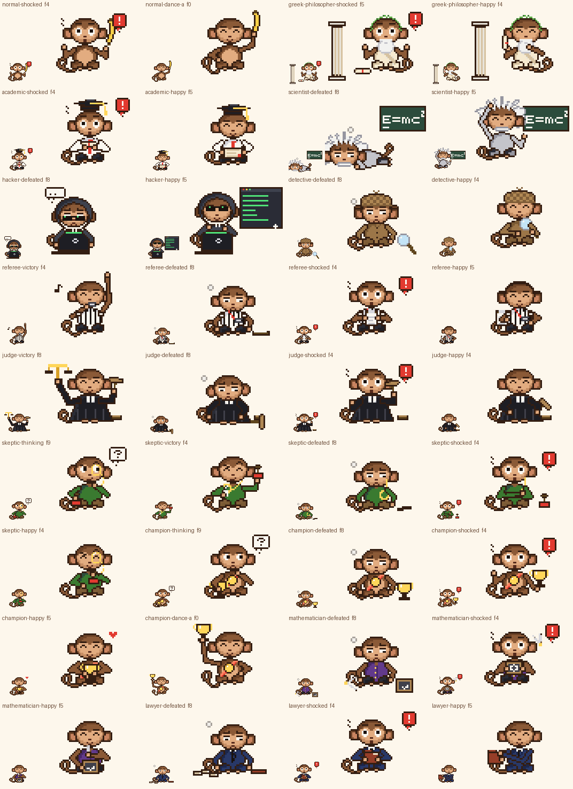

# Laporan Gerbang F

Status: **dibuat, validasi bagian 11 lulus. Ini gerbang terakhir; laporan konsolidasi ada di `pack/reports/final.md`.** Gaya belum disetujui pemilik. Hash aset ada di `pack/sha256-dibuat.txt`, 72 baris untuk gerbang ini.



## Tabel sel kosong sebelum Gerbang F (dari `APPLIES` di `src/pack.py`)

Diambil sesudah Gerbang J, sebelum aset F dibuat. Totalnya 36 sel: 14 wajib dan 22 opsional.

| Kostum | group | Wajib yang kosong | Opsional yang kosong |
|---|---|---|---|
| `normal` | core | - | shocked, dance-a |
| `referee` | role | victory, defeated | shocked, happy |
| `judge` | role | victory, defeated | shocked, happy |
| `skeptic` | role | thinking, victory, defeated | shocked, happy |
| `champion` | role | thinking, defeated | shocked, happy, dance-a |
| `greek-philosopher` | domain | - | shocked, happy |
| `academic` | domain | - | shocked, happy |
| `scientist` | domain | defeated | happy |
| `mathematician` | domain | defeated | shocked, happy |
| `lawyer` | domain | defeated | shocked, happy |
| `hacker` | domain | defeated | happy |
| `detective` | domain | defeated | happy |
| **Jumlah** | | **14** | **22** |

Sesudah Gerbang F: 0 sel kosong. Semua 163 sel yang berlaku terisi: 7 asli dan 156 baru. Tidak ada placeholder yang tersisa.

## Ringkasan

Modul baru `src/pelengkap.py`. Tampilan tiap kostum dipakai ulang dari modul aslinya (`roles.py`, `domains.py`, dan `costumes.py`), tanpa desain ulang. Posisi baku aset aslinya juga diikuti: Greek di x 36 dengan tiang di kiri, Academic 3 px lebih rendah, Scientist di x 21 dengan papan tulis `E=mc` di posisi yang sama, dan Hacker di (22, 16) dengan jendela terminal.

**Pola bersama:**
- shocked: 12 frame. Tenang, lalu tersentak mundur 2-3 px dengan mata lebar, alis naik, mulut "o", gelembung merah "!", dan garis kaget; setelah itu tenang lagi.
- happy: 12 × 150 ms. Senyum kecil, mata tersenyum di f3-f8, dan angguk 1 px. Bukan perayaan besar.
- defeated: 16 frame. Lunglai (bahu turun, kepala turun 2-3 px, tangan terkulai) dengan prop terjatuh dan helaan napas di f6-f9. Scientist rebah menyamping di depan papan tulisnya. Tidak brutal.
- thinking (Skeptic, Champion): tangan di dagu, "..." lalu "?".
- dance-a (Normal, Champion): 16 × 120 ms, pose besar di f0, f4, f8, f12.

**Victory role netral (7.3):** tanpa lompat dan tanpa konfeti. Masing-masing punya elemen khas:
- **Referee:** lengan diangkat lurus sebagai isyarat akhir pertandingan, peluit ditiup dengan nada `n` yang naik.
- **Judge:** timbangan emas kecil diangkat, berayun lalu seimbang dan berkilau; palu terangkat.
- **Skeptic:** monokel dilepas dan digosok sapu tangan putih di depan dada; stempel terangkat.

**Isi per kostum:**

| Kostum | Sel baru |
|---|---|
| Normal | **shocked**: pisang terlonjak dari tangan. **dance-a**: pisang tinggi di kanan, lalu dua tangan di dada, lalu kepalan kiri tinggi, lalu dada lagi. |
| Referee | **defeated**: papan klip jatuh telentang di lantai. **shocked**: papan klip diangkat ke depan dada. **happy**: menggoreskan centang hijau di papan klip lalu mengangguk. |
| Judge | **defeated**: badan merosot ke kiri, palu tergeletak mendatar di lantai. **shocked**: palu terlonjak ke atas. **happy**: palu mengetuk landasan pelan tanpa percikan. |
| Skeptic | **thinking**: telunjuk di dagu, kepala miring, monokel berkilau. **defeated**: monokel lepas dan tergantung di rantai, stempel rebah di lantai. **shocked**: monokel terlepas dan terayun. **happy**: stempel ditepuk ke telapak tangan, monokel berkilau. |
| Champion | **thinking**: memandangi piala di pangkuan. **defeated**: piala diletakkan di lantai. **shocked**: piala merosot di tangan. **happy**: memeluk piala, hati kecil muncul sebentar. **dance-a**: piala diangkat satu tangan bergantian kiri-kanan, di antaranya dipeluk di dada. |
| Greek | **shocked**: gulungan terlepas jatuh ke lantai. **happy**: mengelus janggut dengan mata tersenyum, gulungan diangkat. |
| Academic | **shocked**: topi toga terlonjak, ijazah didekap. **happy**: ijazah terbuka diangkat di depan dada, rumbai berayun. |
| Scientist | **defeated**: rebah menyamping di lantai depan papan tulis, rambut dan kumis tetap, kapur terlepas. **happy**: menggaruk rambut dengan riang, kapur mengetuk papan. |
| Mathematician | **defeated**: batu tulis dan jangka terjatuh. **shocked**: jangka terlonjak, batu tulis diangkat ke dada. **happy**: jangka memutar satu lingkaran di batu tulis. |
| Lawyer | **defeated**: map jatuh dan kertas meluncur keluar, dasi miring. **shocked**: map didekap ke dada. **happy**: menepuk map yang dikepit. |
| Hacker | **defeated**: jendela terminal meredup lalu tertutup, badan merosot di balik laptop, kacamata melorot, "...". **happy**: kode hijau bergulir cepat, senyum. |
| Detective | **defeated**: topi merosot, kaca pembesar terjatuh di lantai. **happy**: kaca pembesar diketuk-ketukkan ke telapak tangan. |

## Perubahan rig, palet, validator, dan dokumentasi

- **Rig dan palet:** tidak ada perubahan. Modul lama (`roles.py`, `domains.py`, `costumes.py`) tidak diubah. Hash 286 file aset lama tetap identik.
- **Validator:** `props()` sekarang juga membaca `pelengkap.PROPS`: timbangan, monokel tergantung, kertas berkas, dan hati kecil.
- **`pack/README.md` (bagian 14 brief):**
  - Format manifest lengkap: `group` sebagai kategori, `base`, `caption`, `applies`, dan isi sel.
  - Cara menambah kostum, state, atau varian.
  - Aturan tarian dan guardrail 7.1-7.4.
  - Rancangan pemilihan kostum Fase 3, ditambah fantasi dan Gamer untuk topik bertema, teologi netral, serta GBLK sebagai maskot spesial. Belum diimplementasikan.
  - Backlog dan daftar modul kode per gerbang.
- **`pack/STYLE.md`:** tabel aksi khas victory ditambah Referee, Judge, dan Skeptic, serta tabel prop.

## Revisi di dalam gerbang

- **Champion dance-a:** versi pertama memegang piala dengan dua tangan di atas kepala. Piala hanya 9 px, jadi kedua lengan melintang di depan wajah. Sekarang piala diangkat satu tangan bergantian di sisi kiri dan kanan.
- **Normal dance-a:** kepalan kiri semula berhenti di samping telinga dan terbaca seperti menggaruk kepala. Sekarang diangkat lebih tinggi dan lebih keluar.
- **Skeptic victory:** sapu tangan semula menggosok monokel di wajah dan menutupi mulut. Sekarang monokel dilepas dan digosok di depan dada.
- **Hacker defeated:** jendela terminal semula tetap ada tetapi hitam, sehingga siluetnya sama dengan idle. Sekarang jendela tertutup sesudah f3.
- **Referee victory:** tidak mengembalikan kanvas di satu cabang kode. Ketahuan saat render pertama dan diperbaiki sebelum export.

## Tebakan dan ketidakpastian

- **Victory role netral tanpa lompat:** saya menafsirkan "tidak dibuat konyol" (7.3) sebagai tanpa lompat dan tanpa konfeti, sedangkan pola dasar victory memakai lompat 1 px. Kalau lompat kecil dianggap wajar, cukup tambahkan `bob` di tiga fungsi itu.
- **Nada `n` untuk suara peluit** memakai glyph MINI `n` yang sebelumnya hanya dipakai `kondangan` (extras, di luar matriks).
- **Timbangan Judge adalah prop baru**, bukan prop yang sudah dimiliki kostum lain. Ia hanya muncul di victory.
- **Hati kecil di happy Champion** adalah tambahan saya, bukan permintaan brief.
- **Scientist defeated rebah**, sedangkan kostum lama lain lunglai sambil duduk. Papan tulis besar membuat versi duduk hampir identik dengan idle.
- **Hacker defeated menutup jendela terminal.** Terminal adalah bagian tampilan asli; menghilangkannya saya anggap "prop terjatuh".
- **Terbaca di 1× tanpa label: tidak terbukti.**

## Kelemahan yang saya lihat sendiri

- **Peluit di mulut (Referee victory)** hanya 5×3 piksel abu dan di 1× tertutup garis kaus.
- **Happy dan idle mirip untuk beberapa kostum lama** (Lawyer, Detective, Judge): pembedanya senyum, angguk, dan satu gerakan kecil.
- **Kertas berkas Lawyer di lantai kiri** tertutup sebagian oleh ekor.
- **Hati kecil Champion (5×4)** dan sapu tangan Skeptic (4×4) di bawah target prop 6×6. Keduanya prop sekunder.
- **Pola lunglai sama untuk 7 kostum** (bahu turun, kepala turun, tangan terkulai). Pembedanya hanya prop yang terjatuh.

## Keputusan yang perlu pemilik

1. **Victory role netral tanpa lompat dan tanpa konfeti** (tafsiran 7.3). Diterima?
2. **Timbangan emas sebagai prop victory Judge**, dan hati kecil di happy Champion. Keduanya tambahan saya.
3. **Scientist defeated rebah** (bukan lunglai duduk) dan **Hacker defeated menutup jendela terminal**. Diterima?
4. **Rancangan pemilihan kostum Fase 3** di `pack/README.md` (fantasi/Gamer untuk topik bertema, GBLK hanya lewat override). Perlu diubah sebelum integrasi?

## Tabel aset

| Aset | Frame | Durasi | GIF | Sheet 1x | Kunci | Beat per rentang frame |
|---|---:|---:|---:|---:|---:|---|
| `normal-shocked` | 12 | 1.52 s | 63595 B | 3008 B | f4 | f0-1      300 ms  mata=look    alis=flat    mulut=flat<br>f2-8      770 ms  mata=wide    alis=up      mulut=o       teks=!<br>f9-11     450 ms  mata=look    alis=flat    mulut=flat |
| `normal-dance-a` | 16 | 1.92 s | 70396 B | 3122 B | f0 | f0-3      480 ms  mata=happy   alis=flat    mulut=smile<br>f4-7      480 ms  mata=happy   alis=flat    mulut=o<br>f8-11     480 ms  mata=happy   alis=flat    mulut=smile<br>f12-15    480 ms  mata=happy   alis=flat    mulut=o |
| `greek-philosopher-shocked` | 12 | 1.52 s | 95396 B | 3381 B | f5 | f0-1      300 ms  mata=look    alis=flat    mulut=flat<br>f2-8      770 ms  mata=wide    alis=up      mulut=flat    teks=!<br>f9-11     450 ms  mata=look    alis=flat    mulut=flat |
| `greek-philosopher-happy` | 12 | 1.80 s | 88611 B | 3216 B | f4 | f0-2      450 ms  mata=look    alis=flat    mulut=flat<br>f3-8      900 ms  mata=happy   alis=flat    mulut=flat<br>f9        150 ms  mata=look    alis=flat    mulut=flat<br>f10       150 ms  mata=blink   alis=flat    mulut=flat<br>f11       150 ms  mata=look    alis=flat    mulut=flat |
| `academic-shocked` | 12 | 1.52 s | 66710 B | 2910 B | f4 | f0-1      300 ms  mata=look    alis=flat    mulut=flat<br>f2-8      770 ms  mata=wide    alis=up      mulut=o       teks=!<br>f9-11     450 ms  mata=look    alis=flat    mulut=flat |
| `academic-happy` | 12 | 1.80 s | 57979 B | 2740 B | f5 | f0-2      450 ms  mata=look    alis=flat    mulut=smile<br>f3-8      900 ms  mata=happy   alis=flat    mulut=smile<br>f9        150 ms  mata=look    alis=flat    mulut=smile<br>f10       150 ms  mata=blink   alis=flat    mulut=smile<br>f11       150 ms  mata=look    alis=flat    mulut=smile |
| `scientist-defeated` | 16 | 3.20 s | 89391 B | 2681 B | f8 | f0-11    2440 ms  mata=relief  alis=worried mulut=flat    teks=E=mc<br>f12       190 ms  mata=blink   alis=worried mulut=flat    teks=E=mc<br>f13-15    570 ms  mata=relief  alis=worried mulut=flat    teks=E=mc |
| `scientist-happy` | 12 | 1.80 s | 88799 B | 2986 B | f5 | f0-2      450 ms  mata=look    alis=flat    mulut=smile   teks=E=mc<br>f3-8      900 ms  mata=happy   alis=flat    mulut=smile   teks=E=mc<br>f9        150 ms  mata=look    alis=flat    mulut=smile   teks=E=mc<br>f10       150 ms  mata=blink   alis=flat    mulut=smile   teks=E=mc<br>f11       150 ms  mata=look    alis=flat    mulut=smile   teks=E=mc |
| `hacker-defeated` | 16 | 3.20 s | 79768 B | 2598 B | f8 | f0-15    3200 ms  mata=relief  alis=worried mulut=frown |
| `hacker-happy` | 12 | 1.80 s | 78703 B | 2610 B | f5 | f0-2      450 ms  mata=down    alis=flat    mulut=smile<br>f3-8      900 ms  mata=happy   alis=flat    mulut=smile<br>f9-11     450 ms  mata=down    alis=flat    mulut=smile |
| `detective-defeated` | 16 | 3.20 s | 96119 B | 3020 B | f8 | f0-11    2440 ms  mata=relief  alis=worried mulut=frown<br>f12       190 ms  mata=blink   alis=worried mulut=frown<br>f13-15    570 ms  mata=relief  alis=worried mulut=frown |
| `detective-happy` | 12 | 1.80 s | 61159 B | 2926 B | f4 | f0-2      450 ms  mata=look    alis=flat    mulut=smile<br>f3-8      900 ms  mata=happy   alis=flat    mulut=smile<br>f9        150 ms  mata=look    alis=flat    mulut=smile<br>f10       150 ms  mata=blink   alis=flat    mulut=smile<br>f11       150 ms  mata=look    alis=flat    mulut=smile |
| `referee-victory` | 16 | 2.04 s | 81891 B | 3196 B | f4 | f0-1      300 ms  mata=look    alis=flat    mulut=smile<br>f2-11    1200 ms  mata=happy   alis=flat    mulut=o       teks=n<br>f12-15    540 ms  mata=look    alis=flat    mulut=smile |
| `referee-defeated` | 16 | 3.20 s | 74262 B | 2618 B | f8 | f0-11    2440 ms  mata=relief  alis=worried mulut=frown<br>f12       190 ms  mata=blink   alis=worried mulut=frown<br>f13-15    570 ms  mata=relief  alis=worried mulut=frown |
| `referee-shocked` | 12 | 1.52 s | 61208 B | 2874 B | f4 | f0-1      300 ms  mata=look    alis=flat    mulut=flat<br>f2-8      770 ms  mata=wide    alis=up      mulut=o       teks=!<br>f9-11     450 ms  mata=look    alis=flat    mulut=flat |
| `referee-happy` | 12 | 1.80 s | 59434 B | 2589 B | f5 | f0-3      600 ms  mata=down    alis=flat    mulut=smile<br>f4-8      750 ms  mata=happy   alis=flat    mulut=smile<br>f9        150 ms  mata=look    alis=flat    mulut=smile<br>f10       150 ms  mata=blink   alis=flat    mulut=smile<br>f11       150 ms  mata=look    alis=flat    mulut=smile |
| `judge-victory` | 16 | 2.16 s | 98384 B | 3244 B | f8 | f0-1      300 ms  mata=look    alis=flat    mulut=smile<br>f2-11    1300 ms  mata=happy   alis=flat    mulut=smile<br>f12-15    560 ms  mata=look    alis=flat    mulut=smile |
| `judge-defeated` | 16 | 3.20 s | 68338 B | 2621 B | f8 | f0-11    2440 ms  mata=relief  alis=worried mulut=frown<br>f12       190 ms  mata=blink   alis=worried mulut=frown<br>f13-15    570 ms  mata=relief  alis=worried mulut=frown |
| `judge-shocked` | 12 | 1.52 s | 69518 B | 3008 B | f4 | f0-1      300 ms  mata=look    alis=flat    mulut=flat<br>f2-8      770 ms  mata=wide    alis=up      mulut=o       teks=!<br>f9-11     450 ms  mata=look    alis=flat    mulut=flat |
| `judge-happy` | 12 | 1.80 s | 61821 B | 2635 B | f4 | f0-2      450 ms  mata=look    alis=flat    mulut=smile<br>f3-8      900 ms  mata=happy   alis=flat    mulut=smile<br>f9        150 ms  mata=look    alis=flat    mulut=smile<br>f10       150 ms  mata=blink   alis=flat    mulut=smile<br>f11       150 ms  mata=look    alis=flat    mulut=smile |
| `skeptic-thinking` | 16 | 2.72 s | 81611 B | 2896 B | f9 | f0-3      680 ms  mata=side    alis=raised  mulut=flat<br>f4        170 ms  mata=blink   alis=raised  mulut=flat<br>f5-7      510 ms  mata=side    alis=raised  mulut=flat<br>f8-13    1020 ms  mata=side    alis=raised  mulut=smirk   teks=?<br>f14-15    340 ms  mata=side    alis=raised  mulut=smirk |
| `skeptic-victory` | 16 | 2.16 s | 77177 B | 3277 B | f4 | f0-1      300 ms  mata=look    alis=raised  mulut=smile<br>f2-11    1300 ms  mata=happy   alis=raised  mulut=smirk<br>f12-15    560 ms  mata=look    alis=raised  mulut=smile |
| `skeptic-defeated` | 16 | 3.20 s | 68763 B | 2754 B | f8 | f0-11    2440 ms  mata=relief  alis=worried mulut=frown<br>f12       190 ms  mata=blink   alis=worried mulut=frown<br>f13-15    570 ms  mata=relief  alis=worried mulut=frown |
| `skeptic-shocked` | 12 | 1.52 s | 62432 B | 2839 B | f4 | f0-1      300 ms  mata=look    alis=flat    mulut=flat<br>f2-8      770 ms  mata=wide    alis=up      mulut=o       teks=!<br>f9-11     450 ms  mata=look    alis=flat    mulut=flat |
| `skeptic-happy` | 12 | 1.80 s | 56197 B | 2717 B | f4 | f0-2      450 ms  mata=look    alis=raised  mulut=smile<br>f3-8      900 ms  mata=happy   alis=raised  mulut=smile<br>f9        150 ms  mata=look    alis=raised  mulut=smile<br>f10       150 ms  mata=blink   alis=raised  mulut=smile<br>f11       150 ms  mata=look    alis=raised  mulut=smile |
| `champion-thinking` | 16 | 2.72 s | 76087 B | 2645 B | f9 | f0-3      680 ms  mata=down    alis=flat    mulut=flat<br>f4        170 ms  mata=blink   alis=flat    mulut=flat<br>f5        170 ms  mata=down    alis=flat    mulut=flat<br>f6-7      340 ms  mata=side    alis=flat    mulut=flat<br>f8-13    1020 ms  mata=side    alis=flat    mulut=frown   teks=?<br>f14-15    340 ms  mata=side    alis=flat    mulut=frown |
| `champion-defeated` | 16 | 3.20 s | 72183 B | 2625 B | f8 | f0-11    2440 ms  mata=relief  alis=worried mulut=frown<br>f12       190 ms  mata=blink   alis=worried mulut=frown<br>f13-15    570 ms  mata=relief  alis=worried mulut=frown |
| `champion-shocked` | 12 | 1.52 s | 68833 B | 3067 B | f4 | f0-1      300 ms  mata=look    alis=flat    mulut=smile<br>f2-8      770 ms  mata=wide    alis=flat    mulut=o       teks=!<br>f9-11     450 ms  mata=look    alis=flat    mulut=smile |
| `champion-happy` | 12 | 1.80 s | 50506 B | 2560 B | f5 | f0-2      450 ms  mata=look    alis=flat    mulut=smile<br>f3-8      900 ms  mata=happy   alis=flat    mulut=smile<br>f9        150 ms  mata=look    alis=flat    mulut=smile<br>f10       150 ms  mata=blink   alis=flat    mulut=smile<br>f11       150 ms  mata=look    alis=flat    mulut=smile |
| `champion-dance-a` | 16 | 1.92 s | 74131 B | 3251 B | f0 | f0-3      480 ms  mata=happy   alis=flat    mulut=smile<br>f4-7      480 ms  mata=happy   alis=flat    mulut=o<br>f8-11     480 ms  mata=happy   alis=flat    mulut=smile<br>f12-15    480 ms  mata=happy   alis=flat    mulut=o |
| `mathematician-defeated` | 16 | 3.20 s | 81162 B | 2855 B | f8 | f0-11    2440 ms  mata=relief  alis=worried mulut=frown<br>f12       190 ms  mata=blink   alis=worried mulut=frown<br>f13-15    570 ms  mata=relief  alis=worried mulut=frown |
| `mathematician-shocked` | 12 | 1.52 s | 65963 B | 3452 B | f4 | f0-1      300 ms  mata=look    alis=flat    mulut=flat<br>f2-8      770 ms  mata=wide    alis=up      mulut=o       teks=!<br>f9-11     450 ms  mata=look    alis=flat    mulut=flat |
| `mathematician-happy` | 12 | 1.80 s | 55949 B | 3274 B | f5 | f0-2      450 ms  mata=look    alis=flat    mulut=smile<br>f3-8      900 ms  mata=happy   alis=flat    mulut=smile<br>f9        150 ms  mata=look    alis=flat    mulut=smile<br>f10       150 ms  mata=blink   alis=flat    mulut=smile<br>f11       150 ms  mata=look    alis=flat    mulut=smile |
| `lawyer-defeated` | 16 | 3.20 s | 72443 B | 2590 B | f8 | f0-11    2440 ms  mata=relief  alis=worried mulut=frown<br>f12       190 ms  mata=blink   alis=worried mulut=frown<br>f13-15    570 ms  mata=relief  alis=worried mulut=frown |
| `lawyer-shocked` | 12 | 1.52 s | 60319 B | 2749 B | f4 | f0-1      300 ms  mata=look    alis=flat    mulut=flat<br>f2-8      770 ms  mata=wide    alis=up      mulut=o       teks=!<br>f9-11     450 ms  mata=look    alis=flat    mulut=flat |
| `lawyer-happy` | 12 | 1.80 s | 55354 B | 2555 B | f5 | f0-2      450 ms  mata=look    alis=flat    mulut=smile<br>f3-8      900 ms  mata=happy   alis=flat    mulut=smile<br>f9        150 ms  mata=look    alis=flat    mulut=smile<br>f10       150 ms  mata=blink   alis=flat    mulut=smile<br>f11       150 ms  mata=look    alis=flat    mulut=smile |

## Validasi (output mentah)

### validate_pack.py --gate F

```
[V1] Hash aset yang dikunci dan aset yang sudah dibuat
  sha256-asli.txt: 27 identik, 0 berubah/hilang
  sha256-disetujui.txt: 89 identik, 0 berubah/hilang
  sha256-dibuat.txt: 170 identik, 0 berubah/hilang

[V2] Manifest dan schema, [V3] palet, kanvas, alfa, isi GIF
  32 kostum, 13 state, 163 sel berlaku, 163 sel terisi; 0 gagal

[V4] Loop seam (piksel berbeda; seam = frame terakhir -> frame pertama)
  ambang = 1.25 x selisih maksimum antar-frame berurutan di aset itu sendiri
  sel                        status     maks  ambang   seam  hasil
  normal/idle                terkunci    237   296.2     37  lulus
  normal/happy               terkunci    324   405.0    100  lulus
  normal/thinking            terkunci    158   197.5     34  lulus
  normal/victory             terkunci    544   680.0     16  lulus
  normal/defeated            terkunci     45    56.2     36  lulus
  normal/shocked             baru        687   858.8     19  lulus
  normal/dance-a             baru        677   846.2    677  lulus
  greek-philosopher/thinking terkunci    197   246.2    234  lulus
  greek-philosopher/idle     terkunci     70    87.5     33  lulus
  greek-philosopher/victory  terkunci    560   700.0      8  lulus
  greek-philosopher/defeated terkunci    113   141.2     69  lulus
  greek-philosopher/shocked  baru        702   877.5     17  lulus
  greek-philosopher/happy    baru        344   430.0     42  lulus
  academic/idle              terkunci    241   301.2     36  lulus
  academic/thinking          terkunci    176   220.0     28  lulus
  academic/victory           terkunci    549   686.2     20  lulus
  academic/defeated          terkunci    287   358.8     12  lulus
  academic/shocked           baru        409   511.2     27  lulus
  academic/happy             baru        420   525.0     31  lulus
  scientist/thinking         terkunci    140   175.0    239  DIKETAHUI (terkunci, tidak diubah)
  scientist/idle             terkunci     75    93.8     44  lulus
  scientist/shocked          terkunci    814  1017.5     30  lulus
  scientist/victory          terkunci    722   902.5     59  lulus
  scientist/defeated         baru         46    57.5     36  lulus
  scientist/happy            baru         99   123.8     69  lulus
  hacker/idle                terkunci    257   321.2    258  lulus
  hacker/thinking            terkunci    138   172.5     68  lulus
  hacker/shocked             terkunci    372   465.0     68  lulus
  hacker/victory             terkunci    600   750.0     68  lulus
  hacker/defeated            baru        712   890.0    708  lulus
  hacker/happy               baru         74    92.5     74  lulus
  detective/thinking         terkunci    312   390.0    356  lulus
  detective/idle             terkunci    196   245.0     16  lulus
  detective/suspicious       terkunci    527   658.8     93  lulus
  detective/shocked          terkunci    813  1016.2     16  lulus
  detective/victory          terkunci    689   861.2     16  lulus
  detective/defeated         baru        246   307.5     16  lulus
  detective/happy            baru        376   470.0     31  lulus
  referee/idle               terkunci    216   270.0      8  lulus
  referee/thinking           terkunci    143   178.8    152  lulus
  referee/victory            baru        231   288.8     18  lulus
  referee/defeated           baru        219   273.8     42  lulus
  referee/shocked            baru        623   778.8     18  lulus
  referee/happy              baru        173   216.2    102  lulus
  judge/idle                 terkunci    207   258.8      4  lulus
  judge/thinking             terkunci    158   197.5     24  lulus
  judge/judging              terkunci    207   258.8      7  lulus
  judge/victory              baru        302   377.5     19  lulus
  judge/defeated             baru        226   282.5     37  lulus
  judge/shocked              baru        670   837.5     19  lulus
  judge/happy                baru        374   467.5     19  lulus
  skeptic/idle               terkunci    221   276.2      8  lulus
  skeptic/suspicious         terkunci    278   347.5      8  lulus
  skeptic/attack             terkunci    152   190.0      8  lulus
  skeptic/thinking           baru        158   197.5     40  lulus
  skeptic/victory            baru        222   277.5     19  lulus
  skeptic/defeated           baru        229   286.2     67  lulus
  skeptic/shocked            baru        587   733.8     19  lulus
  skeptic/happy              baru        333   416.2     19  lulus
  champion/idle              terkunci    214   267.5     16  lulus
  champion/victory           terkunci    513   641.2     16  lulus
  champion/thinking          baru        154   192.5     41  lulus
  champion/defeated          baru        218   272.5     42  lulus
  champion/shocked           baru        763   953.8     18  lulus
  champion/happy             baru        324   405.0     16  lulus
  champion/dance-a           baru        721   901.2    721  lulus
  mathematician/idle         terkunci     59    73.8     23  lulus
  mathematician/thinking     terkunci    180   225.0     11  lulus
  mathematician/victory      terkunci    710   887.5     38  lulus
  mathematician/defeated     baru        217   271.2     42  lulus
  mathematician/shocked      baru        731   913.8     18  lulus
  mathematician/happy        baru        281   351.2     55  lulus
  lawyer/idle                terkunci    105   131.2      8  lulus
  lawyer/thinking            terkunci    131   163.8     18  lulus
  lawyer/victory             terkunci    652   815.0      8  lulus
  lawyer/defeated            baru        217   271.2     38  lulus
  lawyer/shocked             baru        671   838.8     11  lulus
  lawyer/happy               baru        331   413.8     11  lulus
  gamer/idle                 baru        154   192.5     43  lulus
  gamer/thinking             baru        211   263.8     32  lulus
  gamer/happy                baru        220   275.0     31  lulus
  gamer/shocked              baru        620   775.0     32  lulus
  gamer/victory              baru        803  1003.8     17  lulus
  gamer/defeated             baru        103   128.8     16  lulus
  gamer/dance-a              baru        619   773.8    619  lulus
  normal-gblk/idle           baru        183   228.8    158  lulus
  normal-gblk/reveal         baru        367   458.8    261  lulus
  normal-gblk/happy          baru        217   271.2     36  lulus
  normal-gblk/victory        baru        993  1241.2     16  lulus
  normal-gblk/defeated       baru        359   448.8     16  lulus
  normal-gblk/dance-a        baru        873  1091.2    873  lulus
  normal-gblk/dance-b        baru        834  1042.5    844  lulus
  normal-gblk/dance-c        baru        962  1202.5    956  lulus
  knight/idle                baru        356   445.0     11  lulus
  knight/thinking            baru        138   172.5     28  lulus
  knight/shocked             baru        728   910.0     11  lulus
  knight/attack              baru        509   636.2     11  lulus
  knight/victory             baru        552   690.0     11  lulus
  knight/defeated            baru         32    40.0     13  lulus
  viking/idle                baru        396   495.0    395  lulus
  viking/thinking            baru        114   142.5     27  lulus
  viking/attack              baru        267   333.8     11  lulus
  viking/victory             baru        719   898.8     11  lulus
  viking/defeated            baru         30    37.5     14  lulus
  viking/dance-a             baru        586   732.5    597  lulus
  pirate/idle                baru         45    56.2     19  lulus
  pirate/thinking            baru        272   340.0     43  lulus
  pirate/attack              baru        277   346.2     19  lulus
  pirate/victory             baru        652   815.0     19  lulus
  pirate/defeated            baru         29    36.2     22  lulus
  pirate/dance-a             baru        548   685.0    559  lulus
  wizard/idle                baru         37    46.2     17  lulus
  wizard/thinking            baru        130   162.5    138  lulus
  wizard/shocked             baru        531   663.8     18  lulus
  wizard/attack              baru        153   191.2     18  lulus
  wizard/victory             baru        642   802.5     24  lulus
  wizard/defeated            baru        120   150.0     32  lulus
  pak-haji/idle              baru        296   370.0     19  lulus
  pak-haji/thinking          baru         99   123.8     54  lulus
  pak-haji/happy             baru        295   368.8     82  lulus
  pak-haji/victory           baru        136   170.0     48  lulus
  pak-haji/defeated          baru        153   191.2     19  lulus
  priest/idle                baru        240   300.0     19  lulus
  priest/thinking            baru         99   123.8     48  lulus
  priest/happy               baru        242   302.5     66  lulus
  priest/victory             baru        100   125.0     35  lulus
  priest/defeated            baru        126   157.5     19  lulus
  knight-heavy/idle          baru        441   551.2    435  lulus
  knight-heavy/attack        baru        555   693.8     19  lulus
  knight-heavy/victory       baru        504   630.0     19  lulus
  knight-archer/idle         baru        442   552.5    437  lulus
  knight-archer/attack       baru        309   386.2     11  lulus
  knight-archer/victory      baru        523   653.8     11  lulus
  knight-manatarms/idle      baru        453   566.2    449  lulus
  knight-manatarms/attack    baru        490   612.5     12  lulus
  knight-manatarms/victory   baru        551   688.8     12  lulus
  knight-assassin/idle       baru        469   586.2    463  lulus
  knight-assassin/attack     baru        384   480.0     19  lulus
  knight-assassin/victory    baru        501   626.2     19  lulus
  viking-berserker/idle      baru        489   611.2    483  lulus
  viking-berserker/attack    baru        667   833.8     19  lulus
  viking-berserker/victory   baru        558   697.5     19  lulus
  viking-huscarl/idle        baru        464   580.0    463  lulus
  viking-huscarl/attack      baru        551   688.8      9  lulus
  viking-huscarl/victory     baru        694   867.5     11  lulus
  viking-gestir/idle         baru        475   593.8    469  lulus
  viking-gestir/attack       baru        558   697.5     19  lulus
  viking-gestir/victory      baru        578   722.5     19  lulus
  viking-bondi/idle          baru        489   611.2    487  lulus
  viking-bondi/attack        baru        259   323.8     12  lulus
  viking-bondi/victory       baru        541   676.2     12  lulus
  pirate-captain/idle        baru        522   652.5    515  lulus
  pirate-captain/attack      baru        646   807.5     15  lulus
  pirate-captain/victory     baru        600   750.0     15  lulus
  pirate-skirmisher/idle     baru        517   646.2    516  lulus
  pirate-skirmisher/attack   baru        683   853.8     32  lulus
  pirate-skirmisher/victory  baru        501   626.2     32  lulus
  pirate-sharpshooter/idle   baru        483   603.8    477  lulus
  pirate-sharpshooter/attack baru        208   260.0     19  lulus
  pirate-sharpshooter/victory baru        626   782.5     19  lulus
  pirate-buccaneer/idle      baru        538   672.5    532  lulus
  pirate-buccaneer/attack    baru        561   701.2     19  lulus
  pirate-buccaneer/victory   baru        713   891.2     19  lulus

[V5] Siluet: IoU mask buram frame kunci
  catatan: semua kostum memakai kepala dan badan yang sama, jadi IoU dasar antar-kostum sudah tinggi
  a) idle antar kostum dasar (> 0,90 = kandidat terlalu mirip)
             normal normal refere  judge skepti champi greek- academ scient mathem lawyer hacker detect  gamer knight viking pirate wizard pak-ha priest
  normal       1.00   0.41   0.51   0.58   0.55   0.50   0.43   0.52   0.31   0.50   0.50   0.32   0.50   0.53   0.50   0.47   0.50   0.56   0.54   0.56
  normal-gbl   0.41   1.00   0.66   0.58   0.61   0.65   0.38   0.48   0.39   0.60   0.59   0.45   0.63   0.63   0.60   0.60   0.63   0.45   0.59   0.58
  referee      0.51   0.66   1.00   0.78   0.85   0.86   0.44   0.62   0.32   0.84   0.85   0.30   0.82   0.85   0.79   0.74   0.83   0.55   0.78   0.79
  judge        0.58   0.58   0.78   1.00   0.79   0.75   0.46   0.62   0.31   0.78   0.74   0.31   0.73   0.74   0.72   0.65   0.75   0.61   0.76   0.82
  skeptic      0.55   0.61   0.85   0.79   1.00   0.79   0.46   0.60   0.31   0.83   0.80   0.28   0.77   0.84   0.78   0.71   0.80   0.57   0.77   0.77
  champion     0.50   0.65   0.86   0.75   0.79   1.00   0.43   0.59   0.33   0.83   0.77   0.33   0.83   0.77   0.75   0.70   0.78   0.58   0.75   0.75
  greek-phil   0.43   0.38   0.44   0.46   0.46   0.43   1.00   0.40   0.30   0.42   0.41   0.26   0.46   0.43   0.43   0.41   0.44   0.40   0.44   0.45
  academic     0.52   0.48   0.62   0.62   0.60   0.59   0.40   1.00   0.31   0.61   0.58   0.31   0.62   0.63   0.58   0.57   0.62   0.71   0.65   0.64
  scientist    0.31   0.39   0.32   0.31   0.31   0.33   0.30   0.31   1.00   0.32   0.36   0.64   0.33   0.35   0.36   0.40   0.34   0.30   0.34   0.33
  mathematic   0.50   0.60   0.84   0.78   0.83   0.83   0.42   0.61   0.32   1.00   0.80   0.32   0.78   0.81   0.78   0.73   0.81   0.58   0.78   0.80
  lawyer       0.50   0.59   0.85   0.74   0.80   0.77   0.41   0.58   0.36   0.80   1.00   0.32   0.72   0.81   0.83   0.79   0.78   0.52   0.75   0.75
  hacker       0.32   0.45   0.30   0.31   0.28   0.33   0.26   0.31   0.64   0.32   0.32   1.00   0.33   0.31   0.33   0.37   0.31   0.34   0.34   0.34
  detective    0.50   0.63   0.82   0.73   0.77   0.83   0.46   0.62   0.33   0.78   0.72   0.33   1.00   0.82   0.80   0.74   0.82   0.56   0.78   0.73
  gamer        0.53   0.63   0.85   0.74   0.84   0.77   0.43   0.63   0.35   0.81   0.81   0.31   0.82   1.00   0.80   0.75   0.85   0.57   0.76   0.74
  knight       0.50   0.60   0.79   0.72   0.78   0.75   0.43   0.58   0.36   0.78   0.83   0.33   0.80   0.80   1.00   0.83   0.85   0.54   0.79   0.73
  viking       0.47   0.60   0.74   0.65   0.71   0.70   0.41   0.57   0.40   0.73   0.79   0.37   0.74   0.75   0.83   1.00   0.78   0.50   0.73   0.68
  pirate       0.50   0.63   0.83   0.75   0.80   0.78   0.44   0.62   0.34   0.81   0.78   0.31   0.82   0.85   0.85   0.78   1.00   0.56   0.79   0.75
  wizard       0.56   0.45   0.55   0.61   0.57   0.58   0.40   0.71   0.30   0.58   0.52   0.34   0.56   0.57   0.54   0.50   0.56   1.00   0.61   0.64
  pak-haji     0.54   0.59   0.78   0.76   0.77   0.75   0.44   0.65   0.34   0.78   0.75   0.34   0.78   0.76   0.79   0.73   0.79   0.61   1.00   0.93
  priest       0.56   0.58   0.79   0.82   0.77   0.75   0.45   0.64   0.33   0.80   0.75   0.34   0.73   0.74   0.73   0.68   0.75   0.64   0.93   1.00
  tertinggi: pak-haji-priest 0.93, referee-champion 0.86, referee-lawyer 0.85
  pasangan > 0,90: pak-haji-priest 0.93
  b) defeated vs idle pada kostum yang sama (<= 0,85)
    normal               0.30  lulus
    greek-philosopher    0.34  lulus
    academic             0.75  lulus
    scientist            0.43  lulus
    hacker               0.42  lulus
    detective            0.66  lulus
    referee              0.66  lulus
    judge                0.60  lulus
    skeptic              0.66  lulus
    champion             0.62  lulus
    mathematician        0.59  lulus
    lawyer               0.60  lulus
    gamer                0.65  lulus
    normal-gblk          0.53  lulus
    knight               0.56  lulus
    viking               0.61  lulus
    pirate               0.64  lulus
    wizard               0.65  lulus
    pak-haji             0.79  lulus
    priest               0.83  lulus
  c) varian vs saudara sefaksi (dilaporkan)
    knight               knight-heavy         0.85
    knight               knight-archer        0.88
    knight               knight-manatarms     0.88
    knight               knight-assassin      0.84
    knight-heavy         knight-archer        0.82
    knight-heavy         knight-manatarms     0.83
    knight-heavy         knight-assassin      0.87
    knight-archer        knight-manatarms     0.87
    knight-archer        knight-assassin      0.81
    knight-manatarms     knight-assassin      0.84
    viking               viking-berserker     0.75
    viking               viking-huscarl       0.94
    viking               viking-gestir        0.85
    viking               viking-bondi         0.88
    viking-berserker     viking-huscarl       0.76
    viking-berserker     viking-gestir        0.78
    viking-berserker     viking-bondi         0.79
    viking-huscarl       viking-gestir        0.88
    viking-huscarl       viking-bondi         0.86
    viking-gestir        viking-bondi         0.90
    pirate               pirate-captain       0.92
    pirate               pirate-skirmisher    0.87
    pirate               pirate-sharpshooter  0.95
    pirate               pirate-buccaneer     0.83
    pirate-captain       pirate-skirmisher    0.80
    pirate-captain       pirate-sharpshooter  0.87
    pirate-captain       pirate-buccaneer     0.78
    pirate-skirmisher    pirate-sharpshooter  0.88
    pirate-skirmisher    pirate-buccaneer     0.76
    pirate-sharpshooter  pirate-buccaneer     0.82

[V6] Warna dominan dari piksel kostum saja dan jarak warna (CIE76 Delta E; target >= 15)
  metode: frame kunci idle (atau sel pertama bila belum ada idle); piksel yang berbeda dari Normal idle
  pada posisi sama; warna tubuh (BEFKMbf) tidak dihitung; 16 W + 8 P (mata) dikurangkan.
  Kostum teologi: piksel aura (mask identik untuk keduanya, 7.2e) tidak dihitung sebagai pakaian.
  Normal tidak berkostum: warnanya bulu B.
  normal             (idle)     dominan B (139, 90, 55)   100%   kedua -
  normal-gblk        (idle)     dominan n (236, 226, 150)  84%   kedua N (96, 70, 30)
  referee            (idle)     dominan W (250, 247, 240)  36%   kedua P (26, 18, 14)
  judge              (idle)     dominan L (30, 30, 36)     69%   kedua l (64, 64, 74)
  skeptic            (idle)     dominan v (58, 122, 48)    55%   kedua O (255, 214, 90)
  champion           (idle)     dominan O (255, 214, 90)   76%   kedua r (255, 130, 96)
  greek-philosopher  (idle)     dominan c (214, 194, 160)  30%   kedua m (232, 228, 218)
  academic           (idle)     dominan W (250, 247, 240)  42%   kedua L (30, 30, 36)
  scientist          (idle)     dominan k (44, 76, 60)     41%   kedua h (196, 196, 202)
  mathematician      (idle)     dominan p (98, 58, 140)    40%   kedua X (176, 136, 84)
  lawyer             (idle)     dominan J (40, 56, 104)    60%   kedua U (150, 62, 40)
  hacker             (idle)     dominan q (42, 44, 54)     53%   kedua L (30, 30, 36)
  detective          (idle)     dominan d (156, 118, 72)   34%   kedua x (128, 94, 56)
  gamer              (idle)     dominan o (238, 142, 52)   38%   kedua L (30, 30, 36)
  knight             (idle)     dominan z (164, 32, 40)    36%   kedua G (214, 214, 220)
  viking             (idle)     dominan D (74, 42, 26)     33%   kedua s (168, 162, 156)
  pirate             (idle)     dominan i (122, 32, 52)    44%   kedua L (30, 30, 36)
  wizard             (idle)     dominan 3 (66, 110, 220)   68%   kedua 4 (44, 78, 170)
  pak-haji           (idle)     dominan V (96, 176, 72)    27%   kedua S (240, 238, 234)
  priest             (idle)     dominan g (150, 150, 160)  66%   kedua D (74, 42, 26)
  pasangan terdekat:
    referee            academic           W vs W  Delta E   0.0  < 15
    judge              hacker             L vs q  Delta E   7.2  < 15
    normal             detective          B vs d  Delta E  12.2  < 15
    normal-gblk        greek-philosopher  n vs c  Delta E  23.1
    skeptic            pak-haji           v vs V  Delta E  23.8
    greek-philosopher  academic           c vs W  Delta E  24.2
    referee            greek-philosopher  W vs c  Delta E  24.2
    scientist          hacker             k vs q  Delta E  24.5
  aksen varian knight (target Delta E >= 10 antar saudara): knight-heavy=G, knight-archer=v, knight-manatarms=J, knight-assassin=l
    knight-heavy         knight-archer        Delta E  65.8
    knight-heavy         knight-manatarms     Delta E  67.6
    knight-heavy         knight-assassin      Delta E  58.4
    knight-archer        knight-manatarms     Delta E  81.4
    knight-archer        knight-assassin      Delta E  58.2
    knight-manatarms     knight-assassin      Delta E  25.4
  aksen varian viking (target Delta E >= 10 antar saudara): viking-berserker=c, viking-huscarl=s, viking-gestir=k, viking-bondi=d
    viking-berserker     viking-huscarl       Delta E  20.1
    viking-berserker     viking-gestir        Delta E  54.7
    viking-berserker     viking-bondi         Delta E  30.1
    viking-huscarl       viking-gestir        Delta E  41.2
    viking-huscarl       viking-bondi         Delta E  31.8
    viking-gestir        viking-bondi         Delta E  42.3
  aksen varian pirate (target Delta E >= 10 antar saudara): pirate-captain=w, pirate-skirmisher=R, pirate-sharpshooter=k, pirate-buccaneer=x
    pirate-captain       pirate-skirmisher    Delta E  95.0
    pirate-captain       pirate-sharpshooter  Delta E  40.6
    pirate-captain       pirate-buccaneer     Delta E  57.3
    pirate-skirmisher    pirate-sharpshooter  Delta E  91.2
    pirate-skirmisher    pirate-buccaneer     Delta E  57.9
    pirate-sharpshooter  pirate-buccaneer     Delta E  35.4

[V7] Ukuran prop di 1x (kotak pembatas, digambar sendirian; target heuristik >= 6x6)
  referee: peluit                 9x8   ok
  referee: papan klip             8x10  ok
  judge: palu                     9x9   ok
  judge: landasan                 7x3   di bawah 6x6
  judge: papan skor               9x12  ok
  skeptic: monokel                8x14  ok
  skeptic: stempel                7x9   ok
  skeptic: kertas bercap         10x7   ok
  champion: piala                12x11  ok
  champion: medali                7x7   ok
  greek: gulungan terbuka        10x11  ok
  greek: gulungan menggelinding  11x4   di bawah 6x6
  academic: topi toga            21x10  ok
  academic: ijazah terbuka       15x8   ok
  academic: ijazah kusut          8x6   ok
  normal: pisang                  6x17  ok
  scientist: papan tulis (asli)  29x16  ok
  mathematician: batu tulis      11x9   ok
  mathematician: jangka           7x9   ok
  detective: kaca pembesar (asli) 12x13  ok
  hacker: laptop (asli)          24x15  ok
  lawyer: map tertutup           10x9   ok
  lawyer: map terbuka            16x8   ok
  lawyer: dasi                    2x8   di bawah 6x6
  gamer: gamepad                 14x6   ok
  gamer: headset                 26x19  ok
  gamer: kaleng                   4x6   di bawah 6x6
  normal-gblk: papan GBLK        27x21  ok
  knight: pedang                  4x15  di bawah 6x6
  knight: perisai                 9x11  ok
  knight: helm terbuka           20x8   ok
  knight: panji                   8x5   di bawah 6x6
  viking: kapak                  10x15  ok
  viking: perisai bundar         12x12  ok
  viking: helm bertanduk         26x11  ok
  pirate: cutlass                 9x13  ok
  pirate: teropong               15x4   di bawah 6x6
  pirate: tricorn                25x8   ok
  wizard: tongkat                 7x27  ok
  wizard: topi runcing           25x12  ok
  wizard: buku mantra            13x7   ok
  pak-haji: kopiah putih         18x6   ok
  pak-haji: tasbih                8x8   ok
  priest: buku polos              9x7   ok
  priest: kalung salib            6x5   di bawah 6x6
  knight-heavy: pedang besar      6x19  ok
  knight-heavy: pelindung bahu    8x6   ok
  knight-archer: busur panjang    5x25  di bawah 6x6
  knight-archer: tabung panah     7x14  ok
  knight-archer: papan sasaran   10x22  ok
  knight-manatarms: halberd       6x30  ok
  knight-manatarms: gada          8x13  ok
  knight-assassin: belati         4x9   di bawah 6x6
  knight-assassin: bom asap       4x6   di bawah 6x6
  viking-berserker: ikat kepala bulu 18x3   di bawah 6x6
  viking-huscarl: kapak besar     6x22  ok
  viking-gestir: tombak lempar    3x29  di bawah 6x6
  viking-bondi: busur pendek      4x16  di bawah 6x6
  viking-bondi: seax              7x4   di bawah 6x6
  pirate-captain: topi kapten    28x9   ok
  pirate-captain: blunderbuss     7x18  ok
  pirate-captain: burung beo      8x10  ok
  pirate-skirmisher: bandana     25x9   ok
  pirate-skirmisher: tong mesiu   5x6   di bawah 6x6
  pirate-sharpshooter: senapan panjang 11x26  ok
  pirate-buccaneer: palu besar   10x16  ok
  pirate-buccaneer: jangkar      14x15  ok
  judge: timbangan (victory)     17x11  ok
  skeptic: monokel tergantung     6x13  ok
  lawyer: kertas berkas          16x5   di bawah 6x6
  champion: hati kecil            5x4   di bawah 6x6

[V8] Audit teks (semua pemanggil mini_text diinstrumentasi) dan beat per rentang frame
  normal/shocked  (12 frame, 1520 ms, kunci f4)  teks: '!'
    f0-1      300 ms  mata=look    alis=flat    mulut=flat  
    f2-8      770 ms  mata=wide    alis=up      mulut=o       teks=!
    f9-11     450 ms  mata=look    alis=flat    mulut=flat  
  normal/dance-a  (16 frame, 1920 ms, kunci f0)  teks: -
    f0-3      480 ms  mata=happy   alis=flat    mulut=smile 
    f4-7      480 ms  mata=happy   alis=flat    mulut=o     
    f8-11     480 ms  mata=happy   alis=flat    mulut=smile 
    f12-15    480 ms  mata=happy   alis=flat    mulut=o     
  greek-philosopher/shocked  (12 frame, 1520 ms, kunci f5)  teks: '!'
    f0-1      300 ms  mata=look    alis=flat    mulut=flat  
    f2-8      770 ms  mata=wide    alis=up      mulut=flat    teks=!
    f9-11     450 ms  mata=look    alis=flat    mulut=flat  
  greek-philosopher/happy  (12 frame, 1800 ms, kunci f4)  teks: -
    f0-2      450 ms  mata=look    alis=flat    mulut=flat  
    f3-8      900 ms  mata=happy   alis=flat    mulut=flat  
    f9        150 ms  mata=look    alis=flat    mulut=flat  
    f10       150 ms  mata=blink   alis=flat    mulut=flat  
    f11       150 ms  mata=look    alis=flat    mulut=flat  
  academic/shocked  (12 frame, 1520 ms, kunci f4)  teks: '!'
    f0-1      300 ms  mata=look    alis=flat    mulut=flat  
    f2-8      770 ms  mata=wide    alis=up      mulut=o       teks=!
    f9-11     450 ms  mata=look    alis=flat    mulut=flat  
  academic/happy  (12 frame, 1800 ms, kunci f5)  teks: -
    f0-2      450 ms  mata=look    alis=flat    mulut=smile 
    f3-8      900 ms  mata=happy   alis=flat    mulut=smile 
    f9        150 ms  mata=look    alis=flat    mulut=smile 
    f10       150 ms  mata=blink   alis=flat    mulut=smile 
    f11       150 ms  mata=look    alis=flat    mulut=smile 
  scientist/defeated  (16 frame, 3200 ms, kunci f8)  teks: 'E=mc'
    f0-11    2440 ms  mata=relief  alis=worried mulut=flat    teks=E=mc
    f12       190 ms  mata=blink   alis=worried mulut=flat    teks=E=mc
    f13-15    570 ms  mata=relief  alis=worried mulut=flat    teks=E=mc
  scientist/happy  (12 frame, 1800 ms, kunci f5)  teks: 'E=mc'
    f0-2      450 ms  mata=look    alis=flat    mulut=smile   teks=E=mc
    f3-8      900 ms  mata=happy   alis=flat    mulut=smile   teks=E=mc
    f9        150 ms  mata=look    alis=flat    mulut=smile   teks=E=mc
    f10       150 ms  mata=blink   alis=flat    mulut=smile   teks=E=mc
    f11       150 ms  mata=look    alis=flat    mulut=smile   teks=E=mc
  hacker/defeated  (16 frame, 3200 ms, kunci f8)  teks: -
    f0-15    3200 ms  mata=relief  alis=worried mulut=frown 
  hacker/happy  (12 frame, 1800 ms, kunci f5)  teks: -
    f0-2      450 ms  mata=down    alis=flat    mulut=smile 
    f3-8      900 ms  mata=happy   alis=flat    mulut=smile 
    f9-11     450 ms  mata=down    alis=flat    mulut=smile 
  detective/defeated  (16 frame, 3200 ms, kunci f8)  teks: -
    f0-11    2440 ms  mata=relief  alis=worried mulut=frown 
    f12       190 ms  mata=blink   alis=worried mulut=frown 
    f13-15    570 ms  mata=relief  alis=worried mulut=frown 
  detective/happy  (12 frame, 1800 ms, kunci f4)  teks: -
    f0-2      450 ms  mata=look    alis=flat    mulut=smile 
    f3-8      900 ms  mata=happy   alis=flat    mulut=smile 
    f9        150 ms  mata=look    alis=flat    mulut=smile 
    f10       150 ms  mata=blink   alis=flat    mulut=smile 
    f11       150 ms  mata=look    alis=flat    mulut=smile 
  referee/victory  (16 frame, 2040 ms, kunci f4)  teks: 'n'
    f0-1      300 ms  mata=look    alis=flat    mulut=smile 
    f2-11    1200 ms  mata=happy   alis=flat    mulut=o       teks=n
    f12-15    540 ms  mata=look    alis=flat    mulut=smile 
  referee/defeated  (16 frame, 3200 ms, kunci f8)  teks: -
    f0-11    2440 ms  mata=relief  alis=worried mulut=frown 
    f12       190 ms  mata=blink   alis=worried mulut=frown 
    f13-15    570 ms  mata=relief  alis=worried mulut=frown 
  referee/shocked  (12 frame, 1520 ms, kunci f4)  teks: '!'
    f0-1      300 ms  mata=look    alis=flat    mulut=flat  
    f2-8      770 ms  mata=wide    alis=up      mulut=o       teks=!
    f9-11     450 ms  mata=look    alis=flat    mulut=flat  
  referee/happy  (12 frame, 1800 ms, kunci f5)  teks: -
    f0-3      600 ms  mata=down    alis=flat    mulut=smile 
    f4-8      750 ms  mata=happy   alis=flat    mulut=smile 
    f9        150 ms  mata=look    alis=flat    mulut=smile 
    f10       150 ms  mata=blink   alis=flat    mulut=smile 
    f11       150 ms  mata=look    alis=flat    mulut=smile 
  judge/victory  (16 frame, 2160 ms, kunci f8)  teks: -
    f0-1      300 ms  mata=look    alis=flat    mulut=smile 
    f2-11    1300 ms  mata=happy   alis=flat    mulut=smile 
    f12-15    560 ms  mata=look    alis=flat    mulut=smile 
  judge/defeated  (16 frame, 3200 ms, kunci f8)  teks: -
    f0-11    2440 ms  mata=relief  alis=worried mulut=frown 
    f12       190 ms  mata=blink   alis=worried mulut=frown 
    f13-15    570 ms  mata=relief  alis=worried mulut=frown 
  judge/shocked  (12 frame, 1520 ms, kunci f4)  teks: '!'
    f0-1      300 ms  mata=look    alis=flat    mulut=flat  
    f2-8      770 ms  mata=wide    alis=up      mulut=o       teks=!
    f9-11     450 ms  mata=look    alis=flat    mulut=flat  
  judge/happy  (12 frame, 1800 ms, kunci f4)  teks: -
    f0-2      450 ms  mata=look    alis=flat    mulut=smile 
    f3-8      900 ms  mata=happy   alis=flat    mulut=smile 
    f9        150 ms  mata=look    alis=flat    mulut=smile 
    f10       150 ms  mata=blink   alis=flat    mulut=smile 
    f11       150 ms  mata=look    alis=flat    mulut=smile 
  skeptic/thinking  (16 frame, 2720 ms, kunci f9)  teks: '?'
    f0-3      680 ms  mata=side    alis=raised  mulut=flat  
    f4        170 ms  mata=blink   alis=raised  mulut=flat  
    f5-7      510 ms  mata=side    alis=raised  mulut=flat  
    f8-13    1020 ms  mata=side    alis=raised  mulut=smirk   teks=?
    f14-15    340 ms  mata=side    alis=raised  mulut=smirk 
  skeptic/victory  (16 frame, 2160 ms, kunci f4)  teks: -
    f0-1      300 ms  mata=look    alis=raised  mulut=smile 
    f2-11    1300 ms  mata=happy   alis=raised  mulut=smirk 
    f12-15    560 ms  mata=look    alis=raised  mulut=smile 
  skeptic/defeated  (16 frame, 3200 ms, kunci f8)  teks: -
    f0-11    2440 ms  mata=relief  alis=worried mulut=frown 
    f12       190 ms  mata=blink   alis=worried mulut=frown 
    f13-15    570 ms  mata=relief  alis=worried mulut=frown 
  skeptic/shocked  (12 frame, 1520 ms, kunci f4)  teks: '!'
    f0-1      300 ms  mata=look    alis=flat    mulut=flat  
    f2-8      770 ms  mata=wide    alis=up      mulut=o       teks=!
    f9-11     450 ms  mata=look    alis=flat    mulut=flat  
  skeptic/happy  (12 frame, 1800 ms, kunci f4)  teks: -
    f0-2      450 ms  mata=look    alis=raised  mulut=smile 
    f3-8      900 ms  mata=happy   alis=raised  mulut=smile 
    f9        150 ms  mata=look    alis=raised  mulut=smile 
    f10       150 ms  mata=blink   alis=raised  mulut=smile 
    f11       150 ms  mata=look    alis=raised  mulut=smile 
  champion/thinking  (16 frame, 2720 ms, kunci f9)  teks: '?'
    f0-3      680 ms  mata=down    alis=flat    mulut=flat  
    f4        170 ms  mata=blink   alis=flat    mulut=flat  
    f5        170 ms  mata=down    alis=flat    mulut=flat  
    f6-7      340 ms  mata=side    alis=flat    mulut=flat  
    f8-13    1020 ms  mata=side    alis=flat    mulut=frown   teks=?
    f14-15    340 ms  mata=side    alis=flat    mulut=frown 
  champion/defeated  (16 frame, 3200 ms, kunci f8)  teks: -
    f0-11    2440 ms  mata=relief  alis=worried mulut=frown 
    f12       190 ms  mata=blink   alis=worried mulut=frown 
    f13-15    570 ms  mata=relief  alis=worried mulut=frown 
  champion/shocked  (12 frame, 1520 ms, kunci f4)  teks: '!'
    f0-1      300 ms  mata=look    alis=flat    mulut=smile 
    f2-8      770 ms  mata=wide    alis=flat    mulut=o       teks=!
    f9-11     450 ms  mata=look    alis=flat    mulut=smile 
  champion/happy  (12 frame, 1800 ms, kunci f5)  teks: -
    f0-2      450 ms  mata=look    alis=flat    mulut=smile 
    f3-8      900 ms  mata=happy   alis=flat    mulut=smile 
    f9        150 ms  mata=look    alis=flat    mulut=smile 
    f10       150 ms  mata=blink   alis=flat    mulut=smile 
    f11       150 ms  mata=look    alis=flat    mulut=smile 
  champion/dance-a  (16 frame, 1920 ms, kunci f0)  teks: -
    f0-3      480 ms  mata=happy   alis=flat    mulut=smile 
    f4-7      480 ms  mata=happy   alis=flat    mulut=o     
    f8-11     480 ms  mata=happy   alis=flat    mulut=smile 
    f12-15    480 ms  mata=happy   alis=flat    mulut=o     
  mathematician/defeated  (16 frame, 3200 ms, kunci f8)  teks: -
    f0-11    2440 ms  mata=relief  alis=worried mulut=frown 
    f12       190 ms  mata=blink   alis=worried mulut=frown 
    f13-15    570 ms  mata=relief  alis=worried mulut=frown 
  mathematician/shocked  (12 frame, 1520 ms, kunci f4)  teks: '!'
    f0-1      300 ms  mata=look    alis=flat    mulut=flat  
    f2-8      770 ms  mata=wide    alis=up      mulut=o       teks=!
    f9-11     450 ms  mata=look    alis=flat    mulut=flat  
  mathematician/happy  (12 frame, 1800 ms, kunci f5)  teks: -
    f0-2      450 ms  mata=look    alis=flat    mulut=smile 
    f3-8      900 ms  mata=happy   alis=flat    mulut=smile 
    f9        150 ms  mata=look    alis=flat    mulut=smile 
    f10       150 ms  mata=blink   alis=flat    mulut=smile 
    f11       150 ms  mata=look    alis=flat    mulut=smile 
  lawyer/defeated  (16 frame, 3200 ms, kunci f8)  teks: -
    f0-11    2440 ms  mata=relief  alis=worried mulut=frown 
    f12       190 ms  mata=blink   alis=worried mulut=frown 
    f13-15    570 ms  mata=relief  alis=worried mulut=frown 
  lawyer/shocked  (12 frame, 1520 ms, kunci f4)  teks: '!'
    f0-1      300 ms  mata=look    alis=flat    mulut=flat  
    f2-8      770 ms  mata=wide    alis=up      mulut=o       teks=!
    f9-11     450 ms  mata=look    alis=flat    mulut=flat  
  lawyer/happy  (12 frame, 1800 ms, kunci f5)  teks: -
    f0-2      450 ms  mata=look    alis=flat    mulut=smile 
    f3-8      900 ms  mata=happy   alis=flat    mulut=smile 
    f9        150 ms  mata=look    alis=flat    mulut=smile 
    f10       150 ms  mata=blink   alis=flat    mulut=smile 
    f11       150 ms  mata=look    alis=flat    mulut=smile 

[VT] Audit teologi 7.2 (keputusan pemilik 11c: pemeriksaan i-vi, wajib lulus)
  state pak-haji: defeated, happy, idle, thinking, victory | priest: defeated, happy, idle, thinking, victory
  (ii) defeated  16 frame, durasi [200] ms, sama untuk keduanya
  (ii) happy     12 frame, durasi [150] ms, sama untuk keduanya
  (ii) idle      16 frame, durasi [180] ms, sama untuk keduanya
  (ii) thinking  12 frame, durasi [170] ms, sama untuk keduanya
  (ii) victory   16 frame, durasi [160] ms, sama untuk keduanya
  (ii) lulus
  (i)  defeated  mask aura 69-318 piksel per frame, identik di 16 frame; terlihat rata-rata pak-haji 83, priest 66
  (i)  happy     mask aura 280-361 piksel per frame, identik di 12 frame; terlihat rata-rata pak-haji 128, priest 107
  (i)  idle      mask aura 280-361 piksel per frame, identik di 16 frame; terlihat rata-rata pak-haji 128, priest 107
  (i)  thinking  mask aura 318-318 piksel per frame, identik di 12 frame; terlihat rata-rata pak-haji 131, priest 107
  (i)  victory   mask aura 464-596 piksel per frame, identik di 16 frame; terlihat rata-rata pak-haji 187, priest 158
  (i)  lulus
  (iii) pak-haji-defeated    teks mini_text: tidak ada (titik digambar sebagai piksel)
  (iii) pak-haji-happy       teks mini_text: tidak ada (titik digambar sebagai piksel)
  (iii) pak-haji-idle        teks mini_text: tidak ada (titik digambar sebagai piksel)
  (iii) pak-haji-thinking    teks mini_text: tidak ada (titik digambar sebagai piksel)
  (iii) pak-haji-victory     teks mini_text: tidak ada (titik digambar sebagai piksel)
  (iii) priest-defeated      teks mini_text: tidak ada (titik digambar sebagai piksel)
  (iii) priest-happy         teks mini_text: tidak ada (titik digambar sebagai piksel)
  (iii) priest-idle          teks mini_text: tidak ada (titik digambar sebagai piksel)
  (iii) priest-thinking      teks mini_text: tidak ada (titik digambar sebagai piksel)
  (iii) priest-victory       teks mini_text: tidak ada (titik digambar sebagai piksel)
  (iii) lulus
  (iv) warna salib 'y': pak-haji 0 piksel di semua frame; priest kotak 3x4 (6 px); buku polos warna CDK
  (iv) lulus (glyph: hanya lewat mini_text yang diinstrumentasi di iii)
  (v)  dagu (30 piksel zona) tanpa GHSWghm; di atas alis tanpa VZkv: lulus
  (vi) area kopiah tanpa Llq, tanpa warna batik Uu; kopiah putih pak-haji min 40 piksel W: lulus
  kontrol positif greek-philosopher-idle janggut 26, daun 20, kopiah hitam 0, batik 0 piksel -> terdeteksi
  kontrol positif kondangan              janggut 0, daun 0, kopiah hitam 30, batik 135 piksel -> terdeteksi

[V9] Audit tarian (dance-*: 16 frame x 120 ms, pose besar di beat f0/f4/f8/f12)
  normal/dance-a           transisi beat [677, 662, 665, 677], lainnya maks 19  lulus
  champion/dance-a         transisi beat [721, 670, 673, 721], lainnya maks 19  lulus
  gamer/dance-a            transisi beat [619, 589, 610, 619], lainnya maks 20  lulus
  normal-gblk/dance-a      transisi beat [873, 859, 860, 873], lainnya maks 19  lulus
  normal-gblk/dance-b      transisi beat [834, 828, 832, 844], lainnya maks 19  lulus
  normal-gblk/dance-c      transisi beat [962, 932, 941, 956], lainnya maks 19  lulus
  viking/dance-a           transisi beat [586, 557, 575, 597], lainnya maks 20  lulus
  pirate/dance-a           transisi beat [548, 518, 536, 559], lainnya maks 20  lulus

[V10] Ukuran
  GIF pra-Fase 2 terbesar: 171429 byte (batas per GIF baru, dihitung setelah optimize)
  gerbang A:  2 aset, GIF terbesar 111960 byte, total file   222284 byte
  gerbang B:  8 aset, GIF terbesar 111841 byte, total file   858967 byte
  gerbang C:  9 aset, GIF terbesar 136520 byte, total file  1004656 byte
  gerbang D:  6 aset, GIF terbesar 124003 byte, total file   642031 byte
  gerbang E: 10 aset, GIF terbesar 115337 byte, total file   977908 byte
  gerbang G: 15 aset, GIF terbesar  95216 byte, total file  1224060 byte
  gerbang H: 24 aset, GIF terbesar 106870 byte, total file  1898721 byte
  gerbang I: 10 aset, GIF terbesar 115568 byte, total file   953349 byte
  gerbang J: 36 aset, GIF terbesar 106520 byte, total file  2816640 byte
  gerbang F: 36 aset, GIF terbesar  98384 byte, total file  2694681 byte
  sel berlaku 163, terisi 163, tersisa 0
  rata-rata per aset profil baru: GIF 78609 byte, sheet 3196 byte (137 aset)
             dd78be8   sekarang  pertambahan proyeksi akhir
  GIF        3029800   13799243     10769443       10769443
  sheet       365586     803533       437947         437947
  proyeksi pertambahan total: 11207390 byte (10.69 MB); ambang peringatan 15 MB, batas keras 16 MB
  opsi D (GIF aset baru dibuat saat rilis, tidak disimpan): hemat 10769443 byte sekarang, 10769443 byte di akhir

HASIL: LULUS
exit=0
```

### Tes

```
$ python3 -m unittest src/test_validate_pack.py
Ran 5 tests in 0.005s

OK

$ node --test pack/resolver.test.js
# tests 19
# pass 19
# fail 0

$ bukti opsi B (optimize vs tanpa optimize)
  normal-shocked             optimize   63595 B | tanpa   72235 B (-12.0%) | frame+durasi identik True, loop 0/0
  normal-dance-a             optimize   70396 B | tanpa   81916 B (-14.1%) | frame+durasi identik True, loop 0/0
  referee-victory            optimize   81891 B | tanpa   93411 B (-12.3%) | frame+durasi identik True, loop 0/0
  referee-defeated           optimize   74262 B | tanpa   84870 B (-12.5%) | frame+durasi identik True, loop 0/0
  referee-shocked            optimize   61208 B | tanpa   69848 B (-12.4%) | frame+durasi identik True, loop 0/0
  referee-happy              optimize   59434 B | tanpa   67498 B (-11.9%) | frame+durasi identik True, loop 0/0
  judge-victory              optimize   98384 B | tanpa  109136 B ( -9.9%) | frame+durasi identik True, loop 0/0
  judge-defeated             optimize   68338 B | tanpa   77122 B (-11.4%) | frame+durasi identik True, loop 0/0
  judge-shocked              optimize   69518 B | tanpa   77582 B (-10.4%) | frame+durasi identik True, loop 0/0
  judge-happy                optimize   61821 B | tanpa   70221 B (-12.0%) | frame+durasi identik True, loop 0/0
  skeptic-thinking           optimize   81611 B | tanpa   92411 B (-11.7%) | frame+durasi identik True, loop 0/0
  skeptic-victory            optimize   77177 B | tanpa   88409 B (-12.7%) | frame+durasi identik True, loop 0/0
  skeptic-defeated           optimize   68763 B | tanpa   79467 B (-13.5%) | frame+durasi identik True, loop 0/0
  skeptic-shocked            optimize   62432 B | tanpa   70496 B (-11.4%) | frame+durasi identik True, loop 0/0
  skeptic-happy              optimize   56197 B | tanpa   64597 B (-13.0%) | frame+durasi identik True, loop 0/0
  champion-thinking          optimize   76087 B | tanpa   87607 B (-13.1%) | frame+durasi identik True, loop 0/0
  champion-defeated          optimize   72183 B | tanpa   82983 B (-13.0%) | frame+durasi identik True, loop 0/0
  champion-shocked           optimize   68833 B | tanpa   77473 B (-11.2%) | frame+durasi identik True, loop 0/0
  champion-happy             optimize   50506 B | tanpa   59146 B (-14.6%) | frame+durasi identik True, loop 0/0
  champion-dance-a           optimize   74131 B | tanpa   85651 B (-13.4%) | frame+durasi identik True, loop 0/0
  greek-philosopher-shocked  optimize   95396 B | tanpa  103460 B ( -7.8%) | frame+durasi identik True, loop 0/0
  greek-philosopher-happy    optimize   88611 B | tanpa   97011 B ( -8.7%) | frame+durasi identik True, loop 0/0
  academic-shocked           optimize   66710 B | tanpa   74774 B (-10.8%) | frame+durasi identik True, loop 0/0
  academic-happy             optimize   57979 B | tanpa   66043 B (-12.2%) | frame+durasi identik True, loop 0/0
  scientist-defeated         optimize   89391 B | tanpa   99375 B (-10.0%) | frame+durasi identik True, loop 0/0
  scientist-happy            optimize   88799 B | tanpa   97439 B ( -8.9%) | frame+durasi identik True, loop 0/0
  mathematician-defeated     optimize   81162 B | tanpa   91242 B (-11.0%) | frame+durasi identik True, loop 0/0
  mathematician-shocked      optimize   65963 B | tanpa   74027 B (-10.9%) | frame+durasi identik True, loop 0/0
  mathematician-happy        optimize   55949 B | tanpa   64013 B (-12.6%) | frame+durasi identik True, loop 0/0
  lawyer-defeated            optimize   72443 B | tanpa   83243 B (-13.0%) | frame+durasi identik True, loop 0/0
  lawyer-shocked             optimize   60319 B | tanpa   68959 B (-12.5%) | frame+durasi identik True, loop 0/0
  lawyer-happy               optimize   55354 B | tanpa   63994 B (-13.5%) | frame+durasi identik True, loop 0/0
  hacker-defeated            optimize   79768 B | tanpa   91144 B (-12.5%) | frame+durasi identik True, loop 0/0
  hacker-happy               optimize   78703 B | tanpa   87343 B ( -9.9%) | frame+durasi identik True, loop 0/0
  detective-defeated         optimize   96119 B | tanpa  106919 B (-10.1%) | frame+durasi identik True, loop 0/0
  detective-happy            optimize   61159 B | tanpa   69751 B (-12.3%) | frame+durasi identik True, loop 0/0
  total gerbang F: 2590592 B vs 2930816 B (-11.6%)

$ hash aset lama (asli, disetujui, dibuat G, H, I, J) setelah export ulang
286 file lama identik

$ sha256sum -c pack/sha256-dibuat.txt (G + H + I + J + F)
242 file cocok
```

### Uji browser (tools/e2e_preview.js)

```json
{
 "counts": {
  "real": 7,
  "new": 156,
  "new_by_gate": {
   "C": 9,
   "F": 36,
   "G": 15,
   "A": 2,
   "B": 8,
   "D": 6,
   "E": 10,
   "H": 24,
   "J": 36,
   "I": 10
  },
  "placeholder": 0,
  "css_placeholder": 0,
  "not_applicable": 253,
  "rows": 32,
  "stats": "7 sel asli | 156 sel baru | 0 placeholder | 103 / 103 sel wajib terisi | 163 / 163 sel berlaku terisi | 32 × 13 kostum × state"
 },
 "animates": true,
 "blank_cells": 0,
 "static_button_holds": true,
 "reduced_motion_static": true,
 "blind_same_order_after_reload": true,
 "blind_revealed_ok": true,
 "phone_overflow": 0,
 "desktop_errors": [],
 "phone_errors": [],
 "desktop_bad_requests": [],
 "phone_bad_requests": [],
 "fails": [],
 "static_desktop": {
  "canvases": 567,
  "frame_mismatch": 0,
  "pixel_mismatch": 0
 },
 "static_phone": {
  "canvases": 567,
  "frame_mismatch": 0,
  "pixel_mismatch": 0
 },
 "sheet4x_vs_1x_scaled": {
  "cells_with_sheet4x": 26,
  "cells_without_sheet4x": 137,
  "frames_compared": 445,
  "frames_different": 0
 },
 "filter_desktop": {
  "union_ok": true,
  "counts_ok": true,
  "max_gate_height": 1833,
  "per_option": {
   "idle": {
    "figures": 20,
    "height_px": 1561
   },
   "F:inti-dan-spesial": {
    "figures": 2,
    "height_px": 473
   },
   "F:peran": {
    "figures": 18,
    "height_px": 1561
   },
   "F:domain": {
    "figures": 16,
    "height_px": 1289
   },
   "J:knight": {
    "figures": 12,
    "height_px": 1017
   },
   "J:viking": {
    "figures": 12,
    "height_px": 1017
   },
   "J:pirate": {
    "figures": 12,
    "height_px": 1017
   },
   "I": {
    "figures": 10,
    "height_px": 1017
   },
   "H": {
    "figures": 24,
    "height_px": 1833
   },
   "G": {
    "figures": 15,
    "height_px": 1289
   },
   "E": {
    "figures": 10,
    "height_px": 1017
   },
   "D": {
    "figures": 6,
    "height_px": 745
   },
   "C": {
    "figures": 9,
    "height_px": 1017
   },
   "B": {
    "figures": 8,
    "height_px": 745
   },
   "A": {
    "figures": 2,
    "height_px": 473
   },
   "semua": {
    "figures": 176,
    "height_px": 13775
   }
  }
 },
 "filter_phone": {
  "union_ok": true,
  "counts_ok": true,
  "max_gate_height": 2327,
  "per_option": {
   "idle": {
    "figures": 20,
    "height_px": 2028
   },
   "F:inti-dan-spesial": {
    "figures": 2,
    "height_px": 588
   },
   "F:peran": {
    "figures": 18,
    "height_px": 1847
   },
   "F:domain": {
    "figures": 16,
    "height_px": 1687
   },
   "J:knight": {
    "figures": 12,
    "height_px": 1367
   },
   "J:viking": {
    "figures": 12,
    "height_px": 1367
   },
   "J:pirate": {
    "figures": 12,
    "height_px": 1367
   },
   "I": {
    "figures": 10,
    "height_px": 1207
   },
   "H": {
    "figures": 24,
    "height_px": 2327
   },
   "G": {
    "figures": 15,
    "height_px": 1687
   },
   "E": {
    "figures": 10,
    "height_px": 1207
   },
   "D": {
    "figures": 6,
    "height_px": 887
   },
   "C": {
    "figures": 9,
    "height_px": 1207
   },
   "B": {
    "figures": 8,
    "height_px": 1047
   },
   "A": {
    "figures": 2,
    "height_px": 567
   },
   "semua": {
    "figures": 176,
    "height_px": 15291
   }
  }
 }
}
```

### Git

```
$ git diff --stat origin/main..HEAD (sebelum commit gerbang ini, ringkas)
 299 files changed, 13889 insertions(+), 178 deletions(-)
$ git status --short (perubahan gerbang ini)
95 file berubah
$ repo Bertahan-Bukan-hidup
status: 0 baris; origin/main 26e3cb3; diff vs origin/main: 0 baris
```

---

Gerbang terakhir. Laporan konsolidasi: pack/reports/final.md.

