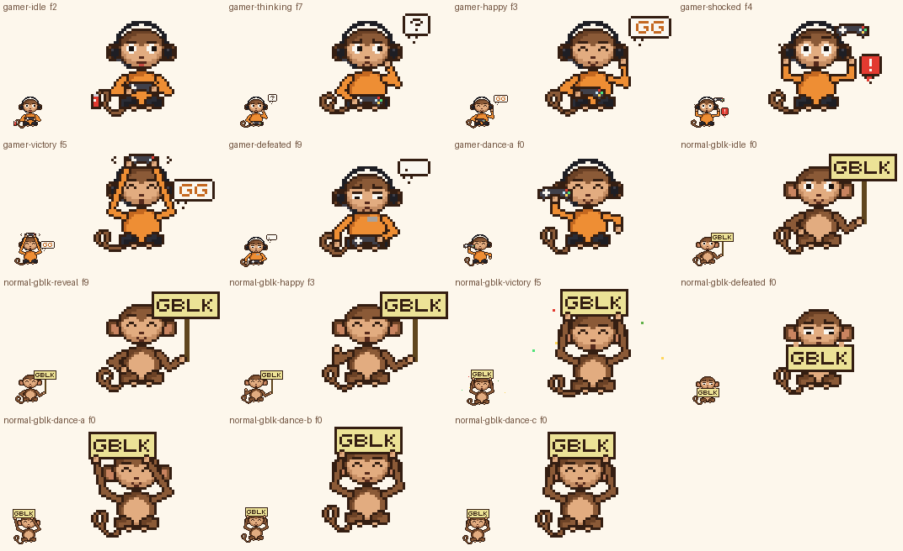

# Laporan Gerbang G

Status: **dibuat, validasi bagian 11 lulus, lanjut otomatis ke Gerbang H.** Gaya belum disetujui pemilik. Hash aset ada di `pack/sha256-dibuat.txt`.



## Ringkasan

- **Gamer** (kostum baru, group `domain`):
  - Kaus oranye `o/t` (PAL_EXT).
  - Headset besar: ikat kepala hitam, dua earcup, mik di kiri.
  - Gamepad 14×6 dipegang dua tangan; kaleng minuman kecil hanya di idle.
  - Siluet pembeda dari Hacker: cincin headset dan gamepad melintang di depan dada, bukan laptop.
  - Hoodie tetap milik Hacker.
- **Normal-GBLK** (group `special`, base `normal`):
  - Tampilan Gobyet Normal persis, ditambah papan bertongkat 27×11 bertuliskan GBLK.
  - Tidak ada kata lain di papan. Kepanjangan akronim hanya di `caption` manifest.
- **Tarian (4 aset):** tepat 16 frame × 120 ms, pose besar di f0, f4, f8, f12. Badan tetap duduk dan bergoyang seperti `kondangan`, tanpa badan berdiri baru.

## Perubahan rig, glyph, dan palet

- **Glyph baru (aditif) di `MINI`:** `G`, `B`, `L`, sesuai usulan bitmap brief K4 tanpa perubahan. Setelah ditambah, 116 file aset lama tetap identik (bukti di bawah).
- **Palet:** tidak ada tambahan di gerbang ini. `o/t` sudah dialokasikan sebelum Gerbang G.
- **Modul baru:** `src/special.py` (Normal-GBLK). Gamer ada di `src/domains.py`. Tidak ada perubahan pada `head()` atau fungsi rig lain.
- **Validator:** aturan "teks statis" sekarang hanya untuk papan `E=mc` milik Scientist. Papan GBLK boleh bergerak, tetapi harus utuh di frame kunci; pemeriksaan baru `hidden_text_pixels` memverifikasinya per state.
- **Revisi di dalam gerbang:**
  - `gamer-shocked`: gamepad yang terlempar semula menutupi mata, sekarang melambung ke kanan atas.
  - `normal-gblk-victory`: satu piksel konfeti menimpa huruf di frame kunci, sekarang konfeti digambar di belakang papan.
  - Tarian GBLK: versi pertama menaruh tongkat papan melintang di depan wajah (dance-a, dance-c). Semua tarian diganti menjadi papan di atas kepala dengan dua tangan.

## Tebakan dan ketidakpastian

- **Terbaca di 1x tanpa label: tidak terbukti.** Panel tes buta ada di preview.
- **Tarian dengan badan duduk:** saya anggap memenuhi "goyang pinggul", "lompat-lompat", dan "langkah geser". Geser dan lompat hanya 2-5 px karena kanvas 64×48.
- **"Lidah sedikit keluar"** di idle Gamer hanya 2 piksel merah di bawah mulut. Di 1x mungkin tidak terlihat.
- **Asap kecil di `gamer-defeated`** memakai `puff()` yang sudah ada.
- **Jarak warna:** warna dominan Normal-GBLK (papan `n`) berjarak ΔE 23,1 dari Greek `c`, pasangan terdekat di gerbang ini.

## Kelemahan yang saya lihat sendiri

- **Kaleng Gamer 4×6** di bawah target prop 6×6. Ini prop sekunder dan hanya muncul di idle.
- **IoU Referee–Gamer 0,85**, termasuk tertinggi. Badan duduk yang sama dengan lengan di depan dada membuat baseline-nya tinggi.
- **Papan GBLK di dance-a bergeser ±6 px.** Pada frame tertentu tepinya hanya 11-12 px dari tepi kanvas; masih di dalam kanvas.
- **Dance-a, dance-b, dan dance-c GBLK** semuanya memegang papan di atas kepala. Pembedanya hanya arah gerak (samping, naik-turun, geser dengan papan mengangguk), jadi di 1x ketiganya bisa terlihat mirip.
- **Ekspresi happy dan victory Gamer mirip**, keduanya bergelembung "GG". Pembedanya ada pada lompatan, gamepad di atas kepala, dan garis getar.

## Tabel aset

| Aset | Frame | Durasi | GIF | Sheet 1x | Kunci | Beat per rentang frame |
|---|---:|---:|---:|---:|---:|---|
| `gamer-idle` | 16 | 2.60 s | 79143 B | 2985 B | f2 | f0-5      840 ms  mata=look    alis=flat    mulut=flat<br>f6        140 ms  mata=blink   alis=flat    mulut=flat<br>f7-9      420 ms  mata=look    alis=flat    mulut=flat<br>f10-12    600 ms  mata=happy   alis=flat    mulut=flat<br>f13-15    600 ms  mata=look    alis=flat    mulut=flat |
| `gamer-thinking` | 12 | 2.04 s | 65746 B | 2653 B | f7 | f0-1      340 ms  mata=look    alis=flat    mulut=flat<br>f2-4      510 ms  mata=side    alis=worried mulut=frown<br>f5-7      510 ms  mata=side    alis=worried mulut=frown   teks=?<br>f8        170 ms  mata=blink   alis=worried mulut=frown   teks=?<br>f9-10     340 ms  mata=side    alis=worried mulut=frown   teks=?<br>f11       170 ms  mata=look    alis=flat    mulut=flat |
| `gamer-happy` | 12 | 1.56 s | 68671 B | 2500 B | f3 | f0-1      260 ms  mata=look    alis=flat    mulut=smile<br>f2-9     1040 ms  mata=happy   alis=flat    mulut=smile   teks=GG<br>f10-11    260 ms  mata=look    alis=flat    mulut=smile |
| `gamer-shocked` | 12 | 1.50 s | 65197 B | 3113 B | f4 | f0-1      320 ms  mata=look    alis=flat    mulut=flat<br>f2-7      540 ms  mata=wide    alis=up      mulut=o       teks=!<br>f8        160 ms  mata=wide    alis=up      mulut=flat<br>f9-10     320 ms  mata=look    alis=worried mulut=flat<br>f11       160 ms  mata=look    alis=flat    mulut=flat |
| `gamer-victory` | 16 | 2.00 s | 90391 B | 3990 B | f5 | f0-1      300 ms  mata=look    alis=flat    mulut=smile<br>f2        110 ms  mata=happy   alis=flat    mulut=smile   teks=GG<br>f3        110 ms  mata=happy   alis=flat    mulut=o       teks=GG<br>f4        110 ms  mata=happy   alis=flat    mulut=smile   teks=GG<br>f5        110 ms  mata=happy   alis=flat    mulut=o       teks=GG<br>f6        110 ms  mata=happy   alis=flat    mulut=smile   teks=GG<br>f7        110 ms  mata=happy   alis=flat    mulut=o       teks=GG<br>f8        110 ms  mata=happy   alis=flat    mulut=smile   teks=GG<br>f9        110 ms  mata=happy   alis=flat    mulut=o       teks=GG<br>f10       110 ms  mata=happy   alis=flat    mulut=smile   teks=GG<br>f11       110 ms  mata=happy   alis=flat    mulut=o       teks=GG<br>f12-15    600 ms  mata=look    alis=flat    mulut=smile |
| `gamer-defeated` | 16 | 3.20 s | 78130 B | 2617 B | f9 | f0-11    2400 ms  mata=relief  alis=worried mulut=frown<br>f12       200 ms  mata=blink   alis=worried mulut=frown<br>f13-15    600 ms  mata=relief  alis=worried mulut=frown |
| `gamer-dance-a` | 16 | 1.92 s | 76396 B | 3071 B | f0 | f0-3      480 ms  mata=happy   alis=flat    mulut=smile<br>f4-7      480 ms  mata=happy   alis=flat    mulut=o<br>f8-11     480 ms  mata=happy   alis=flat    mulut=smile<br>f12-15    480 ms  mata=happy   alis=flat    mulut=o |
| `normal-gblk-idle` | 16 | 2.67 s | 92551 B | 2790 B | f0 | f0-9     1700 ms  mata=look    alis=flat    mulut=smile   teks=GBLK<br>f10       120 ms  mata=blink   alis=flat    mulut=smile   teks=GBLK<br>f11-15    850 ms  mata=look    alis=flat    mulut=smile   teks=GBLK |
| `normal-gblk-reveal` | 16 | 2.40 s | 89887 B | 2937 B | f9 | f0-4      800 ms  mata=side    alis=flat    mulut=flat<br>f5         90 ms  mata=wide    alis=flat    mulut=flat<br>f6         90 ms  mata=wide    alis=up      mulut=o<br>f7        220 ms  mata=look    alis=up      mulut=o       teks=GBLK<br>f8-10     450 ms  mata=happy   alis=up      mulut=smile   teks=GBLK<br>f11-15    750 ms  mata=look    alis=up      mulut=smile   teks=GBLK |
| `normal-gblk-happy` | 12 | 1.44 s | 66599 B | 2610 B | f3 | f0-1      240 ms  mata=happy   alis=flat    mulut=smile   teks=GBLK<br>f2-3      240 ms  mata=happy   alis=flat    mulut=o       teks=GBLK<br>f4-5      240 ms  mata=happy   alis=flat    mulut=smile   teks=GBLK<br>f6-7      240 ms  mata=happy   alis=flat    mulut=o       teks=GBLK<br>f8-9      240 ms  mata=happy   alis=flat    mulut=smile   teks=GBLK<br>f10-11    240 ms  mata=happy   alis=flat    mulut=o       teks=GBLK |
| `normal-gblk-victory` | 16 | 1.92 s | 95216 B | 4348 B | f5 | f0-1      300 ms  mata=look    alis=flat    mulut=smile   teks=GBLK<br>f2        110 ms  mata=happy   alis=flat    mulut=smile   teks=GBLK<br>f3        110 ms  mata=happy   alis=flat    mulut=o       teks=GBLK<br>f4        110 ms  mata=happy   alis=flat    mulut=smile   teks=GBLK<br>f5        110 ms  mata=happy   alis=flat    mulut=o       teks=GBLK<br>f6        110 ms  mata=happy   alis=flat    mulut=smile   teks=GBLK<br>f7        110 ms  mata=happy   alis=flat    mulut=o       teks=GBLK<br>f8        110 ms  mata=happy   alis=flat    mulut=smile   teks=GBLK<br>f9        110 ms  mata=happy   alis=flat    mulut=o       teks=GBLK<br>f10       110 ms  mata=happy   alis=flat    mulut=smile   teks=GBLK<br>f11       110 ms  mata=happy   alis=flat    mulut=o       teks=GBLK<br>f12       110 ms  mata=happy   alis=flat    mulut=smile   teks=GBLK<br>f13       110 ms  mata=happy   alis=flat    mulut=o       teks=GBLK<br>f14-15    300 ms  mata=look    alis=flat    mulut=smile   teks=GBLK |
| `normal-gblk-defeated` | 16 | 3.24 s | 66226 B | 2626 B | f0 | f0-11    2480 ms  mata=relief  alis=worried mulut=frown   teks=GBLK<br>f12       190 ms  mata=blink   alis=worried mulut=frown   teks=GBLK<br>f13-15    570 ms  mata=relief  alis=worried mulut=frown   teks=GBLK |
| `normal-gblk-dance-a` | 16 | 1.92 s | 83336 B | 3171 B | f0 | f0-3      480 ms  mata=happy   alis=flat    mulut=smile   teks=GBLK<br>f4-7      480 ms  mata=happy   alis=flat    mulut=o       teks=GBLK<br>f8-11     480 ms  mata=happy   alis=flat    mulut=smile   teks=GBLK<br>f12-15    480 ms  mata=happy   alis=flat    mulut=o       teks=GBLK |
| `normal-gblk-dance-b` | 16 | 1.92 s | 81933 B | 3007 B | f0 | f0-3      480 ms  mata=happy   alis=flat    mulut=smile   teks=GBLK<br>f4-7      480 ms  mata=happy   alis=flat    mulut=o       teks=GBLK<br>f8-11     480 ms  mata=happy   alis=flat    mulut=smile   teks=GBLK<br>f12-15    480 ms  mata=happy   alis=flat    mulut=o       teks=GBLK |
| `normal-gblk-dance-c` | 16 | 1.92 s | 79501 B | 2719 B | f0 | f0-3      480 ms  mata=happy   alis=flat    mulut=smile   teks=GBLK<br>f4-7      480 ms  mata=happy   alis=flat    mulut=o       teks=GBLK<br>f8-11     480 ms  mata=happy   alis=flat    mulut=smile   teks=GBLK<br>f12-15    480 ms  mata=happy   alis=flat    mulut=o       teks=GBLK |

## Validasi (output mentah)

### validate_pack.py --gate G

```
[V1] Hash aset yang dikunci dan aset yang sudah dibuat
  sha256-asli.txt: 27 identik, 0 berubah/hilang
  sha256-disetujui.txt: 89 identik, 0 berubah/hilang
  sha256-dibuat.txt: 0 identik, 0 berubah/hilang

[V2] Manifest dan schema, [V3] palet, kanvas, alfa, isi GIF
  32 kostum, 13 state, 163 sel berlaku, 57 sel terisi; 0 gagal

[V4] Loop seam (piksel berbeda; seam = frame terakhir -> frame pertama)
  ambang = 1.25 x selisih maksimum antar-frame berurutan di aset itu sendiri
  sel                        status     maks  ambang   seam  hasil
  normal/idle                terkunci    237   296.2     37  lulus
  normal/happy               terkunci    324   405.0    100  lulus
  normal/thinking            terkunci    158   197.5     34  lulus
  normal/victory             terkunci    544   680.0     16  lulus
  normal/defeated            terkunci     45    56.2     36  lulus
  greek-philosopher/thinking terkunci    197   246.2    234  lulus
  greek-philosopher/idle     terkunci     70    87.5     33  lulus
  greek-philosopher/victory  terkunci    560   700.0      8  lulus
  greek-philosopher/defeated terkunci    113   141.2     69  lulus
  academic/idle              terkunci    241   301.2     36  lulus
  academic/thinking          terkunci    176   220.0     28  lulus
  academic/victory           terkunci    549   686.2     20  lulus
  academic/defeated          terkunci    287   358.8     12  lulus
  scientist/thinking         terkunci    140   175.0    239  DIKETAHUI (terkunci, tidak diubah)
  scientist/idle             terkunci     75    93.8     44  lulus
  scientist/shocked          terkunci    814  1017.5     30  lulus
  scientist/victory          terkunci    722   902.5     59  lulus
  hacker/idle                terkunci    257   321.2    258  lulus
  hacker/thinking            terkunci    138   172.5     68  lulus
  hacker/shocked             terkunci    372   465.0     68  lulus
  hacker/victory             terkunci    600   750.0     68  lulus
  detective/thinking         terkunci    312   390.0    356  lulus
  detective/idle             terkunci    196   245.0     16  lulus
  detective/suspicious       terkunci    527   658.8     93  lulus
  detective/shocked          terkunci    813  1016.2     16  lulus
  detective/victory          terkunci    689   861.2     16  lulus
  referee/idle               terkunci    216   270.0      8  lulus
  referee/thinking           terkunci    143   178.8    152  lulus
  judge/idle                 terkunci    207   258.8      4  lulus
  judge/thinking             terkunci    158   197.5     24  lulus
  judge/judging              terkunci    207   258.8      7  lulus
  skeptic/idle               terkunci    221   276.2      8  lulus
  skeptic/suspicious         terkunci    278   347.5      8  lulus
  skeptic/attack             terkunci    152   190.0      8  lulus
  champion/idle              terkunci    214   267.5     16  lulus
  champion/victory           terkunci    513   641.2     16  lulus
  mathematician/idle         terkunci     59    73.8     23  lulus
  mathematician/thinking     terkunci    180   225.0     11  lulus
  mathematician/victory      terkunci    710   887.5     38  lulus
  lawyer/idle                terkunci    105   131.2      8  lulus
  lawyer/thinking            terkunci    131   163.8     18  lulus
  lawyer/victory             terkunci    652   815.0      8  lulus
  gamer/idle                 baru        154   192.5     43  lulus
  gamer/thinking             baru        211   263.8     32  lulus
  gamer/happy                baru        220   275.0     31  lulus
  gamer/shocked              baru        620   775.0     32  lulus
  gamer/victory              baru        803  1003.8     17  lulus
  gamer/defeated             baru        103   128.8     16  lulus
  gamer/dance-a              baru        619   773.8    619  lulus
  normal-gblk/idle           baru        183   228.8    158  lulus
  normal-gblk/reveal         baru        367   458.8    261  lulus
  normal-gblk/happy          baru        217   271.2     36  lulus
  normal-gblk/victory        baru        993  1241.2     16  lulus
  normal-gblk/defeated       baru        359   448.8     16  lulus
  normal-gblk/dance-a        baru        873  1091.2    873  lulus
  normal-gblk/dance-b        baru        834  1042.5    844  lulus
  normal-gblk/dance-c        baru        962  1202.5    956  lulus

[V5] Siluet: IoU mask buram frame kunci
  catatan: semua kostum memakai kepala dan badan yang sama, jadi IoU dasar antar-kostum sudah tinggi
  a) idle antar kostum dasar (> 0,90 = kandidat terlalu mirip)
             normal normal refere  judge skepti champi greek- academ scient mathem lawyer hacker detect  gamer
  normal       1.00   0.41   0.51   0.58   0.55   0.50   0.43   0.52   0.31   0.50   0.50   0.32   0.50   0.53
  normal-gbl   0.41   1.00   0.66   0.58   0.61   0.65   0.38   0.48   0.39   0.60   0.59   0.45   0.63   0.63
  referee      0.51   0.66   1.00   0.78   0.85   0.86   0.44   0.62   0.32   0.84   0.85   0.30   0.82   0.85
  judge        0.58   0.58   0.78   1.00   0.79   0.75   0.46   0.62   0.31   0.78   0.74   0.31   0.73   0.74
  skeptic      0.55   0.61   0.85   0.79   1.00   0.79   0.46   0.60   0.31   0.83   0.80   0.28   0.77   0.84
  champion     0.50   0.65   0.86   0.75   0.79   1.00   0.43   0.59   0.33   0.83   0.77   0.33   0.83   0.77
  greek-phil   0.43   0.38   0.44   0.46   0.46   0.43   1.00   0.40   0.30   0.42   0.41   0.26   0.46   0.43
  academic     0.52   0.48   0.62   0.62   0.60   0.59   0.40   1.00   0.31   0.61   0.58   0.31   0.62   0.63
  scientist    0.31   0.39   0.32   0.31   0.31   0.33   0.30   0.31   1.00   0.32   0.36   0.64   0.33   0.35
  mathematic   0.50   0.60   0.84   0.78   0.83   0.83   0.42   0.61   0.32   1.00   0.80   0.32   0.78   0.81
  lawyer       0.50   0.59   0.85   0.74   0.80   0.77   0.41   0.58   0.36   0.80   1.00   0.32   0.72   0.81
  hacker       0.32   0.45   0.30   0.31   0.28   0.33   0.26   0.31   0.64   0.32   0.32   1.00   0.33   0.31
  detective    0.50   0.63   0.82   0.73   0.77   0.83   0.46   0.62   0.33   0.78   0.72   0.33   1.00   0.82
  gamer        0.53   0.63   0.85   0.74   0.84   0.77   0.43   0.63   0.35   0.81   0.81   0.31   0.82   1.00
  tertinggi: referee-champion 0.86, referee-lawyer 0.85, referee-gamer 0.85
  pasangan > 0,90: tidak ada
  b) defeated vs idle pada kostum yang sama (<= 0,85)
    normal               0.30  lulus
    greek-philosopher    0.34  lulus
    academic             0.75  lulus
    gamer                0.65  lulus
    normal-gblk          0.53  lulus
  c) varian vs saudara sefaksi (dilaporkan)
    belum ada varian dengan idle

[V6] Warna dominan dari piksel kostum saja dan jarak warna (CIE76 Delta E; target >= 15)
  metode: frame kunci idle (atau sel pertama bila belum ada idle); piksel yang berbeda dari Normal idle
  pada posisi sama; warna tubuh (BEFKMbf) tidak dihitung; 16 W + 8 P (mata) dikurangkan.
  Normal tidak berkostum: warnanya bulu B.
  normal             (idle)     dominan B (139, 90, 55)   100%   kedua -
  normal-gblk        (idle)     dominan n (236, 226, 150)  84%   kedua N (96, 70, 30)
  referee            (idle)     dominan W (250, 247, 240)  36%   kedua P (26, 18, 14)
  judge              (idle)     dominan L (30, 30, 36)     69%   kedua l (64, 64, 74)
  skeptic            (idle)     dominan v (58, 122, 48)    55%   kedua O (255, 214, 90)
  champion           (idle)     dominan O (255, 214, 90)   76%   kedua r (255, 130, 96)
  greek-philosopher  (idle)     dominan c (214, 194, 160)  30%   kedua m (232, 228, 218)
  academic           (idle)     dominan W (250, 247, 240)  42%   kedua L (30, 30, 36)
  scientist          (idle)     dominan k (44, 76, 60)     41%   kedua h (196, 196, 202)
  mathematician      (idle)     dominan p (98, 58, 140)    40%   kedua X (176, 136, 84)
  lawyer             (idle)     dominan J (40, 56, 104)    60%   kedua U (150, 62, 40)
  hacker             (idle)     dominan q (42, 44, 54)     53%   kedua L (30, 30, 36)
  detective          (idle)     dominan d (156, 118, 72)   34%   kedua x (128, 94, 56)
  gamer              (idle)     dominan o (238, 142, 52)   38%   kedua L (30, 30, 36)
  knight             belum ada aset (dilewati)
  viking             belum ada aset (dilewati)
  pirate             belum ada aset (dilewati)
  wizard             belum ada aset (dilewati)
  pak-haji           belum ada aset (dilewati)
  priest             belum ada aset (dilewati)
  pasangan terdekat:
    referee            academic           W vs W  Delta E   0.0  < 15
    judge              hacker             L vs q  Delta E   7.2  < 15
    normal             detective          B vs d  Delta E  12.2  < 15
    normal-gblk        greek-philosopher  n vs c  Delta E  23.1
    greek-philosopher  academic           c vs W  Delta E  24.2
    referee            greek-philosopher  W vs c  Delta E  24.2
    scientist          hacker             k vs q  Delta E  24.5
    lawyer             hacker             J vs q  Delta E  25.6

[V7] Ukuran prop di 1x (kotak pembatas, digambar sendirian; target heuristik >= 6x6)
  referee: peluit                 9x8   ok
  referee: papan klip             8x10  ok
  judge: palu                     9x9   ok
  judge: landasan                 7x3   di bawah 6x6
  judge: papan skor               9x12  ok
  skeptic: monokel                8x14  ok
  skeptic: stempel                7x9   ok
  skeptic: kertas bercap         10x7   ok
  champion: piala                12x11  ok
  champion: medali                7x7   ok
  greek: gulungan terbuka        10x11  ok
  greek: gulungan menggelinding  11x4   di bawah 6x6
  academic: topi toga            21x10  ok
  academic: ijazah terbuka       15x8   ok
  academic: ijazah kusut          8x6   ok
  normal: pisang                  6x17  ok
  scientist: papan tulis (asli)  29x16  ok
  mathematician: batu tulis      11x9   ok
  mathematician: jangka           7x9   ok
  detective: kaca pembesar (asli) 12x13  ok
  hacker: laptop (asli)          24x15  ok
  lawyer: map tertutup           10x9   ok
  lawyer: map terbuka            16x8   ok
  lawyer: dasi                    2x8   di bawah 6x6
  gamer: gamepad                 14x6   ok
  gamer: headset                 26x19  ok
  gamer: kaleng                   4x6   di bawah 6x6

[V8] Audit teks (semua pemanggil mini_text diinstrumentasi) dan beat per rentang frame
  gamer/idle  (16 frame, 2600 ms, kunci f2)  teks: -
    f0-5      840 ms  mata=look    alis=flat    mulut=flat  
    f6        140 ms  mata=blink   alis=flat    mulut=flat  
    f7-9      420 ms  mata=look    alis=flat    mulut=flat  
    f10-12    600 ms  mata=happy   alis=flat    mulut=flat  
    f13-15    600 ms  mata=look    alis=flat    mulut=flat  
  gamer/thinking  (12 frame, 2040 ms, kunci f7)  teks: '?'
    f0-1      340 ms  mata=look    alis=flat    mulut=flat  
    f2-4      510 ms  mata=side    alis=worried mulut=frown 
    f5-7      510 ms  mata=side    alis=worried mulut=frown   teks=?
    f8        170 ms  mata=blink   alis=worried mulut=frown   teks=?
    f9-10     340 ms  mata=side    alis=worried mulut=frown   teks=?
    f11       170 ms  mata=look    alis=flat    mulut=flat  
  gamer/happy  (12 frame, 1560 ms, kunci f3)  teks: 'GG'
    f0-1      260 ms  mata=look    alis=flat    mulut=smile 
    f2-9     1040 ms  mata=happy   alis=flat    mulut=smile   teks=GG
    f10-11    260 ms  mata=look    alis=flat    mulut=smile 
  gamer/shocked  (12 frame, 1500 ms, kunci f4)  teks: '!'
    f0-1      320 ms  mata=look    alis=flat    mulut=flat  
    f2-7      540 ms  mata=wide    alis=up      mulut=o       teks=!
    f8        160 ms  mata=wide    alis=up      mulut=flat  
    f9-10     320 ms  mata=look    alis=worried mulut=flat  
    f11       160 ms  mata=look    alis=flat    mulut=flat  
  gamer/victory  (16 frame, 2000 ms, kunci f5)  teks: 'GG'
    f0-1      300 ms  mata=look    alis=flat    mulut=smile 
    f2        110 ms  mata=happy   alis=flat    mulut=smile   teks=GG
    f3        110 ms  mata=happy   alis=flat    mulut=o       teks=GG
    f4        110 ms  mata=happy   alis=flat    mulut=smile   teks=GG
    f5        110 ms  mata=happy   alis=flat    mulut=o       teks=GG
    f6        110 ms  mata=happy   alis=flat    mulut=smile   teks=GG
    f7        110 ms  mata=happy   alis=flat    mulut=o       teks=GG
    f8        110 ms  mata=happy   alis=flat    mulut=smile   teks=GG
    f9        110 ms  mata=happy   alis=flat    mulut=o       teks=GG
    f10       110 ms  mata=happy   alis=flat    mulut=smile   teks=GG
    f11       110 ms  mata=happy   alis=flat    mulut=o       teks=GG
    f12-15    600 ms  mata=look    alis=flat    mulut=smile 
  gamer/defeated  (16 frame, 3200 ms, kunci f9)  teks: -
    f0-11    2400 ms  mata=relief  alis=worried mulut=frown 
    f12       200 ms  mata=blink   alis=worried mulut=frown 
    f13-15    600 ms  mata=relief  alis=worried mulut=frown 
  gamer/dance-a  (16 frame, 1920 ms, kunci f0)  teks: -
    f0-3      480 ms  mata=happy   alis=flat    mulut=smile 
    f4-7      480 ms  mata=happy   alis=flat    mulut=o     
    f8-11     480 ms  mata=happy   alis=flat    mulut=smile 
    f12-15    480 ms  mata=happy   alis=flat    mulut=o     
  normal-gblk/idle: 'GBLK' utuh di frame kunci f0
  normal-gblk/idle  (16 frame, 2670 ms, kunci f0)  teks: 'GBLK'
    f0-9     1700 ms  mata=look    alis=flat    mulut=smile   teks=GBLK
    f10       120 ms  mata=blink   alis=flat    mulut=smile   teks=GBLK
    f11-15    850 ms  mata=look    alis=flat    mulut=smile   teks=GBLK
  normal-gblk/reveal: 'GBLK' utuh di frame kunci f9
  normal-gblk/reveal  (16 frame, 2400 ms, kunci f9)  teks: 'GBLK'
    f0-4      800 ms  mata=side    alis=flat    mulut=flat  
    f5         90 ms  mata=wide    alis=flat    mulut=flat  
    f6         90 ms  mata=wide    alis=up      mulut=o     
    f7        220 ms  mata=look    alis=up      mulut=o       teks=GBLK
    f8-10     450 ms  mata=happy   alis=up      mulut=smile   teks=GBLK
    f11-15    750 ms  mata=look    alis=up      mulut=smile   teks=GBLK
  normal-gblk/happy: 'GBLK' utuh di frame kunci f3
  normal-gblk/happy  (12 frame, 1440 ms, kunci f3)  teks: 'GBLK'
    f0-1      240 ms  mata=happy   alis=flat    mulut=smile   teks=GBLK
    f2-3      240 ms  mata=happy   alis=flat    mulut=o       teks=GBLK
    f4-5      240 ms  mata=happy   alis=flat    mulut=smile   teks=GBLK
    f6-7      240 ms  mata=happy   alis=flat    mulut=o       teks=GBLK
    f8-9      240 ms  mata=happy   alis=flat    mulut=smile   teks=GBLK
    f10-11    240 ms  mata=happy   alis=flat    mulut=o       teks=GBLK
  normal-gblk/victory: 'GBLK' utuh di frame kunci f5
  normal-gblk/victory  (16 frame, 1920 ms, kunci f5)  teks: 'GBLK'
    f0-1      300 ms  mata=look    alis=flat    mulut=smile   teks=GBLK
    f2        110 ms  mata=happy   alis=flat    mulut=smile   teks=GBLK
    f3        110 ms  mata=happy   alis=flat    mulut=o       teks=GBLK
    f4        110 ms  mata=happy   alis=flat    mulut=smile   teks=GBLK
    f5        110 ms  mata=happy   alis=flat    mulut=o       teks=GBLK
    f6        110 ms  mata=happy   alis=flat    mulut=smile   teks=GBLK
    f7        110 ms  mata=happy   alis=flat    mulut=o       teks=GBLK
    f8        110 ms  mata=happy   alis=flat    mulut=smile   teks=GBLK
    f9        110 ms  mata=happy   alis=flat    mulut=o       teks=GBLK
    f10       110 ms  mata=happy   alis=flat    mulut=smile   teks=GBLK
    f11       110 ms  mata=happy   alis=flat    mulut=o       teks=GBLK
    f12       110 ms  mata=happy   alis=flat    mulut=smile   teks=GBLK
    f13       110 ms  mata=happy   alis=flat    mulut=o       teks=GBLK
    f14-15    300 ms  mata=look    alis=flat    mulut=smile   teks=GBLK
  normal-gblk/defeated: 'GBLK' utuh di frame kunci f0
  normal-gblk/defeated  (16 frame, 3240 ms, kunci f0)  teks: 'GBLK'
    f0-11    2480 ms  mata=relief  alis=worried mulut=frown   teks=GBLK
    f12       190 ms  mata=blink   alis=worried mulut=frown   teks=GBLK
    f13-15    570 ms  mata=relief  alis=worried mulut=frown   teks=GBLK
  normal-gblk/dance-a: 'GBLK' utuh di frame kunci f0
  normal-gblk/dance-a  (16 frame, 1920 ms, kunci f0)  teks: 'GBLK'
    f0-3      480 ms  mata=happy   alis=flat    mulut=smile   teks=GBLK
    f4-7      480 ms  mata=happy   alis=flat    mulut=o       teks=GBLK
    f8-11     480 ms  mata=happy   alis=flat    mulut=smile   teks=GBLK
    f12-15    480 ms  mata=happy   alis=flat    mulut=o       teks=GBLK
  normal-gblk/dance-b: 'GBLK' utuh di frame kunci f0
  normal-gblk/dance-b  (16 frame, 1920 ms, kunci f0)  teks: 'GBLK'
    f0-3      480 ms  mata=happy   alis=flat    mulut=smile   teks=GBLK
    f4-7      480 ms  mata=happy   alis=flat    mulut=o       teks=GBLK
    f8-11     480 ms  mata=happy   alis=flat    mulut=smile   teks=GBLK
    f12-15    480 ms  mata=happy   alis=flat    mulut=o       teks=GBLK
  normal-gblk/dance-c: 'GBLK' utuh di frame kunci f0
  normal-gblk/dance-c  (16 frame, 1920 ms, kunci f0)  teks: 'GBLK'
    f0-3      480 ms  mata=happy   alis=flat    mulut=smile   teks=GBLK
    f4-7      480 ms  mata=happy   alis=flat    mulut=o       teks=GBLK
    f8-11     480 ms  mata=happy   alis=flat    mulut=smile   teks=GBLK
    f12-15    480 ms  mata=happy   alis=flat    mulut=o       teks=GBLK

[V9] Audit tarian (dance-*: 16 frame x 120 ms, pose besar di beat f0/f4/f8/f12)
  gamer/dance-a            transisi beat [619, 589, 610, 619], lainnya maks 20  lulus
  normal-gblk/dance-a      transisi beat [873, 859, 860, 873], lainnya maks 19  lulus
  normal-gblk/dance-b      transisi beat [834, 828, 832, 844], lainnya maks 19  lulus
  normal-gblk/dance-c      transisi beat [962, 932, 941, 956], lainnya maks 19  lulus

[V10] Ukuran
  GIF pra-Fase 2 terbesar: 171429 byte (batas per GIF baru, dihitung setelah optimize)
  gerbang A:  2 aset, GIF terbesar 111960 byte, total file   222284 byte
  gerbang B:  8 aset, GIF terbesar 111841 byte, total file   858967 byte
  gerbang C:  9 aset, GIF terbesar 136520 byte, total file  1004656 byte
  gerbang D:  6 aset, GIF terbesar 124003 byte, total file   642031 byte
  gerbang E: 10 aset, GIF terbesar 115337 byte, total file   977908 byte
  gerbang G: 15 aset, GIF terbesar  95216 byte, total file  1224060 byte
  sel berlaku 163, terisi 57, tersisa 106
  rata-rata per aset profil baru: GIF 88465 byte, sheet 3276 byte (31 aset)
             dd78be8   sekarang  pertambahan proyeksi akhir
  GIF        3029800    5772230      2742430       12119771
  sheet       365586     467155       101569         448869
  proyeksi pertambahan total: 12568640 byte (11.99 MB); ambang peringatan 15 MB, batas keras 16 MB
  opsi D (GIF aset baru dibuat saat rilis, tidak disimpan): hemat 2742430 byte sekarang, 12119771 byte di akhir

HASIL: LULUS
```

### Tes

```
$ python3 -m unittest src/test_validate_pack.py
Ran 5 tests in 0.005s

OK

$ node --test pack/resolver.test.js
# tests 19
# pass 19
# fail 0

$ bukti opsi B (optimize vs tanpa optimize)
  gamer-idle                 optimize   79143 B | tanpa   90087 B (-12.1%) | frame+durasi identik True, loop 0/0
  gamer-thinking             optimize   65746 B | tanpa   73954 B (-11.1%) | frame+durasi identik True, loop 0/0
  gamer-happy                optimize   68671 B | tanpa   76735 B (-10.5%) | frame+durasi identik True, loop 0/0
  gamer-shocked              optimize   65197 B | tanpa   73645 B (-11.5%) | frame+durasi identik True, loop 0/0
  gamer-victory              optimize   90391 B | tanpa  101911 B (-11.3%) | frame+durasi identik True, loop 0/0
  gamer-defeated             optimize   78130 B | tanpa   89650 B (-12.8%) | frame+durasi identik True, loop 0/0
  gamer-dance-a              optimize   76396 B | tanpa   87532 B (-12.7%) | frame+durasi identik True, loop 0/0
  normal-gblk-idle           optimize   92551 B | tanpa  104071 B (-11.1%) | frame+durasi identik True, loop 0/0
  normal-gblk-reveal         optimize   89887 B | tanpa  101407 B (-11.4%) | frame+durasi identik True, loop 0/0
  normal-gblk-happy          optimize   66599 B | tanpa   75239 B (-11.5%) | frame+durasi identik True, loop 0/0
  normal-gblk-victory        optimize   95216 B | tanpa  106736 B (-10.8%) | frame+durasi identik True, loop 0/0
  normal-gblk-defeated       optimize   66226 B | tanpa   77746 B (-14.8%) | frame+durasi identik True, loop 0/0
  normal-gblk-dance-a        optimize   83336 B | tanpa   94856 B (-12.1%) | frame+durasi identik True, loop 0/0
  normal-gblk-dance-b        optimize   81933 B | tanpa   93453 B (-12.3%) | frame+durasi identik True, loop 0/0
  normal-gblk-dance-c        optimize   79501 B | tanpa   91213 B (-12.8%) | frame+durasi identik True, loop 0/0
  total gerbang G: 1178923 B vs 1338235 B (-11.9%)

$ hash aset lama setelah glyph G/B/L dan export ulang
116 file identik
sha256-asli 27, sha256-disetujui 89, sha256-dibuat 30: semua identik
```

### Uji browser (tools/e2e_preview.js)

```json
{
 "counts": {
  "real": 7,
  "new": 50,
  "new_by_gate": {
   "C": 9,
   "G": 15,
   "A": 2,
   "B": 8,
   "D": 6,
   "E": 10
  },
  "placeholder": 106,
  "css_placeholder": 0,
  "not_applicable": 253,
  "rows": 32,
  "stats": "7 sel asli | 50 sel baru | 106 placeholder | 41 / 103 sel wajib terisi | 57 / 163 sel berlaku terisi | 32 × 13 kostum × state"
 },
 "animates": true,
 "blank_cells": 0,
 "static_button_holds": true,
 "reduced_motion_static": true,
 "blind_same_order_after_reload": true,
 "blind_revealed_ok": true,
 "phone_overflow": 0,
 "desktop_errors": [],
 "phone_errors": [],
 "desktop_bad_requests": [],
 "phone_bad_requests": [],
 "fails": [],
 "static_desktop": {
  "canvases": 319,
  "frame_mismatch": 0,
  "pixel_mismatch": 0
 },
 "static_phone": {
  "canvases": 319,
  "frame_mismatch": 0,
  "pixel_mismatch": 0
 },
 "sheet4x_vs_1x_scaled": {
  "cells_with_sheet4x": 26,
  "cells_without_sheet4x": 31,
  "frames_compared": 445,
  "frames_different": 0
 },
 "filter_desktop": {
  "union_ok": true,
  "counts_ok": true,
  "max_gate_height": 1289,
  "per_option": {
   "idle": {
    "figures": 14,
    "height_px": 1289
   },
   "G": {
    "figures": 15,
    "height_px": 1289
   },
   "E": {
    "figures": 10,
    "height_px": 1017
   },
   "D": {
    "figures": 6,
    "height_px": 745
   },
   "C": {
    "figures": 9,
    "height_px": 1017
   },
   "B": {
    "figures": 8,
    "height_px": 745
   },
   "A": {
    "figures": 2,
    "height_px": 473
   },
   "semua": {
    "figures": 64,
    "height_px": 5591
   }
  }
 },
 "filter_phone": {
  "union_ok": true,
  "counts_ok": true,
  "max_gate_height": 1687,
  "per_option": {
   "idle": {
    "figures": 14,
    "height_px": 1548
   },
   "G": {
    "figures": 15,
    "height_px": 1687
   },
   "E": {
    "figures": 10,
    "height_px": 1207
   },
   "D": {
    "figures": 6,
    "height_px": 887
   },
   "C": {
    "figures": 9,
    "height_px": 1207
   },
   "B": {
    "figures": 8,
    "height_px": 1047
   },
   "A": {
    "figures": 2,
    "height_px": 567
   },
   "semua": {
    "figures": 64,
    "height_px": 5966
   }
  }
 }
}
```

### Git

```
$ git diff --stat origin/main..HEAD (sebelum commit gerbang ini, ringkas)
 112 files changed, 5214 insertions(+), 176 deletions(-)
$ git status --short (perubahan gerbang ini)
42 file berubah
$ repo Bertahan-Bukan-hidup
status: 0 baris; origin/main 26e3cb3; diff vs origin/main: 0 baris
```


## Keputusan yang perlu pemilik

Bagian ini ditambahkan saat Gerbang I, karena format bagian 12 memintanya dan versi awal laporan ini belum memuatnya.

1. **Tiga tarian GBLK memakai pola yang sama:** papan di atas kepala dengan dua tangan. Pembedanya hanya arah gerak. Diterima, atau salah satunya perlu pose lain?
2. **"Lidah sedikit keluar" di idle Gamer** hanya 2 piksel dan mungkin tidak terlihat di 1×. Diterima, atau diperbesar?
3. **Kaleng Gamer 4×6** di bawah target prop 6×6. Diterima sebagai prop sekunder?

---

Lanjut otomatis ke Gerbang H.
