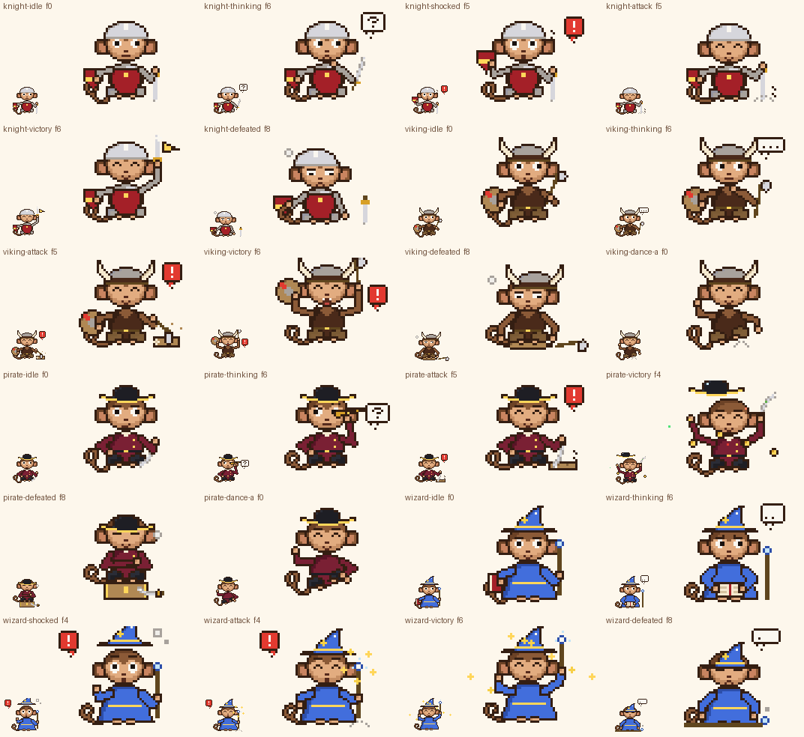

# Laporan Gerbang H

Status: **dibuat, validasi bagian 11 lulus, lanjut otomatis ke Gerbang I.** Gaya belum disetujui pemilik. Hash aset ada di `pack/sha256-dibuat.txt` (30 baris G + 48 baris H).



## Ringkasan

Semua kostum H ada di modul baru `src/fantasy.py` (group `fantasy`). Wajah Gobyet tetap terlihat, kecuali di dua beat defeated yang diminta brief.

- **Knight (6 state: idle, thinking, shocked, attack, victory, defeated)**
  - Helm baja terbuka (hanya kubah, wajah terbuka) dan tabard merah tua `z/1` selebar badan.
  - Lengan zirah rantai `s`, perisai layang-layang 9×11 dengan pita emas mendatar, pedang.
  - attack: pedang diangkat lalu ditancapkan ke lantai, dengan debu piksel dan garis hentakan.
  - victory: pedang diacungkan, kilau menyapu bilah, panji emas kecil berkibar di ujung pedang.
  - defeated: duduk bersandar ke perisai yang berdiri di lantai, helm miring, pedang menancap di kanan, helaan napas.
- **Viking (6 state: idle, thinking, attack, victory, defeated, dance-a)**
  - Helm bertanduk kartun dengan pita kulit, rompi kulit `D` tertutup (belahan leher V berbulu).
  - Perisai bundar kayu dengan lajur cat merah, kapak.
  - attack: kapak dihentak ke balok kayu, serpihan kayu, "!".
  - victory: kapak dan perisai terangkat, mulut berteriak dengan garis teriakan, "!".
  - defeated: duduk di atas perisai yang rebah, helm tergeser, kapak tergeletak.
  - dance-a: jig. Hentakan kaki kanan, ayunan dua lengan, hentakan kaki kiri, ayunan lagi (16 × 120 ms).
- **Pirate (6 state: idle, thinking, attack, victory, defeated, dance-a)**
  - Tricorn hitam bertepi emas, mantel marun `i/2`, cutlass, teropong. Tidak memakai penutup mata.
  - idle: tangan di pinggang, cutlass bertumpu di lantai.
  - thinking: teropong ke mata kanan, "?".
  - attack: cutlass ditancapkan ke papan kayu di lantai, "!".
  - victory: topi dilempar melambung ke kiri atas lalu ditangkap, cutlass terangkat, konfeti, koin emas memercik.
  - defeated: duduk tenang di atas peti, tangan terlipat, topi merosot menutupi mata.
  - dance-a: jig. Tendangan kaki kanan, tepuk tangan di depan dada, tendangan kaki kiri, tepuk tangan lagi.
- **Wizard (6 state: idle, thinking, shocked, attack, victory, defeated)**
  - Jubah biru kerajaan `3/4` dengan sabuk tali emas, topi runcing berbintang, tongkat berpermata, buku mantra.
  - Tanpa janggut (K8).
  - Tokoh diturunkan 4 px supaya ujung topi muat di kanvas.
  - idle: permata tongkat bersinar redup, bintang topi berkedip.
  - thinking: membolak-balik buku di pangkuan, "..." lalu "?".
  - shocked: kepulan "poof", topi terangkat, "!".
  - attack: tongkat dihentak, percikan bintang, "!".
  - victory: tongkat terangkat, bintang berjatuhan seperti konfeti.
  - defeated: mantra gagal (asap kecil), topi jatuh menutupi mata, tongkat tergeletak, duduk.

## Perubahan rig, palet, dan validator

- **Rig:** tidak ada perubahan pada `monkey.py`. Semua prop dan badan kostum baru ada di `src/fantasy.py`.
- **Palet:** tidak ada tambahan. `z/1`, `i/2`, dan `3/4` sudah dialokasikan sebelum Gerbang G.
- **Fase ekor periodik:** `wag(t, n)` memberi satu putaran penuh per n frame, sehingga frame terakhir menyambung mulus ke frame 0. Sebabnya: versi pertama `pirate-defeated` GAGAL seam, 52 > 30. Ekornya memakai fase `t × 0,2` yang melompat saat kembali ke f0. Setelah perbaikan, seam-nya 22 ≤ 36,2. Semua aset H memakai `wag`. Aset lama tidak berubah.
- **Validator:** `props()` sekarang juga membaca `PROPS` dari `special` dan `fantasy`, dan nanti `theology` bila modulnya ada. Karena itu tabel V7 mencakup prop GBLK dan fantasi.
- **Tes resolver:** satu tes memakai `pirate` sebagai contoh kostum tanpa aset. Sejak Gerbang H, pirate punya idle, jadi `pirate/happy` sekarang jatuh ke `costume+idle`, dan ini perilaku yang benar.
  - Contoh "kostum tak dikenal → normal" diganti dengan `kostum-tak-dikenal`.
  - Ditambah satu assert untuk `pirate/happy → costume+idle`.
  - Jumlah tes tetap 19.

## Revisi di dalam gerbang

- **Warna dominan Knight:** versi pertama didominasi baja `G` (40%), yang berjarak ΔE 13,4 dari Referee dan Academic `W`. Ini pasangan < 15 yang baru dan tidak sesuai alokasi global.
  - Perbaikan: tabard dibuat selebar badan dan lengan menjadi zirah rantai `s`.
  - Hasil: dominan `z` 36%. Pasangan terdekat Knight sekarang Pirate, ΔE 24,9.
- **Warna dominan Viking:** versi pertama didominasi helm abu `s`.
  - Perbaikan: rompi dibuat tertutup, dengan belahan leher V saja, dan pita kulit `D` ditambahkan di pangkal helm.
  - Hasil: dominan `D` 33%.
- **Victory khas:** kilau berpindah sudah dipakai Detective dan lempar topi sudah dipakai Academic.
  - Knight mendapat panji emas di ujung pedang.
  - Elemen khas Pirate dihitung dari koin emasnya.
  - Tabel "aksi khas victory" di `pack/STYLE.md` sudah diperbarui.
- **Keterbacaan:**
  - Bilah pedang dan cutlass diberi tepi abu `s`. Versi pertama `G` di atas latar krem hampir hilang.
  - Tanduk Viking dipertebal di pangkal. Versi pertama terlihat seperti antena.
  - Kapak diperbesar.
  - Emblem perisai Knight diganti dari chevron ke pita mendatar, karena chevron yang separuh tertutup lengan terbaca seperti petir.
  - Koin Pirate diperbesar dari 2×2 ke 4×4.
- **Tepuk tangan Pirate di dance-a:** versi pertama di atas kepala, sehingga lengan menutupi wajah. Sekarang tepukannya di depan dada.
- **Topi Pirate saat victory:** versi pertama melambung keluar dari kanvas. Sekarang tokoh diturunkan 3 px selama victory, dan topi melambung ke kiri atas tetap di dalam kanvas.

## Tebakan dan ketidakpastian

- **Topi menutupi mata (Pirate dan Wizard defeated):** ini bertentangan dengan kalimat umum 9.3 "wajah terlihat penuh". Saya mengikuti deskripsi state yang lebih spesifik ("topi menutupi mata", "topi jatuh menutup mata"). Mulut dan bentuk kepala tetap terlihat. Kalau pemilik ingin wajah selalu penuh, cukup ubah `tip` atau `droop` di dua fungsi itu.
- **"Duduk bersandar perisai" (Knight defeated):** saya gambar sebagai perisai berdiri di lantai kiri dengan lengan kiri menumpu ke tepinya, bukan punggung bersandar ke perisai.
- **"Duduk di atas perisai" (Viking defeated):** perisai rebah digambar sebagai elips kayu pipih di bawah badan. Dari depan, bentuk bundarnya tidak terlihat.
- **Tarian dengan badan duduk:** tendangan dan hentakan kaki hanya mengangkat paha 2-3 px, seperti tarian Gerbang G. Tidak ada badan berdiri baru.
- **Terbaca di 1× tanpa label: tidak terbukti.** Panel tes buta keluarga fantasi ada di preview.
- **Emblem perisai Knight** sengaja pita mendatar polos, bukan salib atau simbol heraldik lain, supaya tidak terbaca sebagai simbol agama.

## Kelemahan yang saya lihat sendiri

- **Pedang Knight 4×15:** lebar bilah hanya 2-3 px, di bawah target 6×6 pada satu sisi. Panjangnya yang membuatnya terbaca. Teropong Pirate 15×4 juga di bawah target tinggi.
- **IoU idle Knight–Pirate dan Pirate–Gamer 0,85:** tertinggi bersama Referee–Champion 0,86. Semuanya karena badan duduk yang sama dengan lengan di samping. Tidak ada pasangan > 0,90.
- **Frame kunci `wizard-thinking` f6** masih di tahap gelembung "...". Tanda "?" baru muncul di f8. Frame kunci tidak diubah di gerbang ini.
- **Warna kedua Knight tetap baja** (`G` 30%, `s` 24%). Di 1×, Knight terbaca sebagai "abu-abu dengan merah", bukan "merah".
- **Kapak Viking** (10×15 termasuk gagang) masih kecil di 1×. Mata kapaknya hanya sekitar 5×6.
- **`wizard-defeated`:** mata tertutup topi di semua frame, jadi ekspresinya hanya terbaca dari mulut dan gelembung "...".

## Tabel aset

| Aset | Frame | Durasi | GIF | Sheet 1x | Kunci | Beat per rentang frame |
|---|---:|---:|---:|---:|---:|---|
| `knight-idle` | 12 | 2.10 s | 58254 B | 2606 B | f0 | f0-6     1260 ms  mata=look    alis=flat    mulut=flat<br>f7        120 ms  mata=blink   alis=flat    mulut=flat<br>f8-11     720 ms  mata=look    alis=flat    mulut=flat |
| `knight-thinking` | 12 | 2.04 s | 66910 B | 2479 B | f6 | f0-2      510 ms  mata=side    alis=worried mulut=flat<br>f3        170 ms  mata=blink   alis=worried mulut=flat<br>f4        170 ms  mata=side    alis=worried mulut=flat<br>f5        170 ms  mata=side    alis=worried mulut=flat    teks=?<br>f6-10     850 ms  mata=side    alis=worried mulut=frown   teks=?<br>f11       170 ms  mata=side    alis=worried mulut=frown |
| `knight-shocked` | 12 | 1.59 s | 67741 B | 2723 B | f5 | f0-1      300 ms  mata=look    alis=flat    mulut=flat<br>f2-8      840 ms  mata=wide    alis=up      mulut=o       teks=!<br>f9-11     450 ms  mata=look    alis=flat    mulut=flat |
| `knight-attack` | 12 | 1.71 s | 59638 B | 3164 B | f5 | f0        140 ms  mata=look    alis=flat    mulut=flat<br>f1        140 ms  mata=look    alis=angry   mulut=flat<br>f2-3      280 ms  mata=look    alis=angry   mulut=o<br>f4-8      730 ms  mata=happy   alis=flat    mulut=smile<br>f9-11     420 ms  mata=look    alis=flat    mulut=flat |
| `knight-victory` | 16 | 1.92 s | 81381 B | 3693 B | f6 | f0-1      300 ms  mata=look    alis=flat    mulut=smile<br>f2        110 ms  mata=happy   alis=flat    mulut=smile<br>f3        110 ms  mata=happy   alis=flat    mulut=o<br>f4        110 ms  mata=happy   alis=flat    mulut=smile<br>f5        110 ms  mata=happy   alis=flat    mulut=o<br>f6        110 ms  mata=happy   alis=flat    mulut=smile<br>f7        110 ms  mata=happy   alis=flat    mulut=o<br>f8        110 ms  mata=happy   alis=flat    mulut=smile<br>f9        110 ms  mata=happy   alis=flat    mulut=o<br>f10       110 ms  mata=happy   alis=flat    mulut=smile<br>f11       110 ms  mata=happy   alis=flat    mulut=o<br>f12-15    520 ms  mata=look    alis=flat    mulut=smile |
| `knight-defeated` | 16 | 3.20 s | 79751 B | 2640 B | f8 | f0-11    2440 ms  mata=relief  alis=worried mulut=frown<br>f12       190 ms  mata=blink   alis=worried mulut=frown<br>f13-15    570 ms  mata=relief  alis=worried mulut=frown |
| `viking-idle` | 12 | 2.10 s | 72587 B | 2890 B | f0 | f0-7     1440 ms  mata=look    alis=flat    mulut=smile<br>f8        120 ms  mata=blink   alis=flat    mulut=smile<br>f9-11     540 ms  mata=look    alis=flat    mulut=smile |
| `viking-thinking` | 12 | 2.04 s | 78096 B | 2556 B | f6 | f0-4      850 ms  mata=side    alis=worried mulut=flat<br>f5        170 ms  mata=blink   alis=worried mulut=flat<br>f6-11    1020 ms  mata=side    alis=worried mulut=flat |
| `viking-attack` | 12 | 1.71 s | 77898 B | 3257 B | f5 | f0        140 ms  mata=look    alis=flat    mulut=smile<br>f1        140 ms  mata=look    alis=angry   mulut=flat<br>f2-3      280 ms  mata=look    alis=angry   mulut=shout<br>f4-6      450 ms  mata=happy   alis=flat    mulut=smile   teks=!<br>f7-8      280 ms  mata=happy   alis=flat    mulut=smile<br>f9-11     420 ms  mata=look    alis=flat    mulut=smile |
| `viking-victory` | 16 | 1.92 s | 106870 B | 4272 B | f6 | f0-1      300 ms  mata=look    alis=flat    mulut=smile<br>f2-3      220 ms  mata=happy   alis=up      mulut=shout<br>f4-11     880 ms  mata=happy   alis=up      mulut=shout   teks=!<br>f12-15    520 ms  mata=look    alis=flat    mulut=smile |
| `viking-defeated` | 16 | 3.20 s | 92307 B | 2753 B | f8 | f0-11    2440 ms  mata=relief  alis=worried mulut=frown<br>f12       190 ms  mata=blink   alis=worried mulut=frown<br>f13-15    570 ms  mata=relief  alis=worried mulut=frown |
| `viking-dance-a` | 16 | 1.92 s | 84999 B | 3331 B | f0 | f0-3      480 ms  mata=happy   alis=flat    mulut=smile<br>f4-7      480 ms  mata=happy   alis=flat    mulut=o<br>f8-11     480 ms  mata=happy   alis=flat    mulut=smile<br>f12-15    480 ms  mata=happy   alis=flat    mulut=o |
| `pirate-idle` | 12 | 2.10 s | 61848 B | 2381 B | f0 | f0-5     1080 ms  mata=look    alis=flat    mulut=smirk<br>f6        120 ms  mata=blink   alis=flat    mulut=smirk<br>f7-8      360 ms  mata=look    alis=flat    mulut=smirk<br>f9-10     360 ms  mata=side    alis=flat    mulut=smirk<br>f11       180 ms  mata=look    alis=flat    mulut=smirk |
| `pirate-thinking` | 12 | 2.04 s | 67176 B | 2700 B | f6 | f0-1      340 ms  mata=look    alis=flat    mulut=flat<br>f2-4      510 ms  mata=left    alis=raised  mulut=flat<br>f5-10    1020 ms  mata=left    alis=raised  mulut=flat    teks=?<br>f11       170 ms  mata=blink   alis=flat    mulut=flat |
| `pirate-attack` | 12 | 1.71 s | 68186 B | 3207 B | f5 | f0        140 ms  mata=look    alis=flat    mulut=smirk<br>f1        140 ms  mata=look    alis=angry   mulut=flat<br>f2-3      280 ms  mata=look    alis=angry   mulut=o<br>f4-5      310 ms  mata=happy   alis=flat    mulut=smile   teks=!<br>f6-8      420 ms  mata=happy   alis=flat    mulut=smile<br>f9-11     420 ms  mata=look    alis=flat    mulut=smirk |
| `pirate-victory` | 16 | 1.96 s | 95951 B | 5434 B | f4 | f0        150 ms  mata=look    alis=flat    mulut=smile<br>f1-2      220 ms  mata=happy   alis=flat    mulut=smile<br>f3        110 ms  mata=happy   alis=flat    mulut=o<br>f4        110 ms  mata=happy   alis=flat    mulut=smile<br>f5        110 ms  mata=happy   alis=flat    mulut=o<br>f6        110 ms  mata=happy   alis=flat    mulut=smile<br>f7        110 ms  mata=happy   alis=flat    mulut=o<br>f8        110 ms  mata=happy   alis=flat    mulut=smile<br>f9        110 ms  mata=happy   alis=flat    mulut=o<br>f10-11    220 ms  mata=happy   alis=flat    mulut=smile<br>f12-15    600 ms  mata=look    alis=flat    mulut=smile |
| `pirate-defeated` | 16 | 3.32 s | 79738 B | 2736 B | f8 | f0-7     1660 ms  mata=blink   alis=flat    mulut=flat<br>f8-15    1660 ms  mata=blink   alis=flat    mulut=smile |
| `pirate-dance-a` | 16 | 1.92 s | 73737 B | 3246 B | f0 | f0-3      480 ms  mata=happy   alis=flat    mulut=smile<br>f4-7      480 ms  mata=happy   alis=flat    mulut=o<br>f8-11     480 ms  mata=happy   alis=flat    mulut=smile<br>f12-15    480 ms  mata=happy   alis=flat    mulut=o |
| `wizard-idle` | 12 | 2.10 s | 63504 B | 2412 B | f0 | f0-6     1260 ms  mata=look    alis=flat    mulut=smile<br>f7        120 ms  mata=blink   alis=flat    mulut=smile<br>f8-11     720 ms  mata=look    alis=flat    mulut=smile |
| `wizard-thinking` | 12 | 2.04 s | 77051 B | 2636 B | f6 | f0-5     1020 ms  mata=down    alis=flat    mulut=flat<br>f6-7      340 ms  mata=side    alis=worried mulut=frown<br>f8-11     680 ms  mata=side    alis=worried mulut=frown   teks=? |
| `wizard-shocked` | 12 | 1.52 s | 72816 B | 3407 B | f4 | f0-1      300 ms  mata=look    alis=flat    mulut=flat<br>f2-8      770 ms  mata=wide    alis=up      mulut=o       teks=!<br>f9-11     450 ms  mata=look    alis=flat    mulut=flat |
| `wizard-attack` | 12 | 1.63 s | 67853 B | 3244 B | f4 | f0        140 ms  mata=look    alis=flat    mulut=smile<br>f1-2      280 ms  mata=look    alis=angry   mulut=flat<br>f3         90 ms  mata=happy   alis=up      mulut=o<br>f4-7      560 ms  mata=happy   alis=up      mulut=o       teks=!<br>f8        140 ms  mata=happy   alis=up      mulut=o<br>f9-11     420 ms  mata=look    alis=flat    mulut=smile |
| `wizard-victory` | 16 | 1.92 s | 93110 B | 5062 B | f6 | f0-1      300 ms  mata=look    alis=flat    mulut=smile<br>f2        110 ms  mata=happy   alis=flat    mulut=smile<br>f3        110 ms  mata=happy   alis=flat    mulut=o<br>f4        110 ms  mata=happy   alis=flat    mulut=smile<br>f5        110 ms  mata=happy   alis=flat    mulut=o<br>f6        110 ms  mata=happy   alis=flat    mulut=smile<br>f7        110 ms  mata=happy   alis=flat    mulut=o<br>f8        110 ms  mata=happy   alis=flat    mulut=smile<br>f9        110 ms  mata=happy   alis=flat    mulut=o<br>f10       110 ms  mata=happy   alis=flat    mulut=smile<br>f11       110 ms  mata=happy   alis=flat    mulut=o<br>f12-15    520 ms  mata=look    alis=flat    mulut=smile |
| `wizard-defeated` | 16 | 3.20 s | 75945 B | 2545 B | f8 | f0-15    3200 ms  mata=blink   alis=worried mulut=frown |

## Validasi (output mentah)

### validate_pack.py --gate H

```
[V1] Hash aset yang dikunci dan aset yang sudah dibuat
  sha256-asli.txt: 27 identik, 0 berubah/hilang
  sha256-disetujui.txt: 89 identik, 0 berubah/hilang
  sha256-dibuat.txt: 30 identik, 0 berubah/hilang

[V2] Manifest dan schema, [V3] palet, kanvas, alfa, isi GIF
  32 kostum, 13 state, 163 sel berlaku, 81 sel terisi; 0 gagal

[V4] Loop seam (piksel berbeda; seam = frame terakhir -> frame pertama)
  ambang = 1.25 x selisih maksimum antar-frame berurutan di aset itu sendiri
  sel                        status     maks  ambang   seam  hasil
  normal/idle                terkunci    237   296.2     37  lulus
  normal/happy               terkunci    324   405.0    100  lulus
  normal/thinking            terkunci    158   197.5     34  lulus
  normal/victory             terkunci    544   680.0     16  lulus
  normal/defeated            terkunci     45    56.2     36  lulus
  greek-philosopher/thinking terkunci    197   246.2    234  lulus
  greek-philosopher/idle     terkunci     70    87.5     33  lulus
  greek-philosopher/victory  terkunci    560   700.0      8  lulus
  greek-philosopher/defeated terkunci    113   141.2     69  lulus
  academic/idle              terkunci    241   301.2     36  lulus
  academic/thinking          terkunci    176   220.0     28  lulus
  academic/victory           terkunci    549   686.2     20  lulus
  academic/defeated          terkunci    287   358.8     12  lulus
  scientist/thinking         terkunci    140   175.0    239  DIKETAHUI (terkunci, tidak diubah)
  scientist/idle             terkunci     75    93.8     44  lulus
  scientist/shocked          terkunci    814  1017.5     30  lulus
  scientist/victory          terkunci    722   902.5     59  lulus
  hacker/idle                terkunci    257   321.2    258  lulus
  hacker/thinking            terkunci    138   172.5     68  lulus
  hacker/shocked             terkunci    372   465.0     68  lulus
  hacker/victory             terkunci    600   750.0     68  lulus
  detective/thinking         terkunci    312   390.0    356  lulus
  detective/idle             terkunci    196   245.0     16  lulus
  detective/suspicious       terkunci    527   658.8     93  lulus
  detective/shocked          terkunci    813  1016.2     16  lulus
  detective/victory          terkunci    689   861.2     16  lulus
  referee/idle               terkunci    216   270.0      8  lulus
  referee/thinking           terkunci    143   178.8    152  lulus
  judge/idle                 terkunci    207   258.8      4  lulus
  judge/thinking             terkunci    158   197.5     24  lulus
  judge/judging              terkunci    207   258.8      7  lulus
  skeptic/idle               terkunci    221   276.2      8  lulus
  skeptic/suspicious         terkunci    278   347.5      8  lulus
  skeptic/attack             terkunci    152   190.0      8  lulus
  champion/idle              terkunci    214   267.5     16  lulus
  champion/victory           terkunci    513   641.2     16  lulus
  mathematician/idle         terkunci     59    73.8     23  lulus
  mathematician/thinking     terkunci    180   225.0     11  lulus
  mathematician/victory      terkunci    710   887.5     38  lulus
  lawyer/idle                terkunci    105   131.2      8  lulus
  lawyer/thinking            terkunci    131   163.8     18  lulus
  lawyer/victory             terkunci    652   815.0      8  lulus
  gamer/idle                 baru        154   192.5     43  lulus
  gamer/thinking             baru        211   263.8     32  lulus
  gamer/happy                baru        220   275.0     31  lulus
  gamer/shocked              baru        620   775.0     32  lulus
  gamer/victory              baru        803  1003.8     17  lulus
  gamer/defeated             baru        103   128.8     16  lulus
  gamer/dance-a              baru        619   773.8    619  lulus
  normal-gblk/idle           baru        183   228.8    158  lulus
  normal-gblk/reveal         baru        367   458.8    261  lulus
  normal-gblk/happy          baru        217   271.2     36  lulus
  normal-gblk/victory        baru        993  1241.2     16  lulus
  normal-gblk/defeated       baru        359   448.8     16  lulus
  normal-gblk/dance-a        baru        873  1091.2    873  lulus
  normal-gblk/dance-b        baru        834  1042.5    844  lulus
  normal-gblk/dance-c        baru        962  1202.5    956  lulus
  knight/idle                baru        356   445.0     11  lulus
  knight/thinking            baru        138   172.5     28  lulus
  knight/shocked             baru        728   910.0     11  lulus
  knight/attack              baru        509   636.2     11  lulus
  knight/victory             baru        552   690.0     11  lulus
  knight/defeated            baru         32    40.0     13  lulus
  viking/idle                baru        396   495.0    395  lulus
  viking/thinking            baru        114   142.5     27  lulus
  viking/attack              baru        267   333.8     11  lulus
  viking/victory             baru        719   898.8     11  lulus
  viking/defeated            baru         30    37.5     14  lulus
  viking/dance-a             baru        586   732.5    597  lulus
  pirate/idle                baru         45    56.2     19  lulus
  pirate/thinking            baru        272   340.0     43  lulus
  pirate/attack              baru        277   346.2     19  lulus
  pirate/victory             baru        652   815.0     19  lulus
  pirate/defeated            baru         29    36.2     22  lulus
  pirate/dance-a             baru        548   685.0    559  lulus
  wizard/idle                baru         37    46.2     17  lulus
  wizard/thinking            baru        130   162.5    138  lulus
  wizard/shocked             baru        531   663.8     18  lulus
  wizard/attack              baru        153   191.2     18  lulus
  wizard/victory             baru        642   802.5     24  lulus
  wizard/defeated            baru        120   150.0     32  lulus

[V5] Siluet: IoU mask buram frame kunci
  catatan: semua kostum memakai kepala dan badan yang sama, jadi IoU dasar antar-kostum sudah tinggi
  a) idle antar kostum dasar (> 0,90 = kandidat terlalu mirip)
             normal normal refere  judge skepti champi greek- academ scient mathem lawyer hacker detect  gamer knight viking pirate wizard
  normal       1.00   0.41   0.51   0.58   0.55   0.50   0.43   0.52   0.31   0.50   0.50   0.32   0.50   0.53   0.50   0.47   0.50   0.56
  normal-gbl   0.41   1.00   0.66   0.58   0.61   0.65   0.38   0.48   0.39   0.60   0.59   0.45   0.63   0.63   0.60   0.60   0.63   0.45
  referee      0.51   0.66   1.00   0.78   0.85   0.86   0.44   0.62   0.32   0.84   0.85   0.30   0.82   0.85   0.79   0.74   0.83   0.55
  judge        0.58   0.58   0.78   1.00   0.79   0.75   0.46   0.62   0.31   0.78   0.74   0.31   0.73   0.74   0.72   0.65   0.75   0.61
  skeptic      0.55   0.61   0.85   0.79   1.00   0.79   0.46   0.60   0.31   0.83   0.80   0.28   0.77   0.84   0.78   0.71   0.80   0.57
  champion     0.50   0.65   0.86   0.75   0.79   1.00   0.43   0.59   0.33   0.83   0.77   0.33   0.83   0.77   0.75   0.70   0.78   0.58
  greek-phil   0.43   0.38   0.44   0.46   0.46   0.43   1.00   0.40   0.30   0.42   0.41   0.26   0.46   0.43   0.43   0.41   0.44   0.40
  academic     0.52   0.48   0.62   0.62   0.60   0.59   0.40   1.00   0.31   0.61   0.58   0.31   0.62   0.63   0.58   0.57   0.62   0.71
  scientist    0.31   0.39   0.32   0.31   0.31   0.33   0.30   0.31   1.00   0.32   0.36   0.64   0.33   0.35   0.36   0.40   0.34   0.30
  mathematic   0.50   0.60   0.84   0.78   0.83   0.83   0.42   0.61   0.32   1.00   0.80   0.32   0.78   0.81   0.78   0.73   0.81   0.58
  lawyer       0.50   0.59   0.85   0.74   0.80   0.77   0.41   0.58   0.36   0.80   1.00   0.32   0.72   0.81   0.83   0.79   0.78   0.52
  hacker       0.32   0.45   0.30   0.31   0.28   0.33   0.26   0.31   0.64   0.32   0.32   1.00   0.33   0.31   0.33   0.37   0.31   0.34
  detective    0.50   0.63   0.82   0.73   0.77   0.83   0.46   0.62   0.33   0.78   0.72   0.33   1.00   0.82   0.80   0.74   0.82   0.56
  gamer        0.53   0.63   0.85   0.74   0.84   0.77   0.43   0.63   0.35   0.81   0.81   0.31   0.82   1.00   0.80   0.75   0.85   0.57
  knight       0.50   0.60   0.79   0.72   0.78   0.75   0.43   0.58   0.36   0.78   0.83   0.33   0.80   0.80   1.00   0.83   0.85   0.54
  viking       0.47   0.60   0.74   0.65   0.71   0.70   0.41   0.57   0.40   0.73   0.79   0.37   0.74   0.75   0.83   1.00   0.78   0.50
  pirate       0.50   0.63   0.83   0.75   0.80   0.78   0.44   0.62   0.34   0.81   0.78   0.31   0.82   0.85   0.85   0.78   1.00   0.56
  wizard       0.56   0.45   0.55   0.61   0.57   0.58   0.40   0.71   0.30   0.58   0.52   0.34   0.56   0.57   0.54   0.50   0.56   1.00
  tertinggi: referee-champion 0.86, referee-lawyer 0.85, referee-gamer 0.85
  pasangan > 0,90: tidak ada
  b) defeated vs idle pada kostum yang sama (<= 0,85)
    normal               0.30  lulus
    greek-philosopher    0.34  lulus
    academic             0.75  lulus
    gamer                0.65  lulus
    normal-gblk          0.53  lulus
    knight               0.56  lulus
    viking               0.61  lulus
    pirate               0.64  lulus
    wizard               0.65  lulus
  c) varian vs saudara sefaksi (dilaporkan)
    belum ada varian dengan idle

[V6] Warna dominan dari piksel kostum saja dan jarak warna (CIE76 Delta E; target >= 15)
  metode: frame kunci idle (atau sel pertama bila belum ada idle); piksel yang berbeda dari Normal idle
  pada posisi sama; warna tubuh (BEFKMbf) tidak dihitung; 16 W + 8 P (mata) dikurangkan.
  Normal tidak berkostum: warnanya bulu B.
  normal             (idle)     dominan B (139, 90, 55)   100%   kedua -
  normal-gblk        (idle)     dominan n (236, 226, 150)  84%   kedua N (96, 70, 30)
  referee            (idle)     dominan W (250, 247, 240)  36%   kedua P (26, 18, 14)
  judge              (idle)     dominan L (30, 30, 36)     69%   kedua l (64, 64, 74)
  skeptic            (idle)     dominan v (58, 122, 48)    55%   kedua O (255, 214, 90)
  champion           (idle)     dominan O (255, 214, 90)   76%   kedua r (255, 130, 96)
  greek-philosopher  (idle)     dominan c (214, 194, 160)  30%   kedua m (232, 228, 218)
  academic           (idle)     dominan W (250, 247, 240)  42%   kedua L (30, 30, 36)
  scientist          (idle)     dominan k (44, 76, 60)     41%   kedua h (196, 196, 202)
  mathematician      (idle)     dominan p (98, 58, 140)    40%   kedua X (176, 136, 84)
  lawyer             (idle)     dominan J (40, 56, 104)    60%   kedua U (150, 62, 40)
  hacker             (idle)     dominan q (42, 44, 54)     53%   kedua L (30, 30, 36)
  detective          (idle)     dominan d (156, 118, 72)   34%   kedua x (128, 94, 56)
  gamer              (idle)     dominan o (238, 142, 52)   38%   kedua L (30, 30, 36)
  knight             (idle)     dominan z (164, 32, 40)    36%   kedua G (214, 214, 220)
  viking             (idle)     dominan D (74, 42, 26)     33%   kedua s (168, 162, 156)
  pirate             (idle)     dominan i (122, 32, 52)    44%   kedua L (30, 30, 36)
  wizard             (idle)     dominan 3 (66, 110, 220)   68%   kedua 4 (44, 78, 170)
  pak-haji           belum ada aset (dilewati)
  priest             belum ada aset (dilewati)
  pasangan terdekat:
    referee            academic           W vs W  Delta E   0.0  < 15
    judge              hacker             L vs q  Delta E   7.2  < 15
    normal             detective          B vs d  Delta E  12.2  < 15
    normal-gblk        greek-philosopher  n vs c  Delta E  23.1
    greek-philosopher  academic           c vs W  Delta E  24.2
    referee            greek-philosopher  W vs c  Delta E  24.2
    scientist          hacker             k vs q  Delta E  24.5
    knight             pirate             z vs i  Delta E  24.9

[V7] Ukuran prop di 1x (kotak pembatas, digambar sendirian; target heuristik >= 6x6)
  referee: peluit                 9x8   ok
  referee: papan klip             8x10  ok
  judge: palu                     9x9   ok
  judge: landasan                 7x3   di bawah 6x6
  judge: papan skor               9x12  ok
  skeptic: monokel                8x14  ok
  skeptic: stempel                7x9   ok
  skeptic: kertas bercap         10x7   ok
  champion: piala                12x11  ok
  champion: medali                7x7   ok
  greek: gulungan terbuka        10x11  ok
  greek: gulungan menggelinding  11x4   di bawah 6x6
  academic: topi toga            21x10  ok
  academic: ijazah terbuka       15x8   ok
  academic: ijazah kusut          8x6   ok
  normal: pisang                  6x17  ok
  scientist: papan tulis (asli)  29x16  ok
  mathematician: batu tulis      11x9   ok
  mathematician: jangka           7x9   ok
  detective: kaca pembesar (asli) 12x13  ok
  hacker: laptop (asli)          24x15  ok
  lawyer: map tertutup           10x9   ok
  lawyer: map terbuka            16x8   ok
  lawyer: dasi                    2x8   di bawah 6x6
  gamer: gamepad                 14x6   ok
  gamer: headset                 26x19  ok
  gamer: kaleng                   4x6   di bawah 6x6
  normal-gblk: papan GBLK        27x21  ok
  knight: pedang                  4x15  di bawah 6x6
  knight: perisai                 9x11  ok
  knight: helm terbuka           20x8   ok
  knight: panji                   8x5   di bawah 6x6
  viking: kapak                  10x15  ok
  viking: perisai bundar         12x12  ok
  viking: helm bertanduk         26x11  ok
  pirate: cutlass                 9x13  ok
  pirate: teropong               15x4   di bawah 6x6
  pirate: tricorn                25x8   ok
  wizard: tongkat                 7x27  ok
  wizard: topi runcing           25x12  ok
  wizard: buku mantra            13x7   ok

[V8] Audit teks (semua pemanggil mini_text diinstrumentasi) dan beat per rentang frame
  knight/idle  (12 frame, 2100 ms, kunci f0)  teks: -
    f0-6     1260 ms  mata=look    alis=flat    mulut=flat  
    f7        120 ms  mata=blink   alis=flat    mulut=flat  
    f8-11     720 ms  mata=look    alis=flat    mulut=flat  
  knight/thinking  (12 frame, 2040 ms, kunci f6)  teks: '?'
    f0-2      510 ms  mata=side    alis=worried mulut=flat  
    f3        170 ms  mata=blink   alis=worried mulut=flat  
    f4        170 ms  mata=side    alis=worried mulut=flat  
    f5        170 ms  mata=side    alis=worried mulut=flat    teks=?
    f6-10     850 ms  mata=side    alis=worried mulut=frown   teks=?
    f11       170 ms  mata=side    alis=worried mulut=frown 
  knight/shocked  (12 frame, 1590 ms, kunci f5)  teks: '!'
    f0-1      300 ms  mata=look    alis=flat    mulut=flat  
    f2-8      840 ms  mata=wide    alis=up      mulut=o       teks=!
    f9-11     450 ms  mata=look    alis=flat    mulut=flat  
  knight/attack  (12 frame, 1710 ms, kunci f5)  teks: -
    f0        140 ms  mata=look    alis=flat    mulut=flat  
    f1        140 ms  mata=look    alis=angry   mulut=flat  
    f2-3      280 ms  mata=look    alis=angry   mulut=o     
    f4-8      730 ms  mata=happy   alis=flat    mulut=smile 
    f9-11     420 ms  mata=look    alis=flat    mulut=flat  
  knight/victory  (16 frame, 1920 ms, kunci f6)  teks: -
    f0-1      300 ms  mata=look    alis=flat    mulut=smile 
    f2        110 ms  mata=happy   alis=flat    mulut=smile 
    f3        110 ms  mata=happy   alis=flat    mulut=o     
    f4        110 ms  mata=happy   alis=flat    mulut=smile 
    f5        110 ms  mata=happy   alis=flat    mulut=o     
    f6        110 ms  mata=happy   alis=flat    mulut=smile 
    f7        110 ms  mata=happy   alis=flat    mulut=o     
    f8        110 ms  mata=happy   alis=flat    mulut=smile 
    f9        110 ms  mata=happy   alis=flat    mulut=o     
    f10       110 ms  mata=happy   alis=flat    mulut=smile 
    f11       110 ms  mata=happy   alis=flat    mulut=o     
    f12-15    520 ms  mata=look    alis=flat    mulut=smile 
  knight/defeated  (16 frame, 3200 ms, kunci f8)  teks: -
    f0-11    2440 ms  mata=relief  alis=worried mulut=frown 
    f12       190 ms  mata=blink   alis=worried mulut=frown 
    f13-15    570 ms  mata=relief  alis=worried mulut=frown 
  viking/idle  (12 frame, 2100 ms, kunci f0)  teks: -
    f0-7     1440 ms  mata=look    alis=flat    mulut=smile 
    f8        120 ms  mata=blink   alis=flat    mulut=smile 
    f9-11     540 ms  mata=look    alis=flat    mulut=smile 
  viking/thinking  (12 frame, 2040 ms, kunci f6)  teks: -
    f0-4      850 ms  mata=side    alis=worried mulut=flat  
    f5        170 ms  mata=blink   alis=worried mulut=flat  
    f6-11    1020 ms  mata=side    alis=worried mulut=flat  
  viking/attack  (12 frame, 1710 ms, kunci f5)  teks: '!'
    f0        140 ms  mata=look    alis=flat    mulut=smile 
    f1        140 ms  mata=look    alis=angry   mulut=flat  
    f2-3      280 ms  mata=look    alis=angry   mulut=shout 
    f4-6      450 ms  mata=happy   alis=flat    mulut=smile   teks=!
    f7-8      280 ms  mata=happy   alis=flat    mulut=smile 
    f9-11     420 ms  mata=look    alis=flat    mulut=smile 
  viking/victory  (16 frame, 1920 ms, kunci f6)  teks: '!'
    f0-1      300 ms  mata=look    alis=flat    mulut=smile 
    f2-3      220 ms  mata=happy   alis=up      mulut=shout 
    f4-11     880 ms  mata=happy   alis=up      mulut=shout   teks=!
    f12-15    520 ms  mata=look    alis=flat    mulut=smile 
  viking/defeated  (16 frame, 3200 ms, kunci f8)  teks: -
    f0-11    2440 ms  mata=relief  alis=worried mulut=frown 
    f12       190 ms  mata=blink   alis=worried mulut=frown 
    f13-15    570 ms  mata=relief  alis=worried mulut=frown 
  viking/dance-a  (16 frame, 1920 ms, kunci f0)  teks: -
    f0-3      480 ms  mata=happy   alis=flat    mulut=smile 
    f4-7      480 ms  mata=happy   alis=flat    mulut=o     
    f8-11     480 ms  mata=happy   alis=flat    mulut=smile 
    f12-15    480 ms  mata=happy   alis=flat    mulut=o     
  pirate/idle  (12 frame, 2100 ms, kunci f0)  teks: -
    f0-5     1080 ms  mata=look    alis=flat    mulut=smirk 
    f6        120 ms  mata=blink   alis=flat    mulut=smirk 
    f7-8      360 ms  mata=look    alis=flat    mulut=smirk 
    f9-10     360 ms  mata=side    alis=flat    mulut=smirk 
    f11       180 ms  mata=look    alis=flat    mulut=smirk 
  pirate/thinking  (12 frame, 2040 ms, kunci f6)  teks: '?'
    f0-1      340 ms  mata=look    alis=flat    mulut=flat  
    f2-4      510 ms  mata=left    alis=raised  mulut=flat  
    f5-10    1020 ms  mata=left    alis=raised  mulut=flat    teks=?
    f11       170 ms  mata=blink   alis=flat    mulut=flat  
  pirate/attack  (12 frame, 1710 ms, kunci f5)  teks: '!'
    f0        140 ms  mata=look    alis=flat    mulut=smirk 
    f1        140 ms  mata=look    alis=angry   mulut=flat  
    f2-3      280 ms  mata=look    alis=angry   mulut=o     
    f4-5      310 ms  mata=happy   alis=flat    mulut=smile   teks=!
    f6-8      420 ms  mata=happy   alis=flat    mulut=smile 
    f9-11     420 ms  mata=look    alis=flat    mulut=smirk 
  pirate/victory  (16 frame, 1960 ms, kunci f4)  teks: -
    f0        150 ms  mata=look    alis=flat    mulut=smile 
    f1-2      220 ms  mata=happy   alis=flat    mulut=smile 
    f3        110 ms  mata=happy   alis=flat    mulut=o     
    f4        110 ms  mata=happy   alis=flat    mulut=smile 
    f5        110 ms  mata=happy   alis=flat    mulut=o     
    f6        110 ms  mata=happy   alis=flat    mulut=smile 
    f7        110 ms  mata=happy   alis=flat    mulut=o     
    f8        110 ms  mata=happy   alis=flat    mulut=smile 
    f9        110 ms  mata=happy   alis=flat    mulut=o     
    f10-11    220 ms  mata=happy   alis=flat    mulut=smile 
    f12-15    600 ms  mata=look    alis=flat    mulut=smile 
  pirate/defeated  (16 frame, 3320 ms, kunci f8)  teks: -
    f0-7     1660 ms  mata=blink   alis=flat    mulut=flat  
    f8-15    1660 ms  mata=blink   alis=flat    mulut=smile 
  pirate/dance-a  (16 frame, 1920 ms, kunci f0)  teks: -
    f0-3      480 ms  mata=happy   alis=flat    mulut=smile 
    f4-7      480 ms  mata=happy   alis=flat    mulut=o     
    f8-11     480 ms  mata=happy   alis=flat    mulut=smile 
    f12-15    480 ms  mata=happy   alis=flat    mulut=o     
  wizard/idle  (12 frame, 2100 ms, kunci f0)  teks: -
    f0-6     1260 ms  mata=look    alis=flat    mulut=smile 
    f7        120 ms  mata=blink   alis=flat    mulut=smile 
    f8-11     720 ms  mata=look    alis=flat    mulut=smile 
  wizard/thinking  (12 frame, 2040 ms, kunci f6)  teks: '?'
    f0-5     1020 ms  mata=down    alis=flat    mulut=flat  
    f6-7      340 ms  mata=side    alis=worried mulut=frown 
    f8-11     680 ms  mata=side    alis=worried mulut=frown   teks=?
  wizard/shocked  (12 frame, 1520 ms, kunci f4)  teks: '!'
    f0-1      300 ms  mata=look    alis=flat    mulut=flat  
    f2-8      770 ms  mata=wide    alis=up      mulut=o       teks=!
    f9-11     450 ms  mata=look    alis=flat    mulut=flat  
  wizard/attack  (12 frame, 1630 ms, kunci f4)  teks: '!'
    f0        140 ms  mata=look    alis=flat    mulut=smile 
    f1-2      280 ms  mata=look    alis=angry   mulut=flat  
    f3         90 ms  mata=happy   alis=up      mulut=o     
    f4-7      560 ms  mata=happy   alis=up      mulut=o       teks=!
    f8        140 ms  mata=happy   alis=up      mulut=o     
    f9-11     420 ms  mata=look    alis=flat    mulut=smile 
  wizard/victory  (16 frame, 1920 ms, kunci f6)  teks: -
    f0-1      300 ms  mata=look    alis=flat    mulut=smile 
    f2        110 ms  mata=happy   alis=flat    mulut=smile 
    f3        110 ms  mata=happy   alis=flat    mulut=o     
    f4        110 ms  mata=happy   alis=flat    mulut=smile 
    f5        110 ms  mata=happy   alis=flat    mulut=o     
    f6        110 ms  mata=happy   alis=flat    mulut=smile 
    f7        110 ms  mata=happy   alis=flat    mulut=o     
    f8        110 ms  mata=happy   alis=flat    mulut=smile 
    f9        110 ms  mata=happy   alis=flat    mulut=o     
    f10       110 ms  mata=happy   alis=flat    mulut=smile 
    f11       110 ms  mata=happy   alis=flat    mulut=o     
    f12-15    520 ms  mata=look    alis=flat    mulut=smile 
  wizard/defeated  (16 frame, 3200 ms, kunci f8)  teks: -
    f0-15    3200 ms  mata=blink   alis=worried mulut=frown 

[V9] Audit tarian (dance-*: 16 frame x 120 ms, pose besar di beat f0/f4/f8/f12)
  gamer/dance-a            transisi beat [619, 589, 610, 619], lainnya maks 20  lulus
  normal-gblk/dance-a      transisi beat [873, 859, 860, 873], lainnya maks 19  lulus
  normal-gblk/dance-b      transisi beat [834, 828, 832, 844], lainnya maks 19  lulus
  normal-gblk/dance-c      transisi beat [962, 932, 941, 956], lainnya maks 19  lulus
  viking/dance-a           transisi beat [586, 557, 575, 597], lainnya maks 20  lulus
  pirate/dance-a           transisi beat [548, 518, 536, 559], lainnya maks 20  lulus

[V10] Ukuran
  GIF pra-Fase 2 terbesar: 171429 byte (batas per GIF baru, dihitung setelah optimize)
  gerbang A:  2 aset, GIF terbesar 111960 byte, total file   222284 byte
  gerbang B:  8 aset, GIF terbesar 111841 byte, total file   858967 byte
  gerbang C:  9 aset, GIF terbesar 136520 byte, total file  1004656 byte
  gerbang D:  6 aset, GIF terbesar 124003 byte, total file   642031 byte
  gerbang E: 10 aset, GIF terbesar 115337 byte, total file   977908 byte
  gerbang G: 15 aset, GIF terbesar  95216 byte, total file  1224060 byte
  gerbang H: 24 aset, GIF terbesar 106870 byte, total file  1898721 byte
  sel berlaku 163, terisi 81, tersisa 82
  rata-rata per aset profil baru: GIF 83014 byte, sheet 3217 byte (55 aset)
             dd78be8   sekarang  pertambahan proyeksi akhir
  GIF        3029800    7595577      4565777       11372935
  sheet       365586     542529       176943         440748
  proyeksi pertambahan total: 11813684 byte (11.27 MB); ambang peringatan 15 MB, batas keras 16 MB
  opsi D (GIF aset baru dibuat saat rilis, tidak disimpan): hemat 4565777 byte sekarang, 11372935 byte di akhir

HASIL: LULUS
exit=0
```

### Tes

```
$ python3 -m unittest src/test_validate_pack.py
Ran 5 tests in 0.006s

OK

$ node --test pack/resolver.test.js
# tests 19
# pass 19
# fail 0

$ bukti opsi B (optimize vs tanpa optimize)
  knight-idle                optimize   58254 B | tanpa   66366 B (-12.2%) | frame+durasi identik True, loop 0/0
  knight-thinking            optimize   66910 B | tanpa   74974 B (-10.8%) | frame+durasi identik True, loop 0/0
  knight-shocked             optimize   67741 B | tanpa   75805 B (-10.6%) | frame+durasi identik True, loop 0/0
  knight-attack              optimize   59638 B | tanpa   67942 B (-12.2%) | frame+durasi identik True, loop 0/0
  knight-victory             optimize   81381 B | tanpa   92613 B (-12.1%) | frame+durasi identik True, loop 0/0
  knight-defeated            optimize   79751 B | tanpa   90503 B (-11.9%) | frame+durasi identik True, loop 0/0
  viking-idle                optimize   72587 B | tanpa   80651 B (-10.0%) | frame+durasi identik True, loop 0/0
  viking-thinking            optimize   78096 B | tanpa   86160 B ( -9.4%) | frame+durasi identik True, loop 0/0
  viking-attack              optimize   77898 B | tanpa   85962 B ( -9.4%) | frame+durasi identik True, loop 0/0
  viking-victory             optimize  106870 B | tanpa  117622 B ( -9.1%) | frame+durasi identik True, loop 0/0
  viking-defeated            optimize   92307 B | tanpa  103059 B (-10.4%) | frame+durasi identik True, loop 0/0
  viking-dance-a             optimize   84999 B | tanpa   96519 B (-11.9%) | frame+durasi identik True, loop 0/0
  pirate-idle                optimize   61848 B | tanpa   69912 B (-11.5%) | frame+durasi identik True, loop 0/0
  pirate-thinking            optimize   67176 B | tanpa   75384 B (-10.9%) | frame+durasi identik True, loop 0/0
  pirate-attack              optimize   68186 B | tanpa   76250 B (-10.6%) | frame+durasi identik True, loop 0/0
  pirate-victory             optimize   95951 B | tanpa  106703 B (-10.1%) | frame+durasi identik True, loop 0/0
  pirate-defeated            optimize   79738 B | tanpa   90490 B (-11.9%) | frame+durasi identik True, loop 0/0
  pirate-dance-a             optimize   73737 B | tanpa   85257 B (-13.5%) | frame+durasi identik True, loop 0/0
  wizard-idle                optimize   63504 B | tanpa   71568 B (-11.3%) | frame+durasi identik True, loop 0/0
  wizard-thinking            optimize   77051 B | tanpa   85115 B ( -9.5%) | frame+durasi identik True, loop 0/0
  wizard-shocked             optimize   72816 B | tanpa   81120 B (-10.2%) | frame+durasi identik True, loop 0/0
  wizard-attack              optimize   67853 B | tanpa   76301 B (-11.1%) | frame+durasi identik True, loop 0/0
  wizard-victory             optimize   93110 B | tanpa  104630 B (-11.0%) | frame+durasi identik True, loop 0/0
  wizard-defeated            optimize   75945 B | tanpa   87273 B (-13.0%) | frame+durasi identik True, loop 0/0
  total gerbang H: 1823347 B vs 2048179 B (-11.0%)

$ hash aset lama (asli, disetujui, dibuat G) setelah export ulang
146 file lama identik

$ sha256sum -c pack/sha256-dibuat.txt (G + H)
78 file cocok
```

### Uji browser (tools/e2e_preview.js)

```json
{
 "counts": {
  "real": 7,
  "new": 74,
  "new_by_gate": {
   "C": 9,
   "G": 15,
   "A": 2,
   "B": 8,
   "D": 6,
   "E": 10,
   "H": 24
  },
  "placeholder": 82,
  "css_placeholder": 0,
  "not_applicable": 253,
  "rows": 32,
  "stats": "7 sel asli | 74 sel baru | 82 placeholder | 57 / 103 sel wajib terisi | 81 / 163 sel berlaku terisi | 32 × 13 kostum × state"
 },
 "animates": true,
 "blank_cells": 0,
 "static_button_holds": true,
 "reduced_motion_static": true,
 "blind_same_order_after_reload": true,
 "blind_revealed_ok": true,
 "phone_overflow": 0,
 "desktop_errors": [],
 "phone_errors": [],
 "desktop_bad_requests": [],
 "phone_bad_requests": [],
 "fails": [],
 "static_desktop": {
  "canvases": 383,
  "frame_mismatch": 0,
  "pixel_mismatch": 0
 },
 "static_phone": {
  "canvases": 383,
  "frame_mismatch": 0,
  "pixel_mismatch": 0
 },
 "sheet4x_vs_1x_scaled": {
  "cells_with_sheet4x": 26,
  "cells_without_sheet4x": 55,
  "frames_compared": 445,
  "frames_different": 0
 },
 "filter_desktop": {
  "union_ok": true,
  "counts_ok": true,
  "max_gate_height": 1833,
  "per_option": {
   "idle": {
    "figures": 18,
    "height_px": 1561
   },
   "H": {
    "figures": 24,
    "height_px": 1833
   },
   "G": {
    "figures": 15,
    "height_px": 1289
   },
   "E": {
    "figures": 10,
    "height_px": 1017
   },
   "D": {
    "figures": 6,
    "height_px": 745
   },
   "C": {
    "figures": 9,
    "height_px": 1017
   },
   "B": {
    "figures": 8,
    "height_px": 745
   },
   "A": {
    "figures": 2,
    "height_px": 473
   },
   "semua": {
    "figures": 92,
    "height_px": 7532
   }
  }
 },
 "filter_phone": {
  "union_ok": true,
  "counts_ok": true,
  "max_gate_height": 2327,
  "per_option": {
   "idle": {
    "figures": 18,
    "height_px": 1868
   },
   "H": {
    "figures": 24,
    "height_px": 2327
   },
   "G": {
    "figures": 15,
    "height_px": 1687
   },
   "E": {
    "figures": 10,
    "height_px": 1207
   },
   "D": {
    "figures": 6,
    "height_px": 887
   },
   "C": {
    "figures": 9,
    "height_px": 1207
   },
   "B": {
    "figures": 8,
    "height_px": 1047
   },
   "A": {
    "figures": 2,
    "height_px": 567
   },
   "semua": {
    "figures": 92,
    "height_px": 8249
   }
  }
 }
}
```

### Git

```
$ git diff --stat origin/main..HEAD (sebelum commit gerbang ini, ringkas)
 145 files changed, 6698 insertions(+), 176 deletions(-)
$ git status --short (perubahan gerbang ini)
59 file berubah
$ repo Bertahan-Bukan-hidup
status: 0 baris; origin/main 26e3cb3; diff vs origin/main: 0 baris
```


## Keputusan yang perlu pemilik

Bagian ini ditambahkan saat Gerbang I, karena format bagian 12 memintanya dan versi awal laporan ini belum memuatnya.

1. **Topi menutupi mata di Pirate defeated dan Wizard defeated:** saya mengikuti deskripsi state, tetapi ini bertentangan dengan "wajah terlihat penuh". Pertahankan, atau buka matanya?
2. **Pita emas mendatar di perisai Knight** dipilih sebagai emblem netral. Diterima?
3. **Frame kunci `wizard-thinking`** sekarang di tahap "..." (f6). Pindahkan ke f9 supaya "?" terlihat? Ini hanya mengubah manifest, bukan GIF.
4. **Pirate tanpa penutup mata.** Brief membolehkannya asal satu mata tetap terlihat. Tambahkan?

---

Lanjut otomatis ke Gerbang I.
