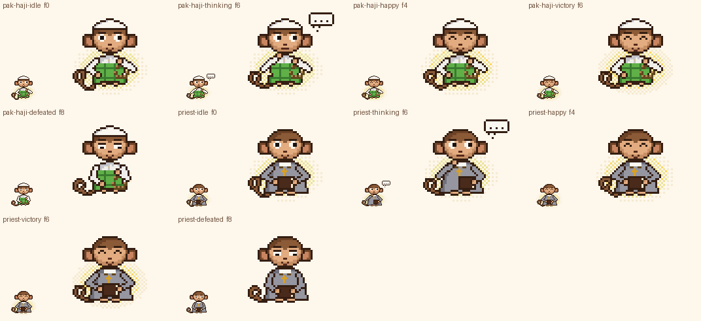
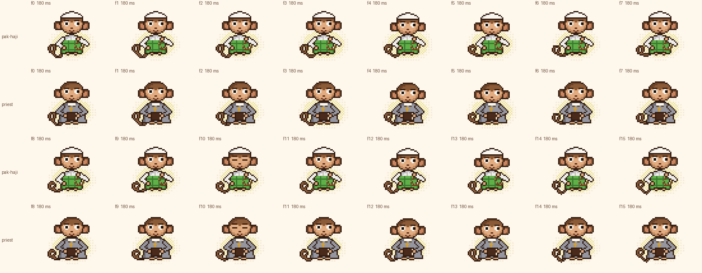
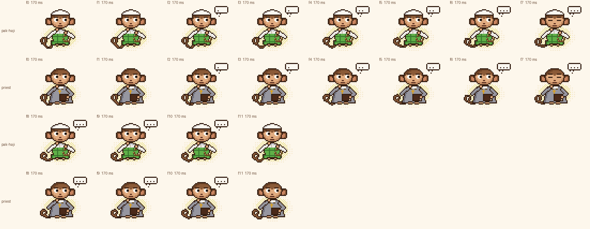
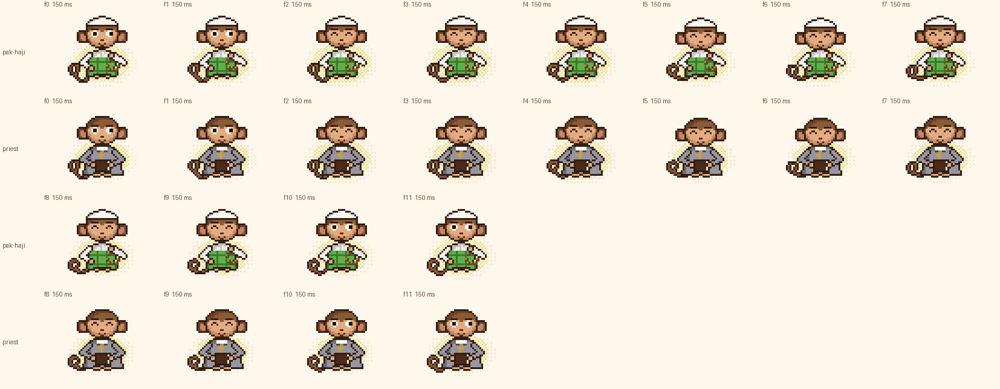
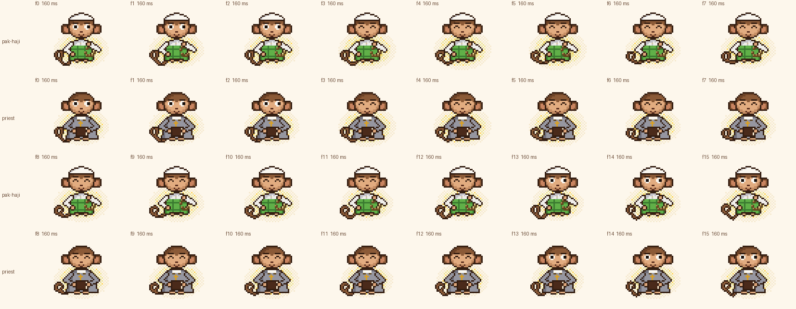
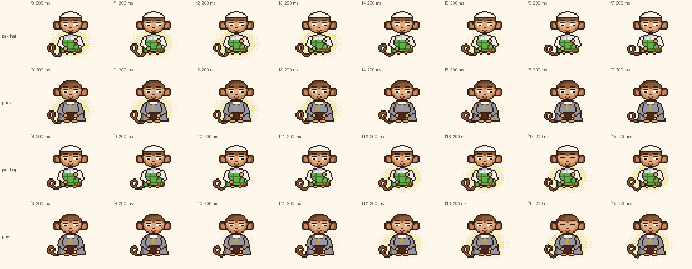

# Laporan Gerbang I

Status: **dibuat, validasi bagian 11 dan audit teologi `[VT]` lulus, lanjut otomatis ke Gerbang J.** Gaya belum disetujui pemilik. Hash aset ada di `pack/sha256-dibuat.txt`, 20 baris untuk gerbang ini.



## Urutan kerja (keputusan pemilik 11)

1. **Idle dulu.** Idle Pak Haji dan Priest dibuat lebih dulu. `theology.BUILD_STATES` saat itu `("idle",)`, jadi hanya dua aset itu yang ada.
2. **Contact sheet penuh idle:** semua 16 frame, skala 3×. Tiap baris Pak Haji tepat di atas baris Priest untuk frame yang sama.

   

3. **Pemeriksaan otomatis (i)-(vi)** dijalankan dengan `python3 src/validate_pack.py --theology-only` saat hanya idle yang ada. Hasilnya LULUS; output mentahnya ada di bagian Tes di bawah, baris pertama.
4. **Sesudah itu**, `BUILD_STATES` diperluas ke thinking, happy, victory, dan defeated. Audit `[VT]` dijalankan ulang untuk semua state sebagai bagian dari validator lengkap, dan hasilnya LULUS.

Contact sheet penuh state lainnya (semua frame, 3×, berdampingan):






## Ringkasan

Semua kode ada di modul baru `src/theology.py`.

**Kerangka bersama.** Kedua kostum memakai satu kerangka frame:
- tabel `STATES` (jumlah frame dan durasi);
- ritme angguk `NOD`;
- ekspresi per frame;
- aura dari `aura_params(state, t)`.

Yang berbeda hanya pakaian dan prop.

**Pak Haji**
- Kopiah putih polos.
- Baju koko putih `S` dengan kerah pendek dan dua kancing.
- Sarung kotak dua hijau PAL: dasar `V`, garis `v` tiap 5 px.
- Tasbih kayu 9 butir yang menjuntai dari tangan kanan di depan dada.
- Ekspresi ramah (senyum).
- Tanpa peci hitam, tanpa batik, tanpa janggut.

**Priest**
- Jubah panjang abu `g` dengan bayangan `5`. Warnanya bukan hitam, supaya jauh dari Judge `L`; ΔE Priest `g` ke Judge `L` di atas 15.
- Kerah putih.
- Buku polos tertutup: sampul `D`, tepi halaman `C`, tanpa tanda apa pun.
- Kalung salib polos kecil 3×4 berwarna `y`, bertali cokelat.
- Tanpa janggut.

**State dan durasi (identik untuk keduanya):**

| State | Frame × durasi | Isi |
|---|---|---|
| idle | 16 × 180 ms | Kepala mengangguk 1 px di f4-f5 dan f12-f13, kedip f10. Pak Haji menggeser butir tasbih satu per beat; Priest memegang buku. Aura berdenyut ±1 px. |
| thinking | 12 × 170 ms | Tangan kiri di dagu, gelembung "..." (titik digambar sebagai piksel, tanpa glyph). |
| happy | 12 × 150 ms | Senyum kecil dengan mata tersenyum, angguk kecil, aura level 2 (sedikit lebih terang). |
| victory | 16 × 160 ms | Senyum tenang, aura level 3 (paling terang, titik emas bergeser pelan). Tanpa konfeti, tanpa lompat, tangan tidak diangkat. |
| defeated | 16 × 200 ms | Badan tegak, senyum tipis, mata setengah terpejam, tangan diam di pangkuan dengan siku rapat. Aura meredup (f4-f5 redup, f6-f9 paling redup, f10-f11 redup) lalu kembali. |

## Audit kepatuhan 7.2, butir demi butir

Rujukan frame memakai contact sheet di atas. `[VT]` adalah pemeriksaan otomatis di `validate_pack.py`.

| Butir | Aturan | Kepatuhan dan bukti |
|---|---|---|
| a | Tanpa aksara Arab, kutipan kitab, kaligrafi, atau simbol suci selain salib polos kecil Priest | `[VT]` (iii): `mini_text` tidak dipanggil sama sekali di 10 aset, dan titik gelembung digambar sebagai piksel. `[VT]` (iv): warna salib `y` 0 piksel di semua 72 frame Pak Haji. Di Priest, `y` hanya ada sebagai kotak 3×4 (6 piksel) di semua 72 frame. Buku Priest hanya memuat warna `C`, `D`, `K`. Kopiah polos tanpa motif. Tasbih hanya butir kayu `N`/`X`. Tidak ada tulisan di mana pun (lihat semua contact sheet). |
| b | Tidak menggambarkan Tuhan, nabi, malaikat, atau orang suci | Kedua tokoh adalah Gobyet berkostum (wajah dan badan rig yang sama dengan semua kostum lain). Tidak ada figur lain, sayap, atau lingkaran cahaya di atas kepala (lihat f) di semua frame. |
| c | Tanpa gestur ritual atau ibadah; tasbih hanya digeser, buku hanya dipegang | Tangan tidak pernah ditengadahkan, dilipat di depan dada, atau diangkat, termasuk di victory. Kepala hanya mengangguk 1 px, tidak menunduk. Tasbih: butir bergeser setengah jarak di frame kedua tiap beat (idle, happy, victory f1, f5, f9, f13) dan diam di thinking dan defeated. Buku selalu tertutup (idle, happy, victory, dan defeated di pangkuan; thinking dengan satu tangan) dan tidak pernah dibuka atau dibaca. |
| d | Tidak menari, tidak slapstick, tanpa humor dari praktik keagamaan | Tidak ada state tarian di `APPLIES` untuk keduanya. Tidak ada lompatan (victory tanpa lompat), benda jatuh, atau efek lucu. Satu-satunya efek adalah aura. |
| e | Perlakuan IDENTIK: state, durasi, gaya, ukuran dan bentuk aura | `[VT]` (ii): 5 state yang sama dengan jumlah frame dan durasi identik (tabel di atas). `[VT]` (i): mask aura identik per state dan per frame di semua 72 pasangan frame, digambar paling awal. Ekspresi dan ritme angguk memakai fungsi yang sama. Beda yang tersisa hanya pakaian dan prop. Karena siluet pakaian berbeda, jumlah piksel aura yang **terlihat** sedikit berbeda: rata-rata idle Pak Haji 128 vs Priest 107. Ini dilaporkan di Kelemahan. |
| f | Aura = glow lembut berlapis (dithering) di belakang badan, krem-keemasan pucat, sama untuk keduanya; tanpa halo di atas kepala, tanpa sinar atau nyala | Aura adalah dithering 25-50% dari `C`, `n`, dan titik `O` di elips 19×13 yang berpusat di badan `(CX, TOP+7)`. `[VT]` (i) memeriksa bahwa aura hanya berwarna C/n/O, digambar sebelum piksel lain (di belakang badan), dan tidak naik di atas pusat kepala (y ≥ 14). Tepi atasnya di y 16-17, sejajar telinga. Tidak ada garis sinar dan tidak ada bentuk api (lihat contact sheet victory, level aura tertinggi). |
| g | Defeated = tenang menerima: senyum tipis, aura meredup sesaat lalu kembali, badan tetap tegak | Contact sheet defeated: badan tegak di semua 16 frame (tidak rebah, tidak lunglai). Mulut `smile` dengan mata `relief` (setengah terpejam, tenang), dan kedip di f14. Aura redup di f4-f5 dan f10-f11, paling redup di f6-f9, lalu kembali di f12-f15. Tidak ada asap, air mata, atau alis sedih. |
| h | Presentasi, bukan penilaian; dokumentasikan; pemetaan Fase 3 netral | Ditulis di `pack/README.md`, bagian "Kostum teologi: presentasi, bukan penilaian". Isinya: menang atau kalah tidak boleh diartikan benar atau salah secara teologis; rancangan Fase 3 memakai pemetaan netral dengan state identik; untuk pertanyaan teologis yang tidak menyebut satu tradisi, sistem tidak otomatis memilih salah satu tokoh; kostum teologi tidak dipakai untuk peran turnamen. Belum diimplementasikan. |

**Pemeriksaan otomatis tambahan (keputusan pemilik 11c):**
- **(v) Tanpa janggut putih panjang dan mahkota daun:** zona dagu tanpa warna `GHSWghm`, dan zona di atas alis tanpa hijau daun `VZkv`, di semua frame.
- **(vi) Tanpa kopiah hitam dan batik kondangan:** zona kopiah tanpa `Llq`, dan tidak ada warna batik `Uu`. Kopiah putih Pak Haji minimal 40 piksel `W` di setiap frame.
- **Kontrol positif:** pemeriksaan yang sama mendeteksi janggut (26 piksel) dan daun (20) di Greek, serta peci hitam (30) dan batik (135) di `kondangan`. Ini membuktikan pemeriksaannya bekerja. Seandainya kontrol tidak terdeteksi, validator GAGAL.

## Perubahan rig, palet, dan validator

- **Rig:** tidak ada perubahan pada `monkey.py`. Pakaian, prop, dan aura ada di `src/theology.py`.
- **Palet:** tidak ada tambahan. `5` (bayangan jubah Priest) sudah dialokasikan sebelum Gerbang G.
- **Validator:**
  - Bagian baru `[VT]` menjalankan audit teologi (i)-(vi) beserta kontrol positif, dan wajib lulus.
  - Opsi `--theology-only` menjalankan audit ini saja; dipakai sebelum state lain dibuat.
  - **Metode V6 diubah untuk dua kostum ini:** piksel aura pada frame kunci (posisinya dari `theology.aura_mask`) tidak dihitung sebagai pakaian. Alasannya, aura sengaja identik untuk keduanya (7.2e), jadi tidak bisa menjadi pembeda warna.
  - Tanpa pengecualian ini, dominan Pak Haji adalah `n` aura (20%), bukan sarung `V` (17%). Dengan pengecualian: `V` 27% dan Priest `g` 66%. Kostum lain tidak terpengaruh (angka V6-nya sama).
- **Laporan G dan H:** bagian "Keputusan yang perlu pemilik" dan kalimat penutup ditambahkan, karena format bagian 12 memintanya dan versi awalnya belum memuatnya.

## Revisi di dalam gerbang

- **Tasbih:** versi pertama menjuntai di samping pangkuan kanan dan terbaca seperti ekor kedua. Sekarang dipegang di depan dada dengan untaian lebih kecil (8×8).
- **Sarung:** versi pertama kotak 2×2 dua warna membagi hijau menjadi dua kunci yang seimbang, sehingga koko putih `S` menjadi dominan.
  - Sekarang: dasar `V` dengan garis `v` tiap 5 px, dan sarung dimulai 4 px di bawah bahu.
  - Hasil: `V` dominan 27%, `S` 23%.
- **Salib Priest:** versi pertama tertutup 1 piksel oleh buku (5 dari 6 piksel terlihat). Salib dinaikkan 1 px sehingga 3×4 utuh di semua frame.
- **Angguk:** versi pertama menurunkan seluruh badan. Sekarang hanya kepala (dan kopiah) yang turun 1 px.
- **Defeated, IoU vs idle:** versi pertama GAGAL V5, dengan Pak Haji 0,86 dan Priest 0,87 (> 0,85). Badan tegak (7.2g) membuat siluetnya hampir sama dengan idle. Perbaikan yang tetap mematuhi 7.2g:
  - aura turun ke level paling redup di f6-f9 (hanya lapisan dalam, hampir seluruhnya tertutup badan);
  - siku dirapatkan ke badan.
  - Hasil: 0,79 dan 0,83. Buku dan tasbih tidak diletakkan di lantai, karena itu bisa terbaca tidak hormat.

## Tebakan dan ketidakpastian

- **"Kopiah putih haji"** saya gambar sebagai topi bundar putih polos yang pas di puncak kepala. Tidak ada motif rajut, supaya tidak ada pola yang bisa terbaca sebagai tulisan.
- **Sarung dipakai agak tinggi,** mulai 4 px di bawah bahu. Dalam kenyataan, koko biasanya menutupi pinggang. Ini kompromi supaya hijau dominan sesuai alokasi warna (koko putih < 15 ΔE dari Academic dan Referee). Kalau pemilik lebih suka koko panjang, dominannya menjadi `S`, dan ΔE ke Referee/Academic `W` sekitar 7.
- **Arti "menggeser butir tasbih":** saya gambar sebagai butir yang bergeser setengah jarak sekali tiap beat, dengan jari diam. Di 1× gerakan ini hampir tidak terlihat.
- **Warna salib `y` (emas tua):** saya pilih karena kontras dengan jubah abu dan tidak dipakai bagian lain kedua kostum, sehingga pemeriksaan (iv) bisa berbasis warna. Salib perak `G` hampir hilang di atas `g`.
- **"Aura lebih terang" (victory)** diwujudkan sebagai lapisan lebih rapat (luar 50%) dengan titik `O`, bukan warna baru. Kalau ini terlalu ramai, turunkan kerapatan lapisan luar.
- **Terbaca di 1× tanpa label: tidak terbukti.** Panel tes buta keluarga teologi/spesial ada di preview.
- **Kesan keseluruhan terhadap 7.2:** pemeriksaan otomatis membuktikan butir yang bisa diukur (warna, teks, identik, posisi aura). Kesan umum (hormat, netral, tidak konyol) tidak bisa dibuktikan otomatis, jadi **tidak terbukti**. Ini butir pertama urutan review yang saya sarankan.

## Kelemahan yang saya lihat sendiri

- **IoU idle Pak Haji–Priest 0,93, di atas 0,90** (satu-satunya pasangan di atas 0,90). Penyebabnya aura identik yang diwajibkan 7.2e dan badan duduk yang sama. Pembeda di 1× adalah warna (hijau+putih vs abu) dan kopiah, bukan siluet.
- **Aura yang terlihat tidak identik.** Mask-nya identik, tetapi pakaian menutupi bagian yang berbeda. Rata-rata piksel aura terlihat di idle: Pak Haji 128, Priest 107. Jubah Priest lebih lebar di bawah.
- **Happy dan victory mirip.** Keduanya senyum dengan mata tersenyum; pembedanya hanya kerapatan aura. Brief memang meminta victory tanpa konfeti, tanpa lompat, dan tanpa lengan naik, sehingga hampir tidak ada ruang pembeda lain.
- **Tasbih 8×8** di 1× hanya terbaca sebagai untaian titik cokelat. Kalung salib bersama talinya 6×5, di bawah target 6×6, tetapi memang diminta kecil.
- **Seam `pak-haji-happy`** 82 dari ambang 368,8 (lulus). Titik emas aura bergeser tiap 3 frame, termasuk di sambungan loop.

## Keputusan yang perlu pemilik

1. **Aura.** Bentuk (elips di belakang badan), warna, dan kerapatan per state. Terutama apakah victory level 3 terlalu ramai.
2. **Sarung tinggi supaya hijau dominan**, atau koko panjang yang lebih realistis dengan konsekuensi ΔE di bawah 15 terhadap Referee dan Academic.
3. **Salib emas tua `y`**, atau perak.
4. **IoU idle Pak Haji–Priest 0,93** diterima sebagai konsekuensi 7.2e?
5. **Rancangan pemetaan netral Fase 3** di `pack/README.md`: tampilkan keduanya berdampingan, atau jatuh ke `normal`, untuk pertanyaan teologis tanpa tradisi?

## Tabel aset

| Aset | Frame | Durasi | GIF | Sheet 1x | Kunci | Beat per rentang frame |
|---|---:|---:|---:|---:|---:|---|
| `pak-haji-idle` | 16 | 2.88 s | 106591 B | 3642 B | f0 | f0-9     1800 ms  mata=look    alis=flat    mulut=smile<br>f10       180 ms  mata=blink   alis=flat    mulut=smile<br>f11-15    900 ms  mata=look    alis=flat    mulut=smile |
| `pak-haji-thinking` | 12 | 2.04 s | 84784 B | 2497 B | f6 | f0-6     1190 ms  mata=side    alis=flat    mulut=flat<br>f7        170 ms  mata=blink   alis=flat    mulut=flat<br>f8-11     680 ms  mata=side    alis=flat    mulut=flat |
| `pak-haji-happy` | 12 | 1.80 s | 80710 B | 3575 B | f4 | f0-1      300 ms  mata=look    alis=flat    mulut=smile<br>f2-9     1200 ms  mata=happy   alis=flat    mulut=smile<br>f10-11    300 ms  mata=look    alis=flat    mulut=smile |
| `pak-haji-victory` | 16 | 2.56 s | 115568 B | 4162 B | f6 | f0-2      480 ms  mata=look    alis=flat    mulut=smile<br>f3-12    1600 ms  mata=happy   alis=flat    mulut=smile<br>f13-15    480 ms  mata=look    alis=flat    mulut=smile |
| `pak-haji-defeated` | 16 | 3.20 s | 91841 B | 3174 B | f8 | f0-13    2800 ms  mata=relief  alis=flat    mulut=smile<br>f14       200 ms  mata=blink   alis=flat    mulut=smile<br>f15       200 ms  mata=relief  alis=flat    mulut=smile |
| `priest-idle` | 16 | 2.88 s | 97716 B | 3247 B | f0 | f0-9     1800 ms  mata=look    alis=flat    mulut=smile<br>f10       180 ms  mata=blink   alis=flat    mulut=smile<br>f11-15    900 ms  mata=look    alis=flat    mulut=smile |
| `priest-thinking` | 12 | 2.04 s | 78678 B | 2381 B | f6 | f0-6     1190 ms  mata=side    alis=flat    mulut=flat<br>f7        170 ms  mata=blink   alis=flat    mulut=flat<br>f8-11     680 ms  mata=side    alis=flat    mulut=flat |
| `priest-happy` | 12 | 1.80 s | 73144 B | 3157 B | f4 | f0-1      300 ms  mata=look    alis=flat    mulut=smile<br>f2-9     1200 ms  mata=happy   alis=flat    mulut=smile<br>f10-11    300 ms  mata=look    alis=flat    mulut=smile |
| `priest-victory` | 16 | 2.56 s | 105923 B | 3566 B | f6 | f0-2      480 ms  mata=look    alis=flat    mulut=smile<br>f3-12    1600 ms  mata=happy   alis=flat    mulut=smile<br>f13-15    480 ms  mata=look    alis=flat    mulut=smile |
| `priest-defeated` | 16 | 3.20 s | 85988 B | 3005 B | f8 | f0-13    2800 ms  mata=relief  alis=flat    mulut=smile<br>f14       200 ms  mata=blink   alis=flat    mulut=smile<br>f15       200 ms  mata=relief  alis=flat    mulut=smile |

## Validasi (output mentah)

### validate_pack.py --gate I

```
[V1] Hash aset yang dikunci dan aset yang sudah dibuat
  sha256-asli.txt: 27 identik, 0 berubah/hilang
  sha256-disetujui.txt: 89 identik, 0 berubah/hilang
  sha256-dibuat.txt: 78 identik, 0 berubah/hilang

[V2] Manifest dan schema, [V3] palet, kanvas, alfa, isi GIF
  32 kostum, 13 state, 163 sel berlaku, 91 sel terisi; 0 gagal

[V4] Loop seam (piksel berbeda; seam = frame terakhir -> frame pertama)
  ambang = 1.25 x selisih maksimum antar-frame berurutan di aset itu sendiri
  sel                        status     maks  ambang   seam  hasil
  normal/idle                terkunci    237   296.2     37  lulus
  normal/happy               terkunci    324   405.0    100  lulus
  normal/thinking            terkunci    158   197.5     34  lulus
  normal/victory             terkunci    544   680.0     16  lulus
  normal/defeated            terkunci     45    56.2     36  lulus
  greek-philosopher/thinking terkunci    197   246.2    234  lulus
  greek-philosopher/idle     terkunci     70    87.5     33  lulus
  greek-philosopher/victory  terkunci    560   700.0      8  lulus
  greek-philosopher/defeated terkunci    113   141.2     69  lulus
  academic/idle              terkunci    241   301.2     36  lulus
  academic/thinking          terkunci    176   220.0     28  lulus
  academic/victory           terkunci    549   686.2     20  lulus
  academic/defeated          terkunci    287   358.8     12  lulus
  scientist/thinking         terkunci    140   175.0    239  DIKETAHUI (terkunci, tidak diubah)
  scientist/idle             terkunci     75    93.8     44  lulus
  scientist/shocked          terkunci    814  1017.5     30  lulus
  scientist/victory          terkunci    722   902.5     59  lulus
  hacker/idle                terkunci    257   321.2    258  lulus
  hacker/thinking            terkunci    138   172.5     68  lulus
  hacker/shocked             terkunci    372   465.0     68  lulus
  hacker/victory             terkunci    600   750.0     68  lulus
  detective/thinking         terkunci    312   390.0    356  lulus
  detective/idle             terkunci    196   245.0     16  lulus
  detective/suspicious       terkunci    527   658.8     93  lulus
  detective/shocked          terkunci    813  1016.2     16  lulus
  detective/victory          terkunci    689   861.2     16  lulus
  referee/idle               terkunci    216   270.0      8  lulus
  referee/thinking           terkunci    143   178.8    152  lulus
  judge/idle                 terkunci    207   258.8      4  lulus
  judge/thinking             terkunci    158   197.5     24  lulus
  judge/judging              terkunci    207   258.8      7  lulus
  skeptic/idle               terkunci    221   276.2      8  lulus
  skeptic/suspicious         terkunci    278   347.5      8  lulus
  skeptic/attack             terkunci    152   190.0      8  lulus
  champion/idle              terkunci    214   267.5     16  lulus
  champion/victory           terkunci    513   641.2     16  lulus
  mathematician/idle         terkunci     59    73.8     23  lulus
  mathematician/thinking     terkunci    180   225.0     11  lulus
  mathematician/victory      terkunci    710   887.5     38  lulus
  lawyer/idle                terkunci    105   131.2      8  lulus
  lawyer/thinking            terkunci    131   163.8     18  lulus
  lawyer/victory             terkunci    652   815.0      8  lulus
  gamer/idle                 baru        154   192.5     43  lulus
  gamer/thinking             baru        211   263.8     32  lulus
  gamer/happy                baru        220   275.0     31  lulus
  gamer/shocked              baru        620   775.0     32  lulus
  gamer/victory              baru        803  1003.8     17  lulus
  gamer/defeated             baru        103   128.8     16  lulus
  gamer/dance-a              baru        619   773.8    619  lulus
  normal-gblk/idle           baru        183   228.8    158  lulus
  normal-gblk/reveal         baru        367   458.8    261  lulus
  normal-gblk/happy          baru        217   271.2     36  lulus
  normal-gblk/victory        baru        993  1241.2     16  lulus
  normal-gblk/defeated       baru        359   448.8     16  lulus
  normal-gblk/dance-a        baru        873  1091.2    873  lulus
  normal-gblk/dance-b        baru        834  1042.5    844  lulus
  normal-gblk/dance-c        baru        962  1202.5    956  lulus
  knight/idle                baru        356   445.0     11  lulus
  knight/thinking            baru        138   172.5     28  lulus
  knight/shocked             baru        728   910.0     11  lulus
  knight/attack              baru        509   636.2     11  lulus
  knight/victory             baru        552   690.0     11  lulus
  knight/defeated            baru         32    40.0     13  lulus
  viking/idle                baru        396   495.0    395  lulus
  viking/thinking            baru        114   142.5     27  lulus
  viking/attack              baru        267   333.8     11  lulus
  viking/victory             baru        719   898.8     11  lulus
  viking/defeated            baru         30    37.5     14  lulus
  viking/dance-a             baru        586   732.5    597  lulus
  pirate/idle                baru         45    56.2     19  lulus
  pirate/thinking            baru        272   340.0     43  lulus
  pirate/attack              baru        277   346.2     19  lulus
  pirate/victory             baru        652   815.0     19  lulus
  pirate/defeated            baru         29    36.2     22  lulus
  pirate/dance-a             baru        548   685.0    559  lulus
  wizard/idle                baru         37    46.2     17  lulus
  wizard/thinking            baru        130   162.5    138  lulus
  wizard/shocked             baru        531   663.8     18  lulus
  wizard/attack              baru        153   191.2     18  lulus
  wizard/victory             baru        642   802.5     24  lulus
  wizard/defeated            baru        120   150.0     32  lulus
  pak-haji/idle              baru        296   370.0     19  lulus
  pak-haji/thinking          baru         99   123.8     54  lulus
  pak-haji/happy             baru        295   368.8     82  lulus
  pak-haji/victory           baru        136   170.0     48  lulus
  pak-haji/defeated          baru        153   191.2     19  lulus
  priest/idle                baru        240   300.0     19  lulus
  priest/thinking            baru         99   123.8     48  lulus
  priest/happy               baru        242   302.5     66  lulus
  priest/victory             baru        100   125.0     35  lulus
  priest/defeated            baru        126   157.5     19  lulus

[V5] Siluet: IoU mask buram frame kunci
  catatan: semua kostum memakai kepala dan badan yang sama, jadi IoU dasar antar-kostum sudah tinggi
  a) idle antar kostum dasar (> 0,90 = kandidat terlalu mirip)
             normal normal refere  judge skepti champi greek- academ scient mathem lawyer hacker detect  gamer knight viking pirate wizard pak-ha priest
  normal       1.00   0.41   0.51   0.58   0.55   0.50   0.43   0.52   0.31   0.50   0.50   0.32   0.50   0.53   0.50   0.47   0.50   0.56   0.54   0.56
  normal-gbl   0.41   1.00   0.66   0.58   0.61   0.65   0.38   0.48   0.39   0.60   0.59   0.45   0.63   0.63   0.60   0.60   0.63   0.45   0.59   0.58
  referee      0.51   0.66   1.00   0.78   0.85   0.86   0.44   0.62   0.32   0.84   0.85   0.30   0.82   0.85   0.79   0.74   0.83   0.55   0.78   0.79
  judge        0.58   0.58   0.78   1.00   0.79   0.75   0.46   0.62   0.31   0.78   0.74   0.31   0.73   0.74   0.72   0.65   0.75   0.61   0.76   0.82
  skeptic      0.55   0.61   0.85   0.79   1.00   0.79   0.46   0.60   0.31   0.83   0.80   0.28   0.77   0.84   0.78   0.71   0.80   0.57   0.77   0.77
  champion     0.50   0.65   0.86   0.75   0.79   1.00   0.43   0.59   0.33   0.83   0.77   0.33   0.83   0.77   0.75   0.70   0.78   0.58   0.75   0.75
  greek-phil   0.43   0.38   0.44   0.46   0.46   0.43   1.00   0.40   0.30   0.42   0.41   0.26   0.46   0.43   0.43   0.41   0.44   0.40   0.44   0.45
  academic     0.52   0.48   0.62   0.62   0.60   0.59   0.40   1.00   0.31   0.61   0.58   0.31   0.62   0.63   0.58   0.57   0.62   0.71   0.65   0.64
  scientist    0.31   0.39   0.32   0.31   0.31   0.33   0.30   0.31   1.00   0.32   0.36   0.64   0.33   0.35   0.36   0.40   0.34   0.30   0.34   0.33
  mathematic   0.50   0.60   0.84   0.78   0.83   0.83   0.42   0.61   0.32   1.00   0.80   0.32   0.78   0.81   0.78   0.73   0.81   0.58   0.78   0.80
  lawyer       0.50   0.59   0.85   0.74   0.80   0.77   0.41   0.58   0.36   0.80   1.00   0.32   0.72   0.81   0.83   0.79   0.78   0.52   0.75   0.75
  hacker       0.32   0.45   0.30   0.31   0.28   0.33   0.26   0.31   0.64   0.32   0.32   1.00   0.33   0.31   0.33   0.37   0.31   0.34   0.34   0.34
  detective    0.50   0.63   0.82   0.73   0.77   0.83   0.46   0.62   0.33   0.78   0.72   0.33   1.00   0.82   0.80   0.74   0.82   0.56   0.78   0.73
  gamer        0.53   0.63   0.85   0.74   0.84   0.77   0.43   0.63   0.35   0.81   0.81   0.31   0.82   1.00   0.80   0.75   0.85   0.57   0.76   0.74
  knight       0.50   0.60   0.79   0.72   0.78   0.75   0.43   0.58   0.36   0.78   0.83   0.33   0.80   0.80   1.00   0.83   0.85   0.54   0.79   0.73
  viking       0.47   0.60   0.74   0.65   0.71   0.70   0.41   0.57   0.40   0.73   0.79   0.37   0.74   0.75   0.83   1.00   0.78   0.50   0.73   0.68
  pirate       0.50   0.63   0.83   0.75   0.80   0.78   0.44   0.62   0.34   0.81   0.78   0.31   0.82   0.85   0.85   0.78   1.00   0.56   0.79   0.75
  wizard       0.56   0.45   0.55   0.61   0.57   0.58   0.40   0.71   0.30   0.58   0.52   0.34   0.56   0.57   0.54   0.50   0.56   1.00   0.61   0.64
  pak-haji     0.54   0.59   0.78   0.76   0.77   0.75   0.44   0.65   0.34   0.78   0.75   0.34   0.78   0.76   0.79   0.73   0.79   0.61   1.00   0.93
  priest       0.56   0.58   0.79   0.82   0.77   0.75   0.45   0.64   0.33   0.80   0.75   0.34   0.73   0.74   0.73   0.68   0.75   0.64   0.93   1.00
  tertinggi: pak-haji-priest 0.93, referee-champion 0.86, referee-lawyer 0.85
  pasangan > 0,90: pak-haji-priest 0.93
  b) defeated vs idle pada kostum yang sama (<= 0,85)
    normal               0.30  lulus
    greek-philosopher    0.34  lulus
    academic             0.75  lulus
    gamer                0.65  lulus
    normal-gblk          0.53  lulus
    knight               0.56  lulus
    viking               0.61  lulus
    pirate               0.64  lulus
    wizard               0.65  lulus
    pak-haji             0.79  lulus
    priest               0.83  lulus
  c) varian vs saudara sefaksi (dilaporkan)
    belum ada varian dengan idle

[V6] Warna dominan dari piksel kostum saja dan jarak warna (CIE76 Delta E; target >= 15)
  metode: frame kunci idle (atau sel pertama bila belum ada idle); piksel yang berbeda dari Normal idle
  pada posisi sama; warna tubuh (BEFKMbf) tidak dihitung; 16 W + 8 P (mata) dikurangkan.
  Kostum teologi: piksel aura (mask identik untuk keduanya, 7.2e) tidak dihitung sebagai pakaian.
  Normal tidak berkostum: warnanya bulu B.
  normal             (idle)     dominan B (139, 90, 55)   100%   kedua -
  normal-gblk        (idle)     dominan n (236, 226, 150)  84%   kedua N (96, 70, 30)
  referee            (idle)     dominan W (250, 247, 240)  36%   kedua P (26, 18, 14)
  judge              (idle)     dominan L (30, 30, 36)     69%   kedua l (64, 64, 74)
  skeptic            (idle)     dominan v (58, 122, 48)    55%   kedua O (255, 214, 90)
  champion           (idle)     dominan O (255, 214, 90)   76%   kedua r (255, 130, 96)
  greek-philosopher  (idle)     dominan c (214, 194, 160)  30%   kedua m (232, 228, 218)
  academic           (idle)     dominan W (250, 247, 240)  42%   kedua L (30, 30, 36)
  scientist          (idle)     dominan k (44, 76, 60)     41%   kedua h (196, 196, 202)
  mathematician      (idle)     dominan p (98, 58, 140)    40%   kedua X (176, 136, 84)
  lawyer             (idle)     dominan J (40, 56, 104)    60%   kedua U (150, 62, 40)
  hacker             (idle)     dominan q (42, 44, 54)     53%   kedua L (30, 30, 36)
  detective          (idle)     dominan d (156, 118, 72)   34%   kedua x (128, 94, 56)
  gamer              (idle)     dominan o (238, 142, 52)   38%   kedua L (30, 30, 36)
  knight             (idle)     dominan z (164, 32, 40)    36%   kedua G (214, 214, 220)
  viking             (idle)     dominan D (74, 42, 26)     33%   kedua s (168, 162, 156)
  pirate             (idle)     dominan i (122, 32, 52)    44%   kedua L (30, 30, 36)
  wizard             (idle)     dominan 3 (66, 110, 220)   68%   kedua 4 (44, 78, 170)
  pak-haji           (idle)     dominan V (96, 176, 72)    27%   kedua S (240, 238, 234)
  priest             (idle)     dominan g (150, 150, 160)  66%   kedua D (74, 42, 26)
  pasangan terdekat:
    referee            academic           W vs W  Delta E   0.0  < 15
    judge              hacker             L vs q  Delta E   7.2  < 15
    normal             detective          B vs d  Delta E  12.2  < 15
    normal-gblk        greek-philosopher  n vs c  Delta E  23.1
    skeptic            pak-haji           v vs V  Delta E  23.8
    greek-philosopher  academic           c vs W  Delta E  24.2
    referee            greek-philosopher  W vs c  Delta E  24.2
    scientist          hacker             k vs q  Delta E  24.5

[V7] Ukuran prop di 1x (kotak pembatas, digambar sendirian; target heuristik >= 6x6)
  referee: peluit                 9x8   ok
  referee: papan klip             8x10  ok
  judge: palu                     9x9   ok
  judge: landasan                 7x3   di bawah 6x6
  judge: papan skor               9x12  ok
  skeptic: monokel                8x14  ok
  skeptic: stempel                7x9   ok
  skeptic: kertas bercap         10x7   ok
  champion: piala                12x11  ok
  champion: medali                7x7   ok
  greek: gulungan terbuka        10x11  ok
  greek: gulungan menggelinding  11x4   di bawah 6x6
  academic: topi toga            21x10  ok
  academic: ijazah terbuka       15x8   ok
  academic: ijazah kusut          8x6   ok
  normal: pisang                  6x17  ok
  scientist: papan tulis (asli)  29x16  ok
  mathematician: batu tulis      11x9   ok
  mathematician: jangka           7x9   ok
  detective: kaca pembesar (asli) 12x13  ok
  hacker: laptop (asli)          24x15  ok
  lawyer: map tertutup           10x9   ok
  lawyer: map terbuka            16x8   ok
  lawyer: dasi                    2x8   di bawah 6x6
  gamer: gamepad                 14x6   ok
  gamer: headset                 26x19  ok
  gamer: kaleng                   4x6   di bawah 6x6
  normal-gblk: papan GBLK        27x21  ok
  knight: pedang                  4x15  di bawah 6x6
  knight: perisai                 9x11  ok
  knight: helm terbuka           20x8   ok
  knight: panji                   8x5   di bawah 6x6
  viking: kapak                  10x15  ok
  viking: perisai bundar         12x12  ok
  viking: helm bertanduk         26x11  ok
  pirate: cutlass                 9x13  ok
  pirate: teropong               15x4   di bawah 6x6
  pirate: tricorn                25x8   ok
  wizard: tongkat                 7x27  ok
  wizard: topi runcing           25x12  ok
  wizard: buku mantra            13x7   ok
  pak-haji: kopiah putih         18x6   ok
  pak-haji: tasbih                8x8   ok
  priest: buku polos              9x7   ok
  priest: kalung salib            6x5   di bawah 6x6

[V8] Audit teks (semua pemanggil mini_text diinstrumentasi) dan beat per rentang frame
  pak-haji/idle  (16 frame, 2880 ms, kunci f0)  teks: -
    f0-9     1800 ms  mata=look    alis=flat    mulut=smile 
    f10       180 ms  mata=blink   alis=flat    mulut=smile 
    f11-15    900 ms  mata=look    alis=flat    mulut=smile 
  pak-haji/thinking  (12 frame, 2040 ms, kunci f6)  teks: -
    f0-6     1190 ms  mata=side    alis=flat    mulut=flat  
    f7        170 ms  mata=blink   alis=flat    mulut=flat  
    f8-11     680 ms  mata=side    alis=flat    mulut=flat  
  pak-haji/happy  (12 frame, 1800 ms, kunci f4)  teks: -
    f0-1      300 ms  mata=look    alis=flat    mulut=smile 
    f2-9     1200 ms  mata=happy   alis=flat    mulut=smile 
    f10-11    300 ms  mata=look    alis=flat    mulut=smile 
  pak-haji/victory  (16 frame, 2560 ms, kunci f6)  teks: -
    f0-2      480 ms  mata=look    alis=flat    mulut=smile 
    f3-12    1600 ms  mata=happy   alis=flat    mulut=smile 
    f13-15    480 ms  mata=look    alis=flat    mulut=smile 
  pak-haji/defeated  (16 frame, 3200 ms, kunci f8)  teks: -
    f0-13    2800 ms  mata=relief  alis=flat    mulut=smile 
    f14       200 ms  mata=blink   alis=flat    mulut=smile 
    f15       200 ms  mata=relief  alis=flat    mulut=smile 
  priest/idle  (16 frame, 2880 ms, kunci f0)  teks: -
    f0-9     1800 ms  mata=look    alis=flat    mulut=smile 
    f10       180 ms  mata=blink   alis=flat    mulut=smile 
    f11-15    900 ms  mata=look    alis=flat    mulut=smile 
  priest/thinking  (12 frame, 2040 ms, kunci f6)  teks: -
    f0-6     1190 ms  mata=side    alis=flat    mulut=flat  
    f7        170 ms  mata=blink   alis=flat    mulut=flat  
    f8-11     680 ms  mata=side    alis=flat    mulut=flat  
  priest/happy  (12 frame, 1800 ms, kunci f4)  teks: -
    f0-1      300 ms  mata=look    alis=flat    mulut=smile 
    f2-9     1200 ms  mata=happy   alis=flat    mulut=smile 
    f10-11    300 ms  mata=look    alis=flat    mulut=smile 
  priest/victory  (16 frame, 2560 ms, kunci f6)  teks: -
    f0-2      480 ms  mata=look    alis=flat    mulut=smile 
    f3-12    1600 ms  mata=happy   alis=flat    mulut=smile 
    f13-15    480 ms  mata=look    alis=flat    mulut=smile 
  priest/defeated  (16 frame, 3200 ms, kunci f8)  teks: -
    f0-13    2800 ms  mata=relief  alis=flat    mulut=smile 
    f14       200 ms  mata=blink   alis=flat    mulut=smile 
    f15       200 ms  mata=relief  alis=flat    mulut=smile 

[VT] Audit teologi 7.2 (keputusan pemilik 11c: pemeriksaan i-vi, wajib lulus)
  state pak-haji: defeated, happy, idle, thinking, victory | priest: defeated, happy, idle, thinking, victory
  (ii) defeated  16 frame, durasi [200] ms, sama untuk keduanya
  (ii) happy     12 frame, durasi [150] ms, sama untuk keduanya
  (ii) idle      16 frame, durasi [180] ms, sama untuk keduanya
  (ii) thinking  12 frame, durasi [170] ms, sama untuk keduanya
  (ii) victory   16 frame, durasi [160] ms, sama untuk keduanya
  (ii) lulus
  (i)  defeated  mask aura 69-318 piksel per frame, identik di 16 frame; terlihat rata-rata pak-haji 83, priest 66
  (i)  happy     mask aura 280-361 piksel per frame, identik di 12 frame; terlihat rata-rata pak-haji 128, priest 107
  (i)  idle      mask aura 280-361 piksel per frame, identik di 16 frame; terlihat rata-rata pak-haji 128, priest 107
  (i)  thinking  mask aura 318-318 piksel per frame, identik di 12 frame; terlihat rata-rata pak-haji 131, priest 107
  (i)  victory   mask aura 464-596 piksel per frame, identik di 16 frame; terlihat rata-rata pak-haji 187, priest 158
  (i)  lulus
  (iii) pak-haji-defeated    teks mini_text: tidak ada (titik digambar sebagai piksel)
  (iii) pak-haji-happy       teks mini_text: tidak ada (titik digambar sebagai piksel)
  (iii) pak-haji-idle        teks mini_text: tidak ada (titik digambar sebagai piksel)
  (iii) pak-haji-thinking    teks mini_text: tidak ada (titik digambar sebagai piksel)
  (iii) pak-haji-victory     teks mini_text: tidak ada (titik digambar sebagai piksel)
  (iii) priest-defeated      teks mini_text: tidak ada (titik digambar sebagai piksel)
  (iii) priest-happy         teks mini_text: tidak ada (titik digambar sebagai piksel)
  (iii) priest-idle          teks mini_text: tidak ada (titik digambar sebagai piksel)
  (iii) priest-thinking      teks mini_text: tidak ada (titik digambar sebagai piksel)
  (iii) priest-victory       teks mini_text: tidak ada (titik digambar sebagai piksel)
  (iii) lulus
  (iv) warna salib 'y': pak-haji 0 piksel di semua frame; priest kotak 3x4 (6 px); buku polos warna CDK
  (iv) lulus (glyph: hanya lewat mini_text yang diinstrumentasi di iii)
  (v)  dagu (30 piksel zona) tanpa GHSWghm; di atas alis tanpa VZkv: lulus
  (vi) area kopiah tanpa Llq, tanpa warna batik Uu; kopiah putih pak-haji min 40 piksel W: lulus
  kontrol positif greek-philosopher-idle janggut 26, daun 20, kopiah hitam 0, batik 0 piksel -> terdeteksi
  kontrol positif kondangan              janggut 0, daun 0, kopiah hitam 30, batik 135 piksel -> terdeteksi

[V9] Audit tarian (dance-*: 16 frame x 120 ms, pose besar di beat f0/f4/f8/f12)
  gamer/dance-a            transisi beat [619, 589, 610, 619], lainnya maks 20  lulus
  normal-gblk/dance-a      transisi beat [873, 859, 860, 873], lainnya maks 19  lulus
  normal-gblk/dance-b      transisi beat [834, 828, 832, 844], lainnya maks 19  lulus
  normal-gblk/dance-c      transisi beat [962, 932, 941, 956], lainnya maks 19  lulus
  viking/dance-a           transisi beat [586, 557, 575, 597], lainnya maks 20  lulus
  pirate/dance-a           transisi beat [548, 518, 536, 559], lainnya maks 20  lulus

[V10] Ukuran
  GIF pra-Fase 2 terbesar: 171429 byte (batas per GIF baru, dihitung setelah optimize)
  gerbang A:  2 aset, GIF terbesar 111960 byte, total file   222284 byte
  gerbang B:  8 aset, GIF terbesar 111841 byte, total file   858967 byte
  gerbang C:  9 aset, GIF terbesar 136520 byte, total file  1004656 byte
  gerbang D:  6 aset, GIF terbesar 124003 byte, total file   642031 byte
  gerbang E: 10 aset, GIF terbesar 115337 byte, total file   977908 byte
  gerbang G: 15 aset, GIF terbesar  95216 byte, total file  1224060 byte
  gerbang H: 24 aset, GIF terbesar 106870 byte, total file  1898721 byte
  gerbang I: 10 aset, GIF terbesar 115568 byte, total file   953349 byte
  sel berlaku 163, terisi 91, tersisa 72
  rata-rata per aset profil baru: GIF 84411 byte, sheet 3220 byte (65 aset)
             dd78be8   sekarang  pertambahan proyeksi akhir
  GIF        3029800    8516520      5486720       11564317
  sheet       365586     574935       209349         441243
  proyeksi pertambahan total: 12005560 byte (11.45 MB); ambang peringatan 15 MB, batas keras 16 MB
  opsi D (GIF aset baru dibuat saat rilis, tidak disimpan): hemat 5486720 byte sekarang, 11564317 byte di akhir

HASIL: LULUS
exit=0
```

### Tes

```
$ python3 src/validate_pack.py --theology-only   (dijalankan saat hanya idle kedua kostum yang ada, SEBELUM state lain dibuat)

[VT] Audit teologi 7.2 (keputusan pemilik 11c: pemeriksaan i-vi, wajib lulus)
  state pak-haji: idle | priest: idle
  (ii) idle      16 frame, durasi [180] ms, sama untuk keduanya
  (ii) lulus
  (i)  idle      mask aura 280-361 piksel per frame, identik di 16 frame; terlihat rata-rata pak-haji 128, priest 107
  (i)  lulus
  (iii) pak-haji-idle        teks mini_text: tidak ada (titik digambar sebagai piksel)
  (iii) priest-idle          teks mini_text: tidak ada (titik digambar sebagai piksel)
  (iii) lulus
  (iv) warna salib 'y': pak-haji 0 piksel di semua frame; priest kotak 3x4 (6 px); buku polos warna CDK
  (iv) lulus (glyph: hanya lewat mini_text yang diinstrumentasi di iii)
  (v)  dagu (30 piksel zona) tanpa GHSWghm; di atas alis tanpa VZkv: lulus
  (vi) area kopiah tanpa Llq, tanpa warna batik Uu; kopiah putih pak-haji min 40 piksel W: lulus
  kontrol positif greek-philosopher-idle janggut 26, daun 20, kopiah hitam 0, batik 0 piksel -> terdeteksi
  kontrol positif kondangan              janggut 0, daun 0, kopiah hitam 30, batik 135 piksel -> terdeteksi

HASIL: LULUS

$ python3 -m unittest src/test_validate_pack.py
Ran 5 tests in 0.006s

OK

$ node --test pack/resolver.test.js
# tests 19
# pass 19
# fail 0

$ bukti opsi B (optimize vs tanpa optimize)
  pak-haji-idle              optimize  106591 B | tanpa  117343 B ( -9.2%) | frame+durasi identik True, loop 0/0
  pak-haji-thinking          optimize   84784 B | tanpa   92848 B ( -8.7%) | frame+durasi identik True, loop 0/0
  pak-haji-happy             optimize   80710 B | tanpa   88774 B ( -9.1%) | frame+durasi identik True, loop 0/0
  pak-haji-victory           optimize  115568 B | tanpa  126320 B ( -8.5%) | frame+durasi identik True, loop 0/0
  pak-haji-defeated          optimize   91841 B | tanpa  102593 B (-10.5%) | frame+durasi identik True, loop 0/0
  priest-idle                optimize   97716 B | tanpa  108516 B (-10.0%) | frame+durasi identik True, loop 0/0
  priest-thinking            optimize   78678 B | tanpa   86790 B ( -9.3%) | frame+durasi identik True, loop 0/0
  priest-happy               optimize   73144 B | tanpa   81208 B ( -9.9%) | frame+durasi identik True, loop 0/0
  priest-victory             optimize  105923 B | tanpa  116675 B ( -9.2%) | frame+durasi identik True, loop 0/0
  priest-defeated            optimize   85988 B | tanpa   97172 B (-11.5%) | frame+durasi identik True, loop 0/0
  total gerbang I: 920943 B vs 1018239 B (-9.6%)

$ hash aset lama (asli, disetujui, dibuat G dan H) setelah export ulang
194 file lama identik

$ sha256sum -c pack/sha256-dibuat.txt (G + H + I)
98 file cocok
```

### Uji browser (tools/e2e_preview.js)

```json
{
 "counts": {
  "real": 7,
  "new": 84,
  "new_by_gate": {
   "C": 9,
   "G": 15,
   "A": 2,
   "B": 8,
   "D": 6,
   "E": 10,
   "H": 24,
   "I": 10
  },
  "placeholder": 72,
  "css_placeholder": 0,
  "not_applicable": 253,
  "rows": 32,
  "stats": "7 sel asli | 84 sel baru | 72 placeholder | 65 / 103 sel wajib terisi | 91 / 163 sel berlaku terisi | 32 × 13 kostum × state"
 },
 "animates": true,
 "blank_cells": 0,
 "static_button_holds": true,
 "reduced_motion_static": true,
 "blind_same_order_after_reload": true,
 "blind_revealed_ok": true,
 "phone_overflow": 0,
 "desktop_errors": [],
 "phone_errors": [],
 "desktop_bad_requests": [],
 "phone_bad_requests": [],
 "fails": [],
 "static_desktop": {
  "canvases": 411,
  "frame_mismatch": 0,
  "pixel_mismatch": 0
 },
 "static_phone": {
  "canvases": 411,
  "frame_mismatch": 0,
  "pixel_mismatch": 0
 },
 "sheet4x_vs_1x_scaled": {
  "cells_with_sheet4x": 26,
  "cells_without_sheet4x": 65,
  "frames_compared": 445,
  "frames_different": 0
 },
 "filter_desktop": {
  "union_ok": true,
  "counts_ok": true,
  "max_gate_height": 1833,
  "per_option": {
   "idle": {
    "figures": 20,
    "height_px": 1561
   },
   "I": {
    "figures": 10,
    "height_px": 1017
   },
   "H": {
    "figures": 24,
    "height_px": 1833
   },
   "G": {
    "figures": 15,
    "height_px": 1289
   },
   "E": {
    "figures": 10,
    "height_px": 1017
   },
   "D": {
    "figures": 6,
    "height_px": 745
   },
   "C": {
    "figures": 9,
    "height_px": 1017
   },
   "B": {
    "figures": 8,
    "height_px": 745
   },
   "A": {
    "figures": 2,
    "height_px": 473
   },
   "semua": {
    "figures": 104,
    "height_px": 8385
   }
  }
 },
 "filter_phone": {
  "union_ok": true,
  "counts_ok": true,
  "max_gate_height": 2327,
  "per_option": {
   "idle": {
    "figures": 20,
    "height_px": 2028
   },
   "I": {
    "figures": 10,
    "height_px": 1207
   },
   "H": {
    "figures": 24,
    "height_px": 2327
   },
   "G": {
    "figures": 15,
    "height_px": 1687
   },
   "E": {
    "figures": 10,
    "height_px": 1207
   },
   "D": {
    "figures": 6,
    "height_px": 887
   },
   "C": {
    "figures": 9,
    "height_px": 1207
   },
   "B": {
    "figures": 8,
    "height_px": 1047
   },
   "A": {
    "figures": 2,
    "height_px": 567
   },
   "semua": {
    "figures": 104,
    "height_px": 9252
   }
  }
 }
}
```

### Git

```
$ git diff --stat origin/main..HEAD (sebelum commit gerbang ini, ringkas)
 196 files changed, 9024 insertions(+), 178 deletions(-)
$ git status --short (perubahan gerbang ini)
38 file berubah
$ repo Bertahan-Bukan-hidup
status: 0 baris; origin/main 26e3cb3; diff vs origin/main: 0 baris
```

---

Lanjut otomatis ke Gerbang J.

