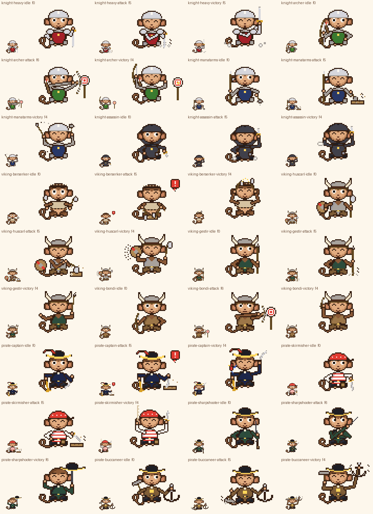

# Laporan Gerbang J

Status: **dibuat, validasi bagian 11 lulus, lanjut otomatis ke Gerbang F.** Gaya belum disetujui pemilik. Hash aset ada di `pack/sha256-dibuat.txt` (72 baris untuk gerbang ini).



## Ringkasan

Semua varian ada di modul baru `src/variants.py`. Varian memakai prop dan rig faksi dari `src/fantasy.py` (helm, pedang, kapak, cutlass, tricorn, balok, papan) tanpa mengubah modul itu.

**Kerangka bersama:** 3 state per varian dengan pola yang sama.
- idle: 12 frame, kedip di f7, angguk di f4-f5 dan f10-f11.
- attack: 12 frame. Pola hentak: angkat, hentak di f4, tahan di f6. Pola bidik: angkat, tarik, bidik f4-f8.
- victory: 16 frame, dengan satu elemen khas per varian.

**Faksi Knight** (helm terbuka, kecuali Assassin yang bertudung):

| Varian | Tampilan | attack | victory (elemen khas) |
|---|---|---|---|
| Heavy | Pelindung bahu tebal, lengan baja, pedang besar dua tangan | Pedang besar ditancapkan ke lantai, debu tebal | Kepulan debu besar di kedua sisi tiap mendarat |
| Archer | Tabard hijau `v`, busur panjang, tabung panah | Membidik papan sasaran bulat di kanan; anak panah terpasang, tidak dilepas | Bintang emas berkedip di tengah papan sasaran |
| Manatarms | Tabard biru `J`, halberd, gada | Gada menghantam papan kayu | Halberd diputar dengan jejak busur putaran |
| Assassin | Tudung dan jubah gelap pendek `l`, belati, bom asap di sabuk | Belati terangkat ke atas, kepulan asap kecil di kaki | Cincin asap berongga naik dari bom asap |

**Faksi Viking** (helm bertanduk, kecuali Berserker yang memakai ikat kepala bulu):

| Varian | Tampilan | attack | victory (elemen khas) |
|---|---|---|---|
| Berserker | Dua kapak, mantel bulu `c`, mata melebar (amuk kartun) | Dua kapak dihentak ke balok, "!" | Dua kapak diadu di atas kepala dengan percikan kilau |
| Huscarl | Zirah rantai `s`, kapak besar dua tangan, perisai bundar | Kapak besar menghantam balok | Perisai dipukul gagang kapak, garis bunyi |
| Gestir | Rompi hijau `k`, tombak lempar | Tombak ditancapkan tegak ke lantai (dipegang, tidak dilempar) | Tombak diseimbangkan di ujung jari |
| Bondi | Rompi `d`, busur pendek, seax bersarung di sabuk | Membidik papan sasaran bulat (tidak melepas) | Tali busur dipetik, garis getar |

**Faksi Pirate:**

| Varian | Tampilan | attack | victory (elemen khas) |
|---|---|---|---|
| Captain | Topi kapten berbulu merah, mantel biru laut `w`, cutlass, blunderbuss (prop) | Cutlass ditancapkan ke papan, blunderbuss tetap menunduk ke lantai, TANPA tembakan | Burung beo hinggap di bahu |
| Skirmisher | Bandana merah, kaus belang, pedang, tong mesiu kecil tertutup | Pedang menghantam papan dengan lompatan kecil (badan naik 2 px saat mengangkat) | Bergelantung di tali dan berayun |
| Sharpshooter | Mantel hijau tua `k`, senapan panjang (prop) | Pose membidik ke atas, satu mata melirik, TANPA kilatan atau asap laras | Tricorn berputar di ujung laras |
| Buccaneer | Dua sabuk kulit menyilang (aksesori besar, proporsi Gobyet tetap), palu besar, jangkar | Palu menghantam lantai, debu piksel | Jangkar diangkat satu tangan dengan garis tenaga |

**Aksen varian**, yaitu warna dominan dari piksel kostum idle. Semua pasangan saudara sefaksi berjarak ΔE ≥ 20, jauh di atas target 10. Terkecil per faksi:
- Knight: Manatarms–Assassin 25,4.
- Viking: Berserker–Huscarl 20,1.
- Pirate: Sharpshooter–Buccaneer 35,4.

## Perubahan rig, palet, validator, dan preview

- **Rig dan palet:** tidak ada perubahan. `src/fantasy.py` tidak diubah, sehingga hash aset H tetap sama.
- **Validator:** `props()` sekarang juga membaca `variants.PROPS`.
- **Preview dan e2e:**
  - Run e2e pertama GAGAL: tampilan gerbang J di ponsel 3287 px, di atas 3000 px, karena gerbang ini berisi 36 aset.
  - Perbaikan: di filter panel banding, gerbang dengan lebih dari 24 aset dipecah per keluarga, atau per faksi bila satu keluarga saja. J menjadi `J:knight`, `J:viking`, dan `J:pirate`, masing-masing 12 aset dan 1367 px di ponsel.
  - `tools/e2e_preview.js` menjumlahkan pilihan dengan huruf gerbang yang sama untuk pemeriksaan jumlah, dan tetap memeriksa ≤ 3000 px per pilihan. Hasilnya LULUS.
  - Cara kerja ini dicatat di `tools/README.md`.

## Revisi di dalam gerbang

- **Heavy:**
  - Pedang besar semula dipegang tegak di depan dada, dengan pelindung tangan melintang. Bentuk itu terbaca seperti salib, jadi dipindah ke sisi kanan (ujung di lantai).
  - Saat attack dan victory, pedang semula diangkat di depan wajah. Sekarang di sisi kanan.
- **Huscarl:** saat attack, lengan kiri semula melintang di depan wajah; sekarang melintang di dada. Saat victory, kepala kapak semula menutupi mata; sekarang sudutnya diubah.
- **Buccaneer:** jangkar semula di kiri, bertumpuk dengan ekor dan tertutup lengan. Sekarang jangkar berdiri di kanan dan palu di tangan kiri. Victory: jangkar diangkat di sisi kanan, tidak di atas kepala (versi pertama menutupi wajah).
- **Gestir:** victory semula berupa tombak diputar. Itu terlalu mirip halberd Manatarms yang juga diputar, jadi diganti menjadi tombak diseimbangkan di ujung jari.
- **Lain-lain:**
  - Jejak putaran halberd semula titik-titik melingkar yang terbaca seperti lalat; sekarang busur pendek di belakang ujung halberd.
  - Bom asap Assassin semula hitam di atas jubah gelap; sekarang abu.
  - Topi kapten semula berbulu putih yang terlihat hitam di 1×; sekarang bulu merah lebih tebal.

## Tebakan dan ketidakpastian

- **"Knight-archer" memakai helm terbuka dan tabard faksi**, bukan tudung pemanah. Saya menafsirkan "tampilan mengikuti kostum dasar faksi" secara harfiah.
- **Pose membidik:** busur dipegang di tangan kanan dengan tangan kiri menarik tali ke arah kanan, karena tokoh selalu menghadap kamera. Anak panah selalu terpasang di busur dan tidak pernah terbang. Papan sasaran ada di tepi kanan kanvas, bukan di "kejauhan" yang sebenarnya.
- **Senapan Sharpshooter** diarahkan ke kanan atas (45-60°), tidak ke arah karakter mana pun. Tidak ada efek apa pun di laras.
- **Blunderbuss Captain** selalu dipegang dengan laras menunduk ke lantai, termasuk saat attack.
- **Jangkar punya palang.** Bagian atasnya (cincin dan palang) bisa sekilas mirip salib, tetapi jangkar diminta brief dan bentuknya utuh (lengan melengkung) di semua frame.
- **Tong mesiu Skirmisher** digambar tertutup tanpa sumbu, supaya tidak terbaca sebagai bahan peledak yang menyala.
- **"Badan lebih besar" Buccaneer** diwujudkan hanya sebagai aksesori (dua sabuk kulit, palu dan jangkar besar). Proporsi Gobyet tidak diubah.
- **Terbaca di 1× tanpa label: tidak terbukti.** Panel tes buta keluarga fantasi di preview hanya memuat kostum dasar, bukan varian.

## Kelemahan yang saya lihat sendiri

- **IoU varian vs kostum dasarnya tinggi** (dilaporkan, bukan GAGAL):
  - Pirate–Sharpshooter 0,95, Viking–Huscarl 0,94, Pirate–Captain 0,92.
  - Antar-saudara, Gestir–Bondi 0,90.
  - Varian yang propnya berdiri tegak di sisi badan (senapan, kapak besar, tombak) punya siluet idle yang hampir sama dengan kostum dasarnya. Pembeda utamanya warna aksen.
- **Prop tipis di bawah target 6×6:** busur panjang 5×25, tombak 3×29, busur pendek 4×16, belati 4×9, seax 7×4, ikat kepala bulu 18×3, bom asap 4×6, tong mesiu 5×6. Busur dan tombak memang tipis, tetapi panjangnya yang membuatnya terbaca.
- **Log di attack Berserker** sebagian tertutup kaki di tengah bawah.
- **Jangkar di victory Buccaneer** di pojok kanan atas; di 1× hanya terbaca sebagai kait abu.
- **Garis getar tali busur Bondi** hanya 3 piksel per sisi dan berganti tiap 2 frame. Di 1× hampir tidak terlihat.

## Keputusan yang perlu pemilik

1. **Pemecahan filter per keluarga/faksi** untuk gerbang lebih dari 24 aset, supaya satu tampilan ≤ 3000 px di ponsel. Diterima?
2. **Archer dan Bondi membidik papan sasaran di tepi kanan kanvas.** Diterima sebagai "di kejauhan"?
3. **Varian yang siluetnya sangat mirip kostum dasarnya** (IoU ≥ 0,92): perlu prop yang lebih mencolok?

## Tabel aset

| Aset | Frame | Durasi | GIF | Sheet 1x | Kunci | Beat per rentang frame |
|---|---:|---:|---:|---:|---:|---|
| `knight-heavy-idle` | 12 | 2.10 s | 60619 B | 2735 B | f0 | f0-6     1260 ms  mata=look    alis=flat    mulut=smile<br>f7        120 ms  mata=blink   alis=flat    mulut=smile<br>f8-11     720 ms  mata=look    alis=flat    mulut=smile |
| `knight-heavy-attack` | 12 | 1.71 s | 60079 B | 3369 B | f5 | f0        140 ms  mata=look    alis=flat    mulut=smile<br>f1        140 ms  mata=look    alis=angry   mulut=flat<br>f2-3      280 ms  mata=look    alis=angry   mulut=o<br>f4-8      730 ms  mata=happy   alis=flat    mulut=smile<br>f9-11     420 ms  mata=look    alis=flat    mulut=smile |
| `knight-heavy-victory` | 16 | 1.92 s | 80615 B | 3791 B | f5 | f0-1      300 ms  mata=look    alis=flat    mulut=smile<br>f2        110 ms  mata=happy   alis=flat    mulut=smile<br>f3        110 ms  mata=happy   alis=flat    mulut=o<br>f4        110 ms  mata=happy   alis=flat    mulut=smile<br>f5        110 ms  mata=happy   alis=flat    mulut=o<br>f6        110 ms  mata=happy   alis=flat    mulut=smile<br>f7        110 ms  mata=happy   alis=flat    mulut=o<br>f8        110 ms  mata=happy   alis=flat    mulut=smile<br>f9        110 ms  mata=happy   alis=flat    mulut=o<br>f10       110 ms  mata=happy   alis=flat    mulut=smile<br>f11       110 ms  mata=happy   alis=flat    mulut=o<br>f12-15    520 ms  mata=look    alis=flat    mulut=smile |
| `knight-archer-idle` | 12 | 2.10 s | 63849 B | 2828 B | f0 | f0-6     1260 ms  mata=look    alis=flat    mulut=smile<br>f7        120 ms  mata=blink   alis=flat    mulut=smile<br>f8-11     720 ms  mata=look    alis=flat    mulut=smile |
| `knight-archer-attack` | 12 | 1.98 s | 79450 B | 3266 B | f6 | f0        140 ms  mata=look    alis=flat    mulut=smile<br>f1-8     1420 ms  mata=look    alis=angry   mulut=flat<br>f9-11     420 ms  mata=look    alis=flat    mulut=smile |
| `knight-archer-victory` | 16 | 1.92 s | 106520 B | 3984 B | f4 | f0-1      300 ms  mata=look    alis=flat    mulut=smile<br>f2        110 ms  mata=happy   alis=flat    mulut=smile<br>f3        110 ms  mata=happy   alis=flat    mulut=o<br>f4        110 ms  mata=happy   alis=flat    mulut=smile<br>f5        110 ms  mata=happy   alis=flat    mulut=o<br>f6        110 ms  mata=happy   alis=flat    mulut=smile<br>f7        110 ms  mata=happy   alis=flat    mulut=o<br>f8        110 ms  mata=happy   alis=flat    mulut=smile<br>f9        110 ms  mata=happy   alis=flat    mulut=o<br>f10       110 ms  mata=happy   alis=flat    mulut=smile<br>f11       110 ms  mata=happy   alis=flat    mulut=o<br>f12-15    520 ms  mata=look    alis=flat    mulut=smile |
| `knight-manatarms-idle` | 12 | 2.10 s | 61359 B | 2785 B | f0 | f0-6     1260 ms  mata=look    alis=flat    mulut=smile<br>f7        120 ms  mata=blink   alis=flat    mulut=smile<br>f8-11     720 ms  mata=look    alis=flat    mulut=smile |
| `knight-manatarms-attack` | 12 | 1.71 s | 64852 B | 3408 B | f5 | f0        140 ms  mata=look    alis=flat    mulut=smile<br>f1        140 ms  mata=look    alis=angry   mulut=flat<br>f2-3      280 ms  mata=look    alis=angry   mulut=o<br>f4-8      730 ms  mata=happy   alis=flat    mulut=smile<br>f9-11     420 ms  mata=look    alis=flat    mulut=smile |
| `knight-manatarms-victory` | 16 | 1.92 s | 83176 B | 4578 B | f4 | f0-1      300 ms  mata=look    alis=flat    mulut=smile<br>f2        110 ms  mata=happy   alis=flat    mulut=smile<br>f3        110 ms  mata=happy   alis=flat    mulut=o<br>f4        110 ms  mata=happy   alis=flat    mulut=smile<br>f5        110 ms  mata=happy   alis=flat    mulut=o<br>f6        110 ms  mata=happy   alis=flat    mulut=smile<br>f7        110 ms  mata=happy   alis=flat    mulut=o<br>f8        110 ms  mata=happy   alis=flat    mulut=smile<br>f9        110 ms  mata=happy   alis=flat    mulut=o<br>f10       110 ms  mata=happy   alis=flat    mulut=smile<br>f11       110 ms  mata=happy   alis=flat    mulut=o<br>f12-15    520 ms  mata=look    alis=flat    mulut=smile |
| `knight-assassin-idle` | 12 | 2.10 s | 57692 B | 2688 B | f0 | f0-6     1260 ms  mata=look    alis=flat    mulut=smile<br>f7        120 ms  mata=blink   alis=flat    mulut=smile<br>f8-11     720 ms  mata=look    alis=flat    mulut=smile |
| `knight-assassin-attack` | 12 | 1.71 s | 58193 B | 3088 B | f5 | f0        140 ms  mata=look    alis=flat    mulut=smile<br>f1        140 ms  mata=look    alis=angry   mulut=flat<br>f2-3      280 ms  mata=look    alis=angry   mulut=o<br>f4-8      730 ms  mata=happy   alis=flat    mulut=smile<br>f9-11     420 ms  mata=look    alis=flat    mulut=smile |
| `knight-assassin-victory` | 16 | 1.92 s | 79071 B | 3762 B | f4 | f0-1      300 ms  mata=look    alis=flat    mulut=smile<br>f2        110 ms  mata=happy   alis=flat    mulut=smile<br>f3        110 ms  mata=happy   alis=flat    mulut=o<br>f4        110 ms  mata=happy   alis=flat    mulut=smile<br>f5        110 ms  mata=happy   alis=flat    mulut=o<br>f6        110 ms  mata=happy   alis=flat    mulut=smile<br>f7        110 ms  mata=happy   alis=flat    mulut=o<br>f8        110 ms  mata=happy   alis=flat    mulut=smile<br>f9        110 ms  mata=happy   alis=flat    mulut=o<br>f10       110 ms  mata=happy   alis=flat    mulut=smile<br>f11       110 ms  mata=happy   alis=flat    mulut=o<br>f12-15    520 ms  mata=look    alis=flat    mulut=smile |
| `viking-berserker-idle` | 12 | 2.10 s | 58979 B | 2724 B | f0 | f0-6     1260 ms  mata=wide    alis=flat    mulut=smile<br>f7        120 ms  mata=blink   alis=flat    mulut=smile<br>f8-11     720 ms  mata=wide    alis=flat    mulut=smile |
| `viking-berserker-attack` | 12 | 1.71 s | 61658 B | 3757 B | f5 | f0        140 ms  mata=wide    alis=flat    mulut=smile<br>f1        140 ms  mata=wide    alis=angry   mulut=flat<br>f2-3      280 ms  mata=wide    alis=angry   mulut=o<br>f4-6      450 ms  mata=happy   alis=flat    mulut=smile   teks=!<br>f7-8      280 ms  mata=happy   alis=flat    mulut=smile<br>f9-11     420 ms  mata=wide    alis=flat    mulut=smile |
| `viking-berserker-victory` | 16 | 1.92 s | 77359 B | 3910 B | f4 | f0-1      300 ms  mata=wide    alis=flat    mulut=smile<br>f2        110 ms  mata=happy   alis=flat    mulut=smile<br>f3        110 ms  mata=happy   alis=flat    mulut=o<br>f4        110 ms  mata=happy   alis=flat    mulut=smile<br>f5        110 ms  mata=happy   alis=flat    mulut=o<br>f6        110 ms  mata=happy   alis=flat    mulut=smile<br>f7        110 ms  mata=happy   alis=flat    mulut=o<br>f8        110 ms  mata=happy   alis=flat    mulut=smile<br>f9        110 ms  mata=happy   alis=flat    mulut=o<br>f10       110 ms  mata=happy   alis=flat    mulut=smile<br>f11       110 ms  mata=happy   alis=flat    mulut=o<br>f12-15    520 ms  mata=wide    alis=flat    mulut=smile |
| `viking-huscarl-idle` | 12 | 2.10 s | 75737 B | 2992 B | f0 | f0-6     1260 ms  mata=look    alis=flat    mulut=smile<br>f7        120 ms  mata=blink   alis=flat    mulut=smile<br>f8-11     720 ms  mata=look    alis=flat    mulut=smile |
| `viking-huscarl-attack` | 12 | 1.71 s | 80092 B | 3815 B | f5 | f0        140 ms  mata=look    alis=flat    mulut=smile<br>f1        140 ms  mata=look    alis=angry   mulut=flat<br>f2-3      280 ms  mata=look    alis=angry   mulut=o<br>f4-8      730 ms  mata=happy   alis=flat    mulut=smile<br>f9-11     420 ms  mata=look    alis=flat    mulut=smile |
| `viking-huscarl-victory` | 16 | 1.92 s | 101652 B | 4066 B | f4 | f0-1      300 ms  mata=look    alis=flat    mulut=smile<br>f2        110 ms  mata=happy   alis=flat    mulut=smile<br>f3        110 ms  mata=happy   alis=flat    mulut=o<br>f4        110 ms  mata=happy   alis=flat    mulut=smile<br>f5        110 ms  mata=happy   alis=flat    mulut=o<br>f6        110 ms  mata=happy   alis=flat    mulut=smile<br>f7        110 ms  mata=happy   alis=flat    mulut=o<br>f8        110 ms  mata=happy   alis=flat    mulut=smile<br>f9        110 ms  mata=happy   alis=flat    mulut=o<br>f10       110 ms  mata=happy   alis=flat    mulut=smile<br>f11       110 ms  mata=happy   alis=flat    mulut=o<br>f12-15    520 ms  mata=look    alis=flat    mulut=smile |
| `viking-gestir-idle` | 12 | 2.10 s | 66949 B | 2827 B | f0 | f0-6     1260 ms  mata=look    alis=flat    mulut=smile<br>f7        120 ms  mata=blink   alis=flat    mulut=smile<br>f8-11     720 ms  mata=look    alis=flat    mulut=smile |
| `viking-gestir-attack` | 12 | 1.71 s | 67804 B | 3348 B | f5 | f0        140 ms  mata=look    alis=flat    mulut=smile<br>f1        140 ms  mata=look    alis=angry   mulut=flat<br>f2-3      280 ms  mata=look    alis=angry   mulut=o<br>f4-8      730 ms  mata=happy   alis=flat    mulut=smile<br>f9-11     420 ms  mata=look    alis=flat    mulut=smile |
| `viking-gestir-victory` | 16 | 1.92 s | 87813 B | 3814 B | f4 | f0-1      300 ms  mata=look    alis=flat    mulut=smile<br>f2        110 ms  mata=happy   alis=flat    mulut=smile<br>f3        110 ms  mata=happy   alis=flat    mulut=o<br>f4        110 ms  mata=happy   alis=flat    mulut=smile<br>f5        110 ms  mata=happy   alis=flat    mulut=o<br>f6        110 ms  mata=happy   alis=flat    mulut=smile<br>f7        110 ms  mata=happy   alis=flat    mulut=o<br>f8        110 ms  mata=happy   alis=flat    mulut=smile<br>f9        110 ms  mata=happy   alis=flat    mulut=o<br>f10       110 ms  mata=happy   alis=flat    mulut=smile<br>f11       110 ms  mata=happy   alis=flat    mulut=o<br>f12-15    520 ms  mata=look    alis=flat    mulut=smile |
| `viking-bondi-idle` | 12 | 2.10 s | 67792 B | 2856 B | f0 | f0-6     1260 ms  mata=look    alis=flat    mulut=smile<br>f7        120 ms  mata=blink   alis=flat    mulut=smile<br>f8-11     720 ms  mata=look    alis=flat    mulut=smile |
| `viking-bondi-attack` | 12 | 1.98 s | 83080 B | 3124 B | f6 | f0        140 ms  mata=look    alis=flat    mulut=smile<br>f1-8     1420 ms  mata=look    alis=angry   mulut=flat<br>f9-11     420 ms  mata=look    alis=flat    mulut=smile |
| `viking-bondi-victory` | 16 | 1.92 s | 90536 B | 3732 B | f4 | f0-1      300 ms  mata=look    alis=flat    mulut=smile<br>f2        110 ms  mata=happy   alis=flat    mulut=smile<br>f3        110 ms  mata=happy   alis=flat    mulut=o<br>f4        110 ms  mata=happy   alis=flat    mulut=smile<br>f5        110 ms  mata=happy   alis=flat    mulut=o<br>f6        110 ms  mata=happy   alis=flat    mulut=smile<br>f7        110 ms  mata=happy   alis=flat    mulut=o<br>f8        110 ms  mata=happy   alis=flat    mulut=smile<br>f9        110 ms  mata=happy   alis=flat    mulut=o<br>f10       110 ms  mata=happy   alis=flat    mulut=smile<br>f11       110 ms  mata=happy   alis=flat    mulut=o<br>f12-15    520 ms  mata=look    alis=flat    mulut=smile |
| `pirate-captain-idle` | 12 | 2.10 s | 66161 B | 3018 B | f0 | f0-6     1260 ms  mata=look    alis=flat    mulut=smile<br>f7        120 ms  mata=blink   alis=flat    mulut=smile<br>f8-11     720 ms  mata=look    alis=flat    mulut=smile |
| `pirate-captain-attack` | 12 | 1.71 s | 74494 B | 3817 B | f5 | f0        140 ms  mata=look    alis=flat    mulut=smile<br>f1        140 ms  mata=look    alis=angry   mulut=flat<br>f2-3      280 ms  mata=look    alis=angry   mulut=o<br>f4-6      450 ms  mata=happy   alis=flat    mulut=smile   teks=!<br>f7-8      280 ms  mata=happy   alis=flat    mulut=smile<br>f9-11     420 ms  mata=look    alis=flat    mulut=smile |
| `pirate-captain-victory` | 16 | 1.92 s | 94966 B | 4273 B | f4 | f0-1      300 ms  mata=look    alis=flat    mulut=smile<br>f2        110 ms  mata=happy   alis=flat    mulut=smile<br>f3        110 ms  mata=happy   alis=flat    mulut=o<br>f4        110 ms  mata=happy   alis=flat    mulut=smile<br>f5        110 ms  mata=happy   alis=flat    mulut=o<br>f6        110 ms  mata=happy   alis=flat    mulut=smile<br>f7        110 ms  mata=happy   alis=flat    mulut=o<br>f8        110 ms  mata=happy   alis=flat    mulut=smile<br>f9        110 ms  mata=happy   alis=flat    mulut=o<br>f10       110 ms  mata=happy   alis=flat    mulut=smile<br>f11       110 ms  mata=happy   alis=flat    mulut=o<br>f12-15    520 ms  mata=look    alis=flat    mulut=smile |
| `pirate-skirmisher-idle` | 12 | 2.10 s | 60016 B | 2857 B | f0 | f0-6     1260 ms  mata=look    alis=flat    mulut=smile<br>f7        120 ms  mata=blink   alis=flat    mulut=smile<br>f8-11     720 ms  mata=look    alis=flat    mulut=smile |
| `pirate-skirmisher-attack` | 12 | 1.71 s | 63035 B | 3768 B | f5 | f0        140 ms  mata=look    alis=flat    mulut=smile<br>f1        140 ms  mata=look    alis=angry   mulut=flat<br>f2-3      280 ms  mata=look    alis=angry   mulut=o<br>f4-8      730 ms  mata=happy   alis=flat    mulut=smile<br>f9-11     420 ms  mata=look    alis=flat    mulut=smile |
| `pirate-skirmisher-victory` | 16 | 1.92 s | 87384 B | 4466 B | f4 | f0-1      300 ms  mata=look    alis=flat    mulut=smile<br>f2        110 ms  mata=happy   alis=flat    mulut=smile<br>f3        110 ms  mata=happy   alis=flat    mulut=o<br>f4        110 ms  mata=happy   alis=flat    mulut=smile<br>f5        110 ms  mata=happy   alis=flat    mulut=o<br>f6        110 ms  mata=happy   alis=flat    mulut=smile<br>f7        110 ms  mata=happy   alis=flat    mulut=o<br>f8        110 ms  mata=happy   alis=flat    mulut=smile<br>f9        110 ms  mata=happy   alis=flat    mulut=o<br>f10       110 ms  mata=happy   alis=flat    mulut=smile<br>f11       110 ms  mata=happy   alis=flat    mulut=o<br>f12-15    520 ms  mata=look    alis=flat    mulut=smile |
| `pirate-sharpshooter-idle` | 12 | 2.10 s | 64460 B | 2953 B | f0 | f0-6     1260 ms  mata=look    alis=flat    mulut=smile<br>f7        120 ms  mata=blink   alis=flat    mulut=smile<br>f8-11     720 ms  mata=look    alis=flat    mulut=smile |
| `pirate-sharpshooter-attack` | 12 | 1.98 s | 63503 B | 3147 B | f6 | f0        140 ms  mata=look    alis=flat    mulut=smile<br>f1-3      420 ms  mata=look    alis=angry   mulut=flat<br>f4-8     1000 ms  mata=side    alis=angry   mulut=flat<br>f9-11     420 ms  mata=look    alis=flat    mulut=smile |
| `pirate-sharpshooter-victory` | 16 | 1.92 s | 83532 B | 3974 B | f6 | f0-1      300 ms  mata=look    alis=flat    mulut=smile<br>f2        110 ms  mata=happy   alis=flat    mulut=smile<br>f3        110 ms  mata=happy   alis=flat    mulut=o<br>f4        110 ms  mata=happy   alis=flat    mulut=smile<br>f5        110 ms  mata=happy   alis=flat    mulut=o<br>f6        110 ms  mata=happy   alis=flat    mulut=smile<br>f7        110 ms  mata=happy   alis=flat    mulut=o<br>f8        110 ms  mata=happy   alis=flat    mulut=smile<br>f9        110 ms  mata=happy   alis=flat    mulut=o<br>f10       110 ms  mata=happy   alis=flat    mulut=smile<br>f11       110 ms  mata=happy   alis=flat    mulut=o<br>f12-15    520 ms  mata=look    alis=flat    mulut=smile |
| `pirate-buccaneer-idle` | 12 | 2.10 s | 77849 B | 3141 B | f0 | f0-6     1260 ms  mata=look    alis=flat    mulut=smile<br>f7        120 ms  mata=blink   alis=flat    mulut=smile<br>f8-11     720 ms  mata=look    alis=flat    mulut=smile |
| `pirate-buccaneer-attack` | 12 | 1.71 s | 76752 B | 3583 B | f5 | f0        140 ms  mata=look    alis=flat    mulut=smile<br>f1        140 ms  mata=look    alis=angry   mulut=flat<br>f2-3      280 ms  mata=look    alis=angry   mulut=o<br>f4-8      730 ms  mata=happy   alis=flat    mulut=smile<br>f9-11     420 ms  mata=look    alis=flat    mulut=smile |
| `pirate-buccaneer-victory` | 16 | 1.92 s | 105053 B | 4265 B | f4 | f0-1      300 ms  mata=look    alis=flat    mulut=smile<br>f2        110 ms  mata=happy   alis=flat    mulut=smile<br>f3        110 ms  mata=happy   alis=flat    mulut=o<br>f4        110 ms  mata=happy   alis=flat    mulut=smile<br>f5        110 ms  mata=happy   alis=flat    mulut=o<br>f6        110 ms  mata=happy   alis=flat    mulut=smile<br>f7        110 ms  mata=happy   alis=flat    mulut=o<br>f8        110 ms  mata=happy   alis=flat    mulut=smile<br>f9        110 ms  mata=happy   alis=flat    mulut=o<br>f10       110 ms  mata=happy   alis=flat    mulut=smile<br>f11       110 ms  mata=happy   alis=flat    mulut=o<br>f12-15    520 ms  mata=look    alis=flat    mulut=smile |

## Validasi (output mentah)

### validate_pack.py --gate J

```
[V1] Hash aset yang dikunci dan aset yang sudah dibuat
  sha256-asli.txt: 27 identik, 0 berubah/hilang
  sha256-disetujui.txt: 89 identik, 0 berubah/hilang
  sha256-dibuat.txt: 98 identik, 0 berubah/hilang

[V2] Manifest dan schema, [V3] palet, kanvas, alfa, isi GIF
  32 kostum, 13 state, 163 sel berlaku, 127 sel terisi; 0 gagal

[V4] Loop seam (piksel berbeda; seam = frame terakhir -> frame pertama)
  ambang = 1.25 x selisih maksimum antar-frame berurutan di aset itu sendiri
  sel                        status     maks  ambang   seam  hasil
  normal/idle                terkunci    237   296.2     37  lulus
  normal/happy               terkunci    324   405.0    100  lulus
  normal/thinking            terkunci    158   197.5     34  lulus
  normal/victory             terkunci    544   680.0     16  lulus
  normal/defeated            terkunci     45    56.2     36  lulus
  greek-philosopher/thinking terkunci    197   246.2    234  lulus
  greek-philosopher/idle     terkunci     70    87.5     33  lulus
  greek-philosopher/victory  terkunci    560   700.0      8  lulus
  greek-philosopher/defeated terkunci    113   141.2     69  lulus
  academic/idle              terkunci    241   301.2     36  lulus
  academic/thinking          terkunci    176   220.0     28  lulus
  academic/victory           terkunci    549   686.2     20  lulus
  academic/defeated          terkunci    287   358.8     12  lulus
  scientist/thinking         terkunci    140   175.0    239  DIKETAHUI (terkunci, tidak diubah)
  scientist/idle             terkunci     75    93.8     44  lulus
  scientist/shocked          terkunci    814  1017.5     30  lulus
  scientist/victory          terkunci    722   902.5     59  lulus
  hacker/idle                terkunci    257   321.2    258  lulus
  hacker/thinking            terkunci    138   172.5     68  lulus
  hacker/shocked             terkunci    372   465.0     68  lulus
  hacker/victory             terkunci    600   750.0     68  lulus
  detective/thinking         terkunci    312   390.0    356  lulus
  detective/idle             terkunci    196   245.0     16  lulus
  detective/suspicious       terkunci    527   658.8     93  lulus
  detective/shocked          terkunci    813  1016.2     16  lulus
  detective/victory          terkunci    689   861.2     16  lulus
  referee/idle               terkunci    216   270.0      8  lulus
  referee/thinking           terkunci    143   178.8    152  lulus
  judge/idle                 terkunci    207   258.8      4  lulus
  judge/thinking             terkunci    158   197.5     24  lulus
  judge/judging              terkunci    207   258.8      7  lulus
  skeptic/idle               terkunci    221   276.2      8  lulus
  skeptic/suspicious         terkunci    278   347.5      8  lulus
  skeptic/attack             terkunci    152   190.0      8  lulus
  champion/idle              terkunci    214   267.5     16  lulus
  champion/victory           terkunci    513   641.2     16  lulus
  mathematician/idle         terkunci     59    73.8     23  lulus
  mathematician/thinking     terkunci    180   225.0     11  lulus
  mathematician/victory      terkunci    710   887.5     38  lulus
  lawyer/idle                terkunci    105   131.2      8  lulus
  lawyer/thinking            terkunci    131   163.8     18  lulus
  lawyer/victory             terkunci    652   815.0      8  lulus
  gamer/idle                 baru        154   192.5     43  lulus
  gamer/thinking             baru        211   263.8     32  lulus
  gamer/happy                baru        220   275.0     31  lulus
  gamer/shocked              baru        620   775.0     32  lulus
  gamer/victory              baru        803  1003.8     17  lulus
  gamer/defeated             baru        103   128.8     16  lulus
  gamer/dance-a              baru        619   773.8    619  lulus
  normal-gblk/idle           baru        183   228.8    158  lulus
  normal-gblk/reveal         baru        367   458.8    261  lulus
  normal-gblk/happy          baru        217   271.2     36  lulus
  normal-gblk/victory        baru        993  1241.2     16  lulus
  normal-gblk/defeated       baru        359   448.8     16  lulus
  normal-gblk/dance-a        baru        873  1091.2    873  lulus
  normal-gblk/dance-b        baru        834  1042.5    844  lulus
  normal-gblk/dance-c        baru        962  1202.5    956  lulus
  knight/idle                baru        356   445.0     11  lulus
  knight/thinking            baru        138   172.5     28  lulus
  knight/shocked             baru        728   910.0     11  lulus
  knight/attack              baru        509   636.2     11  lulus
  knight/victory             baru        552   690.0     11  lulus
  knight/defeated            baru         32    40.0     13  lulus
  viking/idle                baru        396   495.0    395  lulus
  viking/thinking            baru        114   142.5     27  lulus
  viking/attack              baru        267   333.8     11  lulus
  viking/victory             baru        719   898.8     11  lulus
  viking/defeated            baru         30    37.5     14  lulus
  viking/dance-a             baru        586   732.5    597  lulus
  pirate/idle                baru         45    56.2     19  lulus
  pirate/thinking            baru        272   340.0     43  lulus
  pirate/attack              baru        277   346.2     19  lulus
  pirate/victory             baru        652   815.0     19  lulus
  pirate/defeated            baru         29    36.2     22  lulus
  pirate/dance-a             baru        548   685.0    559  lulus
  wizard/idle                baru         37    46.2     17  lulus
  wizard/thinking            baru        130   162.5    138  lulus
  wizard/shocked             baru        531   663.8     18  lulus
  wizard/attack              baru        153   191.2     18  lulus
  wizard/victory             baru        642   802.5     24  lulus
  wizard/defeated            baru        120   150.0     32  lulus
  pak-haji/idle              baru        296   370.0     19  lulus
  pak-haji/thinking          baru         99   123.8     54  lulus
  pak-haji/happy             baru        295   368.8     82  lulus
  pak-haji/victory           baru        136   170.0     48  lulus
  pak-haji/defeated          baru        153   191.2     19  lulus
  priest/idle                baru        240   300.0     19  lulus
  priest/thinking            baru         99   123.8     48  lulus
  priest/happy               baru        242   302.5     66  lulus
  priest/victory             baru        100   125.0     35  lulus
  priest/defeated            baru        126   157.5     19  lulus
  knight-heavy/idle          baru        441   551.2    435  lulus
  knight-heavy/attack        baru        555   693.8     19  lulus
  knight-heavy/victory       baru        504   630.0     19  lulus
  knight-archer/idle         baru        442   552.5    437  lulus
  knight-archer/attack       baru        309   386.2     11  lulus
  knight-archer/victory      baru        523   653.8     11  lulus
  knight-manatarms/idle      baru        453   566.2    449  lulus
  knight-manatarms/attack    baru        490   612.5     12  lulus
  knight-manatarms/victory   baru        551   688.8     12  lulus
  knight-assassin/idle       baru        469   586.2    463  lulus
  knight-assassin/attack     baru        384   480.0     19  lulus
  knight-assassin/victory    baru        501   626.2     19  lulus
  viking-berserker/idle      baru        489   611.2    483  lulus
  viking-berserker/attack    baru        667   833.8     19  lulus
  viking-berserker/victory   baru        558   697.5     19  lulus
  viking-huscarl/idle        baru        464   580.0    463  lulus
  viking-huscarl/attack      baru        551   688.8      9  lulus
  viking-huscarl/victory     baru        694   867.5     11  lulus
  viking-gestir/idle         baru        475   593.8    469  lulus
  viking-gestir/attack       baru        558   697.5     19  lulus
  viking-gestir/victory      baru        578   722.5     19  lulus
  viking-bondi/idle          baru        489   611.2    487  lulus
  viking-bondi/attack        baru        259   323.8     12  lulus
  viking-bondi/victory       baru        541   676.2     12  lulus
  pirate-captain/idle        baru        522   652.5    515  lulus
  pirate-captain/attack      baru        646   807.5     15  lulus
  pirate-captain/victory     baru        600   750.0     15  lulus
  pirate-skirmisher/idle     baru        517   646.2    516  lulus
  pirate-skirmisher/attack   baru        683   853.8     32  lulus
  pirate-skirmisher/victory  baru        501   626.2     32  lulus
  pirate-sharpshooter/idle   baru        483   603.8    477  lulus
  pirate-sharpshooter/attack baru        208   260.0     19  lulus
  pirate-sharpshooter/victory baru        626   782.5     19  lulus
  pirate-buccaneer/idle      baru        538   672.5    532  lulus
  pirate-buccaneer/attack    baru        561   701.2     19  lulus
  pirate-buccaneer/victory   baru        713   891.2     19  lulus

[V5] Siluet: IoU mask buram frame kunci
  catatan: semua kostum memakai kepala dan badan yang sama, jadi IoU dasar antar-kostum sudah tinggi
  a) idle antar kostum dasar (> 0,90 = kandidat terlalu mirip)
             normal normal refere  judge skepti champi greek- academ scient mathem lawyer hacker detect  gamer knight viking pirate wizard pak-ha priest
  normal       1.00   0.41   0.51   0.58   0.55   0.50   0.43   0.52   0.31   0.50   0.50   0.32   0.50   0.53   0.50   0.47   0.50   0.56   0.54   0.56
  normal-gbl   0.41   1.00   0.66   0.58   0.61   0.65   0.38   0.48   0.39   0.60   0.59   0.45   0.63   0.63   0.60   0.60   0.63   0.45   0.59   0.58
  referee      0.51   0.66   1.00   0.78   0.85   0.86   0.44   0.62   0.32   0.84   0.85   0.30   0.82   0.85   0.79   0.74   0.83   0.55   0.78   0.79
  judge        0.58   0.58   0.78   1.00   0.79   0.75   0.46   0.62   0.31   0.78   0.74   0.31   0.73   0.74   0.72   0.65   0.75   0.61   0.76   0.82
  skeptic      0.55   0.61   0.85   0.79   1.00   0.79   0.46   0.60   0.31   0.83   0.80   0.28   0.77   0.84   0.78   0.71   0.80   0.57   0.77   0.77
  champion     0.50   0.65   0.86   0.75   0.79   1.00   0.43   0.59   0.33   0.83   0.77   0.33   0.83   0.77   0.75   0.70   0.78   0.58   0.75   0.75
  greek-phil   0.43   0.38   0.44   0.46   0.46   0.43   1.00   0.40   0.30   0.42   0.41   0.26   0.46   0.43   0.43   0.41   0.44   0.40   0.44   0.45
  academic     0.52   0.48   0.62   0.62   0.60   0.59   0.40   1.00   0.31   0.61   0.58   0.31   0.62   0.63   0.58   0.57   0.62   0.71   0.65   0.64
  scientist    0.31   0.39   0.32   0.31   0.31   0.33   0.30   0.31   1.00   0.32   0.36   0.64   0.33   0.35   0.36   0.40   0.34   0.30   0.34   0.33
  mathematic   0.50   0.60   0.84   0.78   0.83   0.83   0.42   0.61   0.32   1.00   0.80   0.32   0.78   0.81   0.78   0.73   0.81   0.58   0.78   0.80
  lawyer       0.50   0.59   0.85   0.74   0.80   0.77   0.41   0.58   0.36   0.80   1.00   0.32   0.72   0.81   0.83   0.79   0.78   0.52   0.75   0.75
  hacker       0.32   0.45   0.30   0.31   0.28   0.33   0.26   0.31   0.64   0.32   0.32   1.00   0.33   0.31   0.33   0.37   0.31   0.34   0.34   0.34
  detective    0.50   0.63   0.82   0.73   0.77   0.83   0.46   0.62   0.33   0.78   0.72   0.33   1.00   0.82   0.80   0.74   0.82   0.56   0.78   0.73
  gamer        0.53   0.63   0.85   0.74   0.84   0.77   0.43   0.63   0.35   0.81   0.81   0.31   0.82   1.00   0.80   0.75   0.85   0.57   0.76   0.74
  knight       0.50   0.60   0.79   0.72   0.78   0.75   0.43   0.58   0.36   0.78   0.83   0.33   0.80   0.80   1.00   0.83   0.85   0.54   0.79   0.73
  viking       0.47   0.60   0.74   0.65   0.71   0.70   0.41   0.57   0.40   0.73   0.79   0.37   0.74   0.75   0.83   1.00   0.78   0.50   0.73   0.68
  pirate       0.50   0.63   0.83   0.75   0.80   0.78   0.44   0.62   0.34   0.81   0.78   0.31   0.82   0.85   0.85   0.78   1.00   0.56   0.79   0.75
  wizard       0.56   0.45   0.55   0.61   0.57   0.58   0.40   0.71   0.30   0.58   0.52   0.34   0.56   0.57   0.54   0.50   0.56   1.00   0.61   0.64
  pak-haji     0.54   0.59   0.78   0.76   0.77   0.75   0.44   0.65   0.34   0.78   0.75   0.34   0.78   0.76   0.79   0.73   0.79   0.61   1.00   0.93
  priest       0.56   0.58   0.79   0.82   0.77   0.75   0.45   0.64   0.33   0.80   0.75   0.34   0.73   0.74   0.73   0.68   0.75   0.64   0.93   1.00
  tertinggi: pak-haji-priest 0.93, referee-champion 0.86, referee-lawyer 0.85
  pasangan > 0,90: pak-haji-priest 0.93
  b) defeated vs idle pada kostum yang sama (<= 0,85)
    normal               0.30  lulus
    greek-philosopher    0.34  lulus
    academic             0.75  lulus
    gamer                0.65  lulus
    normal-gblk          0.53  lulus
    knight               0.56  lulus
    viking               0.61  lulus
    pirate               0.64  lulus
    wizard               0.65  lulus
    pak-haji             0.79  lulus
    priest               0.83  lulus
  c) varian vs saudara sefaksi (dilaporkan)
    knight               knight-heavy         0.85
    knight               knight-archer        0.88
    knight               knight-manatarms     0.88
    knight               knight-assassin      0.84
    knight-heavy         knight-archer        0.82
    knight-heavy         knight-manatarms     0.83
    knight-heavy         knight-assassin      0.87
    knight-archer        knight-manatarms     0.87
    knight-archer        knight-assassin      0.81
    knight-manatarms     knight-assassin      0.84
    viking               viking-berserker     0.75
    viking               viking-huscarl       0.94
    viking               viking-gestir        0.85
    viking               viking-bondi         0.88
    viking-berserker     viking-huscarl       0.76
    viking-berserker     viking-gestir        0.78
    viking-berserker     viking-bondi         0.79
    viking-huscarl       viking-gestir        0.88
    viking-huscarl       viking-bondi         0.86
    viking-gestir        viking-bondi         0.90
    pirate               pirate-captain       0.92
    pirate               pirate-skirmisher    0.87
    pirate               pirate-sharpshooter  0.95
    pirate               pirate-buccaneer     0.83
    pirate-captain       pirate-skirmisher    0.80
    pirate-captain       pirate-sharpshooter  0.87
    pirate-captain       pirate-buccaneer     0.78
    pirate-skirmisher    pirate-sharpshooter  0.88
    pirate-skirmisher    pirate-buccaneer     0.76
    pirate-sharpshooter  pirate-buccaneer     0.82

[V6] Warna dominan dari piksel kostum saja dan jarak warna (CIE76 Delta E; target >= 15)
  metode: frame kunci idle (atau sel pertama bila belum ada idle); piksel yang berbeda dari Normal idle
  pada posisi sama; warna tubuh (BEFKMbf) tidak dihitung; 16 W + 8 P (mata) dikurangkan.
  Kostum teologi: piksel aura (mask identik untuk keduanya, 7.2e) tidak dihitung sebagai pakaian.
  Normal tidak berkostum: warnanya bulu B.
  normal             (idle)     dominan B (139, 90, 55)   100%   kedua -
  normal-gblk        (idle)     dominan n (236, 226, 150)  84%   kedua N (96, 70, 30)
  referee            (idle)     dominan W (250, 247, 240)  36%   kedua P (26, 18, 14)
  judge              (idle)     dominan L (30, 30, 36)     69%   kedua l (64, 64, 74)
  skeptic            (idle)     dominan v (58, 122, 48)    55%   kedua O (255, 214, 90)
  champion           (idle)     dominan O (255, 214, 90)   76%   kedua r (255, 130, 96)
  greek-philosopher  (idle)     dominan c (214, 194, 160)  30%   kedua m (232, 228, 218)
  academic           (idle)     dominan W (250, 247, 240)  42%   kedua L (30, 30, 36)
  scientist          (idle)     dominan k (44, 76, 60)     41%   kedua h (196, 196, 202)
  mathematician      (idle)     dominan p (98, 58, 140)    40%   kedua X (176, 136, 84)
  lawyer             (idle)     dominan J (40, 56, 104)    60%   kedua U (150, 62, 40)
  hacker             (idle)     dominan q (42, 44, 54)     53%   kedua L (30, 30, 36)
  detective          (idle)     dominan d (156, 118, 72)   34%   kedua x (128, 94, 56)
  gamer              (idle)     dominan o (238, 142, 52)   38%   kedua L (30, 30, 36)
  knight             (idle)     dominan z (164, 32, 40)    36%   kedua G (214, 214, 220)
  viking             (idle)     dominan D (74, 42, 26)     33%   kedua s (168, 162, 156)
  pirate             (idle)     dominan i (122, 32, 52)    44%   kedua L (30, 30, 36)
  wizard             (idle)     dominan 3 (66, 110, 220)   68%   kedua 4 (44, 78, 170)
  pak-haji           (idle)     dominan V (96, 176, 72)    27%   kedua S (240, 238, 234)
  priest             (idle)     dominan g (150, 150, 160)  66%   kedua D (74, 42, 26)
  pasangan terdekat:
    referee            academic           W vs W  Delta E   0.0  < 15
    judge              hacker             L vs q  Delta E   7.2  < 15
    normal             detective          B vs d  Delta E  12.2  < 15
    normal-gblk        greek-philosopher  n vs c  Delta E  23.1
    skeptic            pak-haji           v vs V  Delta E  23.8
    greek-philosopher  academic           c vs W  Delta E  24.2
    referee            greek-philosopher  W vs c  Delta E  24.2
    scientist          hacker             k vs q  Delta E  24.5
  aksen varian knight (target Delta E >= 10 antar saudara): knight-heavy=G, knight-archer=v, knight-manatarms=J, knight-assassin=l
    knight-heavy         knight-archer        Delta E  65.8
    knight-heavy         knight-manatarms     Delta E  67.6
    knight-heavy         knight-assassin      Delta E  58.4
    knight-archer        knight-manatarms     Delta E  81.4
    knight-archer        knight-assassin      Delta E  58.2
    knight-manatarms     knight-assassin      Delta E  25.4
  aksen varian viking (target Delta E >= 10 antar saudara): viking-berserker=c, viking-huscarl=s, viking-gestir=k, viking-bondi=d
    viking-berserker     viking-huscarl       Delta E  20.1
    viking-berserker     viking-gestir        Delta E  54.7
    viking-berserker     viking-bondi         Delta E  30.1
    viking-huscarl       viking-gestir        Delta E  41.2
    viking-huscarl       viking-bondi         Delta E  31.8
    viking-gestir        viking-bondi         Delta E  42.3
  aksen varian pirate (target Delta E >= 10 antar saudara): pirate-captain=w, pirate-skirmisher=R, pirate-sharpshooter=k, pirate-buccaneer=x
    pirate-captain       pirate-skirmisher    Delta E  95.0
    pirate-captain       pirate-sharpshooter  Delta E  40.6
    pirate-captain       pirate-buccaneer     Delta E  57.3
    pirate-skirmisher    pirate-sharpshooter  Delta E  91.2
    pirate-skirmisher    pirate-buccaneer     Delta E  57.9
    pirate-sharpshooter  pirate-buccaneer     Delta E  35.4

[V7] Ukuran prop di 1x (kotak pembatas, digambar sendirian; target heuristik >= 6x6)
  referee: peluit                 9x8   ok
  referee: papan klip             8x10  ok
  judge: palu                     9x9   ok
  judge: landasan                 7x3   di bawah 6x6
  judge: papan skor               9x12  ok
  skeptic: monokel                8x14  ok
  skeptic: stempel                7x9   ok
  skeptic: kertas bercap         10x7   ok
  champion: piala                12x11  ok
  champion: medali                7x7   ok
  greek: gulungan terbuka        10x11  ok
  greek: gulungan menggelinding  11x4   di bawah 6x6
  academic: topi toga            21x10  ok
  academic: ijazah terbuka       15x8   ok
  academic: ijazah kusut          8x6   ok
  normal: pisang                  6x17  ok
  scientist: papan tulis (asli)  29x16  ok
  mathematician: batu tulis      11x9   ok
  mathematician: jangka           7x9   ok
  detective: kaca pembesar (asli) 12x13  ok
  hacker: laptop (asli)          24x15  ok
  lawyer: map tertutup           10x9   ok
  lawyer: map terbuka            16x8   ok
  lawyer: dasi                    2x8   di bawah 6x6
  gamer: gamepad                 14x6   ok
  gamer: headset                 26x19  ok
  gamer: kaleng                   4x6   di bawah 6x6
  normal-gblk: papan GBLK        27x21  ok
  knight: pedang                  4x15  di bawah 6x6
  knight: perisai                 9x11  ok
  knight: helm terbuka           20x8   ok
  knight: panji                   8x5   di bawah 6x6
  viking: kapak                  10x15  ok
  viking: perisai bundar         12x12  ok
  viking: helm bertanduk         26x11  ok
  pirate: cutlass                 9x13  ok
  pirate: teropong               15x4   di bawah 6x6
  pirate: tricorn                25x8   ok
  wizard: tongkat                 7x27  ok
  wizard: topi runcing           25x12  ok
  wizard: buku mantra            13x7   ok
  pak-haji: kopiah putih         18x6   ok
  pak-haji: tasbih                8x8   ok
  priest: buku polos              9x7   ok
  priest: kalung salib            6x5   di bawah 6x6
  knight-heavy: pedang besar      6x19  ok
  knight-heavy: pelindung bahu    8x6   ok
  knight-archer: busur panjang    5x25  di bawah 6x6
  knight-archer: tabung panah     7x14  ok
  knight-archer: papan sasaran   10x22  ok
  knight-manatarms: halberd       6x30  ok
  knight-manatarms: gada          8x13  ok
  knight-assassin: belati         4x9   di bawah 6x6
  knight-assassin: bom asap       4x6   di bawah 6x6
  viking-berserker: ikat kepala bulu 18x3   di bawah 6x6
  viking-huscarl: kapak besar     6x22  ok
  viking-gestir: tombak lempar    3x29  di bawah 6x6
  viking-bondi: busur pendek      4x16  di bawah 6x6
  viking-bondi: seax              7x4   di bawah 6x6
  pirate-captain: topi kapten    28x9   ok
  pirate-captain: blunderbuss     7x18  ok
  pirate-captain: burung beo      8x10  ok
  pirate-skirmisher: bandana     25x9   ok
  pirate-skirmisher: tong mesiu   5x6   di bawah 6x6
  pirate-sharpshooter: senapan panjang 11x26  ok
  pirate-buccaneer: palu besar   10x16  ok
  pirate-buccaneer: jangkar      14x15  ok

[V8] Audit teks (semua pemanggil mini_text diinstrumentasi) dan beat per rentang frame
  knight-heavy/idle  (12 frame, 2100 ms, kunci f0)  teks: -
    f0-6     1260 ms  mata=look    alis=flat    mulut=smile 
    f7        120 ms  mata=blink   alis=flat    mulut=smile 
    f8-11     720 ms  mata=look    alis=flat    mulut=smile 
  knight-heavy/attack  (12 frame, 1710 ms, kunci f5)  teks: -
    f0        140 ms  mata=look    alis=flat    mulut=smile 
    f1        140 ms  mata=look    alis=angry   mulut=flat  
    f2-3      280 ms  mata=look    alis=angry   mulut=o     
    f4-8      730 ms  mata=happy   alis=flat    mulut=smile 
    f9-11     420 ms  mata=look    alis=flat    mulut=smile 
  knight-heavy/victory  (16 frame, 1920 ms, kunci f5)  teks: -
    f0-1      300 ms  mata=look    alis=flat    mulut=smile 
    f2        110 ms  mata=happy   alis=flat    mulut=smile 
    f3        110 ms  mata=happy   alis=flat    mulut=o     
    f4        110 ms  mata=happy   alis=flat    mulut=smile 
    f5        110 ms  mata=happy   alis=flat    mulut=o     
    f6        110 ms  mata=happy   alis=flat    mulut=smile 
    f7        110 ms  mata=happy   alis=flat    mulut=o     
    f8        110 ms  mata=happy   alis=flat    mulut=smile 
    f9        110 ms  mata=happy   alis=flat    mulut=o     
    f10       110 ms  mata=happy   alis=flat    mulut=smile 
    f11       110 ms  mata=happy   alis=flat    mulut=o     
    f12-15    520 ms  mata=look    alis=flat    mulut=smile 
  knight-archer/idle  (12 frame, 2100 ms, kunci f0)  teks: -
    f0-6     1260 ms  mata=look    alis=flat    mulut=smile 
    f7        120 ms  mata=blink   alis=flat    mulut=smile 
    f8-11     720 ms  mata=look    alis=flat    mulut=smile 
  knight-archer/attack  (12 frame, 1980 ms, kunci f6)  teks: -
    f0        140 ms  mata=look    alis=flat    mulut=smile 
    f1-8     1420 ms  mata=look    alis=angry   mulut=flat  
    f9-11     420 ms  mata=look    alis=flat    mulut=smile 
  knight-archer/victory  (16 frame, 1920 ms, kunci f4)  teks: -
    f0-1      300 ms  mata=look    alis=flat    mulut=smile 
    f2        110 ms  mata=happy   alis=flat    mulut=smile 
    f3        110 ms  mata=happy   alis=flat    mulut=o     
    f4        110 ms  mata=happy   alis=flat    mulut=smile 
    f5        110 ms  mata=happy   alis=flat    mulut=o     
    f6        110 ms  mata=happy   alis=flat    mulut=smile 
    f7        110 ms  mata=happy   alis=flat    mulut=o     
    f8        110 ms  mata=happy   alis=flat    mulut=smile 
    f9        110 ms  mata=happy   alis=flat    mulut=o     
    f10       110 ms  mata=happy   alis=flat    mulut=smile 
    f11       110 ms  mata=happy   alis=flat    mulut=o     
    f12-15    520 ms  mata=look    alis=flat    mulut=smile 
  knight-manatarms/idle  (12 frame, 2100 ms, kunci f0)  teks: -
    f0-6     1260 ms  mata=look    alis=flat    mulut=smile 
    f7        120 ms  mata=blink   alis=flat    mulut=smile 
    f8-11     720 ms  mata=look    alis=flat    mulut=smile 
  knight-manatarms/attack  (12 frame, 1710 ms, kunci f5)  teks: -
    f0        140 ms  mata=look    alis=flat    mulut=smile 
    f1        140 ms  mata=look    alis=angry   mulut=flat  
    f2-3      280 ms  mata=look    alis=angry   mulut=o     
    f4-8      730 ms  mata=happy   alis=flat    mulut=smile 
    f9-11     420 ms  mata=look    alis=flat    mulut=smile 
  knight-manatarms/victory  (16 frame, 1920 ms, kunci f4)  teks: -
    f0-1      300 ms  mata=look    alis=flat    mulut=smile 
    f2        110 ms  mata=happy   alis=flat    mulut=smile 
    f3        110 ms  mata=happy   alis=flat    mulut=o     
    f4        110 ms  mata=happy   alis=flat    mulut=smile 
    f5        110 ms  mata=happy   alis=flat    mulut=o     
    f6        110 ms  mata=happy   alis=flat    mulut=smile 
    f7        110 ms  mata=happy   alis=flat    mulut=o     
    f8        110 ms  mata=happy   alis=flat    mulut=smile 
    f9        110 ms  mata=happy   alis=flat    mulut=o     
    f10       110 ms  mata=happy   alis=flat    mulut=smile 
    f11       110 ms  mata=happy   alis=flat    mulut=o     
    f12-15    520 ms  mata=look    alis=flat    mulut=smile 
  knight-assassin/idle  (12 frame, 2100 ms, kunci f0)  teks: -
    f0-6     1260 ms  mata=look    alis=flat    mulut=smile 
    f7        120 ms  mata=blink   alis=flat    mulut=smile 
    f8-11     720 ms  mata=look    alis=flat    mulut=smile 
  knight-assassin/attack  (12 frame, 1710 ms, kunci f5)  teks: -
    f0        140 ms  mata=look    alis=flat    mulut=smile 
    f1        140 ms  mata=look    alis=angry   mulut=flat  
    f2-3      280 ms  mata=look    alis=angry   mulut=o     
    f4-8      730 ms  mata=happy   alis=flat    mulut=smile 
    f9-11     420 ms  mata=look    alis=flat    mulut=smile 
  knight-assassin/victory  (16 frame, 1920 ms, kunci f4)  teks: -
    f0-1      300 ms  mata=look    alis=flat    mulut=smile 
    f2        110 ms  mata=happy   alis=flat    mulut=smile 
    f3        110 ms  mata=happy   alis=flat    mulut=o     
    f4        110 ms  mata=happy   alis=flat    mulut=smile 
    f5        110 ms  mata=happy   alis=flat    mulut=o     
    f6        110 ms  mata=happy   alis=flat    mulut=smile 
    f7        110 ms  mata=happy   alis=flat    mulut=o     
    f8        110 ms  mata=happy   alis=flat    mulut=smile 
    f9        110 ms  mata=happy   alis=flat    mulut=o     
    f10       110 ms  mata=happy   alis=flat    mulut=smile 
    f11       110 ms  mata=happy   alis=flat    mulut=o     
    f12-15    520 ms  mata=look    alis=flat    mulut=smile 
  viking-berserker/idle  (12 frame, 2100 ms, kunci f0)  teks: -
    f0-6     1260 ms  mata=wide    alis=flat    mulut=smile 
    f7        120 ms  mata=blink   alis=flat    mulut=smile 
    f8-11     720 ms  mata=wide    alis=flat    mulut=smile 
  viking-berserker/attack  (12 frame, 1710 ms, kunci f5)  teks: '!'
    f0        140 ms  mata=wide    alis=flat    mulut=smile 
    f1        140 ms  mata=wide    alis=angry   mulut=flat  
    f2-3      280 ms  mata=wide    alis=angry   mulut=o     
    f4-6      450 ms  mata=happy   alis=flat    mulut=smile   teks=!
    f7-8      280 ms  mata=happy   alis=flat    mulut=smile 
    f9-11     420 ms  mata=wide    alis=flat    mulut=smile 
  viking-berserker/victory  (16 frame, 1920 ms, kunci f4)  teks: -
    f0-1      300 ms  mata=wide    alis=flat    mulut=smile 
    f2        110 ms  mata=happy   alis=flat    mulut=smile 
    f3        110 ms  mata=happy   alis=flat    mulut=o     
    f4        110 ms  mata=happy   alis=flat    mulut=smile 
    f5        110 ms  mata=happy   alis=flat    mulut=o     
    f6        110 ms  mata=happy   alis=flat    mulut=smile 
    f7        110 ms  mata=happy   alis=flat    mulut=o     
    f8        110 ms  mata=happy   alis=flat    mulut=smile 
    f9        110 ms  mata=happy   alis=flat    mulut=o     
    f10       110 ms  mata=happy   alis=flat    mulut=smile 
    f11       110 ms  mata=happy   alis=flat    mulut=o     
    f12-15    520 ms  mata=wide    alis=flat    mulut=smile 
  viking-huscarl/idle  (12 frame, 2100 ms, kunci f0)  teks: -
    f0-6     1260 ms  mata=look    alis=flat    mulut=smile 
    f7        120 ms  mata=blink   alis=flat    mulut=smile 
    f8-11     720 ms  mata=look    alis=flat    mulut=smile 
  viking-huscarl/attack  (12 frame, 1710 ms, kunci f5)  teks: -
    f0        140 ms  mata=look    alis=flat    mulut=smile 
    f1        140 ms  mata=look    alis=angry   mulut=flat  
    f2-3      280 ms  mata=look    alis=angry   mulut=o     
    f4-8      730 ms  mata=happy   alis=flat    mulut=smile 
    f9-11     420 ms  mata=look    alis=flat    mulut=smile 
  viking-huscarl/victory  (16 frame, 1920 ms, kunci f4)  teks: -
    f0-1      300 ms  mata=look    alis=flat    mulut=smile 
    f2        110 ms  mata=happy   alis=flat    mulut=smile 
    f3        110 ms  mata=happy   alis=flat    mulut=o     
    f4        110 ms  mata=happy   alis=flat    mulut=smile 
    f5        110 ms  mata=happy   alis=flat    mulut=o     
    f6        110 ms  mata=happy   alis=flat    mulut=smile 
    f7        110 ms  mata=happy   alis=flat    mulut=o     
    f8        110 ms  mata=happy   alis=flat    mulut=smile 
    f9        110 ms  mata=happy   alis=flat    mulut=o     
    f10       110 ms  mata=happy   alis=flat    mulut=smile 
    f11       110 ms  mata=happy   alis=flat    mulut=o     
    f12-15    520 ms  mata=look    alis=flat    mulut=smile 
  viking-gestir/idle  (12 frame, 2100 ms, kunci f0)  teks: -
    f0-6     1260 ms  mata=look    alis=flat    mulut=smile 
    f7        120 ms  mata=blink   alis=flat    mulut=smile 
    f8-11     720 ms  mata=look    alis=flat    mulut=smile 
  viking-gestir/attack  (12 frame, 1710 ms, kunci f5)  teks: -
    f0        140 ms  mata=look    alis=flat    mulut=smile 
    f1        140 ms  mata=look    alis=angry   mulut=flat  
    f2-3      280 ms  mata=look    alis=angry   mulut=o     
    f4-8      730 ms  mata=happy   alis=flat    mulut=smile 
    f9-11     420 ms  mata=look    alis=flat    mulut=smile 
  viking-gestir/victory  (16 frame, 1920 ms, kunci f4)  teks: -
    f0-1      300 ms  mata=look    alis=flat    mulut=smile 
    f2        110 ms  mata=happy   alis=flat    mulut=smile 
    f3        110 ms  mata=happy   alis=flat    mulut=o     
    f4        110 ms  mata=happy   alis=flat    mulut=smile 
    f5        110 ms  mata=happy   alis=flat    mulut=o     
    f6        110 ms  mata=happy   alis=flat    mulut=smile 
    f7        110 ms  mata=happy   alis=flat    mulut=o     
    f8        110 ms  mata=happy   alis=flat    mulut=smile 
    f9        110 ms  mata=happy   alis=flat    mulut=o     
    f10       110 ms  mata=happy   alis=flat    mulut=smile 
    f11       110 ms  mata=happy   alis=flat    mulut=o     
    f12-15    520 ms  mata=look    alis=flat    mulut=smile 
  viking-bondi/idle  (12 frame, 2100 ms, kunci f0)  teks: -
    f0-6     1260 ms  mata=look    alis=flat    mulut=smile 
    f7        120 ms  mata=blink   alis=flat    mulut=smile 
    f8-11     720 ms  mata=look    alis=flat    mulut=smile 
  viking-bondi/attack  (12 frame, 1980 ms, kunci f6)  teks: -
    f0        140 ms  mata=look    alis=flat    mulut=smile 
    f1-8     1420 ms  mata=look    alis=angry   mulut=flat  
    f9-11     420 ms  mata=look    alis=flat    mulut=smile 
  viking-bondi/victory  (16 frame, 1920 ms, kunci f4)  teks: -
    f0-1      300 ms  mata=look    alis=flat    mulut=smile 
    f2        110 ms  mata=happy   alis=flat    mulut=smile 
    f3        110 ms  mata=happy   alis=flat    mulut=o     
    f4        110 ms  mata=happy   alis=flat    mulut=smile 
    f5        110 ms  mata=happy   alis=flat    mulut=o     
    f6        110 ms  mata=happy   alis=flat    mulut=smile 
    f7        110 ms  mata=happy   alis=flat    mulut=o     
    f8        110 ms  mata=happy   alis=flat    mulut=smile 
    f9        110 ms  mata=happy   alis=flat    mulut=o     
    f10       110 ms  mata=happy   alis=flat    mulut=smile 
    f11       110 ms  mata=happy   alis=flat    mulut=o     
    f12-15    520 ms  mata=look    alis=flat    mulut=smile 
  pirate-captain/idle  (12 frame, 2100 ms, kunci f0)  teks: -
    f0-6     1260 ms  mata=look    alis=flat    mulut=smile 
    f7        120 ms  mata=blink   alis=flat    mulut=smile 
    f8-11     720 ms  mata=look    alis=flat    mulut=smile 
  pirate-captain/attack  (12 frame, 1710 ms, kunci f5)  teks: '!'
    f0        140 ms  mata=look    alis=flat    mulut=smile 
    f1        140 ms  mata=look    alis=angry   mulut=flat  
    f2-3      280 ms  mata=look    alis=angry   mulut=o     
    f4-6      450 ms  mata=happy   alis=flat    mulut=smile   teks=!
    f7-8      280 ms  mata=happy   alis=flat    mulut=smile 
    f9-11     420 ms  mata=look    alis=flat    mulut=smile 
  pirate-captain/victory  (16 frame, 1920 ms, kunci f4)  teks: -
    f0-1      300 ms  mata=look    alis=flat    mulut=smile 
    f2        110 ms  mata=happy   alis=flat    mulut=smile 
    f3        110 ms  mata=happy   alis=flat    mulut=o     
    f4        110 ms  mata=happy   alis=flat    mulut=smile 
    f5        110 ms  mata=happy   alis=flat    mulut=o     
    f6        110 ms  mata=happy   alis=flat    mulut=smile 
    f7        110 ms  mata=happy   alis=flat    mulut=o     
    f8        110 ms  mata=happy   alis=flat    mulut=smile 
    f9        110 ms  mata=happy   alis=flat    mulut=o     
    f10       110 ms  mata=happy   alis=flat    mulut=smile 
    f11       110 ms  mata=happy   alis=flat    mulut=o     
    f12-15    520 ms  mata=look    alis=flat    mulut=smile 
  pirate-skirmisher/idle  (12 frame, 2100 ms, kunci f0)  teks: -
    f0-6     1260 ms  mata=look    alis=flat    mulut=smile 
    f7        120 ms  mata=blink   alis=flat    mulut=smile 
    f8-11     720 ms  mata=look    alis=flat    mulut=smile 
  pirate-skirmisher/attack  (12 frame, 1710 ms, kunci f5)  teks: -
    f0        140 ms  mata=look    alis=flat    mulut=smile 
    f1        140 ms  mata=look    alis=angry   mulut=flat  
    f2-3      280 ms  mata=look    alis=angry   mulut=o     
    f4-8      730 ms  mata=happy   alis=flat    mulut=smile 
    f9-11     420 ms  mata=look    alis=flat    mulut=smile 
  pirate-skirmisher/victory  (16 frame, 1920 ms, kunci f4)  teks: -
    f0-1      300 ms  mata=look    alis=flat    mulut=smile 
    f2        110 ms  mata=happy   alis=flat    mulut=smile 
    f3        110 ms  mata=happy   alis=flat    mulut=o     
    f4        110 ms  mata=happy   alis=flat    mulut=smile 
    f5        110 ms  mata=happy   alis=flat    mulut=o     
    f6        110 ms  mata=happy   alis=flat    mulut=smile 
    f7        110 ms  mata=happy   alis=flat    mulut=o     
    f8        110 ms  mata=happy   alis=flat    mulut=smile 
    f9        110 ms  mata=happy   alis=flat    mulut=o     
    f10       110 ms  mata=happy   alis=flat    mulut=smile 
    f11       110 ms  mata=happy   alis=flat    mulut=o     
    f12-15    520 ms  mata=look    alis=flat    mulut=smile 
  pirate-sharpshooter/idle  (12 frame, 2100 ms, kunci f0)  teks: -
    f0-6     1260 ms  mata=look    alis=flat    mulut=smile 
    f7        120 ms  mata=blink   alis=flat    mulut=smile 
    f8-11     720 ms  mata=look    alis=flat    mulut=smile 
  pirate-sharpshooter/attack  (12 frame, 1980 ms, kunci f6)  teks: -
    f0        140 ms  mata=look    alis=flat    mulut=smile 
    f1-3      420 ms  mata=look    alis=angry   mulut=flat  
    f4-8     1000 ms  mata=side    alis=angry   mulut=flat  
    f9-11     420 ms  mata=look    alis=flat    mulut=smile 
  pirate-sharpshooter/victory  (16 frame, 1920 ms, kunci f6)  teks: -
    f0-1      300 ms  mata=look    alis=flat    mulut=smile 
    f2        110 ms  mata=happy   alis=flat    mulut=smile 
    f3        110 ms  mata=happy   alis=flat    mulut=o     
    f4        110 ms  mata=happy   alis=flat    mulut=smile 
    f5        110 ms  mata=happy   alis=flat    mulut=o     
    f6        110 ms  mata=happy   alis=flat    mulut=smile 
    f7        110 ms  mata=happy   alis=flat    mulut=o     
    f8        110 ms  mata=happy   alis=flat    mulut=smile 
    f9        110 ms  mata=happy   alis=flat    mulut=o     
    f10       110 ms  mata=happy   alis=flat    mulut=smile 
    f11       110 ms  mata=happy   alis=flat    mulut=o     
    f12-15    520 ms  mata=look    alis=flat    mulut=smile 
  pirate-buccaneer/idle  (12 frame, 2100 ms, kunci f0)  teks: -
    f0-6     1260 ms  mata=look    alis=flat    mulut=smile 
    f7        120 ms  mata=blink   alis=flat    mulut=smile 
    f8-11     720 ms  mata=look    alis=flat    mulut=smile 
  pirate-buccaneer/attack  (12 frame, 1710 ms, kunci f5)  teks: -
    f0        140 ms  mata=look    alis=flat    mulut=smile 
    f1        140 ms  mata=look    alis=angry   mulut=flat  
    f2-3      280 ms  mata=look    alis=angry   mulut=o     
    f4-8      730 ms  mata=happy   alis=flat    mulut=smile 
    f9-11     420 ms  mata=look    alis=flat    mulut=smile 
  pirate-buccaneer/victory  (16 frame, 1920 ms, kunci f4)  teks: -
    f0-1      300 ms  mata=look    alis=flat    mulut=smile 
    f2        110 ms  mata=happy   alis=flat    mulut=smile 
    f3        110 ms  mata=happy   alis=flat    mulut=o     
    f4        110 ms  mata=happy   alis=flat    mulut=smile 
    f5        110 ms  mata=happy   alis=flat    mulut=o     
    f6        110 ms  mata=happy   alis=flat    mulut=smile 
    f7        110 ms  mata=happy   alis=flat    mulut=o     
    f8        110 ms  mata=happy   alis=flat    mulut=smile 
    f9        110 ms  mata=happy   alis=flat    mulut=o     
    f10       110 ms  mata=happy   alis=flat    mulut=smile 
    f11       110 ms  mata=happy   alis=flat    mulut=o     
    f12-15    520 ms  mata=look    alis=flat    mulut=smile 

[VT] Audit teologi 7.2 (keputusan pemilik 11c: pemeriksaan i-vi, wajib lulus)
  state pak-haji: defeated, happy, idle, thinking, victory | priest: defeated, happy, idle, thinking, victory
  (ii) defeated  16 frame, durasi [200] ms, sama untuk keduanya
  (ii) happy     12 frame, durasi [150] ms, sama untuk keduanya
  (ii) idle      16 frame, durasi [180] ms, sama untuk keduanya
  (ii) thinking  12 frame, durasi [170] ms, sama untuk keduanya
  (ii) victory   16 frame, durasi [160] ms, sama untuk keduanya
  (ii) lulus
  (i)  defeated  mask aura 69-318 piksel per frame, identik di 16 frame; terlihat rata-rata pak-haji 83, priest 66
  (i)  happy     mask aura 280-361 piksel per frame, identik di 12 frame; terlihat rata-rata pak-haji 128, priest 107
  (i)  idle      mask aura 280-361 piksel per frame, identik di 16 frame; terlihat rata-rata pak-haji 128, priest 107
  (i)  thinking  mask aura 318-318 piksel per frame, identik di 12 frame; terlihat rata-rata pak-haji 131, priest 107
  (i)  victory   mask aura 464-596 piksel per frame, identik di 16 frame; terlihat rata-rata pak-haji 187, priest 158
  (i)  lulus
  (iii) pak-haji-defeated    teks mini_text: tidak ada (titik digambar sebagai piksel)
  (iii) pak-haji-happy       teks mini_text: tidak ada (titik digambar sebagai piksel)
  (iii) pak-haji-idle        teks mini_text: tidak ada (titik digambar sebagai piksel)
  (iii) pak-haji-thinking    teks mini_text: tidak ada (titik digambar sebagai piksel)
  (iii) pak-haji-victory     teks mini_text: tidak ada (titik digambar sebagai piksel)
  (iii) priest-defeated      teks mini_text: tidak ada (titik digambar sebagai piksel)
  (iii) priest-happy         teks mini_text: tidak ada (titik digambar sebagai piksel)
  (iii) priest-idle          teks mini_text: tidak ada (titik digambar sebagai piksel)
  (iii) priest-thinking      teks mini_text: tidak ada (titik digambar sebagai piksel)
  (iii) priest-victory       teks mini_text: tidak ada (titik digambar sebagai piksel)
  (iii) lulus
  (iv) warna salib 'y': pak-haji 0 piksel di semua frame; priest kotak 3x4 (6 px); buku polos warna CDK
  (iv) lulus (glyph: hanya lewat mini_text yang diinstrumentasi di iii)
  (v)  dagu (30 piksel zona) tanpa GHSWghm; di atas alis tanpa VZkv: lulus
  (vi) area kopiah tanpa Llq, tanpa warna batik Uu; kopiah putih pak-haji min 40 piksel W: lulus
  kontrol positif greek-philosopher-idle janggut 26, daun 20, kopiah hitam 0, batik 0 piksel -> terdeteksi
  kontrol positif kondangan              janggut 0, daun 0, kopiah hitam 30, batik 135 piksel -> terdeteksi

[V9] Audit tarian (dance-*: 16 frame x 120 ms, pose besar di beat f0/f4/f8/f12)
  gamer/dance-a            transisi beat [619, 589, 610, 619], lainnya maks 20  lulus
  normal-gblk/dance-a      transisi beat [873, 859, 860, 873], lainnya maks 19  lulus
  normal-gblk/dance-b      transisi beat [834, 828, 832, 844], lainnya maks 19  lulus
  normal-gblk/dance-c      transisi beat [962, 932, 941, 956], lainnya maks 19  lulus
  viking/dance-a           transisi beat [586, 557, 575, 597], lainnya maks 20  lulus
  pirate/dance-a           transisi beat [548, 518, 536, 559], lainnya maks 20  lulus

[V10] Ukuran
  GIF pra-Fase 2 terbesar: 171429 byte (batas per GIF baru, dihitung setelah optimize)
  gerbang A:  2 aset, GIF terbesar 111960 byte, total file   222284 byte
  gerbang B:  8 aset, GIF terbesar 111841 byte, total file   858967 byte
  gerbang C:  9 aset, GIF terbesar 136520 byte, total file  1004656 byte
  gerbang D:  6 aset, GIF terbesar 124003 byte, total file   642031 byte
  gerbang E: 10 aset, GIF terbesar 115337 byte, total file   977908 byte
  gerbang G: 15 aset, GIF terbesar  95216 byte, total file  1224060 byte
  gerbang H: 24 aset, GIF terbesar 106870 byte, total file  1898721 byte
  gerbang I: 10 aset, GIF terbesar 115568 byte, total file   953349 byte
  gerbang J: 36 aset, GIF terbesar 106520 byte, total file  2816640 byte
  sel berlaku 163, terisi 127, tersisa 36
  rata-rata per aset profil baru: GIF 80978 byte, sheet 3305 byte (101 aset)
             dd78be8   sekarang  pertambahan proyeksi akhir
  GIF        3029800   11208651      8178851       11094085
  sheet       365586     699444       333858         452856
  proyeksi pertambahan total: 11546941 byte (11.01 MB); ambang peringatan 15 MB, batas keras 16 MB
  opsi D (GIF aset baru dibuat saat rilis, tidak disimpan): hemat 8178851 byte sekarang, 11094085 byte di akhir

HASIL: LULUS
exit=0
```

### Tes

```
$ python3 -m unittest src/test_validate_pack.py
Ran 5 tests in 0.005s

OK

$ node --test pack/resolver.test.js
# tests 19
# pass 19
# fail 0

$ bukti opsi B (optimize vs tanpa optimize)
  knight-heavy-idle          optimize   60619 B | tanpa   68731 B (-11.8%) | frame+durasi identik True, loop 0/0
  knight-heavy-attack        optimize   60079 B | tanpa   68527 B (-12.3%) | frame+durasi identik True, loop 0/0
  knight-heavy-victory       optimize   80615 B | tanpa   91991 B (-12.4%) | frame+durasi identik True, loop 0/0
  knight-archer-idle         optimize   63849 B | tanpa   71913 B (-11.2%) | frame+durasi identik True, loop 0/0
  knight-archer-attack       optimize   79450 B | tanpa   87514 B ( -9.2%) | frame+durasi identik True, loop 0/0
  knight-archer-victory      optimize  106520 B | tanpa  117272 B ( -9.2%) | frame+durasi identik True, loop 0/0
  knight-manatarms-idle      optimize   61359 B | tanpa   69471 B (-11.7%) | frame+durasi identik True, loop 0/0
  knight-manatarms-attack    optimize   64852 B | tanpa   72916 B (-11.1%) | frame+durasi identik True, loop 0/0
  knight-manatarms-victory   optimize   83176 B | tanpa   94408 B (-11.9%) | frame+durasi identik True, loop 0/0
  knight-assassin-idle       optimize   57692 B | tanpa   65756 B (-12.3%) | frame+durasi identik True, loop 0/0
  knight-assassin-attack     optimize   58193 B | tanpa   66257 B (-12.2%) | frame+durasi identik True, loop 0/0
  knight-assassin-victory    optimize   79071 B | tanpa   89823 B (-12.0%) | frame+durasi identik True, loop 0/0
  viking-berserker-idle      optimize   58979 B | tanpa   67619 B (-12.8%) | frame+durasi identik True, loop 0/0
  viking-berserker-attack    optimize   61658 B | tanpa   70298 B (-12.3%) | frame+durasi identik True, loop 0/0
  viking-berserker-victory   optimize   77359 B | tanpa   88879 B (-13.0%) | frame+durasi identik True, loop 0/0
  viking-huscarl-idle        optimize   75737 B | tanpa   83801 B ( -9.6%) | frame+durasi identik True, loop 0/0
  viking-huscarl-attack      optimize   80092 B | tanpa   88156 B ( -9.1%) | frame+durasi identik True, loop 0/0
  viking-huscarl-victory     optimize  101652 B | tanpa  112404 B ( -9.6%) | frame+durasi identik True, loop 0/0
  viking-gestir-idle         optimize   66949 B | tanpa   75013 B (-10.8%) | frame+durasi identik True, loop 0/0
  viking-gestir-attack       optimize   67804 B | tanpa   75868 B (-10.6%) | frame+durasi identik True, loop 0/0
  viking-gestir-victory      optimize   87813 B | tanpa   98565 B (-10.9%) | frame+durasi identik True, loop 0/0
  viking-bondi-idle          optimize   67792 B | tanpa   75856 B (-10.6%) | frame+durasi identik True, loop 0/0
  viking-bondi-attack        optimize   83080 B | tanpa   91144 B ( -8.8%) | frame+durasi identik True, loop 0/0
  viking-bondi-victory       optimize   90536 B | tanpa  101288 B (-10.6%) | frame+durasi identik True, loop 0/0
  pirate-captain-idle        optimize   66161 B | tanpa   74225 B (-10.9%) | frame+durasi identik True, loop 0/0
  pirate-captain-attack      optimize   74494 B | tanpa   82558 B ( -9.8%) | frame+durasi identik True, loop 0/0
  pirate-captain-victory     optimize   94966 B | tanpa  105718 B (-10.2%) | frame+durasi identik True, loop 0/0
  pirate-skirmisher-idle     optimize   60016 B | tanpa   68080 B (-11.8%) | frame+durasi identik True, loop 0/0
  pirate-skirmisher-attack   optimize   63035 B | tanpa   71099 B (-11.3%) | frame+durasi identik True, loop 0/0
  pirate-skirmisher-victory  optimize   87384 B | tanpa   98136 B (-11.0%) | frame+durasi identik True, loop 0/0
  pirate-sharpshooter-idle   optimize   64460 B | tanpa   72572 B (-11.2%) | frame+durasi identik True, loop 0/0
  pirate-sharpshooter-attack optimize   63503 B | tanpa   71615 B (-11.3%) | frame+durasi identik True, loop 0/0
  pirate-sharpshooter-victory optimize   83532 B | tanpa   94908 B (-12.0%) | frame+durasi identik True, loop 0/0
  pirate-buccaneer-idle      optimize   77849 B | tanpa   85913 B ( -9.4%) | frame+durasi identik True, loop 0/0
  pirate-buccaneer-attack    optimize   76752 B | tanpa   84816 B ( -9.5%) | frame+durasi identik True, loop 0/0
  pirate-buccaneer-victory   optimize  105053 B | tanpa  115805 B ( -9.3%) | frame+durasi identik True, loop 0/0
  total gerbang J: 2692131 B vs 3018915 B (-10.8%)

$ hash aset lama (asli, disetujui, dibuat G, H, I) setelah export ulang
214 file lama identik

$ sha256sum -c pack/sha256-dibuat.txt (G + H + I + J)
170 file cocok

$ e2e run pertama (sebelum filter dipecah): GAGAL
fails ['tampilan satu gerbang di ponsel > 3000 px']
J {'figures': 36, 'height_px': 3287}
```

### Uji browser (tools/e2e_preview.js)

```json
{
 "counts": {
  "real": 7,
  "new": 120,
  "new_by_gate": {
   "C": 9,
   "G": 15,
   "A": 2,
   "B": 8,
   "D": 6,
   "E": 10,
   "H": 24,
   "J": 36,
   "I": 10
  },
  "placeholder": 36,
  "css_placeholder": 0,
  "not_applicable": 253,
  "rows": 32,
  "stats": "7 sel asli | 120 sel baru | 36 placeholder | 89 / 103 sel wajib terisi | 127 / 163 sel berlaku terisi | 32 × 13 kostum × state"
 },
 "animates": true,
 "blank_cells": 0,
 "static_button_holds": true,
 "reduced_motion_static": true,
 "blind_same_order_after_reload": true,
 "blind_revealed_ok": true,
 "phone_overflow": 0,
 "desktop_errors": [],
 "phone_errors": [],
 "desktop_bad_requests": [],
 "phone_bad_requests": [],
 "fails": [],
 "static_desktop": {
  "canvases": 495,
  "frame_mismatch": 0,
  "pixel_mismatch": 0
 },
 "static_phone": {
  "canvases": 495,
  "frame_mismatch": 0,
  "pixel_mismatch": 0
 },
 "sheet4x_vs_1x_scaled": {
  "cells_with_sheet4x": 26,
  "cells_without_sheet4x": 101,
  "frames_compared": 445,
  "frames_different": 0
 },
 "filter_desktop": {
  "union_ok": true,
  "counts_ok": true,
  "max_gate_height": 1833,
  "per_option": {
   "idle": {
    "figures": 20,
    "height_px": 1561
   },
   "J:knight": {
    "figures": 12,
    "height_px": 1017
   },
   "J:viking": {
    "figures": 12,
    "height_px": 1017
   },
   "J:pirate": {
    "figures": 12,
    "height_px": 1017
   },
   "I": {
    "figures": 10,
    "height_px": 1017
   },
   "H": {
    "figures": 24,
    "height_px": 1833
   },
   "G": {
    "figures": 15,
    "height_px": 1289
   },
   "E": {
    "figures": 10,
    "height_px": 1017
   },
   "D": {
    "figures": 6,
    "height_px": 745
   },
   "C": {
    "figures": 9,
    "height_px": 1017
   },
   "B": {
    "figures": 8,
    "height_px": 745
   },
   "A": {
    "figures": 2,
    "height_px": 473
   },
   "semua": {
    "figures": 140,
    "height_px": 10944
   }
  }
 },
 "filter_phone": {
  "union_ok": true,
  "counts_ok": true,
  "max_gate_height": 2327,
  "per_option": {
   "idle": {
    "figures": 20,
    "height_px": 2028
   },
   "J:knight": {
    "figures": 12,
    "height_px": 1367
   },
   "J:viking": {
    "figures": 12,
    "height_px": 1367
   },
   "J:pirate": {
    "figures": 12,
    "height_px": 1367
   },
   "I": {
    "figures": 10,
    "height_px": 1207
   },
   "H": {
    "figures": 24,
    "height_px": 2327
   },
   "G": {
    "figures": 15,
    "height_px": 1687
   },
   "E": {
    "figures": 10,
    "height_px": 1207
   },
   "D": {
    "figures": 6,
    "height_px": 887
   },
   "C": {
    "figures": 9,
    "height_px": 1207
   },
   "B": {
    "figures": 8,
    "height_px": 1047
   },
   "A": {
    "figures": 2,
    "height_px": 567
   },
   "semua": {
    "figures": 140,
    "height_px": 12261
   }
  }
 }
}
```

### Git

```
$ git diff --stat origin/main..HEAD (sebelum commit gerbang ini, ringkas)
 224 files changed, 10630 insertions(+), 178 deletions(-)
$ git status --short (perubahan gerbang ini)
85 file berubah
$ repo Bertahan-Bukan-hidup
status: 0 baris; origin/main 26e3cb3; diff vs origin/main: 0 baris
```

---

Lanjut otomatis ke Gerbang F.

