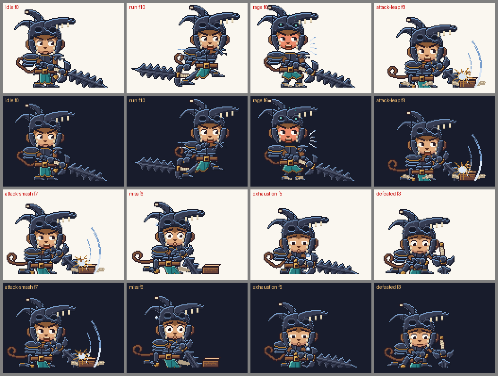
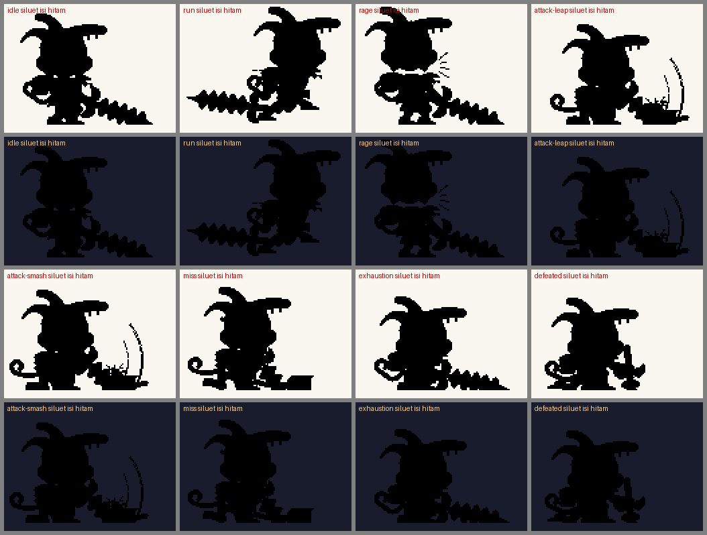

# Berserker Hero: laporan Fase C dan D (delapan state, validasi, preview)

Branch `claude/gobyet-hero` (dari `claude/gobyet-fase2`). Tidak di-merge, `main` tidak disentuh, tidak ada force-push. Repo Bertahan-Bukan-hidup tidak berubah (lihat "Bukti tidak berubah").

**Yang tidak saya klaim:** bahwa gayanya bagus atau disetujui. Itu keputusan pemilik. Semua angka di bawah adalah ukuran heuristik terhadap spesifikasi, bukan penilaian estetika. Hal yang tidak saya buktikan ditulis "tidak terbukti".

**Catatan izin:** Fase B berhenti menunggu persetujuan. Pesan terakhir dari pemilik adalah "gas". Saya menafsirkannya sebagai lampu hijau untuk lanjut ke Fase C dan D dengan gaya Fase B, bukan sebagai persetujuan gaya akhir. Kalau tafsir itu salah, semua isi laporan ini tetap hanya usulan.

## 1. Ringkasan

- Delapan state selesai dan terekspor: `idle` 12, `run` 12, `rage` 12 (tidak loop), `attack-leap` 14, `attack-smash` 12, `miss` 10, `exhaustion` 12, `defeated` 14 frame. Kanvas 128×96, GIF ×4 (512×384).
- Validator penuh `python3 src/validate_pack.py --gate K`: **HASIL: LULUS** (kode keluar 0). Pemeriksaan hash lama: 27 + 89 + 242 identik, 0 berubah.
- Uji: `python3 -m unittest src/test_validate_pack.py`: 29 lulus. `node --test pack/resolver.test.js`: 24 lulus. `node tools/e2e_preview.js`: LULUS (0 error konsol, 0 request gagal, mode statis = frame kunci per piksel, 0 px scroll horizontal di ponsel 390 px).
- Ekspor penuh dari kode (`python3 src/export.py`, 6 menit 27 detik) lalu `git status`: **0** file `gif/` dan `sheets/` lama berubah; hanya berkas hero dan manifest yang berbeda.
- Palet seluruh karakter 26 warna (batas 28). Setiap GIF ≤ 129 KB (batas 200 KB). Total GIF + sheet hero 1.014.303 B (batas 1.572.864 B).
- Pose kunci `idle` f0 dan `attack-smash` f7 identik piksel dengan pose Fase B yang Anda lihat (hash sama). Pose kunci `run` **tidak** identik (lihat bagian 6).

## 2. Tabel aset

Durasi per frame dalam ms. Ukuran = GIF / sheet 1×. Lembar kontak bernomor ada di bagian 3.

| State | Frame | Loop | Durasi per frame | Total | Kunci | Ukuran | Isi |
|---|---:|---|---|---:|---|---|---|
| `idle` | 12 | ya | 240, 140, 140, 160, 160, 200, 180, 160, 90, 140, 160, 180 | 1950 ms | f0 | 109.0 KB / 9.9 KB | berdiri tegak, ujung pedang di lantai, napas, tabard bergoyang, berkedip |
| `run` | 12 | ya | 70, 80, 70, 60, 100, 60, 70, 80, 70, 60, 100, 60 | 880 ms | f10 | 110.0 KB / 14.7 KB | lari condong ke depan; kontak, serap, lintas, dorong, melayang; debu, garis kecepatan |
| `rage` | 12 | **tidak** | 200, 140, 140, 180, 70, 90, 110, 70, 70, 70, 120, 400 | 1660 ms | f6 | 110.7 KB / 16.7 KB | mengumpulkan amarah lalu meledak; wajah merah, titik teal di rongga mata, tabard mengembang, debu bergetar |
| `attack-leap` | 14 | ya | 140, 130, 60, 60, 120, 50, 40, 40, 260, 130, 110, 100, 100, 130 | 1470 ms | f8 | 128.7 KB / 25.1 KB | jongkok, lompat, tebas turun dengan smear, mendarat dan menghantam balok kayu |
| `attack-smash` | 12 | ya | 120, 100, 120, 180, 50, 40, 40, 240, 120, 100, 100, 140 | 1350 ms | f7 | 108.8 KB / 20.6 KB | antisipasi, ayunan dengan smear, tumbukan ditahan ke balok kayu, serpihan dan debu |
| `miss` | 10 | ya | 140, 100, 130, 50, 40, 200, 220, 240, 140, 140 | 1400 ms | f6 | 90.1 KB / 17.5 KB | ayunan meleset, pedang menancap lantai di depan balok, kehilangan keseimbangan, malu |
| `exhaustion` | 12 | ya | 200, 150, 150, 170, 220, 260, 220, 150, 90, 150, 170, 200 | 2130 ms | f5 | 100.4 KB / 9.1 KB | bungkuk, dada naik turun dua kali per putaran, mata sayu, napas dan keringat |
| `defeated` | 14 | ya | 200, 180, 180, 200, 200, 220, 200, 160, 120, 180, 200, 200, 200, 200 | 2640 ms | f3 | 109.7 KB / 9.5 KB | berlutut bertumpu pada pedang yang menancap, kepala tertunduk, napas pelan |

Semua state: durasi tidak seragam (≥ 3 nilai berbeda, diperiksa V11), pose kunci ditahan lebih lama. Frame tumbukan serangan ditahan ≥ 1,5 × median durasi (`attack-leap` f8 260 ms, `attack-smash` f7 240 ms, `miss` f6 220 ms; diperiksa V11).

## 3. Bukti visual

Semua gambar di `pack/reports/hero-fase-cd/`. Latar terang dan gelap, 2×, frame bernomor dengan durasi, frame kunci berbingkai biru.

| Gambar | Isi |
|---|---|
| `kunci-8-state.png` | delapan frame kunci, latar terang dan gelap |
| `siluet-kunci.png` | siluet isi hitam delapan frame kunci, latar terang dan gelap |
| `kontak-<state>.png` dan `kontak-<state>-gelap.png` | semua frame tiap state (16 gambar): `idle`, `run`, `rage`, `attack-leap`, `attack-smash`, `miss`, `exhaustion`, `defeated` |
| `e2e/hero-light.png`, `e2e/hero-dark.png` | tangkapan layar bagian "Berserker Hero" di preview desktop, latar terang dan gelap |
| `e2e/hero-phone.png` | bagian yang sama di ponsel 390 px (strip frame menggulir mendatar di dalam kotaknya) |





Preview: `pack/preview.html` (bagian "Berserker Hero: lembar kontak per state") punya pemutar 2× per state, semua frame berurutan, bernomor, 2×, bisa digulir mendatar; pilihan latar terang atau gelap; tombol Statis menampilkan frame kunci.

## 4. Validasi (keluaran mentah)

Berkas lengkap: `pack/reports/hero-fase-cd/validasi-penuh.txt` (518 baris), `unittest.txt`, `node-test.txt`, `e2e/e2e.json`. Cuplikan di bawah disalin tanpa diubah dari `validasi-penuh.txt`.

### V1: hash aset yang dikunci

```
[V1] Hash aset yang dikunci dan aset yang sudah dibuat
  sha256-asli.txt: 27 identik, 0 berubah/hilang
  sha256-disetujui.txt: 89 identik, 0 berubah/hilang
  sha256-dibuat.txt: 242 identik, 0 berubah/hilang
  sha256-hero.txt: 16 identik, 0 berubah/hilang
```

### V2 dan V3: manifest, schema (termasuk `canvas`), palet, alfa, kanvas, isi GIF

```
[V2] Manifest dan schema, [V3] palet, kanvas, alfa, isi GIF
  33 kostum, 19 state, 171 sel berlaku, 171 sel terisi; 0 gagal
```

V3 per sel hero memeriksa: sheet berukuran 128×96 × jumlah frame, GIF 512×384, isi tiap frame GIF = frame sheet, alfa hanya 0 dan 255, warna hanya dari palet yang diizinkan, GIF `loop=false` tanpa blok loop. Warna seluruh karakter: 26 (batas 28), dihitung di V11 di bawah.

### V4: seam loop (baris hero)

```
[V4] Loop seam (piksel berbeda; seam = frame terakhir -> frame pertama)
  ambang = 1.25 x selisih maksimum antar-frame berurutan di aset itu sendiri
  SEAM-POP (peringatan) = seam >= 0.9 x maks dan maks > 100 px; seam/med = seam dibagi median langkah internal
  sel                        status     maks median  ambang   seam seam/med  hasil
  berserker-hero/idle        baru       2015    113  2518.8    126     1.12  lulus
  berserker-hero/run         baru       3747   3464  4683.8   3679     1.06  lulus; SEAM-POP PERINGATAN
  berserker-hero/rage        baru     tidak loop (loop=false), seam tidak berlaku
  berserker-hero/attack-leap baru       4262   3348  5327.5   3145     0.94  lulus
  berserker-hero/attack-smash baru       3564   3022  4455.0   1926     0.64  lulus
  berserker-hero/miss        baru       3679   3269  4598.8   1893     0.58  lulus
  berserker-hero/exhaustion  baru       1856   1749  2320.0    165     0.09  lulus
  berserker-hero/defeated    baru       1877    102  2346.2     57     0.56  lulus
  SEAM-POP: 29 sel (5 terkunci = DIKETAHUI, 24 baru = PERINGATAN): normal/dance-a, hacker/defeated, champion/dance-a, gamer/dance-a, normal-gblk/dance-a, normal-gblk/dance-b, normal-gblk/dance-c, viking/idle, viking/dance-a, pirate/dance-a, wizard/thinking, knight-heavy/idle, knight-archer/idle, knight-manatarms/idle, knight-assassin/idle, viking-berserker/idle, viking-huscarl/idle, viking-gestir/idle, viking-bondi/idle, pirate-captain/idle, pirate-skirmisher/idle, pirate-sharpshooter/idle, pirate-buccaneer/idle, berserker-hero/run
```

`rage` tidak loop, jadi tidak punya seam. Selain itu V11 memeriksa lebih ketat dari V4: seam ≤ langkah terbesar antar-frame berurutan (lihat V11). **Peringatan SEAM-POP untuk `berserker-hero/run`** (seam 3679 ≥ 0,9 × maks 3747): terjadi karena gerak lari seragam (median langkah 3464, seam/median 1,06), bukan karena lonjakan di sambungan. Peringatan itu tidak menggagalkan apa pun; saya melaporkannya apa adanya.

### V5b: defeated vs idle pada kostum yang sama (≤ 0,85)

```
  b) defeated vs idle pada kostum yang sama (<= 0,85)
    berserker-hero       0.50  lulus
```

### V11: pemeriksaan khusus Berserker Hero

```
[V11] Berserker Hero (kanvas 128x96, GIF x4): spesifikasi, aset = kode, wajah, kepala, 4.4, seam, warna, kontras
  state         frame loop  kanvas skala kunci GIF KB    temuan
  idle             12 ya    128x96     4 0     109.0     lulus
      wajah min 179 px, terlihat 1.00 dari acuan; tinggi kepala 48-48 px (langkah 0.0%, rentang 0.0%); seam 126 <= langkah maks 2015
      kunci f0: helm 65x47, moncong 34x14, tanduk [21.9, 21.9] px, rongga mata [(7, 6), (7, 7)], gigi 6 (lebar [2]), pelat bahu [38, 45, 139]
  run              12 ya    128x96     4 10    110.0     lulus
      wajah min 161 px, terlihat 1.00 dari acuan; tinggi kepala 49-49 px (langkah 0.0%, rentang 0.0%); seam 3679 <= langkah maks 3747; IoU run berurutan maks 0.86
      kunci f10: helm 65x49, moncong 34x14, tanduk [21.9, 21.9] px, rongga mata [(7, 6), (7, 7)], gigi 6 (lebar [2]), pelat bahu [18, 24, 98]
  rage             12 tidak 128x96     4 6     110.7     lulus
      wajah min 173 px, terlihat 1.00 dari acuan; tinggi kepala 49-49 px (langkah 0.0%, rentang 0.0%); tidak loop; frame marah f4-f11
      kunci f6: helm 65x49, moncong 34x14, tanduk [21.9, 21.9] px, rongga mata [(7, 6), (7, 7)], gigi 6 (lebar [2]), pelat bahu [39, 48, 139]
  attack-leap      14 ya    128x96     4 8     128.7     lulus
      wajah min 173 px, terlihat 1.00 dari acuan; tinggi kepala 48-49 px (langkah 2.0%, rentang 2.0%); seam 3145 <= langkah maks 4262; smear sebelum tumbukan f[6, 7], frame tumbukan 260 ms (median 105)
      kunci f8: helm 65x49, moncong 34x14, tanduk [21.9, 21.9] px, rongga mata [(7, 6), (7, 7)], gigi 6 (lebar [2]), pelat bahu [38, 45, 130]
  attack-smash     12 ya    128x96     4 7     108.8     lulus
      wajah min 173 px, terlihat 1.00 dari acuan; tinggi kepala 48-49 px (langkah 2.0%, rentang 2.0%); seam 1926 <= langkah maks 3564; smear sebelum tumbukan f[5, 6], frame tumbukan 240 ms (median 110)
      kunci f7: helm 65x49, moncong 34x14, tanduk [21.9, 21.9] px, rongga mata [(7, 6), (7, 7)], gigi 6 (lebar [2]), pelat bahu [38, 45, 130]
  miss             10 ya    128x96     4 6     90.1      lulus
      wajah min 150 px, terlihat 1.00 dari acuan; tinggi kepala 48-49 px (langkah 2.0%, rentang 2.0%); seam 1893 <= langkah maks 3679; smear sebelum tumbukan f[3, 4], frame tumbukan 220 ms (median 140)
      kunci f6: helm 65x49, moncong 34x14, tanduk [21.9, 21.9] px, rongga mata [(7, 6), (7, 7)], gigi 6 (lebar [2]), pelat bahu [38, 45, 131]
  exhaustion       12 ya    128x96     4 5     100.4     lulus
      wajah min 206 px, terlihat 1.00 dari acuan; tinggi kepala 49-49 px (langkah 0.0%, rentang 0.0%); seam 165 <= langkah maks 1856
      kunci f5: helm 65x49, moncong 34x14, tanduk [21.9, 21.9] px, rongga mata [(7, 6), (7, 7)], gigi 6 (lebar [2]), pelat bahu [39, 48, 95]
  defeated         14 ya    128x96     4 3     109.7     lulus
      wajah min 187 px, terlihat 1.00 dari acuan; tinggi kepala 49-49 px (langkah 0.0%, rentang 0.0%); seam 57 <= langkah maks 1877
      kunci f3: helm 65x49, moncong 34x14, tanduk [21.9, 21.9] px, rongga mata [(7, 6), (7, 7)], gigi 6 (lebar [2]), pelat bahu [38, 45, 109]
  warna seluruh karakter: 26 (batas 28); di luar palet yang diizinkan: 0
  bilah (digambar sendiri, tanpa rotasi): terlebar 16 px, luk per sisi [5, 5], amplitudo luk terkecil 4 px
  kontras luminans WCAG (rasio; laporan, bukan lulus/gagal) terhadap latar terang (250, 247, 240) dan gelap (24, 28, 44):
    o2   garis tepi besi      terang 16.19:1   gelap  1.02:1
    o1   garis tepi organik   terang 15.46:1   gelap  1.02:1
    is   besi bayangan        terang 14.36:1   gelap  1.10:1
    ib   besi tengah          terang 10.20:1   gelap  1.55:1
    il   besi terang          terang  5.68:1   gelap  2.78:1
    rm   rim light baja-biru  terang  2.60:1   gelap  6.09:1
  PERINGATAN: garis tepi besi hampir menyatu dengan latar gelap (1.02:1); keterbacaan siluet di latar gelap bergantung pada rim light dan isi besi terang
  V11: lulus
```

Yang diperiksa V11 (kode di `src/validate_pack.py` `check_hero`, `hero_findings`; pengukuran di `src/hero_check.py`): spesifikasi 8 state dan jumlah frame/loop/kanvas/skala; palet ≤ 28 warna; setiap frame sheet identik piksel dengan render ulang dari kode; durasi tidak seragam; wajah, mata, hidung/mulut, dan telinga terlihat penuh di setiap frame (dibandingkan dengan kepala digambar sendirian di pose yang sama: 1,00 di semua frame); tinggi kotak kepala berubah ≤ 10% antar-frame dan sepanjang state (hasil terburuk 2,0%); tidak ada warna merah wajah di luar wajah dan mulut; wajah merah dan titik teal rongga mata hanya di `rage`; seam ≤ langkah terbesar; siluet `run` berurutan IoU ≤ 0,90 (terburuk 0,86); serangan punya 1-2 frame smear sebelum tumbukan, frame tumbukan ditahan, serpihan dan debu di sana; batas keterbacaan 4.4 di frame kunci; kontras luminans dilaporkan.

Kontras (rasio luminans WCAG, dilaporkan, bukan lulus/gagal): garis tepi besi `o2` terhadap latar terang 16,19:1 dan terhadap latar gelap **1,02:1**; rim light baja-biru `rm` terhadap latar gelap 6,09:1 dan terhadap latar terang 2,60:1. Artinya di latar gelap garis tepi hitam menyatu dengan latar dan siluet hanya terbaca lewat rim light dan isi besi yang lebih terang. Itu konsekuensi langsung dari karakter berzirah hitam; lihat bagian 7.

### V10: ukuran

```
[V10] Ukuran
  GIF pra-Fase 2 terbesar: 171429 byte (batas per GIF baru, dihitung setelah optimize)
  gerbang A:  2 aset, GIF terbesar 111960 byte, total file   222284 byte
  gerbang B:  8 aset, GIF terbesar 111841 byte, total file   858967 byte
  gerbang C:  9 aset, GIF terbesar 136520 byte, total file  1004656 byte
  gerbang D:  6 aset, GIF terbesar 124003 byte, total file   642031 byte
  gerbang E: 10 aset, GIF terbesar 115337 byte, total file   977908 byte
  gerbang G: 15 aset, GIF terbesar  95216 byte, total file  1224060 byte
  gerbang H: 24 aset, GIF terbesar 106870 byte, total file  1898721 byte
  gerbang I: 10 aset, GIF terbesar 115568 byte, total file   953349 byte
  gerbang J: 36 aset, GIF terbesar 106520 byte, total file  2816640 byte
  gerbang F: 36 aset, GIF terbesar  98384 byte, total file  2694681 byte
  gerbang K:  8 aset, GIF terbesar 131783 byte, total file  1014303 byte
  hero: 8 aset, GIF terbesar 131783 byte (batas 204800), total GIF + sheet 1014303 byte (batas 1572864)
  sel berlaku 171, terisi 171, tersisa 0
  rata-rata per aset profil baru: GIF 80396 byte, sheet 3890 byte (145 aset)
             dd78be8   sekarang  pertambahan proyeksi akhir
  GIF        3029800   14687353     11657553       11657553
  sheet       365586     929726       564140         564140
  proyeksi pertambahan total: 12221693 byte (11.66 MB); ambang peringatan 15 MB, batas keras 16 MB
  opsi D (GIF aset baru dibuat saat rilis, tidak disimpan): hemat 11657553 byte sekarang, 11657553 byte di akhir
```

Anggaran "total pack ≤ 16 MB": saya memakai ukuran anggaran proyek yang sudah ada, yaitu pertambahan `gif/` + `sheets/` sejak `dd78be8` (ambang peringatan 15 MB, batas keras 16 MB): **11.657.553 + 564.140 = 12.221.693 B (11,66 MB)** dan semua 171 sel sudah terisi, jadi proyeksi = nyata. Ukuran absolut `gif/` + `sheets/` sekarang 15.617.079 B (14,89 MiB). Bila "total pack" yang dimaksud adalah seluruh pohon `pack/` ditambah `gif/` dan `sheets/` (termasuk laporan dan gambar bukti), jumlahnya sekitar 17,2 MB dan **melewati 16 MB**; tafsir mana yang dimaksud, saya tidak tahu (lihat bagian 6).

### Uji unit, resolver, browser

```
python3 -m unittest src/test_validate_pack.py   ->  Ran 29 tests in 129.017s  OK
node --test pack/resolver.test.js               ->  # tests 24  # pass 24  # fail 0
node tools/e2e_preview.js                        ->  E2E: LULUS
```

Rincian e2e (`e2e/e2e.json`): 0 error konsol dan 0 request gagal di desktop dan ponsel; kanvas mode statis 591 diperiksa per piksel terhadap frame kunci (24 di antaranya kanvas hero 128×96), 0 selisih; lembar kontak hero: 8 state, jumlah frame sama dengan manifest, berurutan, bernomor, 2× (256×192 piksel layar), sama dengan sheet per piksel; pilihan latar terang `rgb(250, 247, 240)` dan gelap `rgb(24, 28, 44)` bekerja; GIF hero termuat 512×384 di browser; strip frame bisa digulir di ponsel (324 px lebar kotak, digeser 400 px) tanpa scroll horizontal halaman (`scrollWidth - innerWidth` = 0 sebelum dan sesudah).

Kontrol negatif (membuktikan pemeriksaan bisa gagal): (1) e2e dengan gambar lembar kontak digeser 1 piksel gagal ("beda piksel" di semua state); (2) `hero_findings` pada sheet yang dirusak satu piksel melaporkan "frame sheet beda dari render kode", pada durasi seragam melaporkan "durasi hampir seragam", dan kepala yang ditutup melaporkan mata 31 dari 64 piksel terlihat.

### Bukti aset lama tidak berubah

- V1 di atas: 27 + 89 + 242 + 16 hash identik.
- Ekspor penuh dari kode saat ini (`python3 src/export.py`, semua animasi, 6 menit 27 detik) lalu `git status`: 0 file `gif/` atau `sheets/` yang sudah dilacak berubah, dan `pack/manifest.json` sama dengan yang di-commit (sebelum hero diekspor ulang dengan perubahan akhir). Setelah itu hanya `berserker-hero-attack-leap` dan `-attack-smash` (dan manifest) berubah karena perubahan akhir hero.
- Selisih terhadap basis `claude/gobyet-fase2` (`git diff --name-status b213be8..HEAD -- gif sheets`): 16 baris, semuanya `A` (berkas hero baru); tidak ada `M` atau `D`.
- `requirements.txt` tidak berubah; tidak ada dependensi baru.
- Bukti tidak berubah untuk Bertahan-Bukan-hidup: pohon kerja bersih (`git status --short` kosong), `HEAD` `696605e` (kepala PR [kanku-Oiric/Bertahan-Bukan-hidup#6](https://github.com/kanku-Oiric/Bertahan-Bukan-hidup/pull/6)), `git diff --stat 696605e HEAD` kosong. Pekerjaan hero tidak membuka repo itu.

### Diff stat

Terhadap basis hero (`claude/gobyet-fase2`, `git diff --stat b213be8..HEAD`, sebelum commit dokumentasi dan laporan ini): `43 files changed, 3440 insertions(+), 83 deletions(-)`; di dalamnya 16 aset hero baru, 8 berkas kode baru atau diubah di `src/`, `tools/`, `pack/`. Terhadap `main` (`git diff --stat main..HEAD`): `1410 files changed, 41381 insertions(+), 255 deletions(-)`; hampir seluruhnya adalah pekerjaan Fase 2 dan v2 yang sudah ada di `claude/gobyet-fase2`, bukan pekerjaan hero. Angka akhir setelah commit ada di bagian paling bawah.

## 5. Perubahan rig dan pipeline (semuanya aditif)

| Berkas | Perubahan |
|---|---|
| `src/monkey.py` (Fase B) | `Canvas(w=None, h=None)` (bawaan `W`, `H` = 64×48), `PAL_HERO = {}` dan `rgb()` mencari PAL, PAL_EXT, PAL_HERO. `Canvas()`, `W`, `H` tidak berubah. |
| `src/hero.py` | Rig hero baru. Fase C menambah opsi pose `legs_front`, `toe_l`, `toe_r` (nilai bawaan tidak mengubah piksel; hash tiga pose kunci Fase B tetap sama, diuji), `flare` pada tabard, balok kayu, efek roar/sweat/breath/teal-spark, dan penanda bagian `smear` (hanya peta pemilik, piksel tidak berubah). |
| `src/hero_scenes.py` | Tabel pose per frame, interpolasi smoothstep, pembulatan ke piksel utuh, durasi, efek; `SCENES` dan `META` 8 state. |
| `src/pack.py` | Kostum `berserker-hero` (group `fantasy`, `base: viking-berserker`), 6 state baru di `STATE_IDS`, `APPLIES`, 8 entri `NEW` gerbang `K`, `CANVAS_OF`, `NO_LOOP`, `canvas_of()`, `loops()`; field per sel `canvas`, `gif_scale`, `loop: false` ditulis hanya untuk hero. |
| `src/export.py` | `indexed()` memakai ukuran kanvas animasi; skala GIF per animasi; GIF `loop=false` tanpa blok loop; `PAL_HERO` di urutan palet lokal; `hero_scenes` di `all_scenes`; argumen awalan nama untuk ekspor sebagian. |
| `src/validate_pack.py`, `src/hero_check.py` | V1-V10 sadar kanvas dan skala per sel, `--hero-only`, V11 baru. |
| `pack/resolver.js` | `canvasOf`, `gifScaleOf`, `validCanvas`; sel dengan `canvas`/`gif_scale` rusak dilewati. Rantai fallback tidak berubah. |
| `pack/preview.html`, `tools/e2e_preview.js` | Kanvas per sel, bagian lembar kontak hero, pilihan latar, hero tidak ikut tes buta. |
| `pack/sha256-hero.txt`, `tools/hero_hashes.py` | Kunci hash hero, berkas terpisah. `sha256-asli.txt`, `-disetujui.txt`, `-dibuat.txt` tidak disentuh. |
| `pack/manifest.json` | Diperiksa dengan skrip: semua sel lama dan entri kostum lama identik; yang bertambah hanya kostum, 8 sel hero, 6 state baru, dan daftar `costumes` pada state `defeated` dan `victory` (victory kini memakai allowlist karena hero tidak punya victory). |

Fallback hero: `berserker-hero` punya `idle`, jadi state yang tidak ada (mis. `victory`) jatuh ke `costume+idle` (idle hero), bukan ke `viking-berserker`. Fallback ke `viking-berserker` hanya terjadi bila hero tidak punya idle; itu diuji dengan fixture di `resolver.test.js`.

## 6. Tebakan dan ketidakpastian

1. **Tafsir "gas".** Saya anggap lampu hijau lanjut Fase C dan D, bukan persetujuan gaya. Tidak terbukti bahwa itu maksud Anda.
2. **Pose kunci `run` berbeda dari pose Fase B.** Pose Fase B memajukan kaki kanan bersama tangan kanan (ipsilateral). Di siklus lari saya, kaki kiri memimpin saat tangan kanan mengepal ke depan (kontralateral), kepala digambar di depan lengan supaya wajah tidak tertutup, dan ada debu dan garis kecepatan. `idle` f0 dan `attack-smash` f7 tetap identik dengan Fase B (hash sama). Anda mungkin menyetujui pose run yang lama, bukan yang ini.
3. **Pose `miss` kunci f6**, bukan f5: f6 (kehilangan keseimbangan, mata lebar, keringat) menurut saya lebih mewakili "meleset", dan ditahan 220 ms. Pilihan saya, bisa dibalik.
4. **Huruf gerbang `K`** dan nama state `attack-leap`, `attack-smash`, `exhaustion` saya ambil dari spesifikasi; huruf `K` pilihan saya.
5. **"Tanduk ≥ 14 px melengkung"** saya ukur sebagai jarak terjauh dua piksel dalam komponen tanduk yang terlihat (21,9 px untuk kedua tanduk), bukan panjang busur tervisualisasi. Panjang busur desain (Fase B) lebih besar. Bila yang dimaksud panjang busur terlihat, angkanya tidak diukur ulang di V11.
6. **Batas 4.4 hanya diukur di frame kunci** (V11). Skrip sekali pakai (bukan bagian validator) menunjukkan gigi terlihat ≥ 6 di semua frame semua state pada aset akhir (minimum 6 di kedelapan state), tetapi itu tidak dijaga validator.
7. **Siluet isi hitam "memperlihatkan tanduk, moncong, dan bilah bergelombang":** tanduk dan moncong terlihat di semua delapan siluet; bilah bergelombang terlihat di `idle`, `run`, `rage`, `attack-leap`, `attack-smash`, `exhaustion`; di `miss` dan `defeated` bilah sebagian besar tertancap di lantai (dipotong garis tanah) sehingga hanya pangkalnya yang terlihat. Ini penilaian mata saya terhadap `siluet-kunci.png`, tidak ada ukuran otomatisnya.
8. **Pemutaran GIF sekali (`rage`)**: GIF diekspor tanpa blok loop (Pillow: `info["loop"]` kosong) dan termuat 512×384 di browser. Bahwa penampil tertentu berhenti di frame terakhir tidak saya uji (preview memakai sheet dan `frameAt`, bukan `` GIF). Tidak terbukti di penampil nyata.
9. **"Total pack ≤ 16 MB"**: lihat catatan V10. Dengan tafsir anggaran proyek: 11,66 MB dari 16 MB (lulus). Dengan tafsir seluruh pohon `pack/` + `gif/` + `sheets/`: sekitar 17,2 MB (melewati). Saya tidak tahu tafsir mana yang Anda maksud, jadi tidak saya sembunyikan. **Susulan:** pemilik menetapkan definisinya (pertambahan `gif/` + `sheets/` sejak `dd78be8`, seluruh pohon tidak dihitung); lihat `hero-fase-teknis.md`.
10. **Ujung tanduk kiri menyentuh tepi kiri kanvas (x = 0)** di lima frame (`attack-smash` f1-f3, `miss` f1-f2) dan puncak tanduk paling atas berada di y = 2 (`run`, `rage`, `attack-leap`), tidak pernah di baris 0. Saya membuktikan tidak terpotong dengan merender pose yang sama digeser +10 px: piksel paling kiri tetap di x = 0 relatif. Bila Anda menganggap menyentuh tepi itu cacat, perlu kanvas lebih lebar atau pose digeser.
11. **Peringatan SEAM-POP `run`** (bagian V4) adalah sifat gerak seragam, bukan lonjakan; saya tidak mengubah aset demi menghilangkan peringatan, hanya memastikan seam ≤ langkah terbesar (3679 ≤ 3747).
12. **Tidak ada pembanding pihak ketiga.** Keterbacaan "heroik hingga konyol" (ekspresi) saya nilai dari ekspresi wajah di lembar kontak; tidak ada uji pengguna.

## 7. Kelemahan yang saya lihat sendiri

1. **`run` hanya 6 pose berbeda.** Siluet frame i dan i+6 mirip (IoU 0,97-0,99; 0,90 untuk f5 dan f11): paruh kedua siklus adalah cermin kaki dari paruh pertama dengan perbedaan kecil di kepalan, tabard, dan debu. Itu normal untuk lari simetris, tetapi "12 frame" di sini setara 6 pose unik. Dan kaki kiri/kanan tampak kecil di 1×.
2. **Lompatan rendah.** Ruang di atas helm idle hanya sekitar 6 piksel, jadi puncak `attack-leap` hanya terangkat 4-5 piksel; kesan melompat datang dari kaki yang ditekuk, pedang terangkat, dan perpindahan horizontal (9 px, `cx` 35 ke 44), bukan tinggi. Lompatan yang meyakinkan perlu kanvas lebih tinggi (mis. 160×120), yang di luar spesifikasi.
3. **`exhaustion` dan `defeated` menyembunyikan kaki.** Tabard dan rok rantai menutupi paha; berlutut di `defeated` terbaca lemah di 1× (lutut belakang hanya terlihat di lantai, kaki depan tertutup tangan kiri). Kepala besar relatif terhadap badan yang meringkuk. `exhaustion` terbaca "lelah/bingung" lebih dari "kehabisan tenaga"; yang membedakannya dari idle hanya posisi badan, mata sayu, mulut "o", napas, dan keringat.
4. **Garis teriak `rage` tipis** (titik-titik biru pucat di kanan kepala) dan hanya sedikit berbeda antar frame 4-9; getaran terutama dari bergesernya `cx` ±1 dan debu.
5. **Frame windup tidak seluruhnya terlihat.** Di `attack-smash` f2-f4 dan `attack-leap` f3-f5 sebagian bilah tertutup helm (kepala digambar di depan supaya wajah tidak tertutup), jadi pedang terbaca sebagai bentuk di belakang kepala. Bilah juga tidak boleh keluar kanvas, jadi sudut windup dibatasi.
6. **Kontras di latar gelap.** Garis tepi besi 1,02:1 terhadap latar gelap pratinjau; siluet bertumpu pada rim light 1 px dan isi besi terang. Di latar terang kontras tinggi.
7. **Efek debu di `attack-leap` mendekati tepi kanan** (piksel paling kanan x = 123 dari 127), dan balok kayu serta efek berada dekat tepi kanan kanvas; tidak ada ruang tambahan untuk serangan yang lebih jauh.
8. **Gerak sekunder sederhana.** Tabard hanya bergeser dan mengembang; ekor hanya berputar dengan fase; tidak ada kain lain karena jubah dilarang.
9. **Dokumentasi README root** (`README.md` di akar repo) tidak saya ubah: hero belum disetujui, jadi belum ditampilkan di halaman utama. Hanya `pack/README.md`, `pack/STYLE.md`, `pack/PROGRESS.md` yang diperbarui.

## 8. Berkas baru dan diubah di fase ini

`src/hero_scenes.py`, `src/hero_check.py`, `tools/hero_hashes.py`, `tools/hero_phase_d.py`, `pack/sha256-hero.txt`, `pack/reports/hero-fase-cd.md` dan `pack/reports/hero-fase-cd/`, 16 aset `gif/berserker-hero-*.gif` dan `sheets/berserker-hero-*.png`; diubah: `src/hero.py`, `src/pack.py`, `src/export.py`, `src/validate_pack.py`, `src/test_validate_pack.py`, `pack/manifest.json`, `pack/resolver.js`, `pack/resolver.test.js`, `pack/preview.html`, `tools/e2e_preview.js`, `pack/README.md`, `pack/STYLE.md`, `pack/PROGRESS.md`.

## 9. Angka akhir diff (pada commit `1545abf`, sebelum commit yang menambahkan bagian ini)

- `git diff --stat b213be8..HEAD` (basis `claude/gobyet-fase2`, yaitu pekerjaan hero saja): `74 files changed, 5645 insertions(+), 88 deletions(-)`
- `git diff --name-status b213be8..HEAD -- gif sheets`: `16 A` (hanya `A` = berkas hero baru; tidak ada `M` atau `D`)
- `git diff --stat main..HEAD`: `1438 files changed, 43581 insertions(+), 255 deletions(-)` (hampir seluruhnya pekerjaan Fase 2 dan v2 yang sudah ada di `claude/gobyet-fase2`, bukan hero)

Menunggu persetujuan gaya untuk Berserker Hero.
