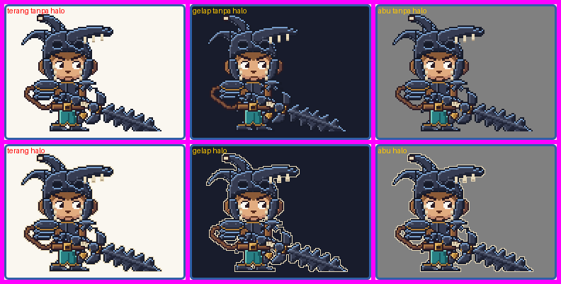

# Berserker Hero: laporan perbaikan teknis (tanpa mengubah gaya)

Branch `claude/gobyet-hero`. Tidak di-merge, `main` tidak disentuh, tidak ada force-push. Aturan keras brief awal tetap berlaku. Format laporan mengikuti bagian 8 brief awal ("LAPORAN (tiap STOP)"); brief awal hanya punya bagian 1-8, jadi permintaan "bagian 12" saya baca sebagai bagian laporan itu.

**Tidak diklaim:** gaya bagus atau disetujui. Itu keputusan pemilik. Hal yang tidak terbukti ditulis "tidak terbukti".

## 1. Ringkasan per permintaan

| # | Permintaan | Hasil | Bukti |
|---|---|---|---|
| 1 | Definisi anggaran | Tertulis di `pack/README.md` (bagian "Anggaran ukuran") dan dicetak di V10. Pertambahan `gif/` + `sheets/` sejak `dd78be8` = **11,66 MB** (12.221.693 B), lulus; ukuran seluruh pohon tidak dihitung. | bagian 4, V10 |
| 2 | Asimetri antar-frame | Dibuktikan: **0 frame ditandai**; bahu 3 pelat, tanduk patah (dan bahu kecil, ekor, moncong) tetap di sisinya, gesper di tengah dengan sorot di kiri, di paruh pertama dan kedua `run`. **Tidak ada elemen pindah sisi, jadi tidak ada aset yang diperbaiki** dan tidak ada tampilan sebelum/sesudah untuk bagian ini. Uji unit: sprite sintetik dan frame hero yang dicerminkan ditandai, yang tidak dicerminkan lolos. | bagian 3, `asimetri.txt` |
| 3 | Seam | `berserker-hero/run` dikecualikan dari SEAM-POP dengan alasan tertulis (gerak seragam), hanya bila datanya seragam. Metrik pelengkap seam/median dilaporkan (run 1,06). Aset tidak diubah. | bagian 4, V4 |
| 4 | Latar gelap | Preview: latar abu tengah `#808080` dan tombol Halo (drop-shadow krem 1 px). Kontras tepi besi terhadap empat latar, dengan dan tanpa halo, dilaporkan dan diukur dari render. Rekomendasi Fase 3 ditulis di README. Aset tidak diubah. | bagian 5 |
| 5 | GIF tanpa loop (`rage`) | Frame terakhir ditahan 1500 ms (400 → 1500; total 1660 → 2760 ms). Hanya durasi frame 11 yang berubah; piksel semua frame identik. Preview: indikator "diputar sekali" dan tombol Putar ulang. README mencatat perilaku penampil dan mana yang belum diuji. | bagian 6 |
| 6 | Laporan | Dokumen ini, dengan bukti hash dan keluaran seluruh validator. | bagian 2, 4, 7 |

## 2. Bukti hash

**Aset lama (358 berkas):** V1 pada validator penuh: `sha256-asli.txt` 27 identik, `sha256-disetujui.txt` 89 identik, `sha256-dibuat.txt` 242 identik, 0 berubah/hilang. Ekspor penuh dari kode saat ini (`python3 src/export.py`, semua animasi) lalu `git status`: **0** berkas `gif/` atau `sheets/` lama berubah; satu-satunya berkas aset yang berbeda dari commit sebelumnya (`39365b7`) adalah `gif/berserker-hero-rage.gif` (`git diff --name-status 39365b7..HEAD -- gif sheets` = satu baris `M`). Sheet semua state hero, termasuk `rage`, identik byte.

**Aset hero (16 berkas), sebelum (`39365b7`) dan sesudah:**

| Berkas | SHA-256 sebelum | SHA-256 sesudah | Status |
|---|---|---|---|
| `gif/berserker-hero-attack-leap.gif` | `72d115a441d3` | `72d115a441d3` | identik |
| `gif/berserker-hero-attack-smash.gif` | `b9f22dda074b` | `b9f22dda074b` | identik |
| `gif/berserker-hero-defeated.gif` | `2764ae4bf73d` | `2764ae4bf73d` | identik |
| `gif/berserker-hero-exhaustion.gif` | `233eace495e0` | `233eace495e0` | identik |
| `gif/berserker-hero-idle.gif` | `a9304405d2bc` | `a9304405d2bc` | identik |
| `gif/berserker-hero-miss.gif` | `5faf6218b340` | `5faf6218b340` | identik |
| `gif/berserker-hero-rage.gif` | `01465308ab0b` | `1aa26e6984e1` | **BERUBAH** (durasi frame 11 rage) |
| `gif/berserker-hero-run.gif` | `a58a1eeff7be` | `a58a1eeff7be` | identik |
| `sheets/berserker-hero-attack-leap.png` | `0cd3fad8080c` | `0cd3fad8080c` | identik |
| `sheets/berserker-hero-attack-smash.png` | `3b838b30925d` | `3b838b30925d` | identik |
| `sheets/berserker-hero-defeated.png` | `5ae9f7b04bd3` | `5ae9f7b04bd3` | identik |
| `sheets/berserker-hero-exhaustion.png` | `4b594cc5747d` | `4b594cc5747d` | identik |
| `sheets/berserker-hero-idle.png` | `7bb6e67c62bd` | `7bb6e67c62bd` | identik |
| `sheets/berserker-hero-miss.png` | `ea7b0cd2c32c` | `ea7b0cd2c32c` | identik |
| `sheets/berserker-hero-rage.png` | `9054aa776205` | `9054aa776205` | identik |
| `sheets/berserker-hero-run.png` | `ae855cf1de62` | `ae855cf1de62` | identik |

`pack/sha256-hero.txt` berubah satu baris (rage GIF); `python3 tools/hero_hashes.py --check` mengonfirmasi 16 berkas sama dengan berkas kunci. Tiga berkas kunci lama tidak disentuh.

`pack/manifest.json`: satu-satunya perbedaan nilai terhadap sebelumnya adalah `cells.berserker-hero.rage.durations_ms` (elemen terakhir 400 → 1500).

### Rage sebelum / sesudah (durasi dalam ms; piksel frame dibandingkan dari GIF hasil decode)

| Frame | 0 | 1 | 2 | 3 | 4 | 5 | 6 | 7 | 8 | 9 | 10 | 11 | Total |
|---|---|---|---|---|---|---|---|---|---|---|---|---|---:|
| sebelum | 200 | 140 | 140 | 180 | 70 | 90 | 110 | 70 | 70 | 70 | 120 | 400 | 1660 |
| sesudah | 200 | 140 | 140 | 180 | 70 | 90 | 110 | 70 | 70 | 70 | 120 | **1500** | 2760 |
| piksel identik | ya | ya | ya | ya | ya | ya | ya | ya | ya | ya | ya | ya | |

Frame yang durasinya berbeda: hanya f11. Loop sebelum dan sesudah: tidak ada blok loop (`None`).

## 3. Asimetri antar-frame (bagian 2)

Pengukuran (`src/hero_check.py` `asymmetry`, `tools/hero_asymmetry.py`): untuk tiap frame tiap state, centroid x piksel elemen (dari peta pemilik piksel: hanya piksel yang terlihat) dikurangi titik tengah badan (`hero.geometry` `tcx` pose itu). dx < 0 = kiri, dx > 0 = kanan. Frame ditandai bila tanda sisi salah atau berubah, kecuali pose berbalik arah eksplisit (`EXPLICIT_TURNS`; rig hero tidak punya pose berbalik, jadi daftarnya kosong).

Rentang dx per elemen di seluruh frame (dari V11; tabel per frame di `asimetri.txt`):

| State | Pelat bahu 1 / 2 / 3 | Gesper (posisi; sorot-bayangan) | Tanduk patah | Bahu kecil | Ekor | Moncong | Ditandai |
|---|---|---|---|---|---|---|---:|
| `idle` | -18.0..-18.0 / -16.8..-16.8 / -14.6..-14.6 | -0.2..+0.0; -2.0..-2.0 | -18.9..-18.9 | +13.2..+13.4 | -22.3..-21.7 | +14.2..+14.2 | 0 |
| `run` | -17.7..-14.1 / -18.5..-15.8 / -17.1..-15.9 | +0.0..+0.0; -2.0..-2.0 | -15.9..-15.9 | +13.4..+13.5 | -28.1..-24.9 | +17.2..+17.2 | 0 |
| `rage` | -18.0..-17.7 / -16.8..-16.7 / -15.7..-14.5 | -0.2..+1.0; -2.4..-2.0 | -21.4..-17.9 | +13.0..+15.1 | -22.6..-20.2 | +11.7..+15.2 | 0 |
| `attack-leap` | -18.0..-12.0 / -16.8..-10.8 / -15.2..-8.7 | -0.4..+1.0; -2.4..-1.8 | -19.9..-13.9 | +8.7..+19.0 | -27.4..-21.3 | +13.2..+19.2 | 0 |
| `attack-smash` | -18.0..-11.7 / -16.8..-10.7 / -14.8..-8.6 | -0.2..+1.0; -2.7..-2.0 | -19.9..-13.9 | +9.8..+17.7 | -27.4..-21.3 | +13.2..+19.2 | 0 |
| `miss` | -18.0..-12.0 / -16.8..-10.8 / -14.7..-8.8 | -0.2..+1.0; -2.7..-2.0 | -19.9..-12.9 | +9.8..+17.4 | -29.4..-21.3 | +13.2..+20.2 | 0 |
| `exhaustion` | -17.7..-17.6 / -16.7..-15.8 / -16.8..-15.2 | +0.0..+0.1; -2.8..-2.5 | -16.4..-16.4 | +12.5..+14.1 | -24.9..-24.6 | +16.7..+16.7 | 0 |
| `defeated` | -18.0..-17.7 / -16.8..-16.3 / -16.6..-16.1 | -0.7..-0.3; -2.8..-2.5 | -15.9..-15.9 | +13.0..+13.6 | -26.2..-25.5 | +17.2..+17.2 | 0 |

Paruh kedua siklus `run` (f6-f11) dibanding paruh pertama (f0-f5), nilai mentah dari `asimetri.txt`:

```
run (12 frame; ditandai: 0)
  f   tcx  pelat_bahu_1 pelat_bahu_2 pelat_bahu_3       gesper tanduk_patah   bahu_kecil         ekor      moncong  cahaya
  0    84.5         -14.9        -16.2        -17.1         +0.0        -15.9        +13.4        -25.3        +17.2  -2.0
  1    84.5         -14.1        -15.8        -17.1         +0.0        -15.9        +13.4        -28.1        +17.2  -2.0
  2    84.5         -14.9        -16.7        -16.8         +0.0        -15.9        +13.4        -24.9        +17.2  -2.0
  3    84.5         -16.9        -17.5        -16.0         +0.0        -15.9        +13.4        -26.9        +17.2  -2.0
  4    84.5         -17.7        -18.5        -15.9         +0.0        -15.9        +13.5        -26.9        +17.2  -2.0
  5    84.5         -16.8        -18.1        -16.0         +0.0        -15.9        +13.4        -25.9        +17.2  -2.0
  6    84.5         -14.9        -17.0        -16.8         +0.0        -15.9        +13.4        -25.3        +17.2  -2.0
  7    84.5         -14.1        -16.2        -17.0         +0.0        -15.9        +13.4        -28.1        +17.2  -2.0
  8    84.5         -14.9        -16.7        -16.7         +0.0        -15.9        +13.4        -24.9        +17.2  -2.0
  9    84.5         -16.9        -18.1        -16.3         +0.0        -15.9        +13.4        -26.9        +17.2  -2.0
  10   84.5         -17.7        -17.9        -16.6         +0.0        -15.9        +13.5        -26.8        +17.2  -2.0
  11   84.5         -16.2        -17.0        -16.9         +0.0        -15.9        +13.4        -25.5        +17.2  -2.0
```

Semua nilai di paruh kedua bertanda sama dengan paruh pertama. Kaki ditukar fasenya di paruh kedua dan sprite tidak dicerminkan.

Uji unit (`HeroAsymmetry`, 8 uji, semuanya lulus): (a) sprite sintetik tanpa cermin lolos; (b) satu frame sintetik dicerminkan ditandai tepat di frame itu untuk tiga pelat bahu, tanduk patah, dan sorot gesper; (c) pembalikan di paruh kedua siklus (f6-f11) tertangkap; (d) gesper yang bergeser 4 px dari tengah ditandai; (e) pengecualian pose berbalik eksplisit bekerja; (f) mode sisi-tak-diketahui memakai frame terlihat pertama dan melewati frame tersembunyi; (g) frame hero asli (idle f0, run f3 dan f9, attack-smash f7, attack-leap f4, defeated f3) lolos dan versi cerminnya ditandai untuk semua elemen bersisi; (h) setiap frame setiap state hero lolos dan semua elemen terlihat.

## 4. Keluaran validasi mentah

Berkas lengkap: `pack/reports/hero-fase-teknis/validasi-penuh.txt`, `unittest.txt`, `node-test.txt`, `e2e/e2e.json`, `gif-sekali.txt`, `kontras.txt`, `asimetri.txt`. Cuplikan disalin tanpa diubah dari `validasi-penuh.txt` (`python3 src/validate_pack.py --gate K`, kode keluar 0, **HASIL: LULUS**).

### V1

```
[V1] Hash aset yang dikunci dan aset yang sudah dibuat
  sha256-asli.txt: 27 identik, 0 berubah/hilang
  sha256-disetujui.txt: 89 identik, 0 berubah/hilang
  sha256-dibuat.txt: 242 identik, 0 berubah/hilang
  sha256-hero.txt: 16 identik, 0 berubah/hilang
```

### V2 dan V3

```
[V2] Manifest dan schema, [V3] palet, kanvas, alfa, isi GIF
  33 kostum, 19 state, 171 sel berlaku, 171 sel terisi; 0 gagal
```

### V4 (baris hero dan ringkasan SEAM-POP)

```
[V4] Loop seam (piksel berbeda; seam = frame terakhir -> frame pertama)
  sel                        status     maks median  ambang   seam seam/med  hasil
  berserker-hero/idle        baru       2015    113  2518.8    126     1.12  lulus
  berserker-hero/run         baru       3747   3464  4683.8   3679     1.06  lulus; SEAM-POP DIKECUALIKAN (seam/median 1.06 <= 1.25, median/maks 0.92 >= 0.90)
  berserker-hero/rage        baru     tidak loop (loop=false), seam tidak berlaku
  berserker-hero/attack-leap baru       4262   3348  5327.5   3145     0.94  lulus
  berserker-hero/attack-smash baru       3564   3022  4455.0   1926     0.64  lulus
  berserker-hero/miss        baru       3679   3269  4598.8   1893     0.58  lulus
  berserker-hero/exhaustion  baru       1856   1749  2320.0    165     0.09  lulus
  berserker-hero/defeated    baru       1877    102  2346.2     57     0.56  lulus
  SEAM-POP dikecualikan: berserker-hero/run. Alasan: siklus lari bergerak seragam: tiap langkah mengubah hampir seluruh badan, jadi median langkah mendekati langkah terbesar dan seam (frame akhir ke frame pertama) adalah satu langkah biasa, bukan lonjakan di sambungan.
  SEAM-POP: 28 sel (5 terkunci = DIKETAHUI, 23 baru = PERINGATAN), 1 dikecualikan dengan alasan tertulis: normal/dance-a, hacker/defeated, champion/dance-a, gamer/dance-a, normal-gblk/dance-a, normal-gblk/dance-b, normal-gblk/dance-c, viking/idle, viking/dance-a, pirate/dance-a, wizard/thinking, knight-heavy/idle, knight-archer/idle, knight-manatarms/idle, knight-assassin/idle, viking-berserker...
```

Pengecualian SEAM-POP `berserker-hero/run`: siklus lari bergerak seragam, tiap langkah mengubah hampir seluruh badan, jadi median langkah (3464) mendekati langkah terbesar (3747) dan seam (3679) adalah satu langkah biasa; seam/median 1,06, median/maks 0,92. Pengecualian hanya berlaku bila seam/median ≤ 1,25 dan median ≥ 0,9 × maks; kalau datanya tidak seragam, peringatan tetap muncul (diuji `SeamPopExempt`, 5 uji). Daftar pengecualian: `POP_EXEMPT` di `src/validate_pack.py`, hanya satu entri. Peringatan SEAM-POP sel non-hero (23 baru) tidak disentuh dan bukan bagian tugas ini.

### V5b

```
  b) defeated vs idle pada kostum yang sama (<= 0,85)
    berserker-hero       0.50  lulus
```

### V11 (Berserker Hero)

```
[V11] Berserker Hero (kanvas 128x96, GIF x4): spesifikasi, aset = kode, wajah, kepala, 4.4, seam, warna, kontras
  state         frame loop  kanvas skala kunci GIF KB    temuan
  idle             12 ya    128x96     4 0     109.0     lulus
      asimetri (dx px relatif tengah badan, - kiri / + kanan): pelat bahu 1/2/3 -18.0..-18.0 | -16.8..-16.8 | -14.6..-14.6; gesper -0.2..0.0 (cahaya -2.0..-2.0); tanduk patah -18.9..-18.9; tambahan: bahu kecil 13.2..13.4, ekor -22.3..-21.7, moncong 14.2..14.2; frame ditandai 0
      wajah min 179 px, terlihat 1.00 dari acuan; tinggi kepala 48-48 px (langkah 0.0%, rentang 0.0%); seam 126 <= langkah maks 2015 (seam/median 1.12)
      kunci f0: helm 65x47, moncong 34x14, tanduk [21.9, 21.9] px, rongga mata [(7, 6), (7, 7)], gigi 6 (lebar [2]), pelat bahu [38, 45, 139]
  run              12 ya    128x96     4 10    110.0     lulus
      asimetri (dx px relatif tengah badan, - kiri / + kanan): pelat bahu 1/2/3 -17.7..-14.1 | -18.5..-15.8 | -17.1..-15.9; gesper 0.0..0.0 (cahaya -2.0..-2.0); tanduk patah -15.9..-15.9; tambahan: bahu kecil 13.4..13.5, ekor -28.1..-24.9, moncong 17.2..17.2; frame ditandai 0
      wajah min 161 px, terlihat 1.00 dari acuan; tinggi kepala 49-49 px (langkah 0.0%, rentang 0.0%); seam 3679 <= langkah maks 3747 (seam/median 1.06); IoU run berurutan maks 0.86
      kunci f10: helm 65x49, moncong 34x14, tanduk [21.9, 21.9] px, rongga mata [(7, 6), (7, 7)], gigi 6 (lebar [2]), pelat bahu [18, 24, 98]
  rage             12 tidak 128x96     4 6     110.7     lulus
      asimetri (dx px relatif tengah badan, - kiri / + kanan): pelat bahu 1/2/3 -18.0..-17.7 | -16.8..-16.7 | -15.7..-14.5; gesper -0.2..1.0 (cahaya -2.4..-2.0); tanduk patah -21.4..-17.9; tambahan: bahu kecil 13.0..15.1, ekor -22.6..-20.2, moncong 11.7..15.2; frame ditandai 0
      wajah min 173 px, terlihat 1.00 dari acuan; tinggi kepala 49-49 px (langkah 0.0%, rentang 0.0%); tidak loop; frame marah f4-f11
      kunci f6: helm 65x49, moncong 34x14, tanduk [21.9, 21.9] px, rongga mata [(7, 6), (7, 7)], gigi 6 (lebar [2]), pelat bahu [39, 48, 139]
  attack-leap      14 ya    128x96     4 8     128.7     lulus
      asimetri (dx px relatif tengah badan, - kiri / + kanan): pelat bahu 1/2/3 -18.0..-12.0 | -16.8..-10.8 | -15.2..-8.7; gesper -0.4..1.0 (cahaya -2.4..-1.8); tanduk patah -19.9..-13.9; tambahan: bahu kecil 8.7..19.0, ekor -27.4..-21.3, moncong 13.2..19.2; frame ditandai 0
      wajah min 173 px, terlihat 1.00 dari acuan; tinggi kepala 48-49 px (langkah 2.0%, rentang 2.0%); seam 3145 <= langkah maks 4262 (seam/median 0.94); smear sebelum tumbukan f[6, 7], frame tumbukan 260 ms (median 105)
      kunci f8: helm 65x49, moncong 34x14, tanduk [21.9, 21.9] px, rongga mata [(7, 6), (7, 7)], gigi 6 (lebar [2]), pelat bahu [38, 45, 130]
  attack-smash     12 ya    128x96     4 7     108.8     lulus
      asimetri (dx px relatif tengah badan, - kiri / + kanan): pelat bahu 1/2/3 -18.0..-11.7 | -16.8..-10.7 | -14.8..-8.6; gesper -0.2..1.0 (cahaya -2.7..-2.0); tanduk patah -19.9..-13.9; tambahan: bahu kecil 9.8..17.7, ekor -27.4..-21.3, moncong 13.2..19.2; frame ditandai 0
      wajah min 173 px, terlihat 1.00 dari acuan; tinggi kepala 48-49 px (langkah 2.0%, rentang 2.0%); seam 1926 <= langkah maks 3564 (seam/median 0.64); smear sebelum tumbukan f[5, 6], frame tumbukan 240 ms (median 110)
      kunci f7: helm 65x49, moncong 34x14, tanduk [21.9, 21.9] px, rongga mata [(7, 6), (7, 7)], gigi 6 (lebar [2]), pelat bahu [38, 45, 130]
  miss             10 ya    128x96     4 6     90.1      lulus
      asimetri (dx px relatif tengah badan, - kiri / + kanan): pelat bahu 1/2/3 -18.0..-12.0 | -16.8..-10.8 | -14.7..-8.8; gesper -0.2..1.0 (cahaya -2.7..-2.0); tanduk patah -19.9..-12.9; tambahan: bahu kecil 9.8..17.4, ekor -29.4..-21.3, moncong 13.2..20.2; frame ditandai 0
      wajah min 150 px, terlihat 1.00 dari acuan; tinggi kepala 48-49 px (langkah 2.0%, rentang 2.0%); seam 1893 <= langkah maks 3679 (seam/median 0.58); smear sebelum tumbukan f[3, 4], frame tumbukan 220 ms (median 140)
      kunci f6: helm 65x49, moncong 34x14, tanduk [21.9, 21.9] px, rongga mata [(7, 6), (7, 7)], gigi 6 (lebar [2]), pelat bahu [38, 45, 131]
  exhaustion       12 ya    128x96     4 5     100.4     lulus
      asimetri (dx px relatif tengah badan, - kiri / + kanan): pelat bahu 1/2/3 -17.7..-17.6 | -16.7..-15.8 | -16.8..-15.2; gesper 0.0..0.1 (cahaya -2.8..-2.5); tanduk patah -16.4..-16.4; tambahan: bahu kecil 12.5..14.1, ekor -24.9..-24.6, moncong 16.7..16.7; frame ditandai 0
      wajah min 206 px, terlihat 1.00 dari acuan; tinggi kepala 49-49 px (langkah 0.0%, rentang 0.0%); seam 165 <= langkah maks 1856 (seam/median 0.09)
      kunci f5: helm 65x49, moncong 34x14, tanduk [21.9, 21.9] px, rongga mata [(7, 6), (7, 7)], gigi 6 (lebar [2]), pelat bahu [39, 48, 95]
  defeated         14 ya    128x96     4 3     109.7     lulus
      asimetri (dx px relatif tengah badan, - kiri / + kanan): pelat bahu 1/2/3 -18.0..-17.7 | -16.8..-16.3 | -16.6..-16.1; gesper -0.7..-0.3 (cahaya -2.8..-2.5); tanduk patah -15.9..-15.9; tambahan: bahu kecil 13.0..13.6, ekor -26.2..-25.5, moncong 17.2..17.2; frame ditandai 0
      wajah min 187 px, terlihat 1.00 dari acuan; tinggi kepala 49-49 px (langkah 0.0%, rentang 0.0%); seam 57 <= langkah maks 1877 (seam/median 0.56)
      kunci f3: helm 65x49, moncong 34x14, tanduk [21.9, 21.9] px, rongga mata [(7, 6), (7, 7)], gigi 6 (lebar [2]), pelat bahu [38, 45, 109]
  warna seluruh karakter: 26 (batas 28); di luar palet yang diizinkan: 0
  bilah (digambar sendiri, tanpa rotasi): terlebar 16 px, luk per sisi [5, 5], amplitudo luk terkecil 4 px
  kontras luminans WCAG (rasio; laporan, bukan lulus/gagal) tepi hero terhadap empat latar pratinjau: terang (250, 247, 240), gelap (24, 28, 44), abu tengah (128, 128, 128), halo krem (232, 218, 186)
    kunci                         terang     gelap  abu tengah | dengan halo (tetangga tepi = halo, sama di semua latar)
    o2   garis tepi besi         16.19:1     1.02:1       4.39:1 | 12.51:1
    o1   garis tepi organik      15.46:1     1.02:1       4.19:1 | 11.95:1
    is   besi bayangan           14.36:1     1.10:1       3.89:1 | 11.10:1
    ib   besi tengah             10.20:1     1.55:1       2.76:1 | 7.88:1
    il   besi terang              5.68:1     2.78:1       1.54:1 | 4.39:1
    rm   rim light baja-biru      2.60:1     6.09:1       1.42:1 | 2.01:1
    halo itu sendiri terhadap latar: terang 1.29:1, gelap 12.22:1, abu tengah 2.85:1
  PERINGATAN: garis tepi besi terhadap latar gelap hanya 1.02:1 tanpa halo; dengan halo 12.51:1
  V11: lulus
```

### V10

```
[V10] Ukuran
  definisi anggaran: 'total pack <= 16 MB' = pertambahan gif/ + sheets/ sejak dd78be8 (peringatan 15 MB, batas 16 MB); ukuran seluruh pohon repo tidak dihitung
  GIF pra-Fase 2 terbesar: 171429 byte (batas per GIF baru, dihitung setelah optimize)
  gerbang A:  2 aset, GIF terbesar 111960 byte, total file   222284 byte
  gerbang B:  8 aset, GIF terbesar 111841 byte, total file   858967 byte
  gerbang C:  9 aset, GIF terbesar 136520 byte, total file  1004656 byte
  gerbang D:  6 aset, GIF terbesar 124003 byte, total file   642031 byte
  gerbang E: 10 aset, GIF terbesar 115337 byte, total file   977908 byte
  gerbang G: 15 aset, GIF terbesar  95216 byte, total file  1224060 byte
  gerbang H: 24 aset, GIF terbesar 106870 byte, total file  1898721 byte
  gerbang I: 10 aset, GIF terbesar 115568 byte, total file   953349 byte
  gerbang J: 36 aset, GIF terbesar 106520 byte, total file  2816640 byte
  gerbang F: 36 aset, GIF terbesar  98384 byte, total file  2694681 byte
  gerbang K:  8 aset, GIF terbesar 131783 byte, total file  1014303 byte
  hero: 8 aset, GIF terbesar 131783 byte (batas 204800), total GIF + sheet 1014303 byte (batas 1572864)
  sel berlaku 171, terisi 171, tersisa 0
  rata-rata per aset profil baru: GIF 80396 byte, sheet 3890 byte (145 aset)
             dd78be8   sekarang  pertambahan proyeksi akhir
  GIF        3029800   14687353     11657553       11657553
  sheet       365586     929726       564140         564140
  proyeksi pertambahan total: 12221693 byte (11.66 MB); ambang peringatan 15 MB, batas keras 16 MB
  opsi D (GIF aset baru dibuat saat rilis, tidak disimpan): hemat 11657553 byte sekarang, 11657553 byte di akhir
```

### Uji unit, resolver, browser, GIF

```
python3 -m unittest src/test_validate_pack.py   ->  Ran 44 tests in 158.936s | OK
node --test pack/resolver.test.js               ->  # tests 24  # pass 24  # fail 0
node tools/e2e_preview.js                        ->  E2E: LULUS   (fails: [])
node tools/gif_once_check.js                     ->  GIF-SEKALI: LULUS   (Chromium 141.0.7390.37)
```

Rincian e2e: 0 error konsol dan 0 request gagal di desktop dan ponsel; kanvas mode statis 591 diperiksa per piksel terhadap frame kunci, 0 selisih; 0 px scroll horizontal di ponsel 390 px (sebelum dan sesudah menggulir lembar kontak hero: 0 / 0).

## 5. Latar gelap: halo dan latar abu (bagian 4)

Preview (`pack/preview.html`, bagian "Berserker Hero") sekarang punya latar Terang, Gelap, Abu tengah `#808080`, dan tombol Halo (kontur krem 1 px lewat CSS `filter: drop-shadow` empat arah tanpa blur, warna nada tulang `bb` = #e8daba). Latar dipindah ke pembungkus `.stage`, bukan di kanvas, supaya halo mengikuti siluet sprite dan bukan kotak latar. Aset tidak berubah. Uji browser memeriksa: warna latar komputasi `rgb(250, 247, 240)`, `rgb(24, 28, 44)`, `rgb(128, 128, 128)`; `filter` komputasi `none` tanpa halo dan empat `drop-shadow(rgb(232, 218, 186) ...)` dengan halo; mati kembali saat ditekan lagi.



Rasio kontras luminans WCAG (laporan; `tools/hero_contrast.py`; bagian kedua dihitung dari tangkapan layar Chromium frame idle f0 pada 2×, 1544 pasangan piksel sprite dan tetangga non-sprite per kombinasi):

```
kontras luminans WCAG (rasio) tepi hero terhadap latar; halo = krem (232, 218, 186) (nada tulang bb)
  kunci                         terang     gelap  abu tengah | dengan halo (tetangga tepi = halo, sama di semua latar)
  o2   garis tepi besi         16.19:1     1.02:1       4.39:1 | 12.51:1
  o1   garis tepi organik      15.46:1     1.02:1       4.19:1 | 11.95:1
  rm   rim light baja-biru      2.60:1     6.09:1       1.42:1 | 2.01:1
  halo itu sendiri terhadap latar (terlihat atau tidak): terang 1.29:1, gelap 12.22:1, abu tengah 2.85:1

terukur dari tangkapan layar (frame idle f0, 2x, Chromium); pasangan = piksel sprite dan tetangganya yang bukan sprite
  latar       halo    pasang    median  persen10   minimum    luar=halo
  terang      tidak     1544    16.19:1    15.46:1     1.29:1         0.0%
  terang      ya        1544    12.51:1    11.95:1     1.00:1       100.0%
  gelap       tidak     1544     1.02:1     1.02:1     1.02:1         0.0%
  gelap       ya        1544    12.51:1    11.95:1     1.00:1       100.0%
  abu tengah  tidak     1544     4.39:1     4.19:1     1.12:1         0.0%
  abu tengah  ya        1544    12.51:1    11.95:1     1.00:1       100.0%
```

Bacaan: garis tepi besi `o2` terhadap latar gelap 1,02:1 tanpa halo dan 12,51:1 dengan halo; terhadap abu tengah 4,39:1 tanpa halo; terhadap latar terang 16,19:1. Nilai "minimum" (1,00-1,29:1) berasal dari bagian sprite yang memang pucat di tepi (gigi krem, putih mata, smear), bukan garis tepi besi. Halo hampir tak terlihat di latar terang (1,29:1) dan jelas di latar gelap (12,22:1).

**Rekomendasi Fase 3** (tertulis di `pack/README.md`, "Rekomendasi untuk integrasi arena"): di arena gelap pakai halo (kontur krem 1 px di sekeliling siluet, CSS `drop-shadow` pada kanvas atau gambar dengan latar di pembungkus) atau alas yang lebih terang di belakang karakter (panggung, lingkaran cahaya, atau latar tengah-terang; di abu tengah kontras tepi besi sudah 4,39:1). Aset tidak diubah.

## 6. GIF tanpa loop (bagian 5)

- `berserker-hero-rage.gif`: tanpa blok loop, frame terakhir 1500 ms (lihat bagian 2).
- Uji Chromium 141 (`tools/gif_once_check.js`, `` 512×384 pada latar abu): tangkapan pada 0,4 s, total + 0,5 s, total + 3 s, total + 6,5 s. Setelah total durasi tangkapan tidak berubah lagi (`rage_stops_after_total: true`); frame yang tampil sama piksel demi piksel dengan frame terakhir sheet (`true`); tangkapan awal berbeda dari yang akhir; kontrol positif: GIF `run` (berputar) menghasilkan 5 tangkapan berbeda dari 5 waktu. GIF sebelum perubahan (frame akhir 400 ms) berperilaku sama di Chromium (berhenti dan sama dengan frame akhir sesudah).
- Preview: state `rage` ditandai "diputar sekali" (di lembar kontak, kartu matriks, dan keterangan banding gaya) dan punya tombol Putar ulang (hanya di lembar kontak). Uji browser: setelah selesai ia di f11; klik memulai dari f0, melewati f0, 2, 3, 6, 8, 11 (cuplikan tiap 220 ms) lalu berhenti di f11 dan tidak berubah; di mode Statis tombol nonaktif (`aria-disabled`) dan frame tetap f6 (kunci) setelah klik.
- README mencatat perilaku GIF tanpa loop per penampil: **diuji** hanya Chromium; Firefox, Safari/WebKit, penampil sistem, WhatsApp, Telegram, Slack, Discord, GitHub: **belum diuji**. Menahan 1500 ms tidak menghentikan penampil yang mengulang: ia memutar ulang setelah 2,76 detik.

## 7. Perubahan kode (semuanya aditif untuk pipeline; aset berubah hanya `gif/berserker-hero-rage.gif`)

| Berkas | Perubahan |
|---|---|
| `src/hero_scenes.py` | durasi frame terakhir `rage` 400 → 1500 |
| `src/hero_check.py` | `ASYM_ELEMENTS`, `element_dx`, `buckle_light`, `side_flags`, `asymmetry`, `mirrored`, `EXPLICIT_TURNS` |
| `src/validate_pack.py` | V11: asimetri, durasi frame terakhir rage (`HERO_LAST_HOLD_MS`), metrik seam/median, kontras empat latar dengan halo; V4: `POP_EXEMPT`, `pop_exempt`; V10: definisi anggaran; docstring V10 dan V11 |
| `src/test_validate_pack.py` | `HeroAsymmetry` (8), `SeamPopExempt` (5), `HeroRageHold` (2) |
| `pack/preview.html` | latar abu, tombol Halo, `.stage`, indikator "diputar sekali", Putar ulang, mulai-saat-terlihat untuk sel `loop: false` |
| `pack/resolver.test.js` | asersi frame terakhir rage 1500 ms dan total 2760 ms |
| `tools/e2e_preview.js` | uji latar abu, halo, indikator, Putar ulang, mode Statis, tangkapan per kombinasi |
| `tools/hero_contrast.py`, `tools/hero_asymmetry.py`, `tools/gif_once_check.js` | baru |
| `pack/README.md` | definisi anggaran, pengecualian SEAM-POP dan metrik seam/median, asimetri, halo dan latar abu, rekomendasi Fase 3, GIF tanpa loop |
| `pack/sha256-hero.txt`, `pack/manifest.json`, `gif/berserker-hero-rage.gif` | hanya rage |

`requirements.txt` tidak berubah (tidak ada dependensi baru). Diff stat terhadap `39365b7`: `38 files changed, 2417 insertions(+), 36 deletions(-)` (sebelum commit laporan ini); terhadap basis `claude/gobyet-fase2` (`b213be8`): `101 files changed, 8039 insertions(+), 95 deletions(-)`, dengan 16 `A` dan tanpa `M` atau `D` di `gif/` dan `sheets/` terhadap basis itu; terhadap `main`: `1465 files changed, 45970 insertions(+), 257 deletions(-)` (hampir seluruhnya pekerjaan Fase 2 dan v2 yang sudah ada di `claude/gobyet-fase2`). Repo Bertahan-Bukan-hidup: pohon kerja bersih, `HEAD` `696605e`, tidak dibuka oleh pekerjaan ini.

## 8. Tebakan dan ketidakpastian

1. **"Bagian 12"** tidak ada di brief awal (hanya bagian 1-8); saya memakai format laporan bagian 8.
2. **"Tahan frame terakhir rage 1500 ms"** saya tafsirkan sebagai durasi frame terakhir menjadi 1500 ms (400 → 1500), bukan menambah 1500 ms (yang akan 1900). Bila maksud Anda yang kedua, durasinya perlu diubah lagi.
3. **"Keempat latar"** saya tafsirkan sebagai terang, gelap, abu tengah `#808080`, dan halo krem (tetangga tepi yang menggantikan latar); tabel juga memuat tanpa dan dengan halo untuk tiga latar pertama. Warna halo (nada tulang `bb`) dan lebar 1 px CSS (setengah piksel sprite pada tampilan 2×) adalah pilihan saya sesuai "1 px krem".
4. **"Sisi gesper":** gesper berada di tengah badan (|dx| ≤ 1,0 px di semua frame), bukan di salah satu sisi, jadi yang saya periksa adalah (a) tetap di tengah dan (b) sisi cahaya sorotnya (sorot di kiri bayangan). Bila yang Anda maksud elemen lain di sabuk, itu tidak diperiksa.
5. **Titik tengah badan** = `tcx` dari geometri pose, bukan tengah piksel sprite. Elemen diukur dari piksel yang terlihat (peta pemilik piksel); semua elemen yang diperiksa terlihat di semua frame saat ini.
6. **Tidak ada pose berbalik arah** di rig hero, jadi `EXPLICIT_TURNS` kosong. Pose berbalik di masa depan harus didaftarkan di sana, atau akan ditandai.
7. **Tidak ada elemen yang pindah sisi,** jadi saya tidak mengubah fase kaki `run` maupun aset lain, dan tidak ada tampilan sebelum/sesudah untuk bagian itu. Kalau Anda melihat elemen pindah sisi dengan mata, pengukuran ini tidak menangkapnya; kirim frame-nya.
8. **Ambang pengecualian SEAM-POP** (seam/median ≤ 1,25 dan median ≥ 0,9 × maks) adalah pilihan saya; run lolos dengan 1,06 dan 0,92. Metrik seam/median sebenarnya sudah ada di V4 (kolom `seam/med`) sejak sebelumnya; sekarang juga dilaporkan di V11 dan dipakai sebagai syarat pengecualian.
9. **Perilaku GIF tanpa loop** hanya terbukti di Chromium 141 headless. Penampil lain tidak terbukti; README menandainya "belum diuji".
10. **Halo hanya di bagian Berserker Hero pada preview** (bukan matriks atau banding gaya). Hanya Chromium yang diuji; `drop-shadow` berantai empat arah menghasilkan kontur 8-arah, bukan diuji di browser lain.
11. **Sel `loop: false` di matriks/banding** mulai diputar saat pertama terlihat (IntersectionObserver). Tanpa IntersectionObserver ia mulai sejak halaman dimuat; itu tidak diuji.
12. **Laporan sebelumnya** (`hero-fase-cd.md`) masih memuat ketidakpastian anggaran (butir 9); definisi pemilik di atas menggantikannya, dan angka lulus (11,66 MB) tidak berubah.

## 9. Kelemahan yang saya lihat sendiri

1. **Halo hanya solusi pratinjau.** Aset tetap menyatu dengan latar gelap (1,02:1); arena Fase 3 harus menerapkan halo atau alas terang sendiri. Pada tampilan 1× 1 px CSS halo setara satu piksel sprite penuh, jadi lebih tebal secara relatif daripada di 2×.
2. **Tahan 1500 ms tidak menghentikan penampil pengulang:** `rage` akan terulang tiap 2,76 detik di penampil seperti itu. Hanya sheet + manifest yang pasti berhenti.
3. **Uji asimetri mengukur sisi, bukan identitas:** tertukarnya tanduk panjang dan tanduk patah di sisi yang sama, atau urutan pelat bahu, tidak tertangkap. Uji sisi cahaya gesper bergantung pada nada `kl`/`ks`; kalau shading gesper didesain ulang, uji ini bisa salah tandai.
4. **Putar ulang diuji hanya di desktop Chromium,** bukan di ponsel atau layar sentuh.
5. **Kelemahan gaya dari laporan sebelumnya tidak diubah** (permintaan ini tanpa mengubah gaya): `run` hanya 6 pose unik, lompatan rendah, kaki `exhaustion` dan `defeated` tertutup tabard, garis teriak `rage` tipis, kontras di latar gelap. 23 peringatan SEAM-POP non-hero juga tidak disentuh.

Menunggu persetujuan gaya untuk Berserker Hero.
