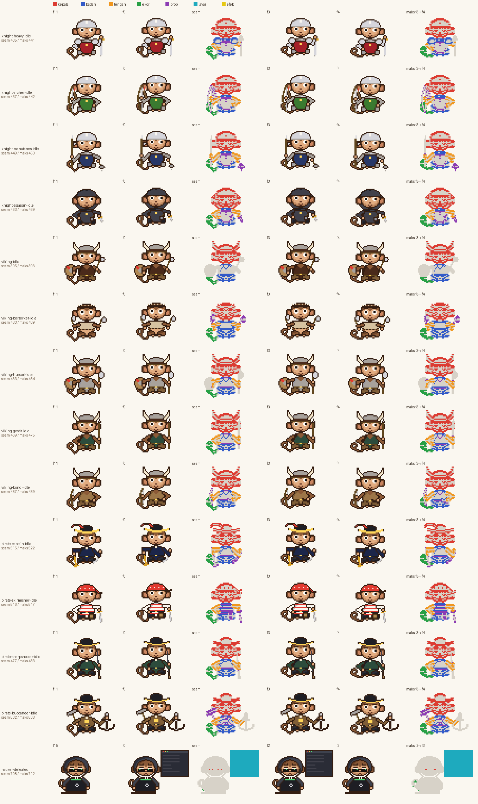
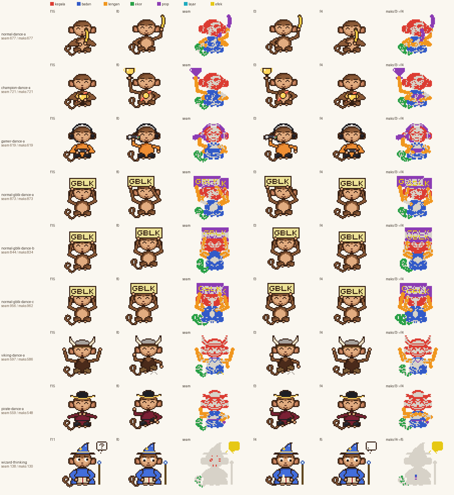
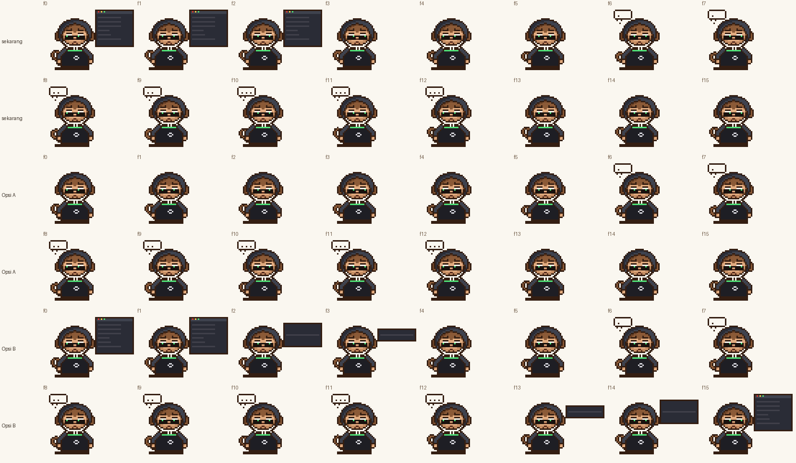

# Laporan perbaikan teknis Fase 2

Branch `claude/gobyet-fase2`. Mengikuti brief "FASE 2: PERBAIKAN TEKNIS" butir 1-6 dan format bagian 12.

**Status:** diagnosis selesai. Tidak ada aset yang terbukti meloncat, jadi **tidak ada aset yang diubah**. Dua opsi untuk `hacker/defeated` disiapkan dan ditandai **perlu persetujuan** (tidak diterapkan). V4 diperketat, tes negatif ditambahkan, validator penuh dijalankan ulang, dan deskripsi PR #1 dibersihkan.

## Ringkasan perubahan

| Berkas | Perubahan |
|---|---|
| `tools/seam_diag.py` (baru) | Diagnosis seam per aset: selisih tiap langkah termasuk seam, median, maks, peta selisih per elemen, bukti pengulangan, dan gambar peta selisih |
| `src/validate_pack.py` | V4: fungsi `seam_metrics`, kolom median dan seam/median, peringatan SEAM-POP, ringkasan jumlah SEAM-POP |
| `src/test_validate_pack.py` | 4 tes baru `SeamPop` (gigi gergaji, mulus, gerak kecil, diam). Total 9 tes |
| `pack/reports/final.md` | Diperbarui: V1, V4, output validator penuh di HEAD, tes, dan deskripsi PR tanpa baris atribusi |
| `pack/reports/perbaikan-teknis.md` dan `img/perbaikan-*.png` (baru) | Laporan ini |
| Deskripsi PR #1 | Baris "Generated with Claude Code" dan link sesi dihapus. Isi lain tidak diubah |
| Aset (`gif/`, `sheets/`, `manifest.json`) | **Tidak berubah.** Export ulang menghasilkan byte yang sama (bukti di Validasi) |

## 1. Diagnosis seam

Alat: `python3 tools/seam_diag.py <aset> [--img peta.png] [--json]`.

- **Label elemen per piksel:** setiap piksel diberi label elemen dari fungsi gambar yang terakhir menulisnya: kepala (termasuk helm dan topi), badan, lengan, ekor, prop, layar terminal, atau efek (gelembung, debu, asap, aura).
- **Ukuran selisih:** sama dengan metrik V4, yaitu jumlah posisi piksel yang berbeda.
- **Loncatan:** selisih elemen di seam lebih dari 1,25 × selisih terbesar elemen itu di langkah internal (searah atau terbalik) dan lebih dari 8 px.
- **Bukti pengulangan:** pasangan (frame terakhir, f0) dicocokkan per piksel, di luar ekor, dengan setiap langkah internal searah dan terbalik. Hasil 0 px berarti seam adalah gerakan yang persis sama dengan langkah internal itu, jadi elemen kembali ke pose awal lewat jalan yang sama.

### 14 aset yang diminta

| Aset | Frame | Median | Maks (langkah) | Seam | Seam/median | Seam/maks | Elemen di seam | Bukti pengulangan (di luar ekor) | Status |
|---|---:|---:|---|---:|---:|---:|---|---|---|
| `knight-heavy-idle` | 12 | 32 | 441 (f3->f4) | 435 | 13.59 | 0.99 | kepala 207, badan 102, lengan 33, ekor 55, prop 38 | sama dengan f5->f6: 0 + 0 px | **disengaja** |
| `knight-archer-idle` | 12 | 22 | 442 (f3->f4) | 437 | 19.86 | 0.99 | kepala 199, badan 64, lengan 71, ekor 37, prop 66 | sama dengan f5->f6: 0 + 0 px | **disengaja** |
| `knight-manatarms-idle` | 12 | 23 | 453 (f3->f4) | 449 | 19.52 | 0.99 | kepala 201, badan 67, lengan 70, ekor 43, prop 68 | sama dengan f5->f6: 0 + 0 px | **disengaja** |
| `knight-assassin-idle` | 12 | 32 | 469 (f3->f4) | 463 | 14.47 | 0.99 | kepala 223, badan 61, lengan 61, ekor 55, prop 63 | sama dengan f5->f6: 0 + 0 px | **disengaja** |
| `viking-idle` | 12 | 21 | 396 (f3->f4) | 395 | 18.81 | 1.00 | kepala 249, badan 109, ekor 37 | sama dengan f5->f6: 0 + 0 px | **disengaja** |
| `viking-berserker-idle` | 12 | 32 | 489 (f3->f4) | 483 | 15.09 | 0.99 | kepala 185, badan 143, lengan 59, ekor 56, prop 40 | sama dengan f5->f6: 0 + 0 px | **disengaja** |
| `viking-huscarl-idle` | 12 | 21 | 464 (f3->f4) | 463 | 22.05 | 1.00 | kepala 248, badan 99, lengan 58, ekor 37, prop 21 | sama dengan f5->f6: 0 + 0 px | **disengaja** |
| `viking-gestir-idle` | 12 | 32 | 475 (f3->f4) | 469 | 14.66 | 0.99 | kepala 241, badan 90, lengan 64, ekor 55, prop 19 | sama dengan f5->f6: 0 + 0 px | **disengaja** |
| `viking-bondi-idle` | 12 | 22 | 489 (f3->f4) | 487 | 22.14 | 1.00 | kepala 252, badan 93, lengan 68, ekor 44, prop 30 | sama dengan f5->f6: 0 + 0 px | **disengaja** |
| `pirate-captain-idle` | 12 | 27 | 522 (f3->f4) | 515 | 19.07 | 0.99 | kepala 256, badan 105, lengan 60, ekor 46, prop 48 | sama dengan f5->f6: 0 + 0 px | **disengaja** |
| `pirate-skirmisher-idle` | 12 | 32 | 517 (f3->f4) | 516 | 16.12 | 1.00 | kepala 215, badan 88, lengan 64, ekor 55, prop 94 | membalik f10->f9: 0 + 0 px | **disengaja** |
| `pirate-sharpshooter-idle` | 12 | 32 | 483 (f3->f4) | 477 | 14.91 | 0.99 | kepala 237, badan 105, lengan 65, ekor 55, prop 15 | sama dengan f5->f6: 0 + 0 px | **disengaja** |
| `pirate-buccaneer-idle` | 12 | 32 | 538 (f3->f4) | 532 | 16.62 | 0.99 | kepala 229, badan 107, lengan 65, ekor 55, prop 76 | sama dengan f5->f6: 0 + 0 px | **disengaja** |
| `hacker-defeated` | 16 | 11 | 712 (f2->f3) | 708 | 64.36 | 0.99 | kepala 4, ekor 2, layar 702 | membalik f3->f2: 0 + 4 px | **disengaja** |

**Kesimpulan per aset**

- **13 idle:** disengaja, angguk periodik: badan dan kepala turun 1 px di f4-f5 dan f10-f11. f11->f0 adalah langkah naik yang sama persis dengan f5->f6.
  - Selain ekor, pasangan (f11, f0) identik per piksel dengan (f5, f6) di 12 aset. Di Skirmisher, identik dengan kebalikan f9->f10; ujung bandananya mengepak berperiode 4 frame.
  - Ekor memakai fase periodik `wag(t, 12)`. Selisih ekor di seam tidak pernah melebihi langkah ekor internal.
  - Seam/maks mendekati 1 karena langkah naik angguk (sekitar 400-540 px) jatuh tepat di sambungan, bukan karena ada elemen yang tidak kembali.
- **`hacker/defeated`:** disengaja, jendela terminal menutup di f2->f3 (dirancang). Seam membalik langkah itu persis: jendela muncul lagi seketika di awal loop. Elemen yang berubah di seam hampir seluruhnya layar (702 dari 708 px). Satu-satunya cara memperkecil seam adalah mengubah apa yang tampil, jadi dua opsi disiapkan di bawah (perlu persetujuan).



Tiap baris berisi frame terakhir, f0, dan peta selisih seam, lalu dua frame langkah terbesar beserta peta selisihnya. Warna piksel menunjukkan elemen; abu pucat berarti piksel yang tidak berubah.

<details><summary>Output mentah tools/seam_diag.py (14 aset)</summary>

```
knight-heavy-idle  (12 frame)
  selisih f0->f1 ... f11->f0: [8, 10, 12, 441, 20, 424, 34, 37, 15, 430, 32, 435]
  median internal 32, maks internal 441 (f3->f4), seam 435, seam/median 13.59, seam/maks 0.99
  seam per elemen:            kepala 207, badan 102, lengan 33, ekor 55, prop 38
  langkah maks per elemen:    kepala 207, badan 109, lengan 32, ekor 61, prop 32
  langkah kembar f5->f6   :   kepala 207, badan 102, lengan 35, ekor 42, prop 38
  per elemen (seam vs maks internal elemen itu): kepala 207/207 mulus, badan 102/110 mulus, lengan 33/35 mulus, ekor 55/62 mulus, prop 38/38 mulus
  pengulangan: pasangan (f11, f0) vs langkah f5->f6: beda 0 px dan 0 px di luar ekor (0 = seam mengulang langkah itu persis)
  kesimpulan: tidak ada elemen yang meloncat

knight-archer-idle  (12 frame)
  selisih f0->f1 ... f11->f0: [7, 6, 8, 442, 15, 435, 30, 34, 10, 440, 22, 437]
  median internal 22, maks internal 442 (f3->f4), seam 437, seam/median 19.86, seam/maks 0.99
  seam per elemen:            kepala 199, badan 64, lengan 71, ekor 37, prop 66
  langkah maks per elemen:    kepala 203, badan 65, lengan 72, ekor 41, prop 61
  langkah kembar f5->f6   :   kepala 199, badan 64, lengan 72, ekor 34, prop 66
  per elemen (seam vs maks internal elemen itu): kepala 199/203 mulus, badan 64/66 mulus, lengan 71/73 mulus, ekor 37/42 mulus, prop 66/67 mulus
  pengulangan: pasangan (f11, f0) vs langkah f5->f6: beda 0 px dan 0 px di luar ekor (0 = seam mengulang langkah itu persis)
  kesimpulan: tidak ada elemen yang meloncat

knight-manatarms-idle  (12 frame)
  selisih f0->f1 ... f11->f0: [7, 9, 10, 453, 13, 440, 33, 35, 12, 446, 23, 449]
  median internal 23, maks internal 453 (f3->f4), seam 449, seam/median 19.52, seam/maks 0.99
  seam per elemen:            kepala 201, badan 67, lengan 70, ekor 43, prop 68
  langkah maks per elemen:    kepala 201, badan 70, lengan 73, ekor 47, prop 62
  langkah kembar f5->f6   :   kepala 201, badan 67, lengan 70, ekor 34, prop 68
  per elemen (seam vs maks internal elemen itu): kepala 201/201 mulus, badan 67/71 mulus, lengan 70/73 mulus, ekor 43/48 mulus, prop 68/68 mulus
  pengulangan: pasangan (f11, f0) vs langkah f5->f6: beda 0 px dan 0 px di luar ekor (0 = seam mengulang langkah itu persis)
  kesimpulan: tidak ada elemen yang meloncat

knight-assassin-idle  (12 frame)
  selisih f0->f1 ... f11->f0: [8, 10, 12, 469, 20, 452, 34, 37, 15, 458, 32, 463]
  median internal 32, maks internal 469 (f3->f4), seam 463, seam/median 14.47, seam/maks 0.99
  seam per elemen:            kepala 223, badan 61, lengan 61, ekor 55, prop 63
  langkah maks per elemen:    kepala 229, badan 55, lengan 67, ekor 61, prop 57
  langkah kembar f5->f6   :   kepala 223, badan 61, lengan 63, ekor 42, prop 63
  per elemen (seam vs maks internal elemen itu): kepala 223/229 mulus, badan 61/61 mulus, lengan 61/69 mulus, ekor 55/62 mulus, prop 63/63 mulus
  pengulangan: pasangan (f11, f0) vs langkah f5->f6: beda 0 px dan 0 px di luar ekor (0 = seam mengulang langkah itu persis)
  kesimpulan: tidak ada elemen yang meloncat

viking-idle  (12 frame)
  selisih f0->f1 ... f11->f0: [8, 10, 7, 396, 12, 388, 8, 37, 36, 394, 21, 395]
  median internal 21, maks internal 396 (f3->f4), seam 395, seam/median 18.81, seam/maks 1.00
  seam per elemen:            kepala 249, badan 109, ekor 37
  langkah maks per elemen:    kepala 249, badan 109, ekor 38
  langkah kembar f5->f6   :   kepala 249, badan 109, ekor 30
  per elemen (seam vs maks internal elemen itu): kepala 249/249 mulus, badan 109/110 mulus, ekor 37/39 mulus
  pengulangan: pasangan (f11, f0) vs langkah f5->f6: beda 0 px dan 0 px di luar ekor (0 = seam mengulang langkah itu persis)
  kesimpulan: tidak ada elemen yang meloncat

viking-berserker-idle  (12 frame)
  selisih f0->f1 ... f11->f0: [8, 10, 12, 489, 20, 470, 58, 61, 15, 476, 32, 483]
  median internal 32, maks internal 489 (f3->f4), seam 483, seam/median 15.09, seam/maks 0.99
  seam per elemen:            kepala 185, badan 143, lengan 59, ekor 56, prop 40
  langkah maks per elemen:    kepala 188, badan 139, lengan 61, ekor 62, prop 39
  langkah kembar f5->f6   :   kepala 185, badan 143, lengan 60, ekor 42, prop 40
  per elemen (seam vs maks internal elemen itu): kepala 185/188 mulus, badan 143/143 mulus, lengan 59/62 mulus, ekor 56/63 mulus, prop 40/40 mulus
  pengulangan: pasangan (f11, f0) vs langkah f5->f6: beda 0 px dan 0 px di luar ekor (0 = seam mengulang langkah itu persis)
  kesimpulan: tidak ada elemen yang meloncat

viking-huscarl-idle  (12 frame)
  selisih f0->f1 ... f11->f0: [8, 10, 7, 464, 12, 456, 32, 37, 12, 462, 21, 463]
  median internal 21, maks internal 464 (f3->f4), seam 463, seam/median 22.05, seam/maks 1.00
  seam per elemen:            kepala 248, badan 99, lengan 58, ekor 37, prop 21
  langkah maks per elemen:    kepala 248, badan 95, lengan 60, ekor 38, prop 23
  langkah kembar f5->f6   :   kepala 248, badan 99, lengan 58, ekor 30, prop 21
  per elemen (seam vs maks internal elemen itu): kepala 248/248 mulus, badan 99/99 mulus, lengan 58/60 mulus, ekor 37/39 mulus, prop 21/23 mulus
  pengulangan: pasangan (f11, f0) vs langkah f5->f6: beda 0 px dan 0 px di luar ekor (0 = seam mengulang langkah itu persis)
  kesimpulan: tidak ada elemen yang meloncat

viking-gestir-idle  (12 frame)
  selisih f0->f1 ... f11->f0: [8, 10, 12, 475, 20, 458, 34, 37, 15, 464, 32, 469]
  median internal 32, maks internal 475 (f3->f4), seam 469, seam/median 14.66, seam/maks 0.99
  seam per elemen:            kepala 241, badan 90, lengan 64, ekor 55, prop 19
  langkah maks per elemen:    kepala 241, badan 86, lengan 68, ekor 61, prop 19
  langkah kembar f5->f6   :   kepala 241, badan 90, lengan 66, ekor 42, prop 19
  per elemen (seam vs maks internal elemen itu): kepala 241/241 mulus, badan 90/90 mulus, lengan 64/70 mulus, ekor 55/62 mulus, prop 19/19 mulus
  pengulangan: pasangan (f11, f0) vs langkah f5->f6: beda 0 px dan 0 px di luar ekor (0 = seam mengulang langkah itu persis)
  kesimpulan: tidak ada elemen yang meloncat

viking-bondi-idle  (12 frame)
  selisih f0->f1 ... f11->f0: [8, 10, 9, 489, 11, 476, 34, 37, 14, 483, 22, 487]
  median internal 22, maks internal 489 (f3->f4), seam 487, seam/median 22.14, seam/maks 1.00
  seam per elemen:            kepala 252, badan 93, lengan 68, ekor 44, prop 30
  langkah maks per elemen:    kepala 252, badan 89, lengan 71, ekor 44, prop 33
  langkah kembar f5->f6   :   kepala 252, badan 93, lengan 68, ekor 35, prop 28
  per elemen (seam vs maks internal elemen itu): kepala 252/252 mulus, badan 93/93 mulus, lengan 68/71 mulus, ekor 44/49 mulus, prop 30/33 mulus
  pengulangan: pasangan (f11, f0) vs langkah f5->f6: beda 0 px dan 0 px di luar ekor (0 = seam mengulang langkah itu persis)
  kesimpulan: tidak ada elemen yang meloncat

pirate-captain-idle  (12 frame)
  selisih f0->f1 ... f11->f0: [8, 8, 10, 522, 17, 504, 34, 32, 15, 507, 27, 515]
  median internal 27, maks internal 522 (f3->f4), seam 515, seam/median 19.07, seam/maks 0.99
  seam per elemen:            kepala 256, badan 105, lengan 60, ekor 46, prop 48
  langkah maks per elemen:    kepala 256, badan 103, lengan 67, ekor 56, prop 40
  langkah kembar f5->f6   :   kepala 256, badan 105, lengan 61, ekor 33, prop 49
  per elemen (seam vs maks internal elemen itu): kepala 256/256 mulus, badan 105/105 mulus, lengan 60/68 mulus, ekor 46/56 mulus, prop 48/49 mulus
  pengulangan: pasangan (f11, f0) vs langkah f5->f6: beda 0 px dan 0 px di luar ekor (0 = seam mengulang langkah itu persis)
  kesimpulan: tidak ada elemen yang meloncat

pirate-skirmisher-idle  (12 frame)
  selisih f0->f1 ... f11->f0: [8, 23, 12, 517, 20, 500, 34, 50, 15, 511, 32, 516]
  median internal 32, maks internal 517 (f3->f4), seam 516, seam/median 16.12, seam/maks 1.00
  seam per elemen:            kepala 215, badan 88, lengan 64, ekor 55, prop 94
  langkah maks per elemen:    kepala 210, badan 88, lengan 72, ekor 61, prop 86
  langkah kembar f10->f9  :   kepala 215, badan 89, lengan 74, ekor 47, prop 86
  per elemen (seam vs maks internal elemen itu): kepala 215/215 mulus, badan 88/89 mulus, lengan 64/74 mulus, ekor 55/62 mulus, prop 94/94 mulus
  pengulangan: pasangan (f11, f0) vs langkah f10->f9 (arah terbalik): beda 0 px dan 0 px di luar ekor (0 = seam membalik langkah itu persis)
  kesimpulan: tidak ada elemen yang meloncat

pirate-sharpshooter-idle  (12 frame)
  selisih f0->f1 ... f11->f0: [8, 10, 12, 483, 20, 466, 34, 37, 15, 472, 32, 477]
  median internal 32, maks internal 483 (f3->f4), seam 477, seam/median 14.91, seam/maks 0.99
  seam per elemen:            kepala 237, badan 105, lengan 65, ekor 55, prop 15
  langkah maks per elemen:    kepala 237, badan 100, lengan 70, ekor 61, prop 15
  langkah kembar f5->f6   :   kepala 237, badan 105, lengan 67, ekor 42, prop 15
  per elemen (seam vs maks internal elemen itu): kepala 237/237 mulus, badan 105/105 mulus, lengan 65/72 mulus, ekor 55/62 mulus, prop 15/15 mulus
  pengulangan: pasangan (f11, f0) vs langkah f5->f6: beda 0 px dan 0 px di luar ekor (0 = seam mengulang langkah itu persis)
  kesimpulan: tidak ada elemen yang meloncat

pirate-buccaneer-idle  (12 frame)
  selisih f0->f1 ... f11->f0: [8, 10, 12, 538, 20, 521, 34, 37, 15, 527, 32, 532]
  median internal 32, maks internal 538 (f3->f4), seam 532, seam/median 16.62, seam/maks 0.99
  seam per elemen:            kepala 229, badan 107, lengan 65, ekor 55, prop 76
  langkah maks per elemen:    kepala 233, badan 102, lengan 69, ekor 61, prop 73
  langkah kembar f5->f6   :   kepala 229, badan 107, lengan 67, ekor 42, prop 76
  per elemen (seam vs maks internal elemen itu): kepala 229/233 mulus, badan 107/107 mulus, lengan 65/71 mulus, ekor 55/62 mulus, prop 76/76 mulus
  pengulangan: pasangan (f11, f0) vs langkah f5->f6: beda 0 px dan 0 px di luar ekor (0 = seam mengulang langkah itu persis)
  kesimpulan: tidak ada elemen yang meloncat

hacker-defeated  (16 frame)
  selisih f0->f1 ... f15->f0: [7, 4, 712, 13, 15, 104, 11, 7, 6, 13, 9, 19, 103, 6, 5, 708]
  median internal 11, maks internal 712 (f2->f3), seam 708, seam/median 64.36, seam/maks 0.99
  seam per elemen:            kepala 4, ekor 2, layar 702
  langkah maks per elemen:    kepala 4, ekor 6, layar 702
  langkah kembar f3->f2   :   kepala 4, ekor 6, layar 702
  per elemen (seam vs maks internal elemen itu): kepala 4/4 mulus, ekor 2/15 mulus, layar 702/702 mulus, efek 0/93 mulus
  pengulangan: pasangan (f15, f0) vs langkah f3->f2 (arah terbalik): beda 0 px dan 4 px di luar ekor (0 = seam membalik langkah itu persis)
  kesimpulan: tidak ada elemen yang meloncat
```
</details>

### Temuan tambahan: 9 aset lain yang ditandai SEAM-POP

V4 yang diperketat juga menandai 9 aset baru di luar daftar. Semuanya didiagnosis dengan alat yang sama. Tidak ada yang diubah, karena tidak disebut di brief.

| Aset | Median | Maks | Seam | Seam/maks | Elemen di seam | Bukti pengulangan | Status |
|---|---:|---:|---:|---:|---|---|---|
| `normal-dance-a` | 7 | 677 | 677 | 1.00 | kepala 229, badan 180, lengan 138, ekor 63, prop 67 | membalik f4->f3: 0 + 0 px | **disengaja** |
| `champion-dance-a` | 7 | 721 | 721 | 1.00 | kepala 252, badan 189, lengan 141, ekor 64, prop 75 | membalik f4->f3: 0 + 0 px | **disengaja** |
| `gamer-dance-a` | 7 | 619 | 619 | 1.00 | kepala 141, badan 167, lengan 110, ekor 63, prop 138 | membalik f4->f3: 0 + 0 px | **disengaja** |
| `normal-gblk-dance-a` | 7 | 873 | 873 | 1.00 | kepala 157, badan 173, lengan 187, ekor 66, prop 246, efek 44 | membalik f4->f3: 0 + 0 px | **disengaja** |
| `normal-gblk-dance-b` | 7 | 834 | 844 | 1.01 | kepala 192, badan 213, lengan 166, ekor 90, prop 151, efek 32 | sama dengan f7->f8: 0 + 0 px | **disengaja** |
| `normal-gblk-dance-c` | 7 | 962 | 956 | 0.99 | kepala 166, badan 228, lengan 231, ekor 80, prop 213, efek 38 | membalik f4->f3: 0 + 0 px | **disengaja** |
| `viking-dance-a` | 7 | 586 | 597 | 1.02 | kepala 244, badan 115, lengan 167, ekor 59, prop 6, efek 6 | membalik f4->f3: 0 + 0 px | **disengaja** |
| `pirate-dance-a` | 7 | 548 | 559 | 1.02 | kepala 233, badan 148, lengan 101, ekor 58, prop 19 | membalik f4->f3: 0 + 0 px | **disengaja** |
| `wizard-thinking` | 27 | 130 | 138 | 1.06 | kepala 16, ekor 19, efek 103 | membalik f5->f4: 25 + 8 px | **disengaja** |

- **8 tarian:** beat ke-4 tarian (f15->f0). V9 mewajibkan perubahan pose besar di f3->f4, f7->f8, f11->f12, dan f15->f0. SEAM-POP pada tarian bertentangan langsung dengan V9; keputusan ada di daftar pemilik.
- **`wizard/thinking`:** gelembung "?" berakhir di f11 dan hilang di seam, bersamaan dengan wajah kembali menunduk ke buku (akhir siklus berpikir). Bukan loncatan fase. Gelembung bisa dibuat berakhir lebih awal (seperti thinking kostum lain), tetapi itu mengubah frame yang terlihat, jadi tidak dikerjakan.



<details><summary>Output mentah tools/seam_diag.py (9 aset lain)</summary>

```
normal-dance-a  (16 frame)
  selisih f0->f1 ... f15->f0: [7, 1, 5, 677, 8, 6, 13, 662, 2, 3, 6, 665, 7, 5, 19, 677]
  median internal 7, maks internal 677 (f3->f4), seam 677, seam/median 96.71, seam/maks 1.00
  seam per elemen:            kepala 229, badan 180, lengan 138, ekor 63, prop 67
  langkah maks per elemen:    kepala 226, badan 125, lengan 167, ekor 64, prop 95
  langkah kembar f4->f3   :   kepala 226, badan 125, lengan 167, ekor 64, prop 95
  per elemen (seam vs maks internal elemen itu): kepala 229/241 mulus, badan 180/179 mulus, lengan 138/189 mulus, ekor 63/64 mulus, prop 67/95 mulus
  pengulangan: pasangan (f15, f0) vs langkah f4->f3 (arah terbalik): beda 0 px dan 0 px di luar ekor (0 = seam membalik langkah itu persis)
  kesimpulan: tidak ada elemen yang meloncat

champion-dance-a  (16 frame)
  selisih f0->f1 ... f15->f0: [7, 1, 5, 721, 8, 6, 13, 670, 2, 3, 6, 673, 7, 5, 19, 721]
  median internal 7, maks internal 721 (f3->f4), seam 721, seam/median 103.00, seam/maks 1.00
  seam per elemen:            kepala 252, badan 189, lengan 141, ekor 64, prop 75
  langkah maks per elemen:    kepala 252, badan 107, lengan 174, ekor 65, prop 123
  langkah kembar f4->f3   :   kepala 252, badan 107, lengan 174, ekor 65, prop 123
  per elemen (seam vs maks internal elemen itu): kepala 252/252 mulus, badan 189/188 mulus, lengan 141/174 mulus, ekor 64/65 mulus, prop 75/123 mulus
  pengulangan: pasangan (f15, f0) vs langkah f4->f3 (arah terbalik): beda 0 px dan 0 px di luar ekor (0 = seam membalik langkah itu persis)
  kesimpulan: tidak ada elemen yang meloncat

gamer-dance-a  (16 frame)
  selisih f0->f1 ... f15->f0: [7, 1, 5, 619, 8, 6, 14, 589, 2, 3, 6, 610, 7, 5, 20, 619]
  median internal 7, maks internal 619 (f3->f4), seam 619, seam/median 88.43, seam/maks 1.00
  seam per elemen:            kepala 141, badan 167, lengan 110, ekor 63, prop 138
  langkah maks per elemen:    kepala 141, badan 102, lengan 138, ekor 63, prop 175
  langkah kembar f4->f3   :   kepala 141, badan 102, lengan 138, ekor 63, prop 175
  per elemen (seam vs maks internal elemen itu): kepala 141/147 mulus, badan 167/167 mulus, lengan 110/138 mulus, ekor 63/63 mulus, prop 138/175 mulus
  pengulangan: pasangan (f15, f0) vs langkah f4->f3 (arah terbalik): beda 0 px dan 0 px di luar ekor (0 = seam membalik langkah itu persis)
  kesimpulan: tidak ada elemen yang meloncat

normal-gblk-dance-a  (16 frame)
  selisih f0->f1 ... f15->f0: [7, 1, 5, 873, 9, 6, 14, 859, 2, 3, 6, 860, 7, 5, 19, 873]
  median internal 7, maks internal 873 (f3->f4), seam 873, seam/median 124.71, seam/maks 1.00
  seam per elemen:            kepala 157, badan 173, lengan 187, ekor 66, prop 246, efek 44
  langkah maks per elemen:    kepala 136, badan 170, lengan 184, ekor 67, prop 267, efek 49
  langkah kembar f4->f3   :   kepala 136, badan 170, lengan 184, ekor 67, prop 267, efek 49
  per elemen (seam vs maks internal elemen itu): kepala 157/160 mulus, badan 173/172 mulus, lengan 187/189 mulus, ekor 66/67 mulus, prop 246/277 mulus, efek 44/54 mulus
  pengulangan: pasangan (f15, f0) vs langkah f4->f3 (arah terbalik): beda 0 px dan 0 px di luar ekor (0 = seam membalik langkah itu persis)
  kesimpulan: tidak ada elemen yang meloncat

normal-gblk-dance-b  (16 frame)
  selisih f0->f1 ... f15->f0: [7, 1, 5, 834, 9, 6, 14, 828, 2, 3, 6, 832, 7, 5, 19, 844]
  median internal 7, maks internal 834 (f3->f4), seam 844, seam/median 120.57, seam/maks 1.01
  seam per elemen:            kepala 192, badan 213, lengan 166, ekor 90, prop 151, efek 32
  langkah maks per elemen:    kepala 143, badan 185, lengan 156, ekor 76, prop 232, efek 42
  langkah kembar f7->f8   :   kepala 192, badan 215, lengan 166, ekor 72, prop 151, efek 32
  per elemen (seam vs maks internal elemen itu): kepala 192/192 mulus, badan 213/216 mulus, lengan 166/166 mulus, ekor 90/81 mulus, prop 151/232 mulus, efek 32/42 mulus
  pengulangan: pasangan (f15, f0) vs langkah f7->f8: beda 0 px dan 0 px di luar ekor (0 = seam mengulang langkah itu persis)
  kesimpulan: tidak ada elemen yang meloncat

normal-gblk-dance-c  (16 frame)
  selisih f0->f1 ... f15->f0: [7, 1, 5, 962, 9, 6, 14, 932, 2, 3, 6, 941, 7, 5, 19, 956]
  median internal 7, maks internal 962 (f3->f4), seam 956, seam/median 136.57, seam/maks 0.99
  seam per elemen:            kepala 166, badan 228, lengan 231, ekor 80, prop 213, efek 38
  langkah maks per elemen:    kepala 121, badan 216, lengan 223, ekor 95, prop 267, efek 40
  langkah kembar f4->f3   :   kepala 121, badan 216, lengan 223, ekor 95, prop 267, efek 40
  per elemen (seam vs maks internal elemen itu): kepala 166/166 mulus, badan 228/231 mulus, lengan 231/231 mulus, ekor 80/95 mulus, prop 213/267 mulus, efek 38/40 mulus
  pengulangan: pasangan (f15, f0) vs langkah f4->f3 (arah terbalik): beda 0 px dan 0 px di luar ekor (0 = seam membalik langkah itu persis)
  kesimpulan: tidak ada elemen yang meloncat

viking-dance-a  (16 frame)
  selisih f0->f1 ... f15->f0: [7, 1, 5, 586, 9, 6, 14, 557, 2, 3, 6, 575, 7, 5, 20, 597]
  median internal 7, maks internal 586 (f3->f4), seam 597, seam/median 85.29, seam/maks 1.02
  seam per elemen:            kepala 244, badan 115, lengan 167, ekor 59, prop 6, efek 6
  langkah maks per elemen:    kepala 244, badan 118, lengan 169, ekor 48, prop 6, efek 1
  langkah kembar f4->f3   :   kepala 244, badan 118, lengan 169, ekor 48, prop 6, efek 1
  per elemen (seam vs maks internal elemen itu): kepala 244/244 mulus, badan 115/118 mulus, lengan 167/169 mulus, ekor 59/49 mulus, prop 6/43 mulus, efek 6/6 mulus
  pengulangan: pasangan (f15, f0) vs langkah f4->f3 (arah terbalik): beda 0 px dan 0 px di luar ekor (0 = seam membalik langkah itu persis)
  kesimpulan: tidak ada elemen yang meloncat

pirate-dance-a  (16 frame)
  selisih f0->f1 ... f15->f0: [7, 1, 5, 548, 9, 6, 14, 518, 2, 3, 6, 536, 7, 5, 20, 559]
  median internal 7, maks internal 548 (f3->f4), seam 559, seam/median 79.86, seam/maks 1.02
  seam per elemen:            kepala 233, badan 148, lengan 101, ekor 58, prop 19
  langkah maks per elemen:    kepala 233, badan 119, lengan 130, ekor 47, prop 19
  langkah kembar f4->f3   :   kepala 233, badan 119, lengan 130, ekor 47, prop 19
  per elemen (seam vs maks internal elemen itu): kepala 233/233 mulus, badan 148/147 mulus, lengan 101/131 mulus, ekor 58/49 mulus, prop 19/33 mulus
  pengulangan: pasangan (f15, f0) vs langkah f4->f3 (arah terbalik): beda 0 px dan 0 px di luar ekor (0 = seam membalik langkah itu persis)
  kesimpulan: tidak ada elemen yang meloncat

wizard-thinking  (12 frame)
  selisih f0->f1 ... f11->f0: [7, 3, 21, 30, 130, 34, 9, 28, 30, 22, 27, 138]
  median internal 27, maks internal 130 (f4->f5), seam 138, seam/median 5.11, seam/maks 1.06
  seam per elemen:            kepala 16, ekor 19, efek 103
  langkah maks per elemen:    badan 4, ekor 19, prop 4, efek 103
  langkah kembar f5->f4   :   badan 4, ekor 19, prop 4, efek 103
  per elemen (seam vs maks internal elemen itu): kepala 16/16 mulus, badan 0/4 mulus, ekor 19/27 mulus, prop 0/13 mulus, efek 103/103 mulus
  pengulangan: pasangan (f11, f0) vs langkah f5->f4 (arah terbalik): beda 25 px dan 8 px di luar ekor (0 = seam membalik langkah itu persis)
  kesimpulan: tidak ada elemen yang meloncat
```
</details>

## 2. Perbaikan

Brief: perbaiki hanya yang terbukti loncatan dengan membuat fase elemennya periodik. **Tidak ada aset yang terbukti loncatan, jadi tidak ada yang diubah.** Semua fase elemen di 14 aset sudah periodik: ekor lewat `wag`, angguk dengan pola periode 6 frame, dan bandana periode 4 frame.

### `hacker/defeated`: dua opsi, PERLU PERSETUJUAN (tidak diterapkan)



- **Opsi A: jendela tidak pernah tampil.** Layar sudah padam sejak awal loop. Ekspresi, badan, dan gelembung "..." tetap sama. Momen "layar meredup lalu padam" hilang.
- **Opsi B: jendela meredup lalu menciut ke garis tengah dan padam di f2-f4, lalu menyala kembali dengan cara yang sama terbalik di f13-f15, sehingga f15 sama dengan f0.** Ini menambah bentuk baru (jendela setengah dan sepertiga tinggi dengan garis tengah) di 5 frame.

```
sekarang  selisih [7, 4, 712, 13, 15, 104, 11, 7, 6, 13, 9, 19, 103, 6, 5, 708] | median 11 maks 712 seam 708 seam/maks 0.99 seam/median 64.36
Opsi A    selisih [7, 4, 10, 13, 15, 104, 11, 7, 6, 13, 9, 19, 103, 6, 5, 6] | median 10 maks 104 seam 6 seam/maks 0.06 seam/median 0.60
Opsi B    selisih [7, 385, 276, 256, 15, 104, 11, 7, 6, 13, 9, 19, 346, 272, 386, 6] | median 19 maks 386 seam 6 seam/maks 0.02 seam/median 0.32
/tmp/claude-0/-home-user-Bertahan-Bukan-hidup/bcbe8b95-25d0-51a0-bf34-17b8829306eb/scratchpad/hacker-opsi.png (1658, 964)
```

Kedua opsi tidak mengubah frame kunci f8 (jendela sudah padam di sana), jadi IoU defeated vs idle (0,42) dan mode statis tetap sama.

## 3. Tabel seam sebelum/sesudah (14 aset)

Karena tidak ada aset yang diubah, nilai sesudah sama dengan sebelum. Untuk `hacker/defeated`, kolom opsi menunjukkan nilai bila opsi itu disetujui.

| Aset | Sebelum: median / maks / seam | Sesudah: median / maks / seam | Hasil V4 | SEAM-POP |
|---|---|---|---|---|
| `knight-heavy-idle` | 32 / 441 / 435 | 32 / 441 / 435 (tidak diubah) | lulus (seam ≤ 1,25 × maks) | PERINGATAN, disengaja |
| `knight-archer-idle` | 22 / 442 / 437 | 22 / 442 / 437 (tidak diubah) | lulus (seam ≤ 1,25 × maks) | PERINGATAN, disengaja |
| `knight-manatarms-idle` | 23 / 453 / 449 | 23 / 453 / 449 (tidak diubah) | lulus (seam ≤ 1,25 × maks) | PERINGATAN, disengaja |
| `knight-assassin-idle` | 32 / 469 / 463 | 32 / 469 / 463 (tidak diubah) | lulus (seam ≤ 1,25 × maks) | PERINGATAN, disengaja |
| `viking-idle` | 21 / 396 / 395 | 21 / 396 / 395 (tidak diubah) | lulus (seam ≤ 1,25 × maks) | PERINGATAN, disengaja |
| `viking-berserker-idle` | 32 / 489 / 483 | 32 / 489 / 483 (tidak diubah) | lulus (seam ≤ 1,25 × maks) | PERINGATAN, disengaja |
| `viking-huscarl-idle` | 21 / 464 / 463 | 21 / 464 / 463 (tidak diubah) | lulus (seam ≤ 1,25 × maks) | PERINGATAN, disengaja |
| `viking-gestir-idle` | 32 / 475 / 469 | 32 / 475 / 469 (tidak diubah) | lulus (seam ≤ 1,25 × maks) | PERINGATAN, disengaja |
| `viking-bondi-idle` | 22 / 489 / 487 | 22 / 489 / 487 (tidak diubah) | lulus (seam ≤ 1,25 × maks) | PERINGATAN, disengaja |
| `pirate-captain-idle` | 27 / 522 / 515 | 27 / 522 / 515 (tidak diubah) | lulus (seam ≤ 1,25 × maks) | PERINGATAN, disengaja |
| `pirate-skirmisher-idle` | 32 / 517 / 516 | 32 / 517 / 516 (tidak diubah) | lulus (seam ≤ 1,25 × maks) | PERINGATAN, disengaja |
| `pirate-sharpshooter-idle` | 32 / 483 / 477 | 32 / 483 / 477 (tidak diubah) | lulus (seam ≤ 1,25 × maks) | PERINGATAN, disengaja |
| `pirate-buccaneer-idle` | 32 / 538 / 532 | 32 / 538 / 532 (tidak diubah) | lulus (seam ≤ 1,25 × maks) | PERINGATAN, disengaja |
| `hacker-defeated` | 11 / 712 / 708 | 11 / 712 / 708 (tidak diubah); Opsi A: 10 / 104 / 6; Opsi B: 19 / 386 / 6 | lulus (seam ≤ 1,25 × maks) | PERINGATAN, disengaja |

## 4. V4 diperketat

- **Kolom baru:** median langkah internal dan seam/median.
- **SEAM-POP (peringatan, bukan GAGAL):** seam ≥ 0,9 × maks dan maks > 100 px. Aset terkunci yang memenuhinya berstatus DIKETAHUI. Di akhir V4 dicetak ringkasan jumlahnya.
- **Ambang GAGAL lama** (seam > 1,25 × maks) tetap berlaku.
- **Logika yang sama dipakai validator dan tes:** `seam_metrics(steps, seam)`.

Hasil di HEAD:

```
  SEAM-POP: 28 sel (5 terkunci = DIKETAHUI, 23 baru = PERINGATAN): normal/dance-a, hacker/defeated, champion/dance-a, gamer/dance-a, normal-gblk/dance-a, normal-gblk/dance-b, normal-gblk/dance-c, viking/idle, viking/dance-a, pirate/dance-a, wizard/thinking, knight-heavy/idle, knight-archer/idle, knight-manatarms/idle, knight-assassin/idle, viking-berserker/idle, viking-huscarl/idle, viking-gestir/idle, viking-bondi/idle, pirate-captain/idle, pirate-skirmisher/idle, pirate-sharpshooter/idle, pirate-buccaneer/idle
```

Lima aset terkunci yang ditandai (DIKETAHUI): `greek-philosopher/thinking`, `scientist/thinking`, `hacker/idle`, `detective/thinking`, dan `referee/thinking`. Daftar lengkap per sel ada di output V4 di bagian Validasi.

### Tes negatif

Empat tes `SeamPop` di `src/test_validate_pack.py` memakai frame sintetik 64×48 dan `vp.diff`, yang sama dengan pembanding sheet sungguhan:

```
kasus                                                           maks median  seam seam/mks seam/med    POP  GAGAL
gigi gergaji 30x20, geser 3 px/frame, 11 frame, loncat kembali   120    120  1200    10.00    10.00   True   True
bolak-balik kosinus 30x20, amplitudo 15 px, 12 frame             160    120    40     0.25     0.33  False  False
gigi gergaji kecil 6x4, geser 1 px/frame, 8 frame                  8      8    48     6.00     6.00  False   True
diam (6 frame identik)                                             0      0     0     0.00     0.00  False  False
```

- **Gigi gergaji:** ditandai SEAM-POP, dan juga GAGAL lewat ambang lama.
- **Loop mulus:** bolak-balik kosinus dengan seam di titik balik. Tidak ditandai.
- **Gigi gergaji kecil:** maks ≤ 100 px, jadi tidak memicu SEAM-POP, tetapi tetap GAGAL lewat ambang 1,25×.
- **Loop diam:** tidak ditandai.

## 5. V1

Validator penuh di HEAD (`python3 src/validate_pack.py`, tanpa `--gate`):

```
[V1] Hash aset yang dikunci dan aset yang sudah dibuat
  sha256-asli.txt: 27 identik, 0 berubah/hilang
  sha256-disetujui.txt: 89 identik, 0 berubah/hilang
  sha256-dibuat.txt: 242 identik, 0 berubah/hilang
```

## 6. PR #1

Dari deskripsi PR, hanya dua baris terakhir yang dihapus: "🤖 Generated with [Claude Code](https://claude.com/claude-code)" dan link sesi Claude. Judul, status draft, dan isi lain tidak berubah. Ini sudah diverifikasi dengan membaca ulang PR sesudah pembaruan. Salinan deskripsi di `pack/reports/final.md` ikut diperbarui.

## Validasi bagian 11 (output mentah)

### Export ulang dan hash

```
$ python3 src/export.py
pack/manifest.json  163 sel (7 asli, 156 baru), 32 kostum, 13 state
$ git status --short gif sheets pack/manifest.json (harus kosong)
0
$ sha256sum -c
  sha256-asli.txt: 27 file identik
  sha256-disetujui.txt: 89 file identik
  sha256-dibuat.txt: 242 file identik
```

### Tes

```
$ python3 -m unittest src/test_validate_pack.py -v
test_sawtooth_flagged (src.test_validate_pack.SeamPop.test_sawtooth_flagged) ... ok
test_small_motion_below_minimum (src.test_validate_pack.SeamPop.test_small_motion_below_minimum) ... ok
test_smooth_loop_not_flagged (src.test_validate_pack.SeamPop.test_smooth_loop_not_flagged) ... ok
test_static_loop (src.test_validate_pack.SeamPop.test_static_loop) ... ok
test_alias_import_with_glyph_outside_mini (src.test_validate_pack.TextAudit.test_alias_import_with_glyph_outside_mini) ... ok
test_direct_import_too_long (src.test_validate_pack.TextAudit.test_direct_import_too_long) ... ok
test_exception_only_for_its_owner_and_static (src.test_validate_pack.TextAudit.test_exception_only_for_its_owner_and_static) ... ok
test_module_attribute_call (src.test_validate_pack.TextAudit.test_module_attribute_call) ... ok
test_patch_is_restored (src.test_validate_pack.TextAudit.test_patch_is_restored) ... ok

----------------------------------------------------------------------
Ran 9 tests in 0.039s

OK

$ node --test pack/resolver.test.js
# tests 19
# pass 19
# fail 0
e2e exit=0
E2E: LULUS
```

Uji browser:

```json
{
 "counts": {
  "real": 7,
  "new": 156,
  "new_by_gate": {
   "C": 9,
   "F": 36,
   "G": 15,
   "A": 2,
   "B": 8,
   "D": 6,
   "E": 10,
   "H": 24,
   "J": 36,
   "I": 10
  },
  "placeholder": 0,
  "css_placeholder": 0,
  "not_applicable": 253,
  "rows": 32,
  "stats": "7 sel asli | 156 sel baru | 0 placeholder | 103 / 103 sel wajib terisi | 163 / 163 sel berlaku terisi | 32 × 13 kostum × state"
 },
 "static_button_holds": true,
 "reduced_motion_static": true,
 "blind_same_order_after_reload": true,
 "blind_revealed_ok": true,
 "phone_overflow": 0,
 "desktop_errors": [],
 "phone_errors": [],
 "desktop_bad_requests": [],
 "phone_bad_requests": [],
 "fails": [],
 "static_desktop": {
  "canvases": 567,
  "frame_mismatch": 0,
  "pixel_mismatch": 0
 },
 "filter_phone": {
  "union_ok": true,
  "counts_ok": true,
  "max_gate_height": 2327
 }
}
```

<details><summary>Output validator lengkap (V1-V10, VT)</summary>

```
[V1] Hash aset yang dikunci dan aset yang sudah dibuat
  sha256-asli.txt: 27 identik, 0 berubah/hilang
  sha256-disetujui.txt: 89 identik, 0 berubah/hilang
  sha256-dibuat.txt: 242 identik, 0 berubah/hilang

[V2] Manifest dan schema, [V3] palet, kanvas, alfa, isi GIF
  32 kostum, 13 state, 163 sel berlaku, 163 sel terisi; 0 gagal

[V4] Loop seam (piksel berbeda; seam = frame terakhir -> frame pertama)
  ambang = 1.25 x selisih maksimum antar-frame berurutan di aset itu sendiri
  SEAM-POP (peringatan) = seam >= 0.9 x maks dan maks > 100 px; seam/med = seam dibagi median langkah internal
  sel                        status     maks median  ambang   seam seam/med  hasil
  normal/idle                terkunci    237     42   296.2     37     0.88  lulus
  normal/happy               terkunci    324   91.5   405.0    100     1.09  lulus
  normal/thinking            terkunci    158     37   197.5     34     0.92  lulus
  normal/victory             terkunci    544    395   680.0     16     0.04  lulus
  normal/defeated            terkunci     45      7    56.2     36     5.14  lulus
  normal/shocked             baru        687    412   858.8     19     0.05  lulus
  normal/dance-a             baru        677      7   846.2    677    96.71  lulus; SEAM-POP PERINGATAN
  greek-philosopher/thinking terkunci    197     20   246.2    234    11.70  lulus; SEAM-POP DIKETAHUI (terkunci)
  greek-philosopher/idle     terkunci     70     28    87.5     33     1.18  lulus
  greek-philosopher/victory  terkunci    560    438   700.0      8     0.02  lulus
  greek-philosopher/defeated terkunci    113     24   141.2     69     2.88  lulus
  greek-philosopher/shocked  baru        702    401   877.5     17     0.04  lulus
  greek-philosopher/happy    baru        344     40   430.0     42     1.05  lulus
  academic/idle              terkunci    241     27   301.2     36     1.33  lulus
  academic/thinking          terkunci    176     34   220.0     28     0.82  lulus
  academic/victory           terkunci    549    130   686.2     20     0.15  lulus
  academic/defeated          terkunci    287     17   358.8     12     0.71  lulus
  academic/shocked           baru        409    117   511.2     27     0.23  lulus
  academic/happy             baru        420     36   525.0     31     0.86  lulus
  scientist/thinking         terkunci    140     37   175.0    239     6.46  DIKETAHUI (terkunci, tidak diubah); SEAM-POP DIKETAHUI (terkunci)
  scientist/idle             terkunci     75     43    93.8     44     1.02  lulus
  scientist/shocked          terkunci    814     44  1017.5     30     0.68  lulus
  scientist/victory          terkunci    722    493   902.5     59     0.12  lulus
  scientist/defeated         baru         46      7    57.5     36     5.14  lulus
  scientist/happy            baru         99     45   123.8     69     1.53  lulus
  hacker/idle                terkunci    257     43   321.2    258     6.00  lulus; SEAM-POP DIKETAHUI (terkunci)
  hacker/thinking            terkunci    138     25   172.5     68     2.72  lulus
  hacker/shocked             terkunci    372    118   465.0     68     0.58  lulus
  hacker/victory             terkunci    600    331   750.0     68     0.21  lulus
  hacker/defeated            baru        712     11   890.0    708    64.36  lulus; SEAM-POP PERINGATAN
  hacker/happy               baru         74     61    92.5     74     1.21  lulus
  detective/thinking         terkunci    312     80   390.0    356     4.45  lulus; SEAM-POP DIKETAHUI (terkunci)
  detective/idle             terkunci    196     19   245.0     16     0.84  lulus
  detective/suspicious       terkunci    527     65   658.8     93     1.43  lulus
  detective/shocked          terkunci    813    100  1016.2     16     0.16  lulus
  detective/victory          terkunci    689    467   861.2     16     0.03  lulus
  detective/defeated         baru        246     18   307.5     16     0.89  lulus
  detective/happy            baru        376     52   470.0     31     0.60  lulus
  referee/idle               terkunci    216     20   270.0      8     0.40  lulus
  referee/thinking           terkunci    143     27   178.8    152     5.63  lulus; SEAM-POP DIKETAHUI (terkunci)
  referee/victory            baru        231     34   288.8     18     0.53  lulus
  referee/defeated           baru        219      7   273.8     42     6.00  lulus
  referee/shocked            baru        623    357   778.8     18     0.05  lulus
  referee/happy              baru        173     41   216.2    102     2.49  lulus
  judge/idle                 terkunci    207     18   258.8      4     0.22  lulus
  judge/thinking             terkunci    158     26   197.5     24     0.92  lulus
  judge/judging              terkunci    207    112   258.8      7     0.06  lulus
  judge/victory              baru        302     46   377.5     19     0.41  lulus
  judge/defeated             baru        226      7   282.5     37     5.29  lulus
  judge/shocked              baru        670    388   837.5     19     0.05  lulus
  judge/happy                baru        374     36   467.5     19     0.53  lulus
  skeptic/idle               terkunci    221     18   276.2      8     0.44  lulus
  skeptic/suspicious         terkunci    278     21   347.5      8     0.38  lulus
  skeptic/attack             terkunci    152     20   190.0      8     0.40  lulus
  skeptic/thinking           baru        158     26   197.5     40     1.54  lulus
  skeptic/victory            baru        222     41   277.5     19     0.46  lulus
  skeptic/defeated           baru        229     19   286.2     67     3.53  lulus
  skeptic/shocked            baru        587    340   733.8     19     0.06  lulus
  skeptic/happy              baru        333     47   416.2     19     0.40  lulus
  champion/idle              terkunci    214     19   267.5     16     0.84  lulus
  champion/victory           terkunci    513    286   641.2     16     0.06  lulus
  champion/thinking          baru        154     22   192.5     41     1.86  lulus
  champion/defeated          baru        218      7   272.5     42     6.00  lulus
  champion/shocked           baru        763    463   953.8     18     0.04  lulus
  champion/happy             baru        324     34   405.0     16     0.47  lulus
  champion/dance-a           baru        721      7   901.2    721   103.00  lulus; SEAM-POP PERINGATAN
  mathematician/idle         terkunci     59     37    73.8     23     0.62  lulus
  mathematician/thinking     terkunci    180     48   225.0     11     0.23  lulus
  mathematician/victory      terkunci    710    450   887.5     38     0.08  lulus
  mathematician/defeated     baru        217      8   271.2     42     5.25  lulus
  mathematician/shocked      baru        731    385   913.8     18     0.05  lulus
  mathematician/happy        baru        281     62   351.2     55     0.89  lulus
  lawyer/idle                terkunci    105     27   131.2      8     0.30  lulus
  lawyer/thinking            terkunci    131     37   163.8     18     0.49  lulus
  lawyer/victory             terkunci    652    403   815.0      8     0.02  lulus
  lawyer/defeated            baru        217      8   271.2     38     4.75  lulus
  lawyer/shocked             baru        671    345   838.8     11     0.03  lulus
  lawyer/happy               baru        331     39   413.8     11     0.28  lulus
  gamer/idle                 baru        154     36   192.5     43     1.19  lulus
  gamer/thinking             baru        211     35   263.8     32     0.91  lulus
  gamer/happy                baru        220     22   275.0     31     1.41  lulus
  gamer/shocked              baru        620    107   775.0     32     0.30  lulus
  gamer/victory              baru        803    443  1003.8     17     0.04  lulus
  gamer/defeated             baru        103     18   128.8     16     0.89  lulus
  gamer/dance-a              baru        619      7   773.8    619    88.43  lulus; SEAM-POP PERINGATAN
  normal-gblk/idle           baru        183     43   228.8    158     3.67  lulus
  normal-gblk/reveal         baru        367     19   458.8    261    13.74  lulus
  normal-gblk/happy          baru        217    200   271.2     36     0.18  lulus
  normal-gblk/victory        baru        993    359  1241.2     16     0.04  lulus
  normal-gblk/defeated       baru        359     18   448.8     16     0.89  lulus
  normal-gblk/dance-a        baru        873      7  1091.2    873   124.71  lulus; SEAM-POP PERINGATAN
  normal-gblk/dance-b        baru        834      7  1042.5    844   120.57  lulus; SEAM-POP PERINGATAN
  normal-gblk/dance-c        baru        962      7  1202.5    956   136.57  lulus; SEAM-POP PERINGATAN
  knight/idle                baru        356     14   445.0     11     0.79  lulus
  knight/thinking            baru        138     32   172.5     28     0.88  lulus
  knight/shocked             baru        728     19   910.0     11     0.58  lulus
  knight/attack              baru        509     22   636.2     11     0.50  lulus
  knight/victory             baru        552    460   690.0     11     0.02  lulus
  knight/defeated            baru         32     14    40.0     13     0.93  lulus
  viking/idle                baru        396     21   495.0    395    18.81  lulus; SEAM-POP PERINGATAN
  viking/thinking            baru        114     29   142.5     27     0.93  lulus
  viking/attack              baru        267     21   333.8     11     0.52  lulus
  viking/victory             baru        719    541   898.8     11     0.02  lulus
  viking/defeated            baru         30     15    37.5     14     0.93  lulus
  viking/dance-a             baru        586      7   732.5    597    85.29  lulus; SEAM-POP PERINGATAN
  pirate/idle                baru         45     19    56.2     19     1.00  lulus
  pirate/thinking            baru        272     15   340.0     43     2.87  lulus
  pirate/attack              baru        277     32   346.2     19     0.59  lulus
  pirate/victory             baru        652    596   815.0     19     0.03  lulus
  pirate/defeated            baru         29     16    36.2     22     1.38  lulus
  pirate/dance-a             baru        548      7   685.0    559    79.86  lulus; SEAM-POP PERINGATAN
  wizard/idle                baru         37     13    46.2     17     1.31  lulus
  wizard/thinking            baru        130     27   162.5    138     5.11  lulus; SEAM-POP PERINGATAN
  wizard/shocked             baru        531    116   663.8     18     0.16  lulus
  wizard/attack              baru        153     76   191.2     18     0.24  lulus
  wizard/victory             baru        642    580   802.5     24     0.04  lulus
  wizard/defeated            baru        120     10   150.0     32     3.20  lulus
  pak-haji/idle              baru        296     39   370.0     19     0.49  lulus
  pak-haji/thinking          baru         99     17   123.8     54     3.18  lulus
  pak-haji/happy             baru        295     52   368.8     82     1.58  lulus
  pak-haji/victory           baru        136     45   170.0     48     1.07  lulus
  pak-haji/defeated          baru        153     15   191.2     19     1.27  lulus
  priest/idle                baru        240     18   300.0     19     1.06  lulus
  priest/thinking            baru         99     14   123.8     48     3.43  lulus
  priest/happy               baru        242     32   302.5     66     2.06  lulus
  priest/victory             baru        100     26   125.0     35     1.35  lulus
  priest/defeated            baru        126     14   157.5     19     1.36  lulus
  knight-heavy/idle          baru        441     32   551.2    435    13.59  lulus; SEAM-POP PERINGATAN
  knight-heavy/attack        baru        555     40   693.8     19     0.47  lulus
  knight-heavy/victory       baru        504    474   630.0     19     0.04  lulus
  knight-archer/idle         baru        442     22   552.5    437    19.86  lulus; SEAM-POP PERINGATAN
  knight-archer/attack       baru        309     22   386.2     11     0.50  lulus
  knight-archer/victory      baru        523    446   653.8     11     0.02  lulus
  knight-manatarms/idle      baru        453     23   566.2    449    19.52  lulus; SEAM-POP PERINGATAN
  knight-manatarms/attack    baru        490     23   612.5     12     0.52  lulus
  knight-manatarms/victory   baru        551    506   688.8     12     0.02  lulus
  knight-assassin/idle       baru        469     32   586.2    463    14.47  lulus; SEAM-POP PERINGATAN
  knight-assassin/attack     baru        384     47   480.0     19     0.40  lulus
  knight-assassin/victory    baru        501    471   626.2     19     0.04  lulus
  viking-berserker/idle      baru        489     32   611.2    483    15.09  lulus; SEAM-POP PERINGATAN
  viking-berserker/attack    baru        667     96   833.8     19     0.20  lulus
  viking-berserker/victory   baru        558    460   697.5     19     0.04  lulus
  viking-huscarl/idle        baru        464     21   580.0    463    22.05  lulus; SEAM-POP PERINGATAN
  viking-huscarl/attack      baru        551     19   688.8      9     0.47  lulus
  viking-huscarl/victory     baru        694    592   867.5     11     0.02  lulus
  viking-gestir/idle         baru        475     32   593.8    469    14.66  lulus; SEAM-POP PERINGATAN
  viking-gestir/attack       baru        558     32   697.5     19     0.59  lulus
  viking-gestir/victory      baru        578    514   722.5     19     0.04  lulus
  viking-bondi/idle          baru        489     22   611.2    487    22.14  lulus; SEAM-POP PERINGATAN
  viking-bondi/attack        baru        259     21   323.8     12     0.57  lulus
  viking-bondi/victory       baru        541    490   676.2     12     0.02  lulus
  pirate-captain/idle        baru        522     27   652.5    515    19.07  lulus; SEAM-POP PERINGATAN
  pirate-captain/attack      baru        646     77   807.5     15     0.19  lulus
  pirate-captain/victory     baru        600    529   750.0     15     0.03  lulus
  pirate-skirmisher/idle     baru        517     32   646.2    516    16.12  lulus; SEAM-POP PERINGATAN
  pirate-skirmisher/attack   baru        683     32   853.8     32     1.00  lulus
  pirate-skirmisher/victory  baru        501    298   626.2     32     0.11  lulus
  pirate-sharpshooter/idle   baru        483     32   603.8    477    14.91  lulus; SEAM-POP PERINGATAN
  pirate-sharpshooter/attack baru        208     21   260.0     19     0.90  lulus
  pirate-sharpshooter/victory baru        626    505   782.5     19     0.04  lulus
  pirate-buccaneer/idle      baru        538     32   672.5    532    16.62  lulus; SEAM-POP PERINGATAN
  pirate-buccaneer/attack    baru        561     32   701.2     19     0.59  lulus
  pirate-buccaneer/victory   baru        713    603   891.2     19     0.03  lulus
  SEAM-POP: 28 sel (5 terkunci = DIKETAHUI, 23 baru = PERINGATAN): normal/dance-a, hacker/defeated, champion/dance-a, gamer/dance-a, normal-gblk/dance-a, normal-gblk/dance-b, normal-gblk/dance-c, viking/idle, viking/dance-a, pirate/dance-a, wizard/thinking, knight-heavy/idle, knight-archer/idle, knight-manatarms/idle, knight-assassin/idle, viking-berserker/idle, viking-huscarl/idle, viking-gestir/idle, viking-bondi/idle, pirate-captain/idle, pirate-skirmisher/idle, pirate-sharpshooter/idle, pirate-buccaneer/idle

[V5] Siluet: IoU mask buram frame kunci
  catatan: semua kostum memakai kepala dan badan yang sama, jadi IoU dasar antar-kostum sudah tinggi
  a) idle antar kostum dasar (> 0,90 = kandidat terlalu mirip)
             normal normal refere  judge skepti champi greek- academ scient mathem lawyer hacker detect  gamer knight viking pirate wizard pak-ha priest
  normal       1.00   0.41   0.51   0.58   0.55   0.50   0.43   0.52   0.31   0.50   0.50   0.32   0.50   0.53   0.50   0.47   0.50   0.56   0.54   0.56
  normal-gbl   0.41   1.00   0.66   0.58   0.61   0.65   0.38   0.48   0.39   0.60   0.59   0.45   0.63   0.63   0.60   0.60   0.63   0.45   0.59   0.58
  referee      0.51   0.66   1.00   0.78   0.85   0.86   0.44   0.62   0.32   0.84   0.85   0.30   0.82   0.85   0.79   0.74   0.83   0.55   0.78   0.79
  judge        0.58   0.58   0.78   1.00   0.79   0.75   0.46   0.62   0.31   0.78   0.74   0.31   0.73   0.74   0.72   0.65   0.75   0.61   0.76   0.82
  skeptic      0.55   0.61   0.85   0.79   1.00   0.79   0.46   0.60   0.31   0.83   0.80   0.28   0.77   0.84   0.78   0.71   0.80   0.57   0.77   0.77
  champion     0.50   0.65   0.86   0.75   0.79   1.00   0.43   0.59   0.33   0.83   0.77   0.33   0.83   0.77   0.75   0.70   0.78   0.58   0.75   0.75
  greek-phil   0.43   0.38   0.44   0.46   0.46   0.43   1.00   0.40   0.30   0.42   0.41   0.26   0.46   0.43   0.43   0.41   0.44   0.40   0.44   0.45
  academic     0.52   0.48   0.62   0.62   0.60   0.59   0.40   1.00   0.31   0.61   0.58   0.31   0.62   0.63   0.58   0.57   0.62   0.71   0.65   0.64
  scientist    0.31   0.39   0.32   0.31   0.31   0.33   0.30   0.31   1.00   0.32   0.36   0.64   0.33   0.35   0.36   0.40   0.34   0.30   0.34   0.33
  mathematic   0.50   0.60   0.84   0.78   0.83   0.83   0.42   0.61   0.32   1.00   0.80   0.32   0.78   0.81   0.78   0.73   0.81   0.58   0.78   0.80
  lawyer       0.50   0.59   0.85   0.74   0.80   0.77   0.41   0.58   0.36   0.80   1.00   0.32   0.72   0.81   0.83   0.79   0.78   0.52   0.75   0.75
  hacker       0.32   0.45   0.30   0.31   0.28   0.33   0.26   0.31   0.64   0.32   0.32   1.00   0.33   0.31   0.33   0.37   0.31   0.34   0.34   0.34
  detective    0.50   0.63   0.82   0.73   0.77   0.83   0.46   0.62   0.33   0.78   0.72   0.33   1.00   0.82   0.80   0.74   0.82   0.56   0.78   0.73
  gamer        0.53   0.63   0.85   0.74   0.84   0.77   0.43   0.63   0.35   0.81   0.81   0.31   0.82   1.00   0.80   0.75   0.85   0.57   0.76   0.74
  knight       0.50   0.60   0.79   0.72   0.78   0.75   0.43   0.58   0.36   0.78   0.83   0.33   0.80   0.80   1.00   0.83   0.85   0.54   0.79   0.73
  viking       0.47   0.60   0.74   0.65   0.71   0.70   0.41   0.57   0.40   0.73   0.79   0.37   0.74   0.75   0.83   1.00   0.78   0.50   0.73   0.68
  pirate       0.50   0.63   0.83   0.75   0.80   0.78   0.44   0.62   0.34   0.81   0.78   0.31   0.82   0.85   0.85   0.78   1.00   0.56   0.79   0.75
  wizard       0.56   0.45   0.55   0.61   0.57   0.58   0.40   0.71   0.30   0.58   0.52   0.34   0.56   0.57   0.54   0.50   0.56   1.00   0.61   0.64
  pak-haji     0.54   0.59   0.78   0.76   0.77   0.75   0.44   0.65   0.34   0.78   0.75   0.34   0.78   0.76   0.79   0.73   0.79   0.61   1.00   0.93
  priest       0.56   0.58   0.79   0.82   0.77   0.75   0.45   0.64   0.33   0.80   0.75   0.34   0.73   0.74   0.73   0.68   0.75   0.64   0.93   1.00
  tertinggi: pak-haji-priest 0.93, referee-champion 0.86, referee-lawyer 0.85
  pasangan > 0,90: pak-haji-priest 0.93
  b) defeated vs idle pada kostum yang sama (<= 0,85)
    normal               0.30  lulus
    greek-philosopher    0.34  lulus
    academic             0.75  lulus
    scientist            0.43  lulus
    hacker               0.42  lulus
    detective            0.66  lulus
    referee              0.66  lulus
    judge                0.60  lulus
    skeptic              0.66  lulus
    champion             0.62  lulus
    mathematician        0.59  lulus
    lawyer               0.60  lulus
    gamer                0.65  lulus
    normal-gblk          0.53  lulus
    knight               0.56  lulus
    viking               0.61  lulus
    pirate               0.64  lulus
    wizard               0.65  lulus
    pak-haji             0.79  lulus
    priest               0.83  lulus
  c) varian vs saudara sefaksi (dilaporkan)
    knight               knight-heavy         0.85
    knight               knight-archer        0.88
    knight               knight-manatarms     0.88
    knight               knight-assassin      0.84
    knight-heavy         knight-archer        0.82
    knight-heavy         knight-manatarms     0.83
    knight-heavy         knight-assassin      0.87
    knight-archer        knight-manatarms     0.87
    knight-archer        knight-assassin      0.81
    knight-manatarms     knight-assassin      0.84
    viking               viking-berserker     0.75
    viking               viking-huscarl       0.94
    viking               viking-gestir        0.85
    viking               viking-bondi         0.88
    viking-berserker     viking-huscarl       0.76
    viking-berserker     viking-gestir        0.78
    viking-berserker     viking-bondi         0.79
    viking-huscarl       viking-gestir        0.88
    viking-huscarl       viking-bondi         0.86
    viking-gestir        viking-bondi         0.90
    pirate               pirate-captain       0.92
    pirate               pirate-skirmisher    0.87
    pirate               pirate-sharpshooter  0.95
    pirate               pirate-buccaneer     0.83
    pirate-captain       pirate-skirmisher    0.80
    pirate-captain       pirate-sharpshooter  0.87
    pirate-captain       pirate-buccaneer     0.78
    pirate-skirmisher    pirate-sharpshooter  0.88
    pirate-skirmisher    pirate-buccaneer     0.76
    pirate-sharpshooter  pirate-buccaneer     0.82

[V6] Warna dominan dari piksel kostum saja dan jarak warna (CIE76 Delta E; target >= 15)
  metode: frame kunci idle (atau sel pertama bila belum ada idle); piksel yang berbeda dari Normal idle
  pada posisi sama; warna tubuh (BEFKMbf) tidak dihitung; 16 W + 8 P (mata) dikurangkan.
  Kostum teologi: piksel aura (mask identik untuk keduanya, 7.2e) tidak dihitung sebagai pakaian.
  Normal tidak berkostum: warnanya bulu B.
  normal             (idle)     dominan B (139, 90, 55)   100%   kedua -
  normal-gblk        (idle)     dominan n (236, 226, 150)  84%   kedua N (96, 70, 30)
  referee            (idle)     dominan W (250, 247, 240)  36%   kedua P (26, 18, 14)
  judge              (idle)     dominan L (30, 30, 36)     69%   kedua l (64, 64, 74)
  skeptic            (idle)     dominan v (58, 122, 48)    55%   kedua O (255, 214, 90)
  champion           (idle)     dominan O (255, 214, 90)   76%   kedua r (255, 130, 96)
  greek-philosopher  (idle)     dominan c (214, 194, 160)  30%   kedua m (232, 228, 218)
  academic           (idle)     dominan W (250, 247, 240)  42%   kedua L (30, 30, 36)
  scientist          (idle)     dominan k (44, 76, 60)     41%   kedua h (196, 196, 202)
  mathematician      (idle)     dominan p (98, 58, 140)    40%   kedua X (176, 136, 84)
  lawyer             (idle)     dominan J (40, 56, 104)    60%   kedua U (150, 62, 40)
  hacker             (idle)     dominan q (42, 44, 54)     53%   kedua L (30, 30, 36)
  detective          (idle)     dominan d (156, 118, 72)   34%   kedua x (128, 94, 56)
  gamer              (idle)     dominan o (238, 142, 52)   38%   kedua L (30, 30, 36)
  knight             (idle)     dominan z (164, 32, 40)    36%   kedua G (214, 214, 220)
  viking             (idle)     dominan D (74, 42, 26)     33%   kedua s (168, 162, 156)
  pirate             (idle)     dominan i (122, 32, 52)    44%   kedua L (30, 30, 36)
  wizard             (idle)     dominan 3 (66, 110, 220)   68%   kedua 4 (44, 78, 170)
  pak-haji           (idle)     dominan V (96, 176, 72)    27%   kedua S (240, 238, 234)
  priest             (idle)     dominan g (150, 150, 160)  66%   kedua D (74, 42, 26)
  pasangan terdekat:
    referee            academic           W vs W  Delta E   0.0  < 15
    judge              hacker             L vs q  Delta E   7.2  < 15
    normal             detective          B vs d  Delta E  12.2  < 15
    normal-gblk        greek-philosopher  n vs c  Delta E  23.1
    skeptic            pak-haji           v vs V  Delta E  23.8
    greek-philosopher  academic           c vs W  Delta E  24.2
    referee            greek-philosopher  W vs c  Delta E  24.2
    scientist          hacker             k vs q  Delta E  24.5
  aksen varian knight (target Delta E >= 10 antar saudara): knight-heavy=G, knight-archer=v, knight-manatarms=J, knight-assassin=l
    knight-heavy         knight-archer        Delta E  65.8
    knight-heavy         knight-manatarms     Delta E  67.6
    knight-heavy         knight-assassin      Delta E  58.4
    knight-archer        knight-manatarms     Delta E  81.4
    knight-archer        knight-assassin      Delta E  58.2
    knight-manatarms     knight-assassin      Delta E  25.4
  aksen varian viking (target Delta E >= 10 antar saudara): viking-berserker=c, viking-huscarl=s, viking-gestir=k, viking-bondi=d
    viking-berserker     viking-huscarl       Delta E  20.1
    viking-berserker     viking-gestir        Delta E  54.7
    viking-berserker     viking-bondi         Delta E  30.1
    viking-huscarl       viking-gestir        Delta E  41.2
    viking-huscarl       viking-bondi         Delta E  31.8
    viking-gestir        viking-bondi         Delta E  42.3
  aksen varian pirate (target Delta E >= 10 antar saudara): pirate-captain=w, pirate-skirmisher=R, pirate-sharpshooter=k, pirate-buccaneer=x
    pirate-captain       pirate-skirmisher    Delta E  95.0
    pirate-captain       pirate-sharpshooter  Delta E  40.6
    pirate-captain       pirate-buccaneer     Delta E  57.3
    pirate-skirmisher    pirate-sharpshooter  Delta E  91.2
    pirate-skirmisher    pirate-buccaneer     Delta E  57.9
    pirate-sharpshooter  pirate-buccaneer     Delta E  35.4

[V7] Ukuran prop di 1x (kotak pembatas, digambar sendirian; target heuristik >= 6x6)
  referee: peluit                 9x8   ok
  referee: papan klip             8x10  ok
  judge: palu                     9x9   ok
  judge: landasan                 7x3   di bawah 6x6
  judge: papan skor               9x12  ok
  skeptic: monokel                8x14  ok
  skeptic: stempel                7x9   ok
  skeptic: kertas bercap         10x7   ok
  champion: piala                12x11  ok
  champion: medali                7x7   ok
  greek: gulungan terbuka        10x11  ok
  greek: gulungan menggelinding  11x4   di bawah 6x6
  academic: topi toga            21x10  ok
  academic: ijazah terbuka       15x8   ok
  academic: ijazah kusut          8x6   ok
  normal: pisang                  6x17  ok
  scientist: papan tulis (asli)  29x16  ok
  mathematician: batu tulis      11x9   ok
  mathematician: jangka           7x9   ok
  detective: kaca pembesar (asli) 12x13  ok
  hacker: laptop (asli)          24x15  ok
  lawyer: map tertutup           10x9   ok
  lawyer: map terbuka            16x8   ok
  lawyer: dasi                    2x8   di bawah 6x6
  gamer: gamepad                 14x6   ok
  gamer: headset                 26x19  ok
  gamer: kaleng                   4x6   di bawah 6x6
  normal-gblk: papan GBLK        27x21  ok
  knight: pedang                  4x15  di bawah 6x6
  knight: perisai                 9x11  ok
  knight: helm terbuka           20x8   ok
  knight: panji                   8x5   di bawah 6x6
  viking: kapak                  10x15  ok
  viking: perisai bundar         12x12  ok
  viking: helm bertanduk         26x11  ok
  pirate: cutlass                 9x13  ok
  pirate: teropong               15x4   di bawah 6x6
  pirate: tricorn                25x8   ok
  wizard: tongkat                 7x27  ok
  wizard: topi runcing           25x12  ok
  wizard: buku mantra            13x7   ok
  pak-haji: kopiah putih         18x6   ok
  pak-haji: tasbih                8x8   ok
  priest: buku polos              9x7   ok
  priest: kalung salib            6x5   di bawah 6x6
  knight-heavy: pedang besar      6x19  ok
  knight-heavy: pelindung bahu    8x6   ok
  knight-archer: busur panjang    5x25  di bawah 6x6
  knight-archer: tabung panah     7x14  ok
  knight-archer: papan sasaran   10x22  ok
  knight-manatarms: halberd       6x30  ok
  knight-manatarms: gada          8x13  ok
  knight-assassin: belati         4x9   di bawah 6x6
  knight-assassin: bom asap       4x6   di bawah 6x6
  viking-berserker: ikat kepala bulu 18x3   di bawah 6x6
  viking-huscarl: kapak besar     6x22  ok
  viking-gestir: tombak lempar    3x29  di bawah 6x6
  viking-bondi: busur pendek      4x16  di bawah 6x6
  viking-bondi: seax              7x4   di bawah 6x6
  pirate-captain: topi kapten    28x9   ok
  pirate-captain: blunderbuss     7x18  ok
  pirate-captain: burung beo      8x10  ok
  pirate-skirmisher: bandana     25x9   ok
  pirate-skirmisher: tong mesiu   5x6   di bawah 6x6
  pirate-sharpshooter: senapan panjang 11x26  ok
  pirate-buccaneer: palu besar   10x16  ok
  pirate-buccaneer: jangkar      14x15  ok
  judge: timbangan (victory)     17x11  ok
  skeptic: monokel tergantung     6x13  ok
  lawyer: kertas berkas          16x5   di bawah 6x6
  champion: hati kecil            5x4   di bawah 6x6

[V8] Audit teks (semua pemanggil mini_text diinstrumentasi) dan beat per rentang frame

[VT] Audit teologi 7.2 (keputusan pemilik 11c: pemeriksaan i-vi, wajib lulus)
  state pak-haji: defeated, happy, idle, thinking, victory | priest: defeated, happy, idle, thinking, victory
  (ii) defeated  16 frame, durasi [200] ms, sama untuk keduanya
  (ii) happy     12 frame, durasi [150] ms, sama untuk keduanya
  (ii) idle      16 frame, durasi [180] ms, sama untuk keduanya
  (ii) thinking  12 frame, durasi [170] ms, sama untuk keduanya
  (ii) victory   16 frame, durasi [160] ms, sama untuk keduanya
  (ii) lulus
  (i)  defeated  mask aura 69-318 piksel per frame, identik di 16 frame; terlihat rata-rata pak-haji 83, priest 66
  (i)  happy     mask aura 280-361 piksel per frame, identik di 12 frame; terlihat rata-rata pak-haji 128, priest 107
  (i)  idle      mask aura 280-361 piksel per frame, identik di 16 frame; terlihat rata-rata pak-haji 128, priest 107
  (i)  thinking  mask aura 318-318 piksel per frame, identik di 12 frame; terlihat rata-rata pak-haji 131, priest 107
  (i)  victory   mask aura 464-596 piksel per frame, identik di 16 frame; terlihat rata-rata pak-haji 187, priest 158
  (i)  lulus
  (iii) pak-haji-defeated    teks mini_text: tidak ada (titik digambar sebagai piksel)
  (iii) pak-haji-happy       teks mini_text: tidak ada (titik digambar sebagai piksel)
  (iii) pak-haji-idle        teks mini_text: tidak ada (titik digambar sebagai piksel)
  (iii) pak-haji-thinking    teks mini_text: tidak ada (titik digambar sebagai piksel)
  (iii) pak-haji-victory     teks mini_text: tidak ada (titik digambar sebagai piksel)
  (iii) priest-defeated      teks mini_text: tidak ada (titik digambar sebagai piksel)
  (iii) priest-happy         teks mini_text: tidak ada (titik digambar sebagai piksel)
  (iii) priest-idle          teks mini_text: tidak ada (titik digambar sebagai piksel)
  (iii) priest-thinking      teks mini_text: tidak ada (titik digambar sebagai piksel)
  (iii) priest-victory       teks mini_text: tidak ada (titik digambar sebagai piksel)
  (iii) lulus
  (iv) warna salib 'y': pak-haji 0 piksel di semua frame; priest kotak 3x4 (6 px); buku polos warna CDK
  (iv) lulus (glyph: hanya lewat mini_text yang diinstrumentasi di iii)
  (v)  dagu (30 piksel zona) tanpa GHSWghm; di atas alis tanpa VZkv: lulus
  (vi) area kopiah tanpa Llq, tanpa warna batik Uu; kopiah putih pak-haji min 40 piksel W: lulus
  kontrol positif greek-philosopher-idle janggut 26, daun 20, kopiah hitam 0, batik 0 piksel -> terdeteksi
  kontrol positif kondangan              janggut 0, daun 0, kopiah hitam 30, batik 135 piksel -> terdeteksi

[V9] Audit tarian (dance-*: 16 frame x 120 ms, pose besar di beat f0/f4/f8/f12)
  normal/dance-a           transisi beat [677, 662, 665, 677], lainnya maks 19  lulus
  champion/dance-a         transisi beat [721, 670, 673, 721], lainnya maks 19  lulus
  gamer/dance-a            transisi beat [619, 589, 610, 619], lainnya maks 20  lulus
  normal-gblk/dance-a      transisi beat [873, 859, 860, 873], lainnya maks 19  lulus
  normal-gblk/dance-b      transisi beat [834, 828, 832, 844], lainnya maks 19  lulus
  normal-gblk/dance-c      transisi beat [962, 932, 941, 956], lainnya maks 19  lulus
  viking/dance-a           transisi beat [586, 557, 575, 597], lainnya maks 20  lulus
  pirate/dance-a           transisi beat [548, 518, 536, 559], lainnya maks 20  lulus

[V10] Ukuran
  GIF pra-Fase 2 terbesar: 171429 byte (batas per GIF baru, dihitung setelah optimize)
  gerbang A:  2 aset, GIF terbesar 111960 byte, total file   222284 byte
  gerbang B:  8 aset, GIF terbesar 111841 byte, total file   858967 byte
  gerbang C:  9 aset, GIF terbesar 136520 byte, total file  1004656 byte
  gerbang D:  6 aset, GIF terbesar 124003 byte, total file   642031 byte
  gerbang E: 10 aset, GIF terbesar 115337 byte, total file   977908 byte
  gerbang G: 15 aset, GIF terbesar  95216 byte, total file  1224060 byte
  gerbang H: 24 aset, GIF terbesar 106870 byte, total file  1898721 byte
  gerbang I: 10 aset, GIF terbesar 115568 byte, total file   953349 byte
  gerbang J: 36 aset, GIF terbesar 106520 byte, total file  2816640 byte
  gerbang F: 36 aset, GIF terbesar  98384 byte, total file  2694681 byte
  sel berlaku 163, terisi 163, tersisa 0
  rata-rata per aset profil baru: GIF 78609 byte, sheet 3196 byte (137 aset)
             dd78be8   sekarang  pertambahan proyeksi akhir
  GIF        3029800   13799243     10769443       10769443
  sheet       365586     803533       437947         437947
  proyeksi pertambahan total: 11207390 byte (10.69 MB); ambang peringatan 15 MB, batas keras 16 MB
  opsi D (GIF aset baru dibuat saat rilis, tidak disimpan): hemat 10769443 byte sekarang, 10769443 byte di akhir

HASIL: LULUS
exit=0
```
</details>

### Git

```
$ git log --oneline origin/main..HEAD | wc -l
23
$ git diff --stat origin/main..HEAD (ringkas)
 387 files changed, 18704 insertions(+), 270 deletions(-)
origin/main: a7a6d21; HEAD: 4590f60 + perubahan perbaikan teknis (belum di-commit saat laporan dibuat)
$ repo Bertahan-Bukan-hidup
status: 0 baris; diff vs origin/main: 0 baris (tidak berubah)
```

Preview artifact tidak diterbitkan ulang, karena tidak ada aset atau `preview.html` yang berubah.

## Perubahan rig, glyph, dan palet

Tidak ada. Bukti: export ulang semua aset menghasilkan `git status` kosong untuk `gif/`, `sheets/`, dan `manifest.json`, dan 27 + 89 + 242 hash identik.

## Tebakan dan ketidakpastian

- **Label elemen di peta selisih adalah heuristik.** Satu piksel diberi label fungsi gambar terakhir yang menulisnya. Bila elemen saling menimpa, piksel yang tertutup tidak dihitung untuk elemen di bawahnya. Bukti pengulangan per piksel tidak bergantung pada label ini; hanya pengecualian ekor yang memakainya.
- **Angguk sebagai "disengaja".** Saya menilai angguk (badan dan kepala turun 1 px tiap 6 frame) sebagai desain, karena seam mengulang langkah internal f5->f6 persis. Kalau pemilik justru menganggap langkah besar di sambungan sebagai masalah (terlepas dari periodisitas), perbaikannya mengubah ritme atau pose angguk. Itu di luar "buat fase periodik".
- **Ambang SEAM-POP (0,9 × maks)** menandai setiap loop yang sambungannya jatuh pada langkah terbesarnya, termasuk loop yang periodik sempurna. Tes "loop mulus tidak ditandai" memakai gerak kosinus dengan seam di titik balik; loop mulus yang seamnya di tengah gerak akan tetap ditandai.

## Kelemahan yang saya lihat sendiri

- **23 peringatan SEAM-POP pada aset baru tetap tampil** di setiap run validator, walaupun semuanya sudah didiagnosis disengaja. Validator belum punya cara mencatat "sudah didiagnosis" tanpa menyembunyikan peringatannya.
- **`tools/seam_diag.py` butuh daftar nama fungsi per elemen** (`LAYERS`). Fungsi gambar baru di masa depan masuk ke "prop" sampai ditambahkan ke daftar itu.
- **Opsi B untuk Hacker menambah bentuk baru** (jendela menciut) yang belum ada di STYLE.md.

## Keputusan yang perlu pemilik

1. **`hacker/defeated`:** tetap seperti sekarang, Opsi A (jendela tidak pernah tampil), atau Opsi B (jendela menciut dan menyala kembali bertahap)?
2. **13 idle dengan angguk di sambungan:** setuju didiagnosis disengaja dan dibiarkan? Atau ritme anggukmu ingin diubah? Itu revisi pose, bukan perbaikan fase.
3. **SEAM-POP pada 8 tarian** bertentangan dengan V9 (beat wajib di f15->f0). Kecualikan tarian dari SEAM-POP, atau biarkan sebagai peringatan?
4. **`wizard/thinking`:** gelembung "?" hilang di sambungan. Biarkan, atau akhiri gelembung satu frame lebih awal (revisi tampilan, protokol 10)?
5. **Cara mencatat peringatan yang sudah didiagnosis:** misalnya daftar `SEAM_POP_DIAGNOSA` di validator yang tetap mencetak peringatan, tetapi dengan rujukan ke laporan ini. Atau tidak perlu?

---

Menunggu persetujuan perbaikan teknis.
