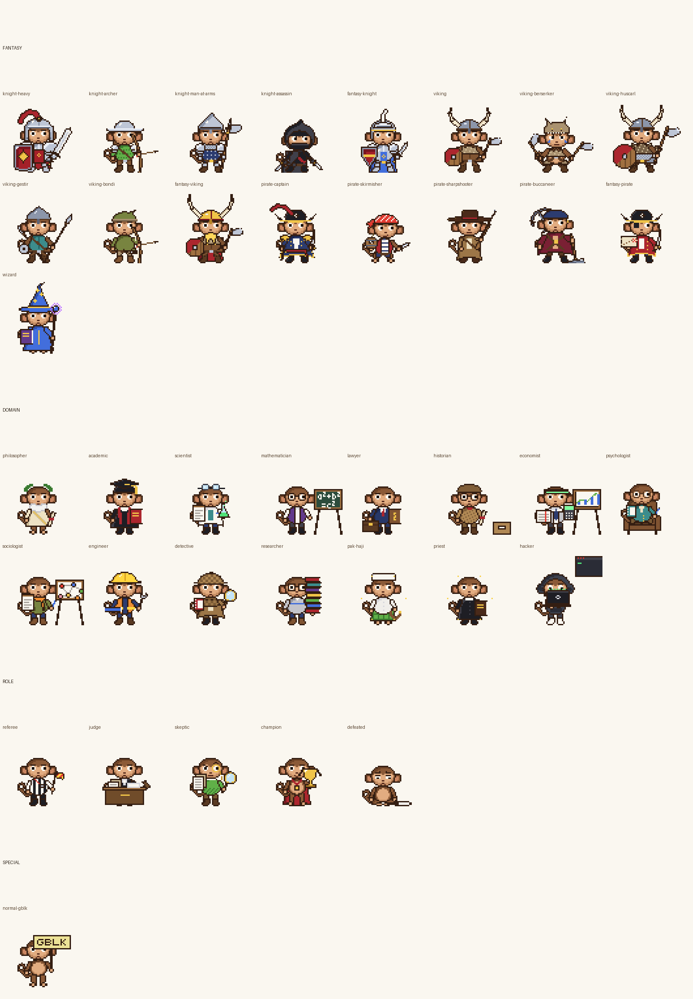
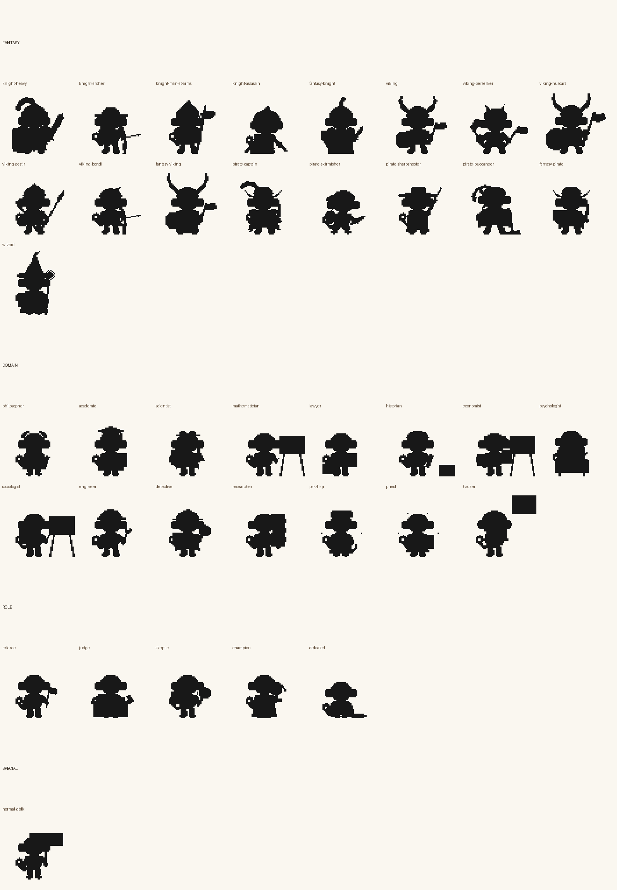
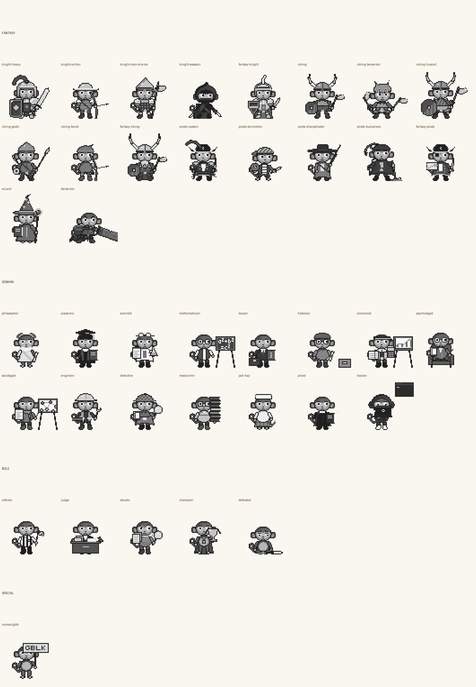

# Gobyet v2: sistem sprite karakter

Rework total karakter Gobyet: 39 karakter, 328 state animasi, 4.165 frame, 13 sprite VFX. Semua karakter berdiri
dengan kuda-kuda, senjata, dan siluet sesuai perannya, dengan kepala Gobyet yang sama persis dengan v1.

Aset v1 (`gif/`, `sheets/`, `pack/`) **tidak diubah**. v2 berdiri sendiri di folder ini. Pemilik yang memutuskan kapan
v2 menggantikan v1.

| Galeri warna | Siluet | Grayscale |
|:---:|:---:|:---:|
|  |  |  |

## Isi folder

```
v2/
  registry.json        data karakter: state, frame, durasi, loop, alias state inti, fallback, jangkar, ikon
  context.json         peta domain topik -> karakter + ikon aksesori (data untuk aplikasi non-Python)
  resolver2.js         resolver fallback untuk browser/Node (sama persis dengan src/resolve2.py)
  sheets/<id>/<state>.png   strip frame 64x64 berpalet, transparan (sumber kebenaran); Berserker 144x100
  sheets/berserker/layers/  lapisan body/weapon/vfx; damaged/ dan heavily_damaged/ untuk tingkat kerusakan
  gif/<id>/<state>.gif      pratinjau 4x
  vfx/<nama>.png            sprite VFX terpisah (tebasan, debu, hantaman, puing, percikan, darah bergaya)
  preview/                  pratinjau konfirmasi kena Berserker (tools/hit_confirm_preview.py)
  icons/<nama>.png          ikon aksesori 16x16 (domain sekunder)
  qa/                  galeri, uji skala, metrik QA visual (visual-qa.json)
  STYLE.md             tata bahasa visual v2
  src/                 rig dan definisi karakter (Python + Pillow)
  tests/test_v2.py     tes registry, aset, fallback, konteks, siluet, baseline, wajah, seam
  tools/               pratinjau, QA visual, vendor ke skill Battle Royale
```

## Membangun ulang

```bash
pip install Pillow
python3 v2/src/export2.py                 # semua karakter (sekitar 2 menit)
python3 v2/src/export2.py knight-heavy    # satu karakter (registry tetap ditulis lengkap)
python3 -m unittest v2/tests/test_v2.py   # 47 tes
python3 v2/tools/hit_confirm_preview.py   # pratinjau hantaman -> hit-stop -> darah -> recoil
python3 v2/tools/visual_qa.py             # metrik + galeri ke v2/qa
SC=3 python3 v2/tools/sheet_preview.py knight-heavy out.png   # semua state satu karakter
SC=2 python3 v2/tools/overview.py out.png knight-heavy viking-huscarl
```

## Registry dan state inti

Setiap karakter punya `core`: peta state inti arena (`idle`, `attack`, `hit`, `victory`, `defeat`) ke state khasnya,
mis. `pirate-sharpshooter.attack = shoot`, `philosopher.attack = arguing`, `defeated.idle = sit`. Semua karakter
kategori fantasy, domain, dan special punya kelima state inti sendiri (diuji).

## Fallback (bagian 62)

`src/resolve2.py` dan `resolver2.js`:

1. Rantai karakter: kelas → basis faksi → Normal GBLK. Contoh: `viking-huscarl → viking → fantasy-viking → normal-gblk`,
   `knight-archer → fantasy-knight → normal-gblk`, karakter domain dan peran → `normal-gblk`. Id tak dikenal mulai dari
   `normal-gblk`.
2. Per karakter: state yang diminta → alias inti → idle.
3. Kandidat dipakai hanya bila berkas sheet-nya ada. Bila tidak ada sama sekali, hasilnya `None`/`null`: pemanggil
   tidak menggambar apa pun. Tidak pernah gambar rusak, tidak pernah mengaku aset ada.

## Context mapping (bagian 59-60)

`src/context2.py` (hanya pustaka standar): `select(topik)` → satu karakter primer + paling banyak satu ikon aksesori.

- Kata kunci per domain (Indonesia dan Inggris), dicocokkan per kata utuh.
- Teknologi jadi primer hanya bila berdiri sendiri: "AI + filsafat" → Philosopher + laptop, "AI + matematika" →
  Mathematician + laptop, "pendidikan + teknologi" → Academic + laptop. "Hukum + sejarah" → Lawyer + gulungan arsip.
- Kata teologi umum (agama, Tuhan, teologi) → Philosopher. Hanya kata yang jelas merujuk tradisi tertentu yang memilih
  Pak Haji atau Priest; ikon aksesori kedua tradisi sama (buku polos).
- Kata yang muncul di semua teks turnamen (argumen, premis) bukan kata kunci.
- Peran turnamen tetap: referee, judge, skeptic, champion, defeated.
- Domain `hero` (pahlawan, perang, naga, monster, prajurit, keberanian, ...) memilih **Berserker Hero**, tokoh utama
  dari `pack/` (bukan karakter v2; `PACK_CHARS`). Di galeri v2 ia tidak ada, jadi resolver v2 menurunkannya ke
  fallback; arena mendapatkannya lewat `tools/vendor_skill.py`. "battle" dan "petarung" bukan kata kunci.

## Berserker: pedang raksasa

`src/berserker.py` (zirah, pedang, kerusakan) dan `src/berserker_moves.py` (state). Ringkasnya:

- Kanvas 144×100, jangkar x = 56, `baseline` = 95 (`registry.characters[].canvas/anchor`). Badan, kepala, dan
  ekor digambar rig yang sama dengan karakter lain, jadi skala Gobyet identik.
- State minimum brief: `idle ready rage run jump attack heavy_attack leap_spin_slash overhead_smash air_slash
  rage_attack combo hit miss exhausted victory defeat`. Nama brief `berserker_*` adalah alias (`aliases`).
  Varian: `idle_breath idle_grip idle_drag idle_look idle_twitch`, `attack_b`, dipilih deterministik lewat
  `Resolver.variant(id, state, seed)`.
- Tiap state punya `durations` (ms per frame) dan `events`: `hit` (titik kena relatif jangkar, arah, nama sprite
  darah per tingkat), `hitstop`, `screen_shake`, `vfx` (sudah di lapisan VFX), `phase`.
- `layers.body/weapon/vfx` ditumpuk berurutan = komposit. `damage.damaged/heavily_damaged` berisi sheet dan lapisan
  per tingkat (`Resolver.resolve(id, state, damage=...)`).
- Darah: `registry.blood.levels` (0 mati, 1-3), hanya sprite `vfx/blood_*.png`, dimunculkan mesin pada event `hit`
  bila memang kena. Tidak pernah ada piksel darah di sheet karakter (diuji).
- Arena Battle Royale sekarang bisa menggambar kanvas per karakter, tetapi `tools/vendor_skill.py` tetap melewati
  Berserker v2 ini: tidak ada domain atau peran arena yang memilihnya. Tokoh berpedang raksasa di arena adalah
  Berserker Hero dari `pack/` (lihat di bawah).

## Integrasi Battle Royale

`tools/vendor_skill.py DEST` menyalin subset aset (state inti + state peran) dan `context2.py`/`resolve2.py` ke skill
`argument-battle-royale`. Arena HTML skill memilih karakter tiap petarung dari teks argumennya dan memutar duel,
putusan juri, uji falsifikasi, dan pemenang dengan karakter Gobyet; tanpa aset, arena kembali ke sprite Clawd.

Berserker Hero (`pack/`, kanvas 128×96) ikut disalin: 8 state (idle, run, rage, attack-smash, attack-leap,
exhaustion, defeated, victory) dengan durasi per frame, `anchor` x 66 / baseline 90, `px` [2, 3] (1 piksel hero =
2/3 piksel Gobyet, dibulatkan ke atas saat digambar), `core.attack` = attack-smash, `core.hit` = exhaustion (hero tidak
punya state hit), `variants.attack` = smash dan leap bergantian, fallback viking-berserker. Arena memakainya sebagai
pembuka tayangan (run lalu rage) dan sebagai petarung untuk domain `hero`.
