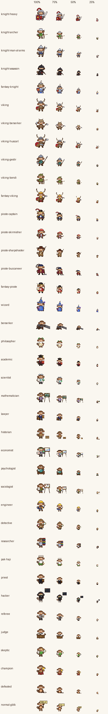

# Laporan rework Gobyet v2

Master prompt: rework total sistem sprite karakter Gobyet untuk Battle Royale Argumen. Repo Gobyet branch `claude/gobyet-fase2` (folder `v2/`), repo Bertahan-Bukan-hidup branch `claude/argument-battle-royale-skill-3wzgmg` (integrasi arena). Tidak ada merge, tidak ada force-push, tidak ada PR baru.

Ringkasnya: **38 karakter, 305 state, 3871 frame** dibuat ulang di rig v2 (Gobyet berdiri, kanvas 64×64). Aset v1 tidak diubah (hash 27 + 89 + 242 tetap cocok). Arena Battle Royale sekarang memakai karakter Gobyet yang dipilih dari isi argumen, dengan fallback ke Clawd bila aset tidak ada.

Galeri interaktif (semua state beranimasi, mode warna/grayscale/siluet, uji skala): https://claude.ai/artifact/KVoj422ugTV2PqKmn6tkVQ (privat; versi repo: `v2/gallery.html`).


## CHARACTER YANG BERHASIL DIREWORK

Semua 38 id dari brief punya aset v2 lengkap (sheet PNG 1×, GIF 4×, entri registry). Kolom siluet berisi penanda siluet yang tercatat di registry.

### FANTASY (17)

| id | nama | faksi/peran | siluet | state |
|---|---|---|---|---:|
| `knight-heavy` | Heavy Knight Gobyet | knights · heavy | large helmet, plume, broad pauldrons, tower shield, greatsword | 8 |
| `knight-archer` | Archer Gobyet | knights · ranged | kettle hat wide brim, longbow, quiver on back | 9 |
| `knight-man-at-arms` | Man-at-Arms Gobyet | knights · versatile | pointed bascinet, halberd long, brigandine, wide stance | 9 |
| `knight-assassin` | Assassin Gobyet | knights · stealth | hood peak, asymmetric cloak, dual daggers, low stance, narrow | 9 |
| `fantasy-knight` | Fantasy Knight Gobyet | fantasy · archetype | visor helm white plume, blue cape, kite shield, longsword | 5 |
| `viking` | Viking Gobyet | vikings · base | horned helmet, fur mantle, round shield, axe | 5 |
| `viking-berserker` | Berserker Gobyet | vikings · rage | wolf pelt hood, dual axes, bare arms, low aggressive stance | 8 |
| `viking-huscarl` | Huscarl Gobyet | vikings · heavy | big horned helmet, huge fur mantle, large round shield, dane axe | 6 |
| `viking-gestir` | Gestir Gobyet | vikings · spear | conical helmet, long spear, javelins on back, small shield | 8 |
| `viking-bondi` | Bondi Gobyet | vikings · ranged | cloth cap, simple tunic, flatbow, seax | 5 |
| `fantasy-viking` | Fantasy Viking Gobyet | fantasy · archetype | giant horns, braided beard, red cape, round shield, axe | 5 |
| `pirate-captain` | Pirate Captain Gobyet | pirates · leader | big tricorn feather, long flared coat, epaulettes, cutlass, pistol | 8 |
| `pirate-skirmisher` | Pirate Skirmisher Gobyet | pirates · mobility | bandana tails, striped shirt open vest, powder keg, short blade, bare feet agile | 10 |
| `pirate-sharpshooter` | Pirate Sharpshooter Gobyet | pirates · long-range | wide flat hat, long rifle, light long coat | 8 |
| `pirate-buccaneer` | Pirate Buccaneer Gobyet | pirates · heavy | big body, heavy coat, giant hammer, anchor on back, crossbelts | 7 |
| `fantasy-pirate` | Fantasy Pirate Gobyet | fantasy · archetype | tricorn, eyepatch, red coat, cutlass, telescope, treasure map | 5 |
| `wizard` | Wizard Gobyet | fantasy · magic | tall pointed hat, floor robe, tall staff, spellbook | 9 |

### DOMAIN (15)

| id | nama | faksi/peran | siluet | state |
|---|---|---|---|---:|
| `philosopher` | Philosopher Gobyet | philosophy | toga drape, laurel, scroll, white beard | 9 |
| `academic` | Academic Gobyet | academia | mortarboard, long gown, book | 9 |
| `scientist` | Scientist Gobyet | science | long lab coat, goggles on forehead, flask, clipboard | 10 |
| `mathematician` | Mathematician Gobyet | math | chalkboard with formula, compass, purple vest | 10 |
| `lawyer` | Lawyer Gobyet | law | dark suit red tie, thick law book, briefcase, documents | 9 |
| `historian` | Historian Gobyet | history | flat cap, tweed jacket, long timeline scroll, archive box | 9 |
| `economist` | Economist Gobyet | economics | green visor, vest tie, chart board, calculator | 9 |
| `psychologist` | Psychologist Gobyet | psychology | wingback armchair seated, cardigan, big glasses, notebook, inkblot card | 9 |
| `sociologist` | Sociologist Gobyet | sociology | field jacket scarf, network diagram board, clipboard | 8 |
| `engineer` | Engineer Gobyet | engineering | hard hat, hi vis vest, wrench, blueprint | 9 |
| `detective` | Detective Gobyet | investigation | deerstalker, trench coat cape, big magnifier, notebook | 10 |
| `researcher` | Researcher Gobyet | evidence | book stack, laptop, papers, glasses, sweater | 9 |
| `pak-haji` | Pak Haji Gobyet | theology | kopiah putih, baju koko, sarung, tasbih | 9 |
| `priest` | Priest Gobyet | theology | cassock, white collar, plain book | 9 |
| `hacker` | Hacker Gobyet | technology | hoodie with ear hood, laptop, floating terminal, screen glow | 10 |

### ROLE (5)

| id | nama | faksi/peran | siluet | state |
|---|---|---|---|---:|
| `referee` | Referee Gobyet | tournament-control | striped shirt, whistle, flag | 6 |
| `judge` | Judge Gobyet | judging | judge robe jabot, desk, score sheet, gavel | 6 |
| `skeptic` | Skeptic Gobyet | falsification | sweater, monocle, magnifier, claim card, raised brow | 10 |
| `champion` | Champion Gobyet | winner | giant trophy, red cape, medal | 5 |
| `defeated` | Defeated Gobyet | loser | slumped sitting, fallen sword, tired face | 5 |

### SPECIAL (1)

| id | nama | faksi/peran | siluet | state |
|---|---|---|---|---:|
| `normal-gblk` | Normal GBLK Gobyet | default | plain gobyet, big gblk sign | 11 |

## CHARACTER YANG MASIH MENGGUNAKAN ASSET EXISTING

- **Tidak ada karakter v2 yang memakai sprite v1.** Yang dipakai ulang dari v1 hanya fungsi `head()` (kepala, telinga, mata, ekspresi) dan `tail()`, sengaja, karena itu identitas Gobyet yang terkunci.
- **Aset v1 tetap ada dan tidak diubah:** 163 sel pack v1 (termasuk 7 animasi asli seperti `makan-pisang`, `marah-debug`, `ngopi-santai`, `hacker`, `detektif-bug`, `kondangan`, `wisuda`), `pack/manifest.json`, dan `pack/preview.html`. Bukti: `sha256sum -c` untuk `sha256-asli.txt` 27 OK, `sha256-disetujui.txt` 89 OK, `sha256-dibuat.txt` 242 OK.
- **Kostum v1 yang tidak ada di brief tidak dibuat ulang:** `gamer` dan `normal` polos (v2 memakai `normal-gblk` sebagai karakter default). `knight` dan `pirate` v1 diwakili `fantasy-knight` dan `fantasy-pirate` v2.
- **Di luar arena HTML, skill Battle Royale masih memakai Clawd:** flipbook teks di chat, `abr.py watch` (terminal), status line, banner SVG README, dan social preview. Arena HTML memakai Gobyet dan kembali ke Clawd hanya bila aset Gobyet tidak ada.

## CHARACTER YANG BELUM MEMILIKI ASSET

Tidak ada: semua 38 id di brief punya aset, dan semua state yang disebut brief per karakter ada (diuji `Registry.test_brief_states`). Yang memang belum dibuat:

- **Animasi jalan/lari** hanya ada pada `knight-heavy/walk`, `pirate-skirmisher/run`, `referee/enter`/`exit`, dan `defeated/leave`. Di arena, karakter lain digeser masuk sambil memutar idle.
- **State di luar daftar brief** untuk Viking dasar, Huscarl, Bondi, dan fantasy-*: brief tidak memberi daftar state, jadi saya buat state inti (idle, attack, hit, victory, defeat) plus `guard` untuk Huscarl.
- **Varian gaya** (mis. Heavy Knight dengan pedang dua tangan tanpa perisai) tidak dibuat; dipilih satu kombinasi pedang besar + perisai menara.

## ANIMATION YANG TERSEDIA

Format: `state` (frame × ms, `L` = loop, `1×` = sekali, `+h` = frame terakhir ditahan). Alias state inti arena ditulis sebagai `inti → state`.

| id | state | inti arena |
|---|---|---|
| `knight-heavy` | `idle` (12×130 L), `walk` (12×130 L), `guard` (8×140 L), `attack` (14×90 1×), `block` (10×100 1×), `hit` (10×100 1×), `victory` (16×110 L), `defeat` (16×120 1×+h) | sama dengan nama state |
| `knight-archer` | `idle` (12×130 L), `aim` (8×130 L), `draw` (10×110 1×), `fire` (8×80 1×), `recoil` (8×100 1×), `attack` (16×90 1×), `hit` (10×100 1×), `victory` (16×110 L), `defeat` (16×120 1×+h) | sama dengan nama state |
| `knight-man-at-arms` | `idle` (12×130 L), `ready` (8×120 L), `attack` (12×90 1×), `swing` (14×90 1×), `block` (12×100 1×), `recover` (10×110 1×), `hit` (10×100 1×), `victory` (16×110 L), `defeat` (16×120 1×+h) | sama dengan nama state |
| `knight-assassin` | `idle` (12×130 L), `stealth` (12×120 L), `attack` (12×70 1×), `backstab` (10×80 1×), `smoke` (12×100 1×), `disappear` (12×100 1×+h), `hit` (10×100 1×), `victory` (16×110 L), `defeat` (16×110 1×+h) | sama dengan nama state |
| `fantasy-knight` | `idle` (12×130 L), `attack` (12×90 1×), `hit` (10×100 1×), `victory` (16×110 L), `defeat` (16×120 1×+h) | sama dengan nama state |
| `viking` | `idle` (12×130 L), `attack` (14×90 1×), `hit` (10×100 1×), `victory` (16×110 L), `defeat` (16×120 1×+h) | sama dengan nama state |
| `viking-berserker` | `idle` (12×110 L), `rage` (6×70 L), `roar` (12×100 1×), `axe_attack` (14×80 1×), `double_attack` (12×80 1×), `hit` (10×90 1×), `victory` (16×100 L), `defeat` (16×120 1×+h) | attack → double_attack |
| `viking-huscarl` | `idle` (12×140 L), `guard` (8×140 L), `attack` (16×100 1×), `hit` (10×110 1×), `victory` (16×120 L), `defeat` (16×130 1×+h) | sama dengan nama state |
| `viking-gestir` | `idle` (12×130 L), `aim` (8×130 L), `throw` (10×80 1×), `recover` (6×110 1×), `melee` (10×90 1×), `hit` (10×100 1×), `victory` (16×110 L), `defeat` (16×120 1×+h) | attack → throw |
| `viking-bondi` | `idle` (12×130 L), `attack` (14×90 1×), `hit` (10×100 1×), `victory` (16×110 L), `defeat` (16×120 1×+h) | sama dengan nama state |
| `fantasy-viking` | `idle` (12×130 L), `attack` (14×90 1×), `hit` (10×100 1×), `victory` (16×110 L), `defeat` (16×120 1×+h) | sama dengan nama state |
| `pirate-captain` | `idle` (12×130 L), `command` (12×110 1×), `sword` (12×90 1×), `pistol` (12×100 1×), `point` (12×110 1×), `victory` (16×110 L), `hit` (10×100 1×), `defeat` (16×120 1×+h) | attack → sword |
| `pirate-skirmisher` | `idle` (12×110 L), `run` (8×80 L), `dash` (10×70 1×), `attack` (10×80 1×), `throw` (12×80 1×), `explosion` (12×90 1×), `recover` (6×110 1×), `hit` (10×90 1×), `victory` (16×100 L), `defeat` (16×120 1×+h) | sama dengan nama state |
| `pirate-sharpshooter` | `idle` (12×140 L), `aim` (8×150 L), `shoot` (12×100 1×), `recoil` (8×90 1×), `reload` (14×100 1×), `victory` (16×110 L), `hit` (10×100 1×), `defeat` (16×120 1×+h) | attack → shoot |
| `pirate-buccaneer` | `idle` (12×150 L), `heavy_attack` (14×100 1×), `hammer_smash` (16×90 1×), `anchor_attack` (14×100 1×), `hit` (10×110 1×), `victory` (16×120 L), `defeat` (16×130 1×+h) | attack → hammer_smash |
| `fantasy-pirate` | `idle` (12×130 L), `attack` (12×90 1×), `hit` (10×100 1×), `victory` (16×110 L), `defeat` (16×120 1×+h) | sama dengan nama state |
| `wizard` | `idle` (12×130 L), `cast` (12×100 1×), `spell_success` (12×100 1×), `spell_fail` (16×110 1×+h), `read` (12×140 L), `confused` (12×120 L), `hit` (10×100 1×), `victory` (16×110 L), `defeat` (16×120 1×+h) | attack → cast |
| `philosopher` | `idle` (12×140 L), `thinking` (16×120 L), `reading` (12×140 L), `contemplating` (16×140 L), `arguing` (12×110 L), `pointing` (10×110 1×), `hit` (10×100 1×), `victory` (16×110 L), `defeat` (16×120 1×+h) | attack → arguing |
| `academic` | `idle` (12×140 L), `read` (12×140 L), `write` (12×110 L), `lecture` (12×120 L), `think` (16×120 L), `present` (12×120 L), `hit` (10×100 1×), `victory` (16×110 L), `defeat` (16×120 1×+h) | attack → lecture |
| `scientist` | `idle` (12×130 L), `observe` (12×120 L), `experiment` (12×110 L), `write` (12×110 L), `compare` (12×130 L), `shocked` (10×100 1×), `success` (12×110 1×), `hit` (10×100 1×), `victory` (16×110 L), `defeat` (16×120 1×+h) | attack → experiment |
| `mathematician` | `idle` (12×140 L), `calculate` (16×110 L), `write` (12×110 L), `erase` (12×110 L), `think` (16×120 L), `eureka` (12×110 1×), `confused` (12×120 L), `hit` (10×100 1×), `victory` (16×110 L), `defeat` (16×120 1×+h) | attack → write |
| `lawyer` | `idle` (12×140 L), `read` (12×140 L), `present` (12×120 L), `object` (10×100 1×), `point` (10×110 1×), `judge` (10×100 L), `hit` (10×100 1×), `victory` (16×110 L), `defeat` (16×120 1×+h) | attack → object |
| `historian` | `idle` (12×140 L), `read_archive` (12×140 L), `compare` (12×130 L), `search` (12×120 L), `write` (12×110 L), `discover` (12×120 L), `hit` (10×100 1×), `victory` (16×110 L), `defeat` (16×120 1×+h) | attack → discover |
| `economist` | `idle` (12×140 L), `calculate` (12×100 L), `graph` (12×120 L), `check` (12×130 L), `shocked` (10×100 1×), `analyze` (16×120 L), `hit` (10×100 1×), `victory` (16×110 L), `defeat` (16×120 1×+h) | attack → graph |
| `psychologist` | `idle` (12×140 L), `observe` (12×130 L), `write` (12×110 L), `think` (16×120 L), `analyze` (12×120 L), `suspicious` (12×130 L), `hit` (10×100 1×), `victory` (16×110 L), `defeat` (16×120 1×+h) | attack → analyze |
| `sociologist` | `idle` (12×140 L), `observe_crowd` (12×130 L), `draw_network` (12×110 L), `compare` (12×130 L), `analyze` (12×120 L), `hit` (10×100 1×), `victory` (16×110 L), `defeat` (16×120 1×+h) | attack → analyze |
| `engineer` | `idle` (12×130 L), `measure` (12×110 L), `design` (12×110 L), `build` (6×100 L), `inspect` (12×120 L), `fix` (8×100 L), `hit` (10×100 1×), `victory` (16×110 L), `defeat` (16×120 1×+h) | attack → build |
| `detective` | `idle` (12×140 L), `search` (12×120 L), `inspect` (12×120 L), `magnify` (12×120 L), `discover` (12×110 1×), `suspicious` (12×130 L), `point` (10×110 1×), `hit` (10×100 1×), `victory` (16×110 L), `defeat` (16×120 1×+h) | attack → point |
| `researcher` | `idle` (12×140 L), `search` (12×120 L), `read` (12×140 L), `compare` (12×130 L), `write` (12×100 L), `archive` (12×110 L), `hit` (10×100 1×), `victory` (16×110 L), `defeat` (16×120 1×+h) | attack → compare |
| `pak-haji` | `idle` (12×150 L), `read` (12×150 L), `think` (16×130 L), `present` (12×130 L), `calm` (16×150 L), `hit` (10×110 1×), `victory` (16×130 L), `defeat` (16×130 1×+h), `consult` (12×140 L) | attack → present |
| `priest` | `idle` (12×150 L), `read` (12×150 L), `think` (16×130 L), `present` (12×130 L), `calm` (16×150 L), `hit` (10×110 1×), `victory` (16×130 L), `defeat` (16×130 1×+h), `judge` (12×140 L) | attack → present |
| `hacker` | `idle` (12×140 L), `typing` (12×80 L), `debugging` (12×120 L), `error` (14×150 1×+h), `panic` (6×80 L), `success` (12×110 1×), `hit` (10×100 1×), `attack` (12×80 1×), `victory` (16×110 L), `defeat` (16×120 1×+h) | sama dengan nama state |
| `referee` | `idle` (12×130 L), `enter` (12×100 1×), `exit` (12×100 1×), `signal_start` (12×100 1×), `signal_stop` (12×100 1×), `point_winner` (12×100 1×) | sama dengan nama state |
| `judge` | `idle` (12×140 L), `read` (12×140 L), `compare` (12×130 L), `write_score` (12×110 L), `think` (16×120 L), `finalize` (12×100 1×) | sama dengan nama state |
| `skeptic` | `idle` (12×140 L), `inspect` (14×150 1×+h), `squint` (8×140 L), `point` (10×110 1×), `contradiction_found` (12×110 1×), `counterattack` (12×90 1×), `falsification` (12×100 1×), `hit` (10×100 1×), `victory` (16×110 L), `defeat` (16×120 1×+h) | attack → counterattack |
| `champion` | `idle` (12×140 L), `trophy_raise` (16×110 L), `victory` (16×110 L), `celebrate` (8×100 L), `dance` (16×120 L) | victory → trophy_raise |
| `defeated` | `hit` (10×100 1×), `stagger` (9×110 L), `fall` (16×120 1×+h), `sit` (12×140 L), `leave` (16×110 1×) | defeat → fall, idle → sit |
| `normal-gblk` | `idle` (12×140 L), `think` (16×120 L), `confused` (12×120 L), `sign_raise` (12×100 L), `victory` (16×110 L), `hit` (10×100 1×), `defeat` (16×120 1×+h), `dance_01` (16×120 L), `dance_02` (16×120 L), `dance_03` (16×120 L), `victory_dance` (16×120 L) | attack → sign_raise |

Contoh perilaku khusus yang diminta brief:

- Hacker `error`: layar menampilkan error, Gobyet menatap layar, diam, lalu menatap penonton (frame terakhir ditahan).
- Berserker `rage`: pose lebih rendah, wajah memerah, kapak terangkat, 70 ms per frame (lebih cepat), asap di kepala.
- Wizard `spell_fail`: POOF asap, wajah berjelaga, lalu tanda tanya.
- Skeptic `inspect`: melihat klaim, diam, menyipit, menunjuk premis.
- Defeat berbeda per kelas: Heavy jatuh berat dengan debu, Archer busur jatuh dulu, Assassin mundur di balik asap, Viking perisai turun dan berlutut, Pirate topi jatuh, Wizard tongkat jatuh + asap, Hacker laptop error, GBLK papan roboh.
- Normal GBLK: `dance_01`/`02`/`03` dan `victory_dance` 16 frame × 120 ms dengan beat di f0, f4, f8, f12.

## FALLBACK SYSTEM

Diterapkan sama di Python (`v2/src/resolve2.py`, disalin ke skill sebagai `gobyet_resolve.py`) dan JavaScript (`v2/resolver2.js`, logika yang sama di arena). Tes `test_js_resolver_matches_python` memastikan keduanya memberi hasil yang sama.

1. **Rantai karakter:** kelas → basis faksi → `normal-gblk`. Knight → `fantasy-knight`, Viking → `viking` → `fantasy-viking`, Pirate → `fantasy-pirate`; karakter domain dan peran langsung ke `normal-gblk`. Id yang tidak dikenal mulai dari `normal-gblk`.
2. **Per karakter:** state yang diminta → alias state inti (mis. `attack` → `shoot` untuk Sharpshooter) → idle.
3. **Berkas:** kandidat dipakai hanya bila sheet-nya benar-benar ada. Kalau tidak ada sama sekali, hasilnya `None`/`null` dan pemanggil tidak menggambar apa pun. Tidak pernah tampil gambar rusak, tidak pernah mengklaim aset ada.
4. **Arena:** bila seluruh aset Gobyet tidak terbaca, `gobyet.web_data()` mengembalikan `None` dan arena memutar sprite Clawd seperti sebelumnya (diuji di selftest dan e2e).

## CONTEXT MAPPING

`v2/src/context2.py` (hanya pustaka standar, disalin ke skill sebagai `gobyet_context.py`). `select(topik)` menghasilkan satu karakter primer dan paling banyak satu ikon aksesori sekunder (tidak pernah tiga kostum).

| domain | karakter | ikon sekunder | contoh kata kunci |
|---|---|---|---|
| philosophy | `philosopher` | scroll | filsafat, filosofi, filosofis, filsuf, philosophy, philosophical |
| academic | `academic` | book | pendidikan, education, sekolah, school, universitas, university |
| science | `scientist` | flask | sains, science, ilmiah, scientific, ilmuwan, scientist |
| math | `mathematician` | formula | matematika, mathematics, math, maths, aljabar, algebra |
| technology | `hacker` | laptop | teknologi, technology, tech, ai, kecerdasan buatan, artificial intelligence |
| law | `lawyer` | lawbook | hukum, law, legal, undang-undang, konstitusi, constitution |
| history | `historian` | oldscroll | sejarah, history, historis, historical, sejarawan, historian |
| economics | `economist` | calculator | ekonomi, economy, economics, ekonom, economist, keuangan |
| psychology | `psychologist` | notebook | psikologi, psychology, psikolog, psychologist, kesehatan mental, mental health |
| sociology | `sociologist` | network | sosiologi, sociology, sosiolog, sociologist, masyarakat, society |
| engineering | `engineer` | wrench | teknik sipil, rekayasa, engineering, insinyur, engineer, konstruksi |
| islam | `pak-haji` | book | islam, islami, islamic, muslim, quran, al-quran |
| christianity | `priest` | book | kristen, kristiani, christian, christianity, katolik, catholic |
| investigation | `detective` | magnifier | investigasi, investigation, penyelidikan, detektif, detective, misteri |
| knight | `fantasy-knight` | sword | ksatria, knight, abad pertengahan, medieval, kastil, castle |
| viking | `fantasy-viking` | axe | viking, vikings, norse, nordik, nordic, skandinavia |
| pirate | `fantasy-pirate` | telescope | bajak laut, pirate, pirates, perompak, maritim, maritime |
| magic | `wizard` | star | sihir, magic, penyihir, wizard, fantasi, fantasy |
| evidence | `researcher` | papers | riset, research, penelitian, peneliti, researcher, bukti |
| falsification | `skeptic` | question | skeptis, skeptisisme, skeptic, skepticism, falsifikasi, falsification |
| sport | `referee` | flag | olahraga, sport, sports, sepak bola, football, soccer |

Aturan:

- Skor = jumlah kata kunci yang cocok per kata utuh (frasa dua kata berbobot 2). Tanpa kecocokan: `normal-gblk`.
- **Teknologi jadi primer hanya bila berdiri sendiri** (bagian 60): "AI + filsafat" → Philosopher + laptop, "AI + matematika" → Mathematician + laptop, "pendidikan + teknologi" → Academic + laptop, "hukum + sejarah" → Lawyer + gulungan arsip.
- **Teologi:** hanya kata yang jelas merujuk tradisi tertentu memilih Pak Haji atau Priest. Kata umum (agama, Tuhan, teologi) memilih Philosopher. Ikon aksesori kedua tradisi sama (buku polos).
- Kata yang ada di semua teks turnamen (argumen, premis) bukan kata kunci; tanpa aturan ini semua petarung menjadi Philosopher (bug yang ditemukan e2e lalu diperbaiki).
- **Peran turnamen tetap:** Referee membuka babak, Judge mengetuk palu saat putusan, Skeptic memimpin uji falsifikasi, Champion memegang piala dengan label "TOURNAMENT WINNER", yang kalah memutar defeat kelasnya sendiri.
- **Per petarung di arena:** karakter dipilih dari judul, posisi, dan tesis argumennya; tanpa kecocokan, ikut topik. Bila dua petarung satu duel mendapat karakter sama, petarung kedua ditampilkan dengan varian tukar peran (karakter domain sekundernya + ikon domain primernya). Ini hanya tampilan, hasil turnamen tidak terpengaruh.

Contoh hasil pada run contoh nyata ("Apakah AI bisa disebut memahami bahasa?", 16 petarung): 15 Philosopher dan 1 Historian, masing-masing dengan ikon aksesori sesuai teksnya; final F0005 (Philosopher + laptop) lawan F0009 (varian tukar peran: Hacker + gulungan).

## FILE YANG DIUBAH

### Repo Gobyet (`claude/gobyet-fase2`)

Commit: `47526b9 v2: siluet Archer/Bondi/Researcher, QA final, galeri, dokumentasi`, `18a41a2 v2 context2: kata umum turnamen (argumen, premis) bukan kata kunci filsafat`, `ec2f530 v2: aturan konteks bagian 60, varian tukar peran, alat vendor skill`, `2696968 v2: ekspor, registry, fallback, context mapping, tes + QA visual`, `3ae0be1 v2 WIP: rig Gobyet berdiri + 38 karakter (305 state)`

- Baru: `v2/src/` (rig2, char2, items2, gear2, props2, moves, knights, vikings, pirates, domain, special2, cast, export2, context2, resolve2), `v2/tests/test_v2.py`, `v2/tools/` (sheet_preview, overview, frames_zoom, visual_qa, vendor_skill, build_gallery), `v2/registry.json`, `v2/context.json`, `v2/resolver2.js`, `v2/sheets/` (305), `v2/gif/` (305), `v2/icons/` (19), `v2/qa/`, `v2/STYLE.md`, `v2/README.md`, `v2/gallery.html`, laporan ini.
- Diubah: `README.md` (bagian singkat v2).
- **Tidak diubah:** `src/`, `gif/`, `sheets/`, `pack/` (v1).

### Repo Bertahan-Bukan-hidup (`claude/argument-battle-royale-skill-3wzgmg`)

Branch ini sebelumnya sudah di-merge lewat PR #5 tanpa commit tambahan, jadi saya mulai ulang dari `main` terbaru (nama branch sama, tanpa force-push karena maju lurus).

- Baru: `scripts/engine/gobyet.py` (lapisan visual), `scripts/engine/gobyet_context.py` dan `gobyet_resolve.py` (salinan dari Gobyet), `assets/gobyet/` (registry subset, 186 sheet, 19 ikon, 406 KB), `.github/scripts/e2e_arena.js`, `.github/readme/record_arena.js`.
- Diubah: `scripts/engine/arena.py` (data Gobyet + `cast` di ringkasan + demo), `templates/arena.html` (penggambar Gobyet, duel, putusan Judge, falsifikasi Skeptic, pemenang Champion, cadangan Clawd), `scripts/selftest.py` (`check_gobyet`), `SKILL.md` dan `README.md` skill (deskripsi arena + bagian "Karakter Gobyet di arena"), README utama, `.github/readme/arena.gif` (rekaman ulang), `examples/sample-run/arena.html`, `arena-data.json`, `arena-live.json` (diregenerasi dengan `abr.py arena --run`).
- Modul turnamen (`phases`, `judging`, `bracket`, `validate`, dll.) tidak diubah dan tidak mengimpor Gobyet (diuji).

## TEST RESULT

Semua tes di bawah benar-benar dijalankan di sesi ini; keluaran mentah dikutip.

1. **Tes unit v2** `python3 -m unittest v2/tests/test_v2.py`: registry (id dan state brief, fallback berakhir di akar, state inti petarung, label Champion), sinkron registry-kode, aset (ukuran sheet, alfa biner, durasi GIF), resolver (alias, fallback berkas hilang, None, kesetaraan JS-Python lewat Node), konteks (contoh bagian 59-60, paritas teologi, batas kata), visual (IoU siluet dalam faksi ≤ 0,80, pasangan bagian 54, lantai, wajah terlihat, seam loop), paritas teologi.

```
----------------------------------------------------------------------
Ran 34 tests in 7.420s

OK
```

2. **Selftest skill** `python3 selftest.py`: animasi, `check_gobyet` (cast demo, data sprite, peran, label, data URI, fallback, aset hilang → None, ukuran halaman < 2,5 MB, pemisahan dari logika turnamen), serve, live, lalu 4 run turnamen sintetis lengkap (1000/150/40/120 petarung) yang menulis arena dengan data Gobyet di tiap langkah.

```
{"animation": "ok", "gobyet": {"karakter": 38, "petarung_demo": {"C01": "hacker", "C02": "philosopher", "C03": "philosopher", "C04": "researcher"}}, "serve": "ok", "live": "ok"}
{"mode": "efficient", "population": 1000, "dq_rate": 0.04, "seconds": 36.3, "packets": 82, "iterations": 18, "status_counts": {"valid": 915, "duplicate": 50, "dq": 35}, "generation_rounds": 1, "rounds": 10, "champion": "F0485", "winner": "F0559", "tamper_detected_by": ["champion", "round_files", "verdicts"], "flags": [], "run_dir": null}
{"mode": "balanced", "population": 150, "dq_rate": 0.04, "seconds": 26.8, "packets": 74, "iterations": 23, "status_counts": {"valid": 141, "duplicate": 6, "dq": 3}, "generation_rounds": 1, "rounds": 8, "champion": "F0142", "winner": "F0107", "tamper_detected_by": ["champion", "round_files", "verdicts"], "flags": ["score_fallback"], "run_dir": null}
{"mode": "full", "population": 40, "dq_rate": 0.04, "seconds": 18.8, "packets": 69, "iterations": 21, "status_counts": {"valid": 37, "duplicate": 2, "dq": 1}, "generation_rounds": 1, "rounds": 6, "champion": "F0011", "winner": "F0034", "tamper_detected_by": ["champion", "round_files", "verdicts"], "flags": ["panel_reduced"], "run_dir": null}
{"mode": "balanced", "population": 120, "dq_rate": 0.25, "seconds": 20.0, "packets": 74, "iterations": 24, "status_counts": {"dq": 45, "valid": 110, "duplicate": 7}, "generation_rounds": 2, "rounds": 7, "champion": "F0107", "winner": "F0011", "tamper_detected_by": ["champion", "round_files", "verdicts"], "flags": ["score_fallback"], "run_dir": null}
SEMUA UJI LULUS
```

3. **E2E arena** `node .github/scripts/e2e_arena.js` (Chromium headless, demo diputar 4×):

```
LULUS data Gobyet tersemat  — 38 karakter
LULUS tiap petarung punya karakter  — {"C01":{"char":"hacker","acc":null,"reason":"primer technology (skor 2)"},"C02":{"char":"philosopher","acc":"notebook","reason":"primer philosophy (skor 2), sekunder psychology (skor 2) sebagai aksesori notebook","alt":"psychologist","alt_acc":"scroll"},"C03":{"char":"philosopher","acc":null,"reason":"primer philosophy (skor 3)"},"C04":{"char":"researcher","acc":"scroll","reason":"primer evidence (skor 2), sekunder philosophy (skor 1) sebagai aksesori scroll","alt":"philosopher","alt_acc":"papers"}}
LULUS petarung demo memakai karakter berbeda  — hacker, philosopher, researcher
LULUS semua sprite dan ikon termuat  — 204 gambar, rusak 0
LULUS label TOURNAMENT WINNER tampil  — Penguji T1: SURVIVED_WITH_DAMAGE | Hasil uji: SURVIVED_WITH_DAMAGE | TOURNAMENT WINNER: C03
LULUS tidak ada ABSOLUTE TRUTH
LULUS duel diputar  — 13 sampel dengan HUD duel
LULUS tanpa error halaman (Gobyet)  —  [info: 2 request font eksternal gagal di sandbox]
LULUS cadangan Clawd: data Gobyet kosong
LULUS cadangan Clawd: kanvas tergambar  — 8300 piksel sampel
LULUS cadangan Clawd: tanpa error halaman
E2E LULUS
```

4. **Hash v1:** `sha256sum -c` → asli 27 OK, disetujui 89 OK, dibuat 242 OK.
5. **Paket skill:** `python3 .github/scripts/package_skill.py` → zip 472 KB (250 berkas; 210 berkas Gobyet, 295 KB terkompres).

## VISUAL QA

Metrik dari `python3 v2/tools/visual_qa.py` (`v2/qa/visual-qa.json`).

### Silhouette test

IoU siluet idle antar-kelas dalam satu faksi (lebih kecil = lebih berbeda). v1 punya 0,81–0,95 untuk pasangan yang sama.

| faksi | IoU maksimum | tiga pasangan paling mirip |
|---|---:|---|
| knights | 0.724 | knight-archer vs knight-man-at-arms 0.724; knight-archer vs knight-assassin 0.659; knight-heavy vs knight-man-at-arms 0.628 |
| vikings | 0.749 | viking-gestir vs viking-bondi 0.749; viking vs viking-gestir 0.707; viking vs viking-huscarl 0.701 |
| pirates | 0.705 | pirate-captain vs pirate-buccaneer 0.705; pirate-captain vs pirate-sharpshooter 0.701; pirate-skirmisher vs pirate-sharpshooter 0.666 |

Uji pengenalan siluet adalah **proksi otomatis, bukan pengenalan manusia**: siluet frame lain dicocokkan ke galeri siluet dengan IoU tertinggi.

| proksi | 100% | 75% | 50% | 25% |
|---|---:|---:|---:|---:|
| galeri idle saja, query idle/attack/victory | 93/107 (87%) | 92/107 (86%) | 90/107 (84%) | 79/107 (74%) |
| galeri semua pose inti (penonton kenal roster) | 96/107 (90%) | 95/107 (89%) | 95/107 (89%) | 89/107 (83%) |

Salah tebak (proksi roster, 100%): knight-man-at-arms/attack->researcher, knight-assassin/attack->economist, fantasy-knight/attack->knight-man-at-arms, viking/attack->pirate-skirmisher, viking-berserker/attack->knight-assassin, viking-huscarl/attack->knight-heavy, viking-gestir/attack->academic, fantasy-viking/attack->knight-assassin, pirate-captain/attack->knight-man-at-arms, pirate-buccaneer/attack->psychologist, fantasy-pirate/attack->pirate-skirmisher.
Hampir semuanya frame tengah ayunan serangan (senjata berada di posisi yang tidak ada di pose galeri). Pada pose idle, semua karakter yang disebut di daftar siluet bagian 55 dikenali benar pada skala 100%.


### Grayscale test

| pasangan bagian 54 | IoU siluet | selisih grayscale rata-rata (0-255) |
|---|---:|---:|
| knight-heavy vs viking-huscarl | 0.703 | 87.4 |
| pirate-captain vs pirate-sharpshooter | 0.701 | 91.3 |
| scientist vs academic | 0.793 | 84.0 |

Heavy Knight dan Huscarl berbeda material, helm, perisai, dan senjata; Captain dan Sharpshooter berbeda topi dan senjata; Scientist (jas lab, kacamata pelindung, labu) dan Academic (toga, topi toga, buku) berbeda. Semua pasangan lulus ambang tes (IoU ≤ 0,80 dan > 300 piksel beda grayscale).


### Scale test

`v2/qa/uji-skala.png` menampilkan tiap karakter pada 100/75/50/25% ukuran piksel asli (64/48/32/16 px). Angka proksi pengenalan di atas dihitung pada keempat skala. Pada 25% (16 px) proksi roster masih 83%; yang paling sering tertukar adalah pose serangan dan pasangan domain berpapan (Economist/Mathematician) serta Skeptic/Researcher.



### Animation test

- **Lantai:** piksel di bawah lantai: 0 frame. Idle yang tidak menapak di y = 58: 0 frame. Semua 3871 frame diuji.
- **Identitas:** wajah Gobyet (≥ 25 piksel krem wajah) terlihat di setiap frame, kecuali frame yang sengaja kosong (Assassin hilang di balik asap, Defeated berjalan keluar, Referee masuk dari tepi). Terendah lainnya: fantasy-pirate/defeat 28 px, hacker/success 29 px, skeptic/contradiction_found 32 px, wizard/defeat 34 px.
- **Seam loop:** 167 state loop diuji; seam > 1,25 × langkah maksimum: 0. SEAM-POP (seam ≥ 0,9 × maks): 68. Semuanya pola napas atau ayunan 1 px yang simetris: naik di satu frame, turun di frame lain, sama seperti idle anggukan v1 yang didiagnosis disengaja.
- **Frame kosong yang disengaja:** knight-assassin/disappear f11, defeated/leave f14, defeated/leave f15.
- **Arena:** screenshot e2e dan rekaman `arena.gif` menunjukkan duel dua karakter berbeda, hantaman, putusan Judge, defeat kelas, Skeptic saat falsifikasi, dan Champion dengan label TOURNAMENT WINNER.

## Evaluasi akhir bagian 67

| pertanyaan | jawaban |
|---|---|
| Semua masih terlihat seperti Gobyet? | Ya. Kepala v1 dipakai apa adanya; wajah terlihat di setiap frame (diuji). |
| Knight benar-benar terlihat Knight? | Ya untuk keempat kelas: pelat baja, helm, pelindung bahu, senjata panjang. |
| Viking benar-benar terlihat Viking? | Ya: tanduk, bulu bergerigi, kayu, perisai bundar; material beda dari Knight. |
| Pirate benar-benar terlihat Pirate? | Ya: topi + mantel + senjata membentuk satu siluet per kelas. |
| Setiap class dapat dibedakan? | Ya secara siluet dalam faksi (IoU maks 0,75). Antar-domain lebih lemah (lihat kelemahan). |
| Silhouette cukup kuat? | Kuat untuk faksi fantasy, Wizard, Judge, Psychologist, GBLK. Sedang untuk karakter domain tanpa topi. |
| Weapon terbaca? | Ya; senjata 20-44 px dan bagian dari siluet. Busur tetap tipis menurut sifatnya. |
| Warna bukan satu-satunya pembeda? | Ya; diuji dengan galeri siluet dan grayscale. |
| Terbaca pada ukuran kecil? | Sebagian: proksi 83% pada 16 px. Detail kecil memang hilang di 16 px. |
| Animasi tidak mengubah baseline? | Ya: 0 frame di bawah lantai, idle selalu di y = 58. |
| Missing assets punya fallback? | Ya: rantai karakter, alias state, cek berkas, cadangan Clawd (diuji). |
| Visual terpisah dari tournament logic? | Ya: hanya arena.py yang mengimpor gobyet; diuji di selftest. |

## Kelemahan yang diketahui

- Karakter domain tanpa topi (Lawyer, Economist, Sociologist, Researcher) lebih bergantung pada prop dan papan daripada siluet tubuh; pasangan Economist/Mathematician/Sociologist sama-sama memakai papan berkaki.
- Arena menggambar Gobyet dengan skala piksel lebih kecil daripada efek arena (percikan, lantai): satu piksel Gobyet = 3 px, satu piksel arena = 8 px pada lebar standar.
- Judge muncul sebentar di tengah, sedikit menimpa kedua petarung selama ketukan palu (sekitar 1,2 detik).
- Ikon aksesori sekunder melayang di samping kepala, bukan dipegang; pada Hacker ia berdekatan dengan jendela terminal.
- Uji pengenalan adalah proksi IoU; belum ada tes buta dengan manusia.
- Topik yang seluruhnya satu domain membuat hampir semua petarung memakai karakter yang sama (dibedakan ikon aksesori dan varian tukar peran pada duel cermin).

## Keputusan yang perlu pemilik

1. **Laurel Champion.** Brief baru menyebut laurel; di Gerbang B pemilik mengganti laurel emas dengan medali. Saya pertahankan medali. Tetap medali, atau tambah laurel?
2. **Peci Pak Haji.** Saya memakai kopiah haji putih seperti aset v1 yang sudah disetujui. Brief menyebut "peci"; ganti ke peci hitam?
3. **v2 menggantikan v1?** v2 berdiri sendiri; `pack/manifest.json`, `resolver.js`, dan `preview.html` v1 tidak diubah. Kapan (dan apakah) v2 menjadi pack utama?
4. **Clawd di luar arena.** Flipbook chat, terminal, status line, banner, dan social preview Battle Royale masih Clawd. Ganti ke Gobyet juga?
5. **Skala piksel di arena.** Biarkan campuran (Gobyet halus, efek arena kasar), atau perbesar kanvas arena supaya satu ukuran piksel?
6. **SEAM-POP pada napas 1 px** (68 loop): terima sebagai disengaja seperti idle anggukan v1?
7. **Pull request.** Belum ada PR baru (tidak diminta). PR untuk branch Bertahan perlu dibuat?

